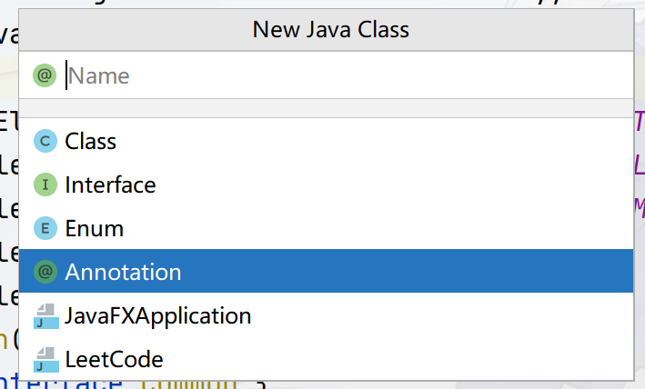
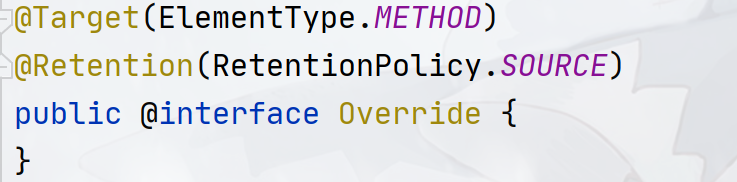
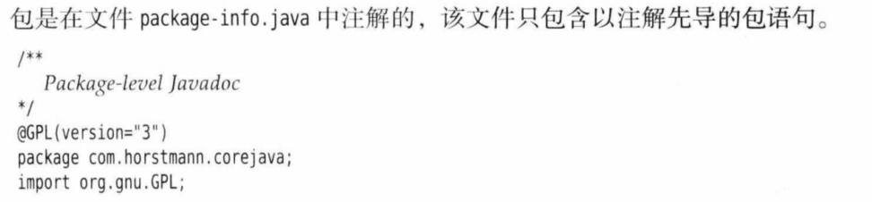
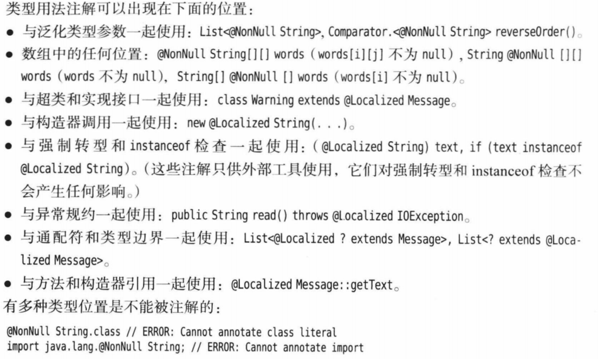
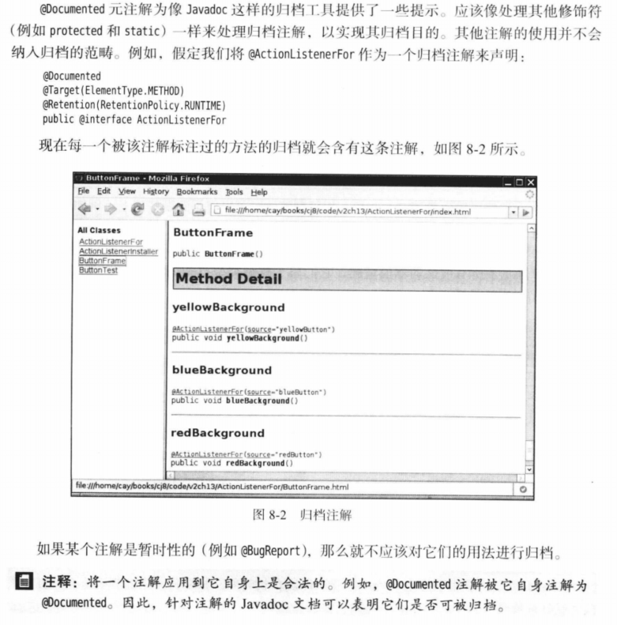
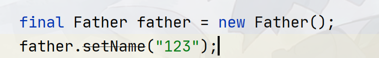
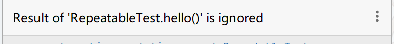
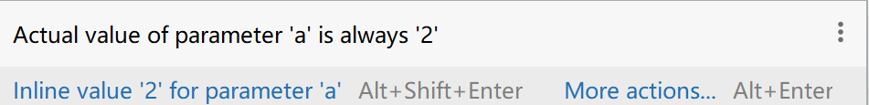
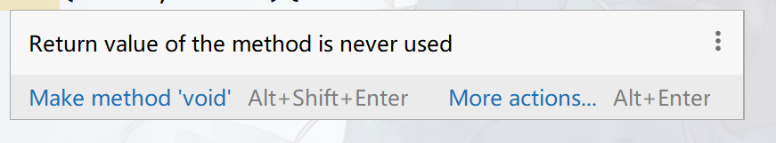
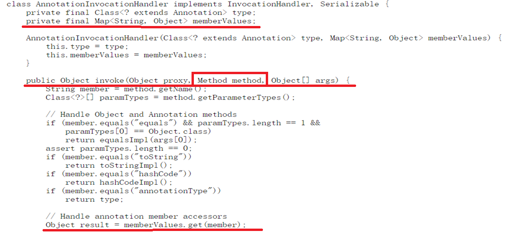

## Java-Annotation(80%)

`Java`中注解可以说是`Java`编程的一大特性，本章节主要内容：

1. 如何定义一个注解：包括元注解、重复注解等的定义方式和标记方式
2. 注解标记的位置：注解能够标记在哪个地方
3. `JDK`内置注解：包括`java.lang`、`java.lang.annotation`、`javax.annotation`包中的非元注解的使用
4. 注解处理器：注解的定义一般有三种级别，对应三类的注解处理器，将会一一介绍！
5. 注解的结构：该小节会反编译注解的字节码，从底层来查看一个注解的源代码
6. 注解应用框架：会介绍常见的注解驱动框架的基本使用，如`core java`中介绍到的[Jcommander](jcommander.org)、大名鼎鼎的[Lombok](https://projectlombok.org/)

### 注解的定义

首先要知道注解在`Java`代码中并不起任何实际的作用，他的唯一作用只有标记，标记该对象具备某个性质，在`java`中所有带`@`开头的都是注解，如常见的`@Override`，标记`@Override`代表该方法是一个重写方法！

定义注解的方式很像定义接口，其格式如下：

```java
public @interface Common {
}
```

在`interface`前面加上`@`定义出来的就是注解，`idea`提供了快速定义的方式，你可以通过`new --> new java class`，选中`Annotation`，就可以创建一个注解：



回到`@Override`注解，你可以在任何重写方法上标记`@Override`，但如果你把注解标记在字段上，则`IDE`会报错！这是因为`@Override`注解的标记是有范围限定的！他只能标记在方法上，我们查看`@Override`的源代码：



发现其上有两个注解`@Target`、`@Retention`，这两个注解就是用于规定`@Override`作用范围和存储级别，这种规定注解接口的作用范围和行为属性的注解一般被称之为元注解，`JDK`中的元注解有5个：

- `Target`：表示该注解能标记在哪个地方，可以传递多个`ElementType`的值：

  - `TYPE`：标记在类型上，如类、接口、枚举类

  - `FIELD`：标记在字段上，如类或接口的字段或常量字段、枚举量

  - `METHOD`：标记在方法上，包括静态或非静态

  - `PARAMETER`：标记在方法参数上

  - `CONSTRUCTOR`：标记在构造器上

  - `LOCAL_VARIABLE`：标记在局部变量上

  - `ANNOTATION_TYPE`：标记在注解的定义上，元注解一般都是这个级别

  - `PACKAGE`：标记在包上，一般和`package-info.java`有关

  - `TYPE_PARAMETER`（`JDK 1.8`）：标记在类型参数上，如`T`，这里举个例子：

    ```java
    @Target({ElementType.TYPE_PARAMETER, ElementType.TYPE_USE})
    @Retention(RetentionPolicy.RUNTIME)
    public @interface Common {
    }
    
    public class Main<@Common T>{
    	private Class<@Common ?> clazz;
    }
    ```

  - `TYPE_USE`（`JDK 1.8`）：标记在所有使用的类型上，如抛出的异常、继承时的类名、泛型的`?`等，这里举个例子：

    ```java
    @Target({ElementType.TYPE_PARAMETER, ElementType.TYPE_USE})
    @Retention(RetentionPolicy.RUNTIME)
    public @interface Common {
    }
    
    public class Main extends @Common Number implement @Common Closable{
    	private Class<@Common ?> getClass() throws @Common IOException;
    }
    ```

- `Retention`：表示该注解的处理方式，有三个值，只能填其一

  - `SOURCE`：源码级别，该注解在编译成字节码的时候会被去掉，类似于注释的处理！
  - `CLASS`：字节码级别，该注解在编译成字节码的时候会被保留，但不会被`JVM`加载，在处理字节码的时候能获取，但无法被反射`API`获取！
  - `RUNTIME`：运行级别，该注解在编译成字节码的时候会被保留，并且会被`JVM`加载，可以通过反射来获取`API`

- `Documented`：指明该注解是否会被`Javadoc`记录

- `Inherited`：指定注解是否能够被继承，标记了该元注解的注解标记在父类的代码上时，子类也能够获取！

- `Repeatable`（`JDK 8`）：表示注解是否可重复标记！

这`5`大元注解中，其中`Target`和`Retention`是必须的，其他都是可选的，根据实际情况标记即可，因此完整创建一个注解需要如下的模板：

```java
@Target({ElementType.TYPE_PARAMETER, ElementType.TYPE_USE})
@Retention(RetentionPolicy.RUNTIME)
public @interface Common {
}
```

到此，注解的声明方式介绍完毕，那么注解内部的定义呢？正如类内部可以定义字段、方法一样，注解内部也可以定义一些字段，用来标记一些信息，注解内部允许定义下面的数据：

- 基本类型（`int`、`short`、`long`、`byte`、`char`、`double`、`float`和`boolean`）
- `String`
- `Class`，如：`Class<?>`、`Class<Integer>`
- `Enum`类型
- 注解类型
- 上面的所有元素的数组，如`Class<?>[]` `String[]`

我们仍然能在注解内部定义内部类、内部接口等，注解声明实际上是当作接口看的，在：

> src/main/java/cn/argento/askia/annotation/full/BugReport.java

中你可以看到一个注解能够定义的所有定义方式和内容，参考`Core Java 11`编写！

注解数据的定义也很简单，只需要在定义数据变量加上括号即可，如：

```java
@Target({ElementType.TYPE_PARAMETER, ElementType.TYPE_USE})
@Retention(RetentionPolicy.RUNTIME)
public @interface Common {
	String version();
	Class<?> testClazz();
}
```

如果希望数据成员有默认值，则可以使用`default`，但是注意，注解成员不允许有`null`值，可以使用`Void.class`、`""`、`-1`、`{}`等作为代替！

```java
@Target({ElementType.TYPE_PARAMETER, ElementType.TYPE_USE})
@Retention(RetentionPolicy.RUNTIME)
public @interface Common {
	String version() default "1.5.1";
	Class<?> testClazz() default Void.class;
}
```

那么在标记注解的时候如何提供数据呢？假如这里有一个注解：

```java
@Target({ElementType.TYPE_PARAMETER, ElementType.TYPE_USE})
@Retention(RetentionPolicy.RUNTIME)
public @interface Common {
    String value() default "1.5.1";
	String version() default "1.5.1";
	Class<?> testClazz() default Void.class;
    int[] ip default {192, 168, 0, 1}
}
```

这个注解包含了四个数据成员，其中一个是数组。提供数据的时候需要写出具体要提供的项等于值的格式，提供多个项使用逗号分隔：

**提供数据给注解无需全部提供，只提供需要的即可，其他都会使用默认值，如**：

```java
public class @Common(version = "1.0.3", testClazz = Main.class) Main {
    // Common注解内各个成员的值：
    // value = "1.5.1"
    // version = "1.0.3"
    // testClazz = Main.class
    // ip = {192, 168, 0, 1}
}
```

如果注解有一个特殊的数值成员`value`，并且当你只需要给这个`value`提供值的时候，可以不写项名：

```java
public class @Common("1.0.3") Main {
    // Common注解内各个成员的值：
    // value = "1.0.3"
    // version = "1.5.1"
    // testClazz = Void.class
    // ip = {192, 168, 0, 1}
}
```

如果提供的注解数值成员是一个数组，则提供内容的时候需要使用`{}`,但是当提供的数组数据只有一个成员的时候，括号可以省略：

```java
public class @Common(ip = {192, 168, 0, 3}) Main {
    // Common注解内各个成员的值：
    // value = "1.5.1"
    // version = "1.5.1"
    // testClazz = Void.class
    // ip = {192, 168, 0, 3}
}

// 数组数据只有一个成员
public class @Common(ip = 192) Main {
    // Common注解内各个成员的值：
    // value = "1.5.1"
    // version = "1.5.1"
    // testClazz = Void.class
    // ip = {192}
}
```

如果只标注注解而不提供任何成员数据时，所有的数据都会使用默认值，这个时候注解无需加括号：

```java
// 数组数据只有一个成员
public class @Common Main {
    // Common注解内各个成员的值：
    // value = "1.5.1"
    // version = "1.5.1"
    // testClazz = Void.class
    // ip = {192, 168, 0, 1}
}
```

### 注解标记的位置

`@Target`元注解中共定义了`10`处位置给注解标记，关键的问题就是如何标记，或者说标记在哪里才算合法？比如对于一个当`@Target(ElementType.Field)`，下面的标记：

```java
@Field private String Field;
private @Field String Field;
private String @Field Field;
```

哪种合法？，就是本小节的探讨内容

> TYPE类型

`Type`类型允许你将注解标记在类、接口、枚举类上，需要将注解放置在`class`、`interface`、`enum`前面：

```java
@Common
public class Main {
}

@Common
public interface Main{
    
}
@Common
public enum Main{
    
}
```

> FIELD类型

如果是字段（包括常量）类型，则需要标记在类型前面，枚举值则在枚举值前标记

```java
public enum C{
    @Common A, @Common B
}

public class Main {

	// 两种方式皆可！
	@Common
	private A name;
	@Common private A name;
}

public interface Main{
    @Common
    String c = "Hello World!";
}
```

> METHOD类型

标记在方法上即可，如：

```java
public interface Main{
   @Common
   void hello();
}
```

> PARAMETER类型

标记在方法的参数上即可，如：

```java
public interface Main{
   void hello(@Common String name);
}
```

> CONSTRUCTOR类型

标记在构造器上即可：

```java
public class Main{

   @Common
   public Main(){
   
   }
}
```

> ANNOTATION_TYPE类型

标记在注解定义上，如：

```java
@Common
public @interface Main{
   int version() default 2;
}
```

> LOCAL_VARIABLE类型

标记在局部变量上，注意定义该类型的注解，其源码级别只能是`SOURCE`级别

```java
public class Main{

   public Main(){ 
     @Common String a = "123";
   }
}
```

> PACKAGE

标记在`package-info.java`里面的`package`上，如：注意定义该类型的注解，其源码级别只能是`SOURCE`级别



> TYPE_PARAMETER

定义在所有定义类型参数变量的位置上，如：

```java
public class Main<@Common T>{
	public <@Common S> S getType();
}
```

> TYPE_USE

定义在所有使用类型上，只要是单独的类型都可，如：`List<@Common String>`、`public void test() throws @Common IOException`、`public class Main extends @Common Main2`，该方式的定义位置非常多样，这里引用`core java`的结论：



### 内置标准注解

在`java.lang`、`java.lang.annotation`、`javax.annotation`中，有非常多标准注解！

`java.lang`包：`@Deprecated`、`@FunctionalInterface`、`@Override`、`@SafeVarargs`、`@SuppressWarnings`

`java.lang.annotation`包（元注解）：`@Documented`、`@Inherited`、`@Native`、`@Repeatable`、`@Retention`、`@Target`

`javax.annotation`包：`@Generated`、`@PostConstruct`、`@PreDestroy`、`@Resource`等

其中`javax.annotation`包是扩展的标准化注解包，其中包括了`jsr`标准规定的一些注解，该包中的注解并不是重点，这些注解你将在`Spring`框架中遇到

`@Retention`和`@Target`我们已介绍过，则无需再花篇幅！

#### 可继承的注解

标记了`@Inherited`的元注解标记在类上的时候可以在子类中被获取，我们定义一个注解：

```java
@Target({ElementType.FIELD, ElementType.CONSTRUCTOR, ElementType.METHOD, ElementType.TYPE})
@Retention(RetentionPolicy.RUNTIME)
@Inherited
@Documented
public @interface InheritedAnnotation {
    String version() default "1.0";
    String name() default "askia";
    Class<?> clazz() default Void.class;
}
```

注意这种带`@Inherited`的注解只有标记在类上的时候才有继承性，如果标记在方法上或者标记在接口上，则无法实现注解继承！

定义一个`Father`类和`FatherInterface`接口，在`Father`类和`FatherInterface`接口上标记`@InheritedAnnotation`注解，在`Father`类上的某个方法上标记`@InheritedAnnotation`注解，然后让`Son`类继承`Father`类，`Son2`类实现`FatherInterface`，进行测试！

在反射`API`中，获取`Runtime`级别的注解可以通过`getAnnotations()`和`getDeclaredAnnotations()`获取，他们的区别是`getDeclaredAnnotations()`不会获取继承性的注解！

结果只有标记在`Father`类上的注解能够被反射`API`获取，其他的都无法获取！具体可以参考`Demo`：

> src/main/java/cn/argento/askia/annotation/inherited/InheritedTest.java

#### 可重复标记的注解

标记了`@Repeatable`的元注解的注解可以重复标记在类、方法等上面，我们先定义一个注解：

```java
@Target({ElementType.FIELD, ElementType.CONSTRUCTOR, ElementType.METHOD, ElementType.TYPE})
@Retention(RetentionPolicy.RUNTIME)
@Documented
public @interface RepeatableAnnotation {

    String description() default "";
}
```

`@Repeatable`需要一个装载重复注解的容器，一般这个容器的名称是可重复注解加上`s`，`@Repeatable`源代码如下：

```java
@Documented
@Retention(RetentionPolicy.RUNTIME)
@Target(ElementType.ANNOTATION_TYPE)
public @interface Repeatable {
    Class<? extends Annotation> value();
}
```

这个容器注解的定义有下面的要求：

1. `@Target`必须是重复注解的子集
2. `@Retention`必须和重复注解相同
3. 必须要定义`value()`数据成员来装载可重复注解
4. 可重复的注解标记了`@Documented`，则注解容器也要标记`@Documented`

我们先定义这个容器：

```java
// 根据第一条规则，这里必须是RepeatableAnnotation的@Target的子集，如下面的结果都是合法的
// {ElementType.FIELD, ElementType.CONSTRUCTOR, ElementType.METHOD, ElementType.TYPE}
// {ElementType.CONSTRUCTOR, ElementType.METHOD, ElementType.TYPE}
// {ElementType.FIELD, ElementType.METHOD, ElementType.TYPE}
// {ElementType.FIELD, ElementType.TYPE}
// .....
// 但是注意，只有这里的target的位置才能实现重复标记，如下面的{ElementType.FIELD、, ElementType.CONSTRUCTOR, ElementType.METHOD}，则只能在FIELD、CONSTRUCTOR、METHOD才能重复标记，在TYPE上无法重复标记！
@Target({ElementType.FIELD, ElementType.CONSTRUCTOR, ElementType.METHOD})
// 根据第二条规则，这里要和RepeatableAnnotation保持一致
@Retention(RetentionPolicy.RUNTIME)
@interface RepeatableAnnotations{
    // 根据第三条规则的定义！
    RepeatableAnnotation[] value() default {};
}
```

然后在`RepeatableAnnotation`标记上`@Repeatable`注解！

```java
@Target({ElementType.FIELD, ElementType.CONSTRUCTOR, ElementType.METHOD, ElementType.TYPE})
@Retention(RetentionPolicy.RUNTIME)
@Documented
@Repeatable(RepeatableAnnotations.class)
public @interface RepeatableAnnotation {

    String description() default "";
}
```

现在分别在`ElementType.FIELD, ElementType.CONSTRUCTOR, ElementType.METHOD, ElementType.TYPE`上进行标记，可以看到只有`ElementType.TYPE`无法重复！

可以通过反射`API`中的`getAnnotationsByType(RepeatableAnnotation.class)`来获取重复的注解！

> src/main/java/cn/argento/askia/annotation/repeat/RepeatableTest.java

#### 文档注解

该注解主要和`javadoc`文档有关，如果希望注解被记录在文档，则标上即可，这里引用`core java`的说明：



#### 本地变量

首先查看一下`@Native`注解的源码信息，如下所示：

```java
/**
 * Indicates that a field defining a constant value may be referenced
 * from native code.
 *
 * The annotation may be used as a hint by tools that generate native
 * header files to determine whether a header file is required, and
 * if so, what declarations it should contain.
 *
 * @since 1.8
 */
@Documented
@Target(ElementType.FIELD)
@Retention(RetentionPolicy.SOURCE)
public @interface Native {
}
```

可以看到`@Native`注解自`jdk1.8`引入，用于解释该字段是一个常量，其值引用`native code`，该注解更多和`@Override`一样，是起到纯标记作用！可以发现它的保留时间为`SOURCE`阶段，这个用的不是很多，在`JNI`中可能用到，常常被代码生成工具使用。

#### 重写方法

`@Override`注解标记的方法是重写方法：

```java
@Target(ElementType.METHOD)
@Retention(RetentionPolicy.SOURCE)
public @interface Override {
}
```

作为一种习惯，建议在所有的重写方法上都标记该注解

```java
class Father{
	public void eat(){
		...
	}
}
class Son extends Father{
	@Override
	public void eat(){
	
	}
}
```

#### 废弃方法

标记`@Deprecated`的方法作为是废弃方法

```java
@Documented
@Retention(RetentionPolicy.RUNTIME)
@Target(value={CONSTRUCTOR, FIELD, LOCAL_VARIABLE, METHOD, PACKAGE, PARAMETER, TYPE})
public @interface Deprecated {
}
```

`JDK 11`时，该注解添加了两个数据成员：

```java
@Documented
@Retention(RetentionPolicy.RUNTIME)
@Target(value={CONSTRUCTOR, FIELD, LOCAL_VARIABLE, METHOD, PACKAGE, MODULE, PARAMETER, TYPE})
public @interface Deprecated {
    String since() default "";				// 从哪个版本开始废弃
    boolean forRemoval() default false;		// 是否后期移除
}
```

**`@Deprecated`标记的内容，在被使用时会被加上删除线**



#### 函数式接口

只有一个公开方法（`public`，`default`方法不算）的接口就被称之为函数式接口，如：

```java
public interface FatherInterface {
    
    int size();
    
    default boolean isEmpty(){
        return size() == 0;
    }
    
    default boolean isNotEmpty(){
    	return !isEmpty();
    }
}
```

我们可以在这些函数式接口上标记`@FunctionalInterface`

```java
@FunctionalInterface
public interface FatherInterface {
    
    int size();
    
    default boolean isEmpty(){
        return size() == 0;
    }
    
    default boolean isNotEmpty(){
    	return !isEmpty();
    }
}
```

#### 安全可变参数

`@SafeVarargs`用于标记可变参数是安全的，在声明具有**模糊类型（比如：泛型）的可变参数的构造函数或方法时**，`Java`编译器会报`unchecked`警告。鉴于这些情况，如果程序员断定声明的构造函数和方法的主体不会对其可变参数执行潜在的不安全的操作，可使用`@SafeVarargs`进行标记，这样的话，`Java`编译器就不会报`unchecked`警告。

```java
@Documented
@Retention(RetentionPolicy.RUNTIME)
@Target({ElementType.CONSTRUCTOR, ElementType.METHOD})
public @interface SafeVarargs {}
```

**@SafeVarargs注解，对于非static或非final声明的方法，不适用，会编译不通过，对于非static或非final声明的方法，请使用@SuppressWarnings("unchecked")**

#### 警告抑制

`@SuppressWarnings`用于忽略某些警告，如上面的`unchecked`，参数`Value`可以填入警告类型，支持同时抑制多种警告

可惜我并没有找到关于这个注解的`value`值有哪些，下表中的值来源个各大网站：

部分无法翻译的或者没有把握是什么意思的则保留原文，写未知的代表该警告值不知道用在什么用途但确实存在该值！部分地方提供了`idea`的警告显示！

| value                        | 中文描述                                                     | IDEA中警告显示                                               |
| ---------------------------- | ------------------------------------------------------------ | ------------------------------------------------------------ |
| **all**                      | **压制所有警告**                                             |                                                              |
| `boxing`                     | 抑制装箱、拆箱的警告                                         |                                                              |
| **cast**                     | **抑制强制转换产生的警告**                                   |                                                              |
| **dep-ann**                  | **抑制使用了@deprecated的注解**                              |                                                              |
| **deprecation**              | **抑制使用了@deprecated的方法或者字段**                      |                                                              |
| **fallthrough**              | **抑制在switch中缺失break的警告**                            |                                                              |
| `FragmentNotInstantiable`    | 未知                                                         |                                                              |
| **finally**                  | **抑制finally模块不返回的警告**                              |                                                              |
| `hiding`                     | `to suppress warnings relative to locals that hide variable` |                                                              |
| `incomplete-switch`          | 忽略没有`case`的`switch`语句警告                             |                                                              |
| `nls`                        | `to suppress warnings relative to non-nls string literals`   |                                                              |
| `null`                       | 忽略对`null`的操作（`to suppress warnings relative to null analysis`） |                                                              |
| `path`                       | 在类路径、源文件路径等中有不存在的路径时的警告。             |                                                              |
| `PointlessBitwiseExpression` | 未知                                                         |                                                              |
| **rawtypes**                 | **使用泛型时忽略没有指定相应类型的警告**                     |                                                              |
| `restriction`                | `to suppress warnings relative to usage of discouraged or forbidden references` |                                                              |
| `ReferenceEquality`          | 未知                                                         |                                                              |
| `ResultOfMethodCallIgnored`  | 压制忽略返回值的警告                                         |  |
| `SameParameterValue`         | 压制参数总是等于某个值的警告                                 |  |
| **serial**                   | **忽略在serializable类中没有声明serialVersionUID变量**       |                                                              |
| `static-access`              | 抑制不正确的静态访问方式警告（`to suppress warnings relative to incorrect static access`） |                                                              |
| `sunapi`                     | `sunapi suppresses javac's warning about using Unsafe; 'all' suppresses eclipse's warning about the unspecified 'sunapi' key. Leave them both. Yes, javac's definition of the word 'all' is quite contrary to what the dictionary says it means. 'all' does NOT include 'sunapi' according to javac.` | 来自`Lombok`                                                 |
| `synthetic-access`           | 抑制子类没有按最优方法访问内部类的警告（`to suppress warnings relative to unoptimized access from inner classes`） |                                                              |
| **try**                      | **抑制没有catch时的警告**                                    |                                                              |
| **unchecked**                | **抑制没有进行类型检查操作的警告**                           |                                                              |
| `unqualified-field-access`   | 抑制没有权限访问的字段的警告（`to suppress warnings relative to field access unqualified`） |                                                              |
| `NullableProblems`           | 未知                                                         |                                                              |
| **unused**                   | **抑制没被使用过的代码（方法、字段、局部变量等）的警告，有几个子抑制，如：UnusedReturnValue、UnusedParameters** |                                                              |
| `UnusedReturnValue`          | 压制方法返回值从未被使用                                     |  |
| `UnusedParameters`           | 压制未使用的方法参数                                         |                                                              |
| `WeakerAccess`               | 未知                                                         |                                                              |

### 注解处理器

#### RUNTIME级别注解处理

在反射`API`中，有一套专门处理注解的`API`，这些`API`位于`java.lang.reflect`包中，包括所有以`AnnotatedXXX`的接口：

- `AnnotatedElement`：代表被注解标记的元素，如被一个或者多个注解标记的类、字段、方法等。（`JDK 1.5`）
- `AnnotatedType`：代表被注解的元素的类型，在`Type`系统引入之后同时引入的接口，该接口继承自`AnnotatedElement`，不仅拥有获取、处理注解的能力，还返回一个`Type`对象，代表一个对象、方法参数、返回值、异常等所属的具体类型（`JDK 1.8`）
- `AnnotatedArrayType`：代表被注解的类型是一个数组类型，如`String[]`，该接口是`AnnotatedType`的子接口（`JDK 1.8`）
- `AnnotatedParameterizedType`：代表被注解的类型是一个参数化类型（泛型），如`List<String>`、`Set<List<String>>`等，该接口是`AnnotatedType`的子接口（`JDK 1.8`）
- `AnnotatedTypeVariable`：代表被注解的类型是一个泛型变量，如`T`、`U`、`S`，该接口是`AnnotatedType`的子接口（`JDK 1.8`）
- `AnnotatedWildcardType`：代表被注解的类型是一个继承性的泛型，如：`List<? extends MyClass>`、`List<T extends MyClass>`（`JDK 1.8`）

除了上面的`6`大接口外，还有一个类`AnnotatedTypeBaseImpl`，它代表所有除上面`6`大接口对应的类型外的其他类型，如`String`、`Integer`、`int`等都会返回`AnnotatedTypeBaseImpl`实现，该类在`sun.reflect.annotation`包下！

上面这`6`大接口中，`AnnotatedElement`主要用于获取标记在元素上的注解，其方法：

```java
public interface AnnotatedElement {

    // JDK 1.5
    // 判断类、字段、构造器、方法上是否有某个注解
    default boolean isAnnotationPresent(Class<? extends Annotation> annotationClass);
    // JDK 1.5
    // 获取类、字段、构造器、方法上的某个特定注解，包括类上的可继承性的注解
    <T extends Annotation> T getAnnotation(Class<T> annotationClass);
    // JDK 1.5
    // 获取类、字段、构造器、方法上的所有注解，包括可重复的注解（可重复注解容器来获得可重复的注解）
    Annotation[] getAnnotations();
    // JDK 1.8
    // 获取类、字段、构造器、方法上的可重复注解！
    default <T extends Annotation> T[] getAnnotationsByType(Class<T> annotationClass);
    // JDK 1.8
    // 和getAnnotation()方法相同，但不能获取继承性的注解
    default <T extends Annotation> T getDeclaredAnnotation(Class<T> annotationClass);
    // JDK 1.8
    // 和getAnnotationsByType方法相同，但不能获取继承性的可重复注解
    default <T extends Annotation> T[] getDeclaredAnnotationsByType(Class<T> annotationClass);
    // JDK 1.5
    // 和getAnnotations()方法相同，但不能获取继承性的可重复注解
    Annotation[] getDeclaredAnnotations();
}
```

```java
@BugReport(2)
@InheritedAnnotation
class Bug{
    @BugReport(2)
    @RepeatableAnnotation(description = "setBug method1")
    @RepeatableAnnotation(description = "setBug method2")
    public Bug setBug(String bug) {
        this.bug = bug;
        return this;
    }
}
```

特别注意`getAnnotationsByType()`方法是`JDK 1.8`才引入的，在`1.8`以前，只能通过获取可重复注解的注解容器的形式来获取。

```java
@Target({ElementType.FIELD, ElementType.CONSTRUCTOR, ElementType.METHOD, ElementType.TYPE})
@Retention(RetentionPolicy.RUNTIME)
@Documented
@Repeatable(RepeatableAnnotation.RepeatableAnnotations.class)
public @interface RepeatableAnnotation {

    String description() default "";

    @Documented
    @Target({ElementType.FIELD, ElementType.CONSTRUCTOR, ElementType.METHOD})
    @Retention(RetentionPolicy.RUNTIME)
    @interface RepeatableAnnotations{
        RepeatableAnnotation[] value() default {};
    }
}
```

```java
// 下面两个方式获取的结果相同
// 获取方式1（JDK 1.5版本）
final RepeatableAnnotation.RepeatableAnnotations annotation1 = setBug.getAnnotation(RepeatableAnnotation.RepeatableAnnotations.class);
final RepeatableAnnotation[] value = annotation1.value();
System.out.println(Arrays.toString(value));

// 获取方式2（JDK 1.8版本）
final RepeatableAnnotation[] annotationsByType = setBug.getAnnotationsByType(RepeatableAnnotation.class);
System.out.println(Arrays.toString(annotationsByType));
```

在标记可重复注解的时候，实际上最终被编译成字节码的时候标记在元素上的不是可重复注解而是注解容器

```java
// 注意可重复注解的获取，标记的永远是注解容器
// false
System.out.println("setBug方法上是否标记了RepeatableAnnotation注解=" + setBug.isAnnotationPresent(RepeatableAnnotation.class));
// true
System.out.println("setBug方法上是否标记了RepeatableAnnotations注解容器=" + setBug.isAnnotationPresent(RepeatableAnnotation.RepeatableAnnotations.class));
```

相关的`Demo`可以参考:

> src/main/java/cn/argento/askia/annotation/runtime/AnnotationAPIs.java

继承了`AnnotatedElement`接口的类有：`Class<T>`、`Constructor<T>` 、`Field`、`Method`、`Package`、`Parameter`

`AnnotatedType`及其所有的子接口除了用于获取注解外，额外提供了用于获取具体类型的功能

```java
// AnnotatedType接口
// JDK 1.8
// 获取类型名称
public interface AnnotatedType extends AnnotatedElement {
    // 获取Type对象，代表一个类型
    public Type getType();
}

// AnnotatedArrayType接口
// 代表数组类型：T[]、String[]
public interface AnnotatedArrayType extends AnnotatedType {
    // 获取标记在数组上的原始类型,如String[]则获取的是String, T[]则获取的是T
    //（注意该类型可能是一个泛型变量，所以返回类型还是一个AnnotatedType）
    // 如T[]调用该方法将获取AnnotatedTypeVariable对象，代表泛型变量T
    AnnotatedType  getAnnotatedGenericComponentType();
}

// AnnotatedParameterizedType接口
// 代表参数化类型：List<String>、Map<String,Object>
public interface AnnotatedParameterizedType extends AnnotatedType {
    // 获取泛型的具体类型，如List<String>则返回String类型, Map<String, Object>则返回String类型、Object类型（AnnotatedTypeBaseImpl实现）
    AnnotatedType[] getAnnotatedActualTypeArguments();
}

// AnnotatedTypeVariable接口
// 代表类型参数，如T、T extends Number
public interface AnnotatedTypeVariable extends AnnotatedType {
    // 获取泛型的界，如T extends Number则返回Number、T则返回Object
    // 同样的理由，由于获取的可能还是一个参数化类型，如：T extends List<String>
    // T extends List<String>返回的List<String>仍然是一个参数化类型（AnnotatedParameterizedType）
    AnnotatedType[] getAnnotatedBounds();
}
// AnnotatedWildcardType接口
// 如? extends Number，? super Integer
public interface AnnotatedWildcardType extends AnnotatedType {

    // 获取下界，如? super Integer则返回Integer
    AnnotatedType[] getAnnotatedLowerBounds();

    // 获取上界，如? extends Number则返回Number
    AnnotatedType[] getAnnotatedUpperBounds();
}
```

要获取`AnnotatedType`接口及其子接口类型的对象，可以使用`getAnnotatedXXX()`方法，如：

- `Constructor`、`Method`的`getAnnotatedReturnType()`、`getAnnotatedReceiverType()`、`getAnnotatedParameterTypes()`、`getAnnotatedExceptionTypes()`
- `Field`、`Parameter`的`getAnnotatedType()`
- `Class`类上的`getAnnotatedSuperclass()`、`getAnnotatedInterfaces()`

```java
// 获取标记在方法、构造器上的可被注解的异常的类型
public AnnotatedType[] getAnnotatedExceptionTypes();
// 获取标记在方法、构造器上的可被注解的参数的类型
public AnnotatedType[] getAnnotatedParameterTypes();
// 获取标记在方法、构造器上的可被注解的接收器类型，所谓接收器类型指的是this
public AnnotatedType getAnnotatedReceiverType();
// 获取标记在方法、构造器上的可被注解的返回值的类型
public abstract AnnotatedType getAnnotatedReturnType();
// 获取标记在字段、参数上的可被注解的类型
public AnnotatedType getAnnotatedType();
// 获取类上的可被注解的父类、父接口类型
public AnnotatedType[] getAnnotatedInterfaces();
public AnnotatedType getAnnotatedSuperclass();
```

`receiverType`指的是这种类型：

```java
public class MyClass<@MyAnnotation T> {
    // 下面的@MyAnnotation MyClass<T> this就是receiverType,参数名必须是this,
    // 实际上就是this对象
    // 当我们需要对this进行一些标记的时候，就可以使用这种方式定义,
    // 一般这种情况不常见！
    public void myMethod(@MyAnnotation MyClass<T> this) {}
}
```

相关`Demo`可以参考：

> src/main/java/cn/argento/askia/annotation/runtime/MyClass.java
>
> src/main/java/cn/argento/askia/annotation/runtime/AnnotatedAPIs.java

#### SOURCE级别的注解处理

`source`级别的注解在编译的时候会被去除，所以唯一能对该类注解进行处理的就是在编译`java`代码之前，也就是在将`java`代码编译成字节码这个过程之前进行处理，基于这个特性决定了处理这些`SOURCE`级别的注解最好的工具就是`javac.exe`，也就是`java`编译器（这样可以方便在处理完注解之后立即进行源代码的编译）

`JDK 5`时期提供了一个可以处理注解的命令行工具：`Annotation Processing Tool`（[`APT`](https://docs.oracle.com/javase/6/docs/technotes/guides/apt/)），可惜工具没有集成到`javac.exe`，需要额外运行，并且`api`在`com.sun.mirror`包下而非标准包，因此`APT`在`JDK 7`以后就被废弃了，取而代之的是`JDK 6`加入的`PAP`（`Pluggable Annotation Processinig API`，插件式注解处理`API`），该`API`解决了`APT`工具遗留的问题。该`API`位于`javax.annotation.processing`包中，其中的核心是：

- `Process`接口：注解处理器顶层接口

- `AbstractProcess`抽象类：抽象注解处理器，对顶层接口中的部分方法提供了实现，需要自定义处理器时继承该抽象类即可！
- `@SupportedAnnotationTypes`：待处理的注解的全限定类名
- `@SupportedOptions`：
- `@SupportedSourceVersion`：待处理的注解的源代码版本
- `ProcessingEnvironment`接口：处理环境上下文
- `RoundEnvironment`接口：代表注解轮询处理环境接口
- `Messager`接口：代表处理过程中产生的警告信息！
- `Filer`接口

定义一个注解处理器只需要继承`AbstractProcess`抽象类实现`process()`方法即可，并且使用`@SupportedAnnotationTypes`和`@SupportedAnnotationTypes`指定需要处理的注解：


#### CLASS级别注解处理

### 注解源码结构

所有的注解实际上都隐式地直接扩展于`java.lang.annotation.Annotation`**接口**，该接口是个**常规接口**，定义如下：

```java
public interface Annotation {
    boolean equals(Object obj);
    int hashCode();
    String toString();
    // 获取注解的类型
    Class<? extends Annotation> annotationType();
}
```

注解类型直接通过`getClass()`获得的`Class`对象不是注解类型本身，而是代理对象（注解的结构和动态代理有关），也就是注解接口的具体实现对象，想要获取真正的注解类型，必须使用`Annotation`接口提供给的`annotationType()`

```java
Test test = this.getClass().getAnnotation(Test.class);
System.out.println(test.annotationType());
System.out.println(test.getClass());
/*
输出：
interface Test
class com.sun.proxy.$Proxy1
*/
```

`Annotation`接口的`String toString();`将会输入一个包含注解接口及其元素名称和默认值的字符串表示，如：

```java
System.out.println(test.toString());
// @Test(timeout=100)
```

同样回到`BugReport`注解：

```java
@Target({ElementType.FIELD, ElementType.METHOD, ElementType.TYPE, ElementType.ANNOTATION_TYPE})
@Retention(RetentionPolicy.RUNTIME)
@Documented
public @interface BugReport {
    long value() default 2000;
    String versions() default "1.1.0";
    int version() default 1;
    double subVersion() default 1.0;
    boolean showStopper() default false;
    String assignedTo() default "[none]";
    Class<?> testCase() default Void.class;
    Status status() default Status.CONFIRMED;
    Reference ref() default @Reference;
    String[] reportedBy() default "";
    Class<?>[] clazz() default {};

    enum Status {UNCONFIRMED, CONFIRMED, FIXED, NOTABUG}

    @interface Reference{
        String ref() default "";
        String url() default "";
    }
    interface B{

    }

    class A{
        public void test(){

        }
    }
}
```

对注解进行反编译（使用`javap.exe`），获取到底层处理注解的方式：

```java
// 0.所有的@interface实际上都会被编译成interface XXX extends Annotation
// 1.继承自Annotation接口
public interface cn.argento.askia.annotation.full.BugReport 
    extends java.lang.annotation.Annotation {
  // 2.所有的数据成员都会被处理成方法
  public abstract long value();

  public abstract java.lang.String versions();

  public abstract int version();

  public abstract double subVersion();

  public abstract boolean showStopper();

  public abstract java.lang.String assignedTo();

  public abstract java.lang.Class<?> testCase();

  public abstract cn.argento.askia.annotation.full.BugReport$Status status();

  public abstract cn.argento.askia.annotation.full.BugReport$Reference ref();

  public abstract java.lang.String[] reportedBy();

  public abstract java.lang.Class<?>[] clazz();
}
```

到此位置，我们知道定义注解的`@interface`和相关数据成员会被进行怎样的处理，但还有一个关键问题，注解中的数据成员的默认值是如何绑定到方法的呢？

既然注解技术依赖于动态代理，我们可以尝试将代理对象的源代码拿出来进行分析，在代码中，添加这个系统属性可以将代理类导出！

```java
System.getProperties().setProperty("sun.misc.ProxyGenerator.saveGeneratedFiles", "true");
```

拿到这个代理类的源代码如下：

```java
//
// Source code recreated from a .class file by IntelliJ IDEA
// (powered by FernFlower decompiler)
//
package com.sun.proxy;
import cn.argento.askia.annotation.full.BugReport;
import cn.argento.askia.annotation.full.BugReport.Reference;
import cn.argento.askia.annotation.full.BugReport.Status;
import java.lang.reflect.InvocationHandler;
import java.lang.reflect.Method;
import java.lang.reflect.Proxy;
import java.lang.reflect.UndeclaredThrowableException;

public final class $Proxy2 extends Proxy implements BugReport {
    private static Method m1;
    private static Method m6;
    private static Method m12;
    private static Method m2;
    private static Method m8;
    private static Method m14;
    private static Method m5;
    private static Method m11;
    private static Method m0;
    private static Method m10;
    private static Method m7;
    private static Method m9;
    private static Method m13;
    private static Method m3;
    private static Method m4;

    // 关键就在这个InvocationHandler对象中，因为所有的方法都是委托InvocationHandler对象来完成的
    public $Proxy2(InvocationHandler对象中 var1) throws  {
        super(var1);
    }

    public final boolean equals(Object var1) throws  {
        try {
            return (Boolean)super.h.invoke(this, m1, new Object[]{var1});
        } catch (RuntimeException | Error var3) {
            throw var3;
        } catch (Throwable var4) {
            throw new UndeclaredThrowableException(var4);
        }
    }

    public final Reference ref() throws  {
        try {
            return (Reference)super.h.invoke(this, m6, (Object[])null);
        } catch (RuntimeException | Error var2) {
            throw var2;
        } catch (Throwable var3) {
            throw new UndeclaredThrowableException(var3);
        }
    }

    public final Class testCase() throws  {
        try {
            return (Class)super.h.invoke(this, m12, (Object[])null);
        } catch (RuntimeException | Error var2) {
            throw var2;
        } catch (Throwable var3) {
            throw new UndeclaredThrowableException(var3);
        }
    }

    public final String toString() throws  {
        try {
            return (String)super.h.invoke(this, m2, (Object[])null);
        } catch (RuntimeException | Error var2) {
            throw var2;
        } catch (Throwable var3) {
            throw new UndeclaredThrowableException(var3);
        }
    }

    public final boolean showStopper() throws  {
        try {
            return (Boolean)super.h.invoke(this, m8, (Object[])null);
        } catch (RuntimeException | Error var2) {
            throw var2;
        } catch (Throwable var3) {
            throw new UndeclaredThrowableException(var3);
        }
    }

    public final Class annotationType() throws  {
        try {
            return (Class)super.h.invoke(this, m14, (Object[])null);
        } catch (RuntimeException | Error var2) {
            throw var2;
        } catch (Throwable var3) {
            throw new UndeclaredThrowableException(var3);
        }
    }

    public final Status status() throws  {
        try {
            return (Status)super.h.invoke(this, m5, (Object[])null);
        } catch (RuntimeException | Error var2) {
            throw var2;
        } catch (Throwable var3) {
            throw new UndeclaredThrowableException(var3);
        }
    }

    public final String assignedTo() throws  {
        try {
            return (String)super.h.invoke(this, m11, (Object[])null);
        } catch (RuntimeException | Error var2) {
            throw var2;
        } catch (Throwable var3) {
            throw new UndeclaredThrowableException(var3);
        }
    }

    public final int hashCode() throws  {
        try {
            return (Integer)super.h.invoke(this, m0, (Object[])null);
        } catch (RuntimeException | Error var2) {
            throw var2;
        } catch (Throwable var3) {
            throw new UndeclaredThrowableException(var3);
        }
    }

    public final String versions() throws  {
        try {
            return (String)super.h.invoke(this, m10, (Object[])null);
        } catch (RuntimeException | Error var2) {
            throw var2;
        } catch (Throwable var3) {
            throw new UndeclaredThrowableException(var3);
        }
    }

    public final int version() throws  {
        try {
            return (Integer)super.h.invoke(this, m7, (Object[])null);
        } catch (RuntimeException | Error var2) {
            throw var2;
        } catch (Throwable var3) {
            throw new UndeclaredThrowableException(var3);
        }
    }

    public final double subVersion() throws  {
        try {
            return (Double)super.h.invoke(this, m9, (Object[])null);
        } catch (RuntimeException | Error var2) {
            throw var2;
        } catch (Throwable var3) {
            throw new UndeclaredThrowableException(var3);
        }
    }

    public final String[] reportedBy() throws  {
        try {
            return (String[])super.h.invoke(this, m13, (Object[])null);
        } catch (RuntimeException | Error var2) {
            throw var2;
        } catch (Throwable var3) {
            throw new UndeclaredThrowableException(var3);
        }
    }

    public final Class[] clazz() throws  {
        try {
            return (Class[])super.h.invoke(this, m3, (Object[])null);
        } catch (RuntimeException | Error var2) {
            throw var2;
        } catch (Throwable var3) {
            throw new UndeclaredThrowableException(var3);
        }
    }

    public final long value() throws  {
        try {
            return (Long)super.h.invoke(this, m4, (Object[])null);
        } catch (RuntimeException | Error var2) {
            throw var2;
        } catch (Throwable var3) {
            throw new UndeclaredThrowableException(var3);
        }
    }

    static {
        try {
            m1 = Class.forName("java.lang.Object").getMethod("equals", Class.forName("java.lang.Object"));
            m6 = Class.forName("cn.argento.askia.annotation.full.BugReport").getMethod("ref");
            m12 = Class.forName("cn.argento.askia.annotation.full.BugReport").getMethod("testCase");
            m2 = Class.forName("java.lang.Object").getMethod("toString");
            m8 = Class.forName("cn.argento.askia.annotation.full.BugReport").getMethod("showStopper");
            m14 = Class.forName("cn.argento.askia.annotation.full.BugReport").getMethod("annotationType");
            m5 = Class.forName("cn.argento.askia.annotation.full.BugReport").getMethod("status");
            m11 = Class.forName("cn.argento.askia.annotation.full.BugReport").getMethod("assignedTo");
            m0 = Class.forName("java.lang.Object").getMethod("hashCode");
            m10 = Class.forName("cn.argento.askia.annotation.full.BugReport").getMethod("versions");
            m7 = Class.forName("cn.argento.askia.annotation.full.BugReport").getMethod("version");
            m9 = Class.forName("cn.argento.askia.annotation.full.BugReport").getMethod("subVersion");
            m13 = Class.forName("cn.argento.askia.annotation.full.BugReport").getMethod("reportedBy");
            m3 = Class.forName("cn.argento.askia.annotation.full.BugReport").getMethod("clazz");
            m4 = Class.forName("cn.argento.askia.annotation.full.BugReport").getMethod("value");
        } catch (NoSuchMethodException var2) {
            throw new NoSuchMethodError(var2.getMessage());
        } catch (ClassNotFoundException var3) {
            throw new NoClassDefFoundError(var3.getMessage());
        }
    }
}
```

代理对象不出意外地实现了注解`BugReport`接口，动态代理的关键就在`InvocationHandler`对象中，代理对象的所有方法都是委托`InvocationHandler`对象来完成的！那传递给这个代理对象的`InvocationHandler`对象又是什么呢？

幸好，动态代理的`API`提供了获取`InvocationHandler`对象的方法：

```java
public static InvocationHandler getInvocationHandler(Object proxy)
    throws IllegalArgumentException
```

使用下面的代码获取具体的`InvocationHandler`对象：

```java
final BugReport annotation = Myclass2.class.getAnnotation(BugReport.class);
final InvocationHandler invocationHandler = Proxy.getInvocationHandler(annotation);
System.out.println(invocationHandler.getClass());
```

得到结果：

```java
class sun.reflect.annotation.AnnotationInvocationHandler
```

`AnnotationInvocationHandler`类中的主要核心如下：



其中`memberValues`用于存放数据成员的值，`invoke()`方法对注解中的方法的调用进行拦截，然后返回值！

据此可以得到初步结论：

- 注解采用接口中的方法来表示变量
- `Java`为注解创建一个代理类。这个代理类包括一个`AnnotationInvocationHandler`成员变量
- `AnnotationInvocationHandler`有一个`Map`成员变量，用于存储所有的注解的属性赋值！
- 在程序中，调用注解接口的方法，将会被代理类接管，然后根据方法名字，到`Map`里面拿相应的`Value`并返回。
- 传递给`AnnotationInvocationHandler`的用于初始化`Map`成员变量的各种注解方法的默认值被`AnnotationParser`类的`parseXXX()`解析获得！

### 注解应用框架

#### Lombok

`Lombok`是一个非常优秀的`java`类库，它利用注解方式自动生成`java bean`中`getter`、`setter`、`equals`等方法，还能自动生成 `logger`、`toString`、`hashCode`、`builder`等 日志相关变量。

在`Lombok`的使用中，核心的注解主要位于：

- `lombok.*`（主包），该包下的注解都是功能稳定的注解，如常用的`@Setter`、`@Getter`、`@Data`等
- `lombok.experimental.*`（实验包）该包下的注解都是带实验性质的（不稳定），一些测试注解或者从主包被废弃的注解会被移动到这里
- `lombok.extern.*`（扩展包）该包下的注解针对其他第三方库（主要是日志），如`slf4j`、`log4j`、`commonLog`等

##### 主包注解

- 用于生成实体类的`@Data`、`@AllArgsConstructor`、`@EqualsAndHashCode`、`@Getter`、`@Setter`、`@NoArgsConstructor`、`@RequiredArgsConstructor`、`@ToString`

- 用于实体类扩展的`@Value`、`@With`
- 用于创建实体的`Builder`类的`@Builder`、`@Singular`

- 用于`IO`流自动关闭的`@Cleanup`
- 用于自定义日志的`@CustomLog`
- 用于判空的`@NonNull`
- 用于异常的`@SneakyThrows`
- 用于锁的`@Synchronized`
- 匿名局部变量特性：`val`、`var`

首先`lombok`中支持你在局部变量里面使用`val`和`var`来代替具体的类型，`val`会生成`final`的局部变量

```java
public void test(){
    var a = new ArrayList<String>();
    // lombok会生成 ArrayList<String> a = new ArrayList<String>();
    val b = new User();
    // lombok会生成 final User b = new User();
}
```

对于实体类，使用`@Data`注解将会为：

- 默认构造器（空构造器，如果有`final`字段或者字段被标记了`@NonNull`，则为这些字段生成一个构造器）
- 为所有非`final`字段生成`Setter`
- 为所有字段生成`Getter`
- 生成`equals()`和`hashCode()`
- 生成一个以逗号分割成员，括号作为左右链接符的`toString()`

`@Data`中有一个数据成员:

```java
String staticConstructor() default ""
```

如果指定了数据成员，则使用工厂的方式来初始化实体类，会将构造器定义为`private`，然后生成一个`public static` 的工厂方法，工厂方法名就是`staticConstructor()`的值！

```java
@Data(staticConstructor = "newInstance")
public class StaticUser{
    // ...
}
// 将生成
public class StaticUser{
    private StaticUser(){}
    
    public static StaticUser newInstance() {
        return new StaticUser();
    }
}
```

由于默认情况下`@Data`注解只会生成默认构造器或者为`final`成员生成构造器。在`lombok`中，有三个和构造器生成有关的注解：

- `@AllArgsConstructor`：生成全参构造器
- `@NoArgsConstructor`：生成无参构造器
- `@RequiredArgsConstructor`：和`@Data`注解的构造器生成一样，专门生成`final`字段和`@NonNull`字段的构造器

注意当标记了`@Data`和`@AllArgsConstructor`的时候，`@AllArgsConstructor`会覆盖掉`@Data`的默认构造器，使类只有一个`AllArgs`的构造器，因此如果希望实体类既有无参构造器，又有全参构造器，则需要将`@AllArgsConstructor`和`@NoArgsConstructor`都标记上！

```java
@Data
@AllArgsConstructor
@NoArgsConstructor
public class StaticUser{
    // 这样实体类里面就会有无参构造、全参构造、Setter、Getter、ToString、hashCode
}
```

如果希望生成无参构造、全参构造和部分参数构造，则可以这三个注解配合来使用：

```java
@Data
@NoArgsConstructor
@AllArgsConstructor
@RequiredArgsConstructor
public class  User {

    @NonNull
    private String name;
    @NonNull
    private int id;
    private int age;
    private List<String> cards;
}
// 将生成
public User(){}
public User(String name, int id){}
public User(String name, int id, inta age, List<String> cards){}
```

这三个构造器注解中，有两个比较重要的数据属性：

- `staticName()`：和`@Data`的`staticConstructor()`作用相同
- `access()`：代表访问级别，如`public`、`private`等

除了使用`@Data`之外，还可以使用`@Getter`和`@Setter`为其添加响应字段的`Setter`和`Getter`方，`@Getter`和`@Setter`的`value`属性可以指定方法的访问级别。

`@Getter`和`@Setter`也可以标记在单个字段上，这样则只会为该字段生成`Getter`和`Setter`

```java
@Getter
@Setter
public class  User {

    @NonNull
    private String name;
    @NonNull
    private int id;
    @Getter
	@Setter("lombok.AccessLevel.protected")
    private int age;
    private List<String> cards;
}
```

也可以单独使用`@ToString`来为实体类生成`toString()`，`@ToString`中，你可以使用下面属性：

- `boolean includeFieldNames()`：输出的`toString()`中是否包含字段名称，默认是`true`
- `boolean callSuper()`：子类的`toString`是否调用`super.toString()`来打印父类的字段，默认是`false`
- `boolean doNotUseGetters() default false;`：是否不使用`getter`方法来获取值，一般情况下`@ToString`生成的`toString()`是调用`getter`来获取值的，设置为`true`则直接使用字段而非`Getter`

另外还有两个数据成员：`exclude()`和`of()`，他们分别代表打印`toString`时需要排除掉的字段和需要打印的字段，这两个数据成员将会被`@ToString.Exclude`注解和`@ToString.Include`注解替代。

当前`Lombok`中，`@ToString`默认情况下会自动输出全部字段的`toString()`，只有设置了`boolean onlyExplicitlyIncluded()`为`true`，这样他就只会输出标记了`@ToString.Include`的字段。

`@EqualsAndHashCode`注解数据成员和`@ToString`相同！

-----

`@Builder`注解用于为一个实体类生成一个`Builder`类，如果实体类中有`List`、`Set`等集合类型，则额外添加清空所有成员的`clearXX()`方法，并且可以配合

`@Singular`使用为这些集合类型生成一个添加单个成员的`add()`，该`add()`方法名由`@Singular`的`value`数据成员控制

`@Builder`注解生成如下：

```java
// Before: 
 @Builder
   class Example<T> {
   	private T foo;
   	private final String bar;
    @Singular("addCard")
    private List<String> cards;   
   }
   
// After:
   class Example<T> {
   	private T foo;
   	private final String bar;
    private List<String> cards;  
   	
   	private Example(T foo, String bar, List<String> cards) {
   		this.foo = foo;
   		this.bar = bar;
        this.cards = cards;
   	}
   	// 生成一个静态的builder()方法，方法名有数据成员String builderMethodName()控制
   	public static <T> ExampleBuilder<T> builder() {
   		return new ExampleBuilder<T>();
   	}
   	// 生成一个Builder类，该类的类名由String builderClassName()控制
   	public static class ExampleBuilder<T> {
   		private T foo;
   		private String bar;
        private List<String> cards;  
        
        //  @Singular添加单个成员的方法，方法名时注解的value值
         public User2.User2Builder addCard(String addCard) {
            if (this.cards == null) {
                this.cards = new ArrayList();
            }

            this.cards.add(addCard);
            return this;
        }
        
        
        public User2.User2Builder cards(Collection<? extends String> cards) {
            if (cards == null) {
                throw new NullPointerException("cards cannot be null");
            } else {
                if (this.cards == null) {
                    this.cards = new ArrayList();
                }

                this.cards.addAll(cards);
                return this;
            }
        }
        
        // 集合类型添加清空所有成员的方法
        public User2.User2Builder clearCards() {
            if (this.cards != null) {
                this.cards.clear();
            }

            return this;
        }
   		
   		private ExampleBuilder() {}
   		
   		public ExampleBuilder foo(T foo) {
   			this.foo = foo;
   			return this;
   		}
   		
   		public ExampleBuilder bar(String bar) {
   			this.bar = bar;
   			return this;
   		}
   		
   		@java.lang.Override public String toString() {
   			return "ExampleBuilder(foo = " + foo + ", bar = " + bar + ", cards = " + this.cards + ")";
   		}
   		// build()方法，该方法方法名由数据成员String buildMethodName()控制
   		public Example build() {
   			return new Example(foo, bar, cards);
   		}
   	}
   }
```

----

`@Cleanup`将用于自动关闭`IO`流，注意他将会包裹整个方法的所有代码！该注解接收一个数据成员，用于指定关闭外部资源的方法的名称！

```java
  public void copyFile(String in, String out) throws IOException {
       @Cleanup FileInputStream inStream = new FileInputStream(in);
       @Cleanup FileOutputStream outStream = new FileOutputStream(out);
       // 下面的所有代码都将会被try...catch... 包裹
       byte[] b = new byte[65536];
       while (true) {
           int r = inStream.read(b);
           if (r == -1) break;
           outStream.write(b, 0, r);
       }
   }
   
  // 会生成：
   public void copyFile(String in, String out) throws IOException {
       @Cleanup FileInputStream inStream = new FileInputStream(in);
       try {
           @Cleanup FileOutputStream outStream = new FileOutputStream(out);
           try {
               byte[] b = new byte[65536];
               while (true) {
                   int r = inStream.read(b);
                   if (r == -1) break;
                   outStream.write(b, 0, r);
               }
           } finally {
               if (outStream != null) outStream.close();
           }
       } finally {
           if (inStream != null) inStream.close();
       }
   }
```

