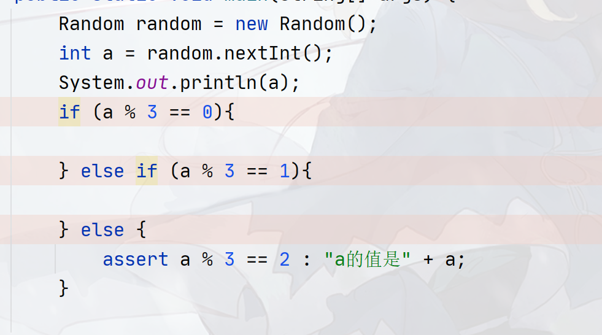
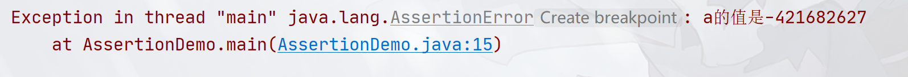

## Java-Assertions

`Java`断言机制允许在测试期间向代码插入一些检查，而在生产代码中会自动删除这些检查！

Java语言中使用`assert`关键字来进行断言，其语法如下：

```java
assert condition;
assert condition : expression;
```

其中`condition`是一个逻辑表达式，其结果是`false`的时候，抛出`AssertionError`异常。在第二个语句中，表达式将传入`AssertionError`的构造器，并转换成一个消息字符串。如：





另外，默认情况下，断言是禁止的，可以在运行程序的时候加上`-enableassertions`参数或者`-ea`来启动断言（类似的，使用`-disableassertions`和`-da`关闭断言）：

```
java.exe -ea Hello
```

除了基本的断言之外，一些框架也提供了断言工具类，如`hutool`的`Assert`类和`JUnit`的`Assert`类

