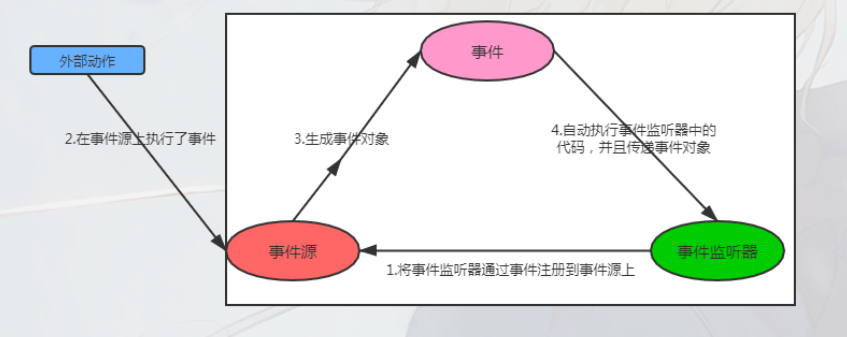
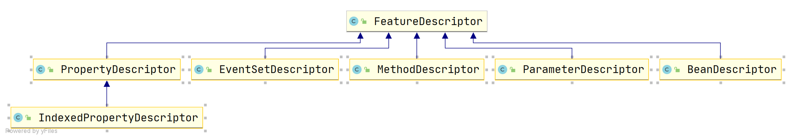
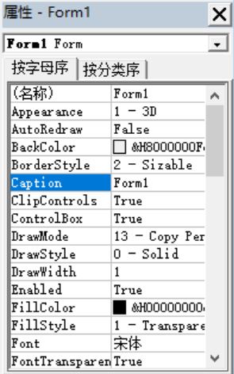
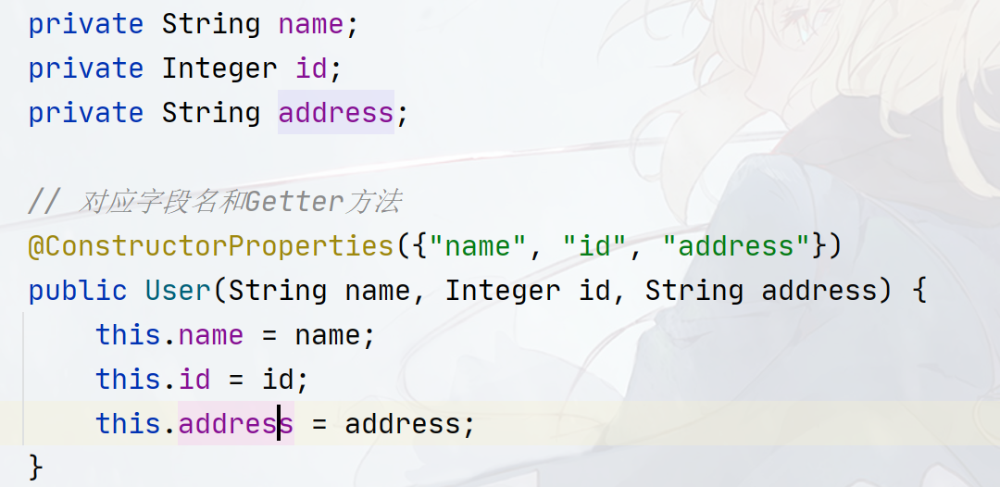
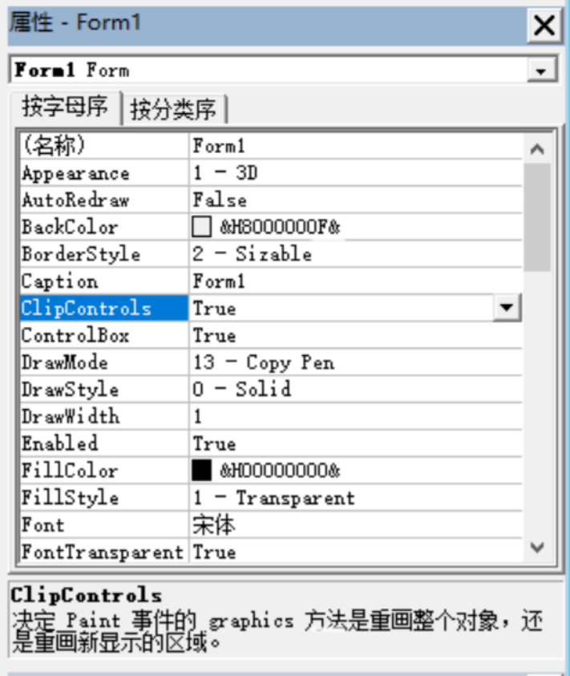

## JavaBean-API

> 本篇的所有内容最早用于Swing开发为主，在web兴起的时候一并引入，如今使用JavaBean的相关API，主要还是用来处理实体类，如果您在维护一些GUI老项目，则可以作为参考！

### JavaBean

何为`JavaBean`？所谓的`JavaBean`可以理解为是一种承载和传递数据的对象，这种类一般有如下要求：

- 类必须是具体的和公共的
- 至少拥有一个无参数的构造器（默认构造器）
- 有一个或者多个代表数据的字段（成员属性）
- 相关用于获取和设置字段的方法，也叫`Setter`和`Getter`

这里给出一个`JavaBean`的例子：

```java
package cn.argento.askia.bean;

public class User {
    private String name;
    private Integer id;
    private String address;

    public User() {
    }

    public Integer getId() {
        return id;
    }

    public void setId(Integer id) {
        this.id = id;
    }

    public String getAddress() {
        return address;
    }

    public void setAddress(String address) {
        this.address = address;
    }

    public String getName() {
        return name;
    }

    public void setName(String name) {
        this.name = name;
    }
}
```

这是一个最基础的`JavaBean`的定义，早期`JavaBean`的作用主要界面之间的信息传递，`Web`兴起的时候作用于`Web`，作用于控制器层、数据库层、`GUI`层等。

一个`JavaBean`理论上由三部分组成：属性（`properties`）、方法（`method`）、事件（`event`），在上面的定义中，并没有看到`event`部分的代码，这是因为事件是由一种类似于触发机制而产生的东西，在现代的`Web`开发中很少使用到这种机制，我们将在后续中补上相关的代码！

这种基于事件的触发机制基于设计模式的观察者模式，主要有三大成员组成（包括事件本身）：

- 事件源（`Event Source`）：事件源本身具备很多"动作"，这些动作由外部因素（如用户或者其他组件等）进行触发，可以说`JavaBean`本身就是事件源！
- 事件（`Event`）：事件源的"动作"被触发之后，会产生一个对应的事件对象，该对象会包含一些重要的信息（如触发"动作"的事件源、触发"动作"的时间等），产生的事件对象会被发送给事件监听器
- 事件监听器（`Event Listener`）：响应事件的场所，开发者在监听器内定义当事件发生时，需要做的事情！事件监听器一般需要预先被注册到事件源上才能触发。

他们的触发流程如下图：



- 一个事件源具有多个触发"动作"，不同的事件源也可以拥有相同的触发"动作"
- 一个触发"动作"对应一种事件（即一类事件对象）
- 一类事件一般由专门的事件监听器监听
- 一个监听器可以绑定在多个事件源上，一个事件源也可以绑定多个事件监听器！

学过`AWT`事件模型的同学就知道了，`AWT`的事件处理也是基于该机制实现的！

在`java.util`包中定义了事件和事件监听器的公共接口：`EventObject`和`EventListener`，其中`EventListener`还有进一步的抽象代理实现：`EventListenerProxy<T extends EventListener>`，当需要定义事件监听器的时候可以实现这个抽象代理对象！

`EventHandler`类则为动态生成事件监听器提供支持，生成的事件监听器的方法执行一条包括`EventObject`对象和目标对象（也就是事件源）的简单语句（对不起我实在不知道怎么翻译`EventHandler`文档的这段话，大概意思就是生成的监听器只能执行简单的代码）。

```
The <code>EventHandler</code> class provides
support for dynamically generating event listeners whose methods
execute a simple statement involving an incoming event object
and a target object.
```

### JavaBean API简介

在`rt.jar`中，有专门处理`JavaBean`的`API`，该组`API`位于`java.beans`包中，其核心在于：

> `BeanInfo`接口

该接口的实现类代表一个`JavaBean`的所有信息，约定上`JavaBean`类会有一个对应的`BeanInfo`接口实现，以用于对`JavaBean`的方法、字段和事件三大属性进行访问！如现有一个`JavaBean`类：`cn.argento.askia.User`，则会有一个对应`BeanInfo`类`UserBeanInfo`，里面记录着`User`类的三大内容！`UserBeanInfo`类可以由程序员通过实现`BeanInfo`接口实现，也可以通过反射`API`来创建。

`BeanInfo`接口有一个默认实现`SimpleBeanInfo`类，该类帮助你实现了大部分方法，你仅需重写需要的方法即可！

> FeatureDescriptor类



`FeatureDescriptor`类直译叫特性描述元数据，是一个超类，他的作用主要是描述`JavaBean`的相关特点（如`JavaBean`的三大组成），因此在其子类中，`JavaBean`三大组成会被封装成相应的`FeatureDescriptor`子类：

- `EventSetDescriptor`：事件集描述元数据，代表`JavaBean`支持的一组事件
- `PropertyDescriptor`：代表`JavaBean`内部字段的描述元数据，并提供相应的获取数据和设置数据的方法！
- `MethodDescriptor`：代表`JavaBean`内部所有方法的描述元数据，包括方法名、参数、参数个数等

除了这三个之外，还有一些扩展的描述元数据：

- `BeanDescriptor`：代表`JavaBean`的全局信息，如`displayName`，类名等！
- `ParameterDescriptor`：允许`JavaBean`实现者在`java.lang.reflect.Method`类提供的低级类型信息之外，提供关于它们的每个参数的附加信息。
- `IndexedPropertyDescriptor`：代表`JavaBean`内部数组字段的描述元数据，提供对数组操作的支持！

> 工具类

- `Beans`类提供了一些通用的`bean`控制方法
- `Introspector`类用于创建`BeanInfo`对象

`Introspector`的创建方法是先寻找和`JavaBean`具有相同全限定类名的`BeanInfo`对象，如有`JavaBean`：`cn.argento.askia.User`，则会先寻找`cn.argento.askia.UserBeanInfo`（也就是在原本`JavaBean`的全限定类名的基础上加上`BeanInfo`）

如果找不到，则会在系统路径中寻找一个叫`UserBeanInfo`的类。

如果再找不到，则会使用反射`API`来分析`cn.argento.askia.User`并返回结果！

> JavaBean的序列化：PersistenceDelegate类、XMLEncoder、XMLDecoder

`PersistenceDelegate`提供了一种干预`JavaBean`序列化的机制，你可以继承`PersistenceDelegate`，重写`WriteObject()`以实现干预`JavaBean`的序列化！

`PersistenceDelegate`底下有一个默认实现：`DefaultPersistenceDelegate`

使用`XMLEncoder`能够将一个`JavaBean`序列化成`XML`文件，使用`XMLDecoder`反序列化！

`XMLEncoder`和`XMLDecoder`是`ObjectInputStream`和`ObjectOutputStream`的一个扩展，在序列化`JavaBean`的时候，官方建议使用`XMLEncoder`和`XMLDecoder`代替

> 属性变化事件监听机制实现：

`java.bean`包中预定义了一种事件：`PropertyChangeEvent`，该事件在`JavaBean`的属性被更改的时候（这可以看作是`JavaBean`触发动作！）会产生，并发送给监听器（`Listener`）：`PropertyChangeListener`和`VetoableChangeListener`，他们的区别是`VetoableChangeListener`支持抛出`PropertyVetoException`异常！

`PropertyChangeEvent`还有一个子事件：`IndexedPropertyChangeEvent`，该事件专门应付数组类型的属性！同样被`PropertyChangeListener`和`VetoableChangeListener`监听。

`PropertyChangeListener`和`VetoableChangeListener`也有`PropertyChangeListenerProxy`和`VetoableChangeListenerProxy`代理实现，可以使用代理实现作为监听器！

另外为了实现上文提到的事件触发机制，提供了相应的辅助类：`VetoableChangeSupport`和`PropertyChangeSupport`

> 注解

- `@ConstructorProperties`：指定该`JavaBean`有什么属性名，标记在构造器上！
- `@Transient`：指定哪些属性不需要序列话到`XML`文件中，标记在方法上！

`@ConstructorProperties`的作用是显示该构造函数的参数如何对应于构造对象的`getter`方法，因为`JavaBean`规定属性成员不能直接被访问和修改（需要通过方法来修改、访问），同时由于方法的参数名通常在运行时不可获取（想要获取参数名一种方法是编译时加上`-D`，但仅限于类），所以可以指定该注解以方便获取`JavaBean`属性名！

> 方法、表达式声明

`Statement`和`Expression`类

> 属性修改器：PropertyEditor接口

`PropertyEditor`为允许用户编辑给定类型的属性值的`GUI`窗口提供支持！其中之一就是提供了一种将字符串转为具体类型的值的方法。

如你可能在一些集成环境中看到类似的属性编辑窗口：



在`Java`中，如果想要做出类似的属性窗口，则需要借助`PropertyEditor`接口来做具体的数据转换！

又如在`Spring`框架中，我们可以使用`@Value`注解为`URL`对象、`UUID`对象、`File`对象、`Path`对象插入值，实际上是靠对应的`org.springframework.beans.propertyeditors.URIEditor`、`org.springframework.beans.propertyeditors.URIEditor`、`org.springframework.beans.propertyeditors.FileEditor`等`PropertyEditor`的子类实现的！

`PropertyEditor`的类名命名是`JavaBean + Editor`的形式，你需要为哪个`JavaBean`类实现这种转换服务就需要定义对应的`JavaBeanEditor`，如：`cn.argento.askia.User`则需要创建一个`UserEditor`的`PropertyEditor`子类

`PropertyEditor`接口也有一个子代理实现：`PropertyEditorSupport`，可以继承该类而非直接实现`PropertyEditor`

`PropertyEditorManager`类则用于定位给定任何`Java`类型的`PropertyEditor`对象。`PropertyEditorManager`使用下面三个步骤来定位`PropertyEditor`对象：

1. `PropertyEditorFinder`中有一个专门存储`Java`类型和类型对应的`PropertyEditor`对象的`Map`，`PropertyEditorManager`提供了一个`registerEditor`方法，用于往这个`Map`中存储`PropertyEditor`对象，然后当给定`JavaBean`类型的时候，优先从这个`Map`中寻找`PropertyEditor`。
2. 如果步骤`1`找不到对应的`PropertyEditor`，则会尝试给目标类型的全限定类名加上`Editor`来寻找，如`cn.argento.askia.User`类，则寻找`cn.argento.askia.UserEditor`作为`User`类的`PropertyEditor`
3. 如果步骤`2`中的类不存在，则在`Classpath`中寻找类`UserEditor`作为`User`类的`PropertyEditor`

默认情况下：`JDK`提供了所有基本类型的`PropertyEditor`，还有`String`类、`java.awt.Color`类、`java.awt.Font`类的`PropertyEditor`。

> 一些暂时不知道用途的接口：

- `Customizer`接口：

- `DesignMode`接口：
- `ExceptionListener`接口：
- `Visibility`接口：

### @ConstructorProperties

一般我们可以在`JavaBean`的全参数构造器中使用`@ConstructorProperties`指定`JavaBean`内部有哪些属性，其注解定义如下：

```java
@Documented 
@Target(CONSTRUCTOR) 
@Retention(RUNTIME)
public @interface ConstructorProperties {
    String[] value();
}
```

如：



`@ConstructorProperties`只起到标记作用，代表着该`JavaBean`对象有哪些属性（属性名）

### Beans工具类

`Beans`工具类中常用的方法如下：

```java
// 提供一个类的全限定类名(beanName)和ClassLoader来初始化一个对象
// instantiate()优先在classpath中寻找一个后缀名为.ser的文件来实例化，如类cn.argento.askia.User则会寻找cn/argento/askia/User.ser文件来反序列出Java对象
// initializer参数用于初始化Applet程序
// beanContext
public static Object instantiate(ClassLoader cls, String beanName);
public static Object instantiate(ClassLoader cls, String beanName, BeanContext beanContext);
public static Object instantiate(ClassLoader cls, String beanName, BeanContext beanContext, AppletInitializer initializer);
// 判断bean对象是否是targetType类或者targetType类的子类的实例对象！
public static boolean isInstanceOf(Object bean, Class<?> targetType);
```

```java
// 设置和获取当前环境是否是设计环境
public static void setDesignTime(boolean isDesignTime);
public static boolean isDesignTime();
```

### FeatureDescriptor体系

在使用`GUI`组件时（如`JButton`、`JList`等），他们的相关属性（如`PreferSize`、`Font`、`Name`等）一般都是由`FeatureDescriptor`体系内的类进行定义和存储！举个例子，`JButton`内有`Name`、`Font`等属性，则会创建`Name`、`Font`等`FeatureDescriptor`子类代表这些属性！

`FeatureDescriptor`类内提供了组件的一些通用的属性，包括：

- `displayName`：代表该`Descriptor`的显示名称，该名称一般用于`GUI`中显示给用户看。
- `name`：代表该`Descriptor`的内部名称，该名称一般用于标记`Descriptor`。
- `ShortDescription`：代表该`Descriptor`的描述，好的描述控制在`40`个字符内。

使用`FeatureDescriptor`中相应的`Setter`设置这些属性的值：

```java
public void setDisplayName(String displayName);
public void setName(String name);
public void setShortDescription(String text);
public String getDisplayName();
public String getName();
public String getShortDescription();
```

如下图中：



我们可以将`Form1`看作是一个`JavaBean`，则表格内每一行都是一个`FeatureDescriptor`的子类，表格行左边的所有属性名都是`FeatureDescriptor`的子类的`displayName`属性，下边的描述是`ShortDescription`，`name`属性一般作为程序内部使用，因此这里无法公开知道！

在`FeatureDescriptor`中，还有一个`table`属性，是一个`Hashtable`，用于保存属性的值（也就是表格右边的数据）！因为右边的数据复杂，所以采用了Ha`shtable<String, Object>`存储！使用`SetValue()`来添加属性：

```
public Object getValue(String attributeName);
public void setValue(String attributeName, Object value);
```

另外在`FeatureDescriptor`还有一些标记记号（`boolean`类型），这些记号用于区分`FeatureDescriptor`的等级，因为`JavaBean`中并不是所有的属性都会公开给用户，参考上面的`name`属性，它只需要作为内部使用即可！一般有三个级别：

- `hidden`：设置该记号为`true`则代表该`FeatureDescriptor`无需对外暴露！
- `preferred`：设置该记号为`true`则代表该`FeatureDescriptor`应该优先用户使用的！

- `expert`：设置该记号为`true`则代表该`FeatureDescriptor`是提供给高级用户使用的！

这三个属性没有相互独立，你可以定义一个`FeatureDescriptor`即使`preferred`又是`expert`！

使用`Setter`设置标记：

```java
public void setExpert(boolean expert);
public void setHidden(boolean hidden);
public void setPreferred(boolean preferred);
public boolean isExpert();
public boolean isHidden();
public boolean isPreferred();
```

#### BeanDescriptor

`BeanDescriptor`用于描述一个类的`Class`对象，`JavaBean`的`Class`对象会被`BeanDescriptor`包装，`BeanDescriptor`提供了下面的构造器和方法给用户进行包装：

```java
public BeanDescriptor(Class<?> beanClass);
public BeanDescriptor(Class<?> beanClass, Class<?> customizerClass);

public Class<?> getBeanClass();
public Class<?> getCustomizerClass();
```

#### PropertyDescriptor

`PropertyDescriptor`用于描述`JavaBean`中属性及其`Getter`、`Setter`等访问方法！同时支持获取一个`PropertyEditor`对象。`PropertyDescriptor`的作用是提供一套公共的`JavaBean`属性访问修改方案！任何`JavaBean`的属性都可以通过`PropertyDescriptor`来访问。

你可以使用下面三个构造方法来创建`PropertyDescriptor`：

```java
// 提供JavaBean的属性名和类型
public PropertyDescriptor(String propertyName, Class<?> beanClass) throws IntrospectionException;
// 提供JavaBean的属性名和类型及其对应的Setter、Getter方法名称！
public PropertyDescriptor(String propertyName, Class<?> beanClass,
                String readMethodName, String writeMethodName)
                throws IntrospectionException;
// 提供JavaBean的属性名和readMethodg、WriteMethod对象
public PropertyDescriptor(String propertyName, Method readMethod, Method writeMethod) throws IntrospectionException;
```

在`PropertyDescriptor`，重要的内容主要有：

- `ReadMethod`：代表属性的`Setter`
- `WriterMethod`：代表属性的`Getter`
- `PropertyEditorClass`：代表属性的`PropertyEditor`，这个在后面会介绍！

```java
public synchronized void setReadMethod(Method readMethod) throws IntrospectionException;
public synchronized void setWriteMethod(Method writeMethod) throws IntrospectionException;
public void setPropertyEditorClass(Class<?> propertyEditorClass);

public Class<?> getPropertyEditorClass();
public synchronized Method getReadMethod();
public synchronized Method getWriteMethod();
```

可以使用下面方法获取该属性的类型：

```java
public synchronized Class<?> getPropertyType();
```

另外有，由于`Bean`包提供了一种监听属性变化的机制，所以提供了两个类型字段来绑定`JavaBean`的监听机制：

- `Bound`：值是`true`或者`false`，指定为`true`代表该`JavaBean`的属性是一个`Bound`属性，即通过`Setter`更新属性会触发`PropertyChange`事件
- `Constrained`：值是`true`或者`false`，指定为`true`代表该`JavaBean`的属性是一个`Constrained`属性，即通过`Setter`更新属性会触发`VetoableChange`事件

如果`JavaBean`实现了`PropertyChangeListener`接口，并提供了`addPropertyChangeListener()`，则需要指定`Bound`为`true`，同理，如果`JavaBean`实现了`VetoableChangeListener`接口，则需要指定`Constrained`为`true`。

这两个字段的设置遵顼上面的原则，有对应的`Setter`和`Getter`方法：

```java
public void setBound(boolean bound);
public void setConstrained(boolean constrained);

public boolean isBound();
public boolean isConstrained();
```

#### IndexedPropertyDescriptor

`IndexedPropertyDescriptor`是`PropertyDescriptor`的扩展，用于访问数组类型的`JavaBean`属性！额外提供了类似于下面的`Setter`和`Getter`方法：

```java
public void setArrayField(int index, Object target);
public Object getArrayField(int index);
```

实际上不仅仅是数组，只要是符合上面的`Setter`、`Getter`方法的都可以！

构造器：

```java
// 默认使用Setter和Getter的重载作为数组访问
public IndexedPropertyDescriptor(String propertyName, Class<?> beanClass) throws IntrospectionException;

public IndexedPropertyDescriptor(String propertyName, Class<?> beanClass, String readMethodName, String writeMethodName, String indexedReadMethodName, String indexedWriteMethodName) throws IntrospectionException;

public IndexedPropertyDescriptor(String propertyName, Method readMethod, Method writeMethod, Method indexedReadMethod, Method indexedWriteMethod) throws IntrospectionException;
```

方法：

```java
// 获取数组的原始类型
public synchronized Class<?> getIndexedPropertyType();
public synchronized Method getIndexedReadMethod();
public synchronized Method getIndexedWriteMethod();
public synchronized void setIndexedWriteMethod(Method writeMethod) throws IntrospectionException;
public synchronized void setIndexedReadMethod(Method readMethod)
throws IntrospectionException;
```

#### MethodDescriptor && ParameterDescriptor

`ParameterDescriptor`代表`JavaBean`的方法上的参数，并提供描述该参数的相关信息！

`ParameterDescriptor`并没有其他的方法，你可以重用`FeatureDescriptor`的属性即可！

而`MethodDescriptor`则代表`JavaBean`的方法，你可以使用下面的构造器创建他：

```java
// 代表一个没有参数描述的方法
public MethodDescriptor(Method method);
// 代表一个没有参数描述的方法并提供参数描述
public MethodDescriptor(Method method, ParameterDescriptor parameterDescriptors[]);
```

你可以使用下面的

```java
// 获取方法
public synchronized Method getMethod();
// 获取参数描述
public ParameterDescriptor[] getParameterDescriptors();
```

#### EventSetDescriptor

事件集描述元素据，代表`JavaBean`支持的多个事件的集合，`EventSetDescriptor`更多地描述的是事件监听器的内容，它具有如下属性：

- `eventSetName`：事件名称，可随意！
- `listenerType`：监听器类型，一般的事件监听器都需要实现或者继承`EventListener`接口。
- `listenerMethodNames`：监听器内的所有监听方法的方法名
- `addListenerMethodName`：添加监听器对象的方法名
- `removeListenerMethodName`：移除监听器对象的方法名
- `getListenerMethodName`：代表获取监听器对象的方法名


### BeanInfo

#### BeanInfo接口

`BeanInfo`可以说是`Class`对象的一个另外一种解决方案，主要用于简单介绍`JavaBean`的属性、方法、事件等！

`BeanInfo`接口内的主要方法如下：

```java
public interface BeanInfo {

    // 获取JavaBean的Bean类描述元素据，如类名、类继承
    BeanDescriptor getBeanDescriptor();
    // 获取JavaBean的事件集描述元素据
    EventSetDescriptor[] getEventSetDescriptors();
    /**
     * A bean may have a default event typically applied when this bean is used.
     *
     * @return  index of the default event in the {@code EventSetDescriptor} array
     *          returned by the {@code getEventSetDescriptors} method,
     *          or -1 if there is no default event
     */
    int getDefaultEventIndex();

    // 返回JavaBean的属性描述元数据，如果JavaBean中的属性是一个数组类型的属性，则会返回IndexedPropertyDescriptor类型的元数据，因此PropertyDescriptor[]中可能包含了IndexedPropertyDescriptor和PropertyDescriptor两种类型的元素据，客户代码可以使用instanceof来判断是哪种类型！
    PropertyDescriptor[] getPropertyDescriptors();

    /**
     * A bean may have a default property commonly updated when this bean is customized.
     *
     * @return  index of the default property in the {@code PropertyDescriptor} array
     *          returned by the {@code getPropertyDescriptors} method,
     *          or -1 if there is no default property
     */
    int getDefaultPropertyIndex();
    
    // 返回JavaBean方法元数据描述
    MethodDescriptor[] getMethodDescriptors();

    /**
     * This method enables the current {@code BeanInfo} object
     * to return an arbitrary collection of other {@code BeanInfo} objects
     * that provide additional information about the current bean.
     * <p>
     * If there are conflicts or overlaps between the information
     * provided by different {@code BeanInfo} objects,
     * the current {@code BeanInfo} object takes priority
     * over the additional {@code BeanInfo} objects.
     * Array elements with higher indices take priority
     * over the elements with lower indices.
     *
     * @return  an array of {@code BeanInfo} objects,
     *          or {@code null} if there are no additional {@code BeanInfo} objects
     */
    BeanInfo[] getAdditionalBeanInfo();

    /**
     * Returns an image that can be used to represent the bean in toolboxes or toolbars.
     * <p>
     * There are four possible types of icons:
     * 16 x 16 color, 32 x 32 color, 16 x 16 mono, and 32 x 32 mono.
     * If you implement a bean so that it supports a single icon,
     * it is recommended to use 16 x 16 color.
     * Another recommendation is to set a transparent background for the icons.
     *
     * @param  iconKind  the kind of icon requested
     * @return           an image object representing the requested icon,
     *                   or {@code null} if no suitable icon is available
     *
     * @see #ICON_COLOR_16x16
     * @see #ICON_COLOR_32x32
     * @see #ICON_MONO_16x16
     * @see #ICON_MONO_32x32
     */
    Image getIcon(int iconKind);

    /**
     * Constant to indicate a 16 x 16 color icon.
     */
    final static int ICON_COLOR_16x16 = 1;

    /**
     * Constant to indicate a 32 x 32 color icon.
     */
    final static int ICON_COLOR_32x32 = 2;

    /**
     * Constant to indicate a 16 x 16 monochrome icon.
     */
    final static int ICON_MONO_16x16 = 3;

    /**
     * Constant to indicate a 32 x 32 monochrome icon.
     */
    final static int ICON_MONO_32x32 = 4;
}
```

自定义的`JavaBean`类应该有属于自己的`BeanInfo`，因此开发者需要实现自己`JavaBean`的`BeanInfo`。

`BeanInfo`接口有一个默认实现`SimpleBeanInfo`类，该类帮助你实现了大部分方法，可以继承该类来实现自己的`BeanInfo`

##### 编写BeanInfo实现类


#### Introspector工具类

`Introspector`工具类的一个用途是创建`BeanInfo`对象。对于属性、方法、事件这三种信息中的每一种，`Introspector`类将分别分析`bean`的类和超类，寻找显式或隐式的信息，并使用这些信息构建全面描述`JavaBean`的`BeanInfo`对象。

`Introspector`工具类创建`BeanInfo`对象的方法如下：

```java
// 提供JavaBean的Class对象获取响应的BeanInfo
public static BeanInfo getBeanInfo(Class<?> beanClass) throws IntrospectionException;
// 会递归分析JavaBean类及JavaBean类的继承链上stopClass之前的所有父类的BeanInfo，
public static BeanInfo getBeanInfo(Class<?> beanClass, Class<?> stopClass) throws IntrospectionException;
// 会递归分析JavaBean类及JavaBean类的父类，分析出多个JavaBean类的BeanInfo
// Flag支持三个选项：
/*
USE_ALL_BEANINFO
任何可以被发现的BeanInfo都会被分析

IGNORE_IMMEDIATE_BEANINFO
忽略beanClass的自定义BeanInfo和内部BeanInfo

IGNORE_ALL_BEANINFO
忽略beanClass和beanclass的所有父类（直到stopClass）的自定义BeanInfo和内部BeanInfo
*/
// 另外stopClass或其父类中的任何方法/属性/事件都会在分析中被忽略。（即不包含边界）
public static BeanInfo getBeanInfo(Class<?> beanClass, Class<?> stopClass, int flags) throws IntrospectionException;
// 
public static BeanInfo getBeanInfo(Class<?> beanClass, int flags)
throws IntrospectionException;
```

`Introspector`类中的`getBeanInfo()`搜索`BeanInfo`对象的顺序我们在`API`简介中简单介绍过：

1. 首先会搜索和`JavaBean`类相同包名的`JavaBeanBeanInfo`类，如有`JavaBean`：`com.x.y.User`，则首先会搜索`com.x.y.UserBeanInfo`（通常这个类是开发者自定义的）作为`User`类的`BeanInfo`类
2. 如果第一步的搜素得不到`BeanInfo`类，则会使用`UserBeanInfo`作为类名，在系统路径中搜索，系统路径为下面两个包：`sun.beans.infos`和`com.sun.beans.infos`
3. 如果系统路径仍然也找不到，则`Introspector`类会调用反射`API`来进行类分析并创建`BeanInfo`对象！

默认情况下，如果`JavaBean`类具有继承关系，则`getBeanInfo()`默认会分析`JavaBean`类和所有`JavaBean`父类的`BeanInfo`，当然如果希望`getBeanInfo()`分析到某个父类就停止分析，则可以指定`stopClass`参数（不包括`stopClass`），比如现在有下面的`JavaBean`：

```java
// User类、 VipUser类、PartnerUser类，他们的继承关系如下：
User <---- VipUser <----- PartnerUser
  
// 则当我们调用
Introspector.getBeanInfo(PartnerUser.class);
// 会分析出所有的的父类的BeanInfo，即User类中的属性、方法、事件，VipUser类中的属性、方法、事件，PartnerUser类中的属性、方法、事件都会被分析出来！

// 如果希望只分析到User类（即分析VipUser类中的属性、方法、事件，PartnerUser类中的属性、方法、事件，不分析User类的），则可以：
Introspector.getBeanInfo(PartnerUser.class, User.class);
```

另外在`getBeanInfo()`的方法参数中，还有一个整型的`flags`参数，这个参数用来控制是否使用上面的第一步和第二步的方法来获取`BeanInfo`：

- `USE_ALL_BEANINFO`：`beanClass`及`beanClass`对应的类的所有父类都会遵循上面的三个步骤来搜索分析出`BeanInfo`
- `IGNORE_IMMEDIATE_BEANINFO`：`beanClass`不进行第一第二步的分析，直接由`Introspector`类调用反射`API`来分析出`BeanInfo`，而`beanClass`的所有父类都采用上面的三个步骤来搜索分析出`BeanInfo`
- `IGNORE_ALL_BEANINFO`：`beanClass`及`beanClass`对应的类的所有父类都直接由`Introspector`类调用反射`API`来分析出`BeanInfo`

最后，搜索`BeanInfo`对象的第二步中涉及到的系统路径，我们可以手动添加更多的包进去，可以使用下面的`API`来获取、增加系统的搜索路径：

```java
// 设置系统BeanInfo的所有路径包，默认：sun.beans.infos，你可以添加自己的路径如：com.y.x.pack
public static void setBeanInfoSearchPath(String[] path);
// 获取系统的搜索路径
public static String[] getBeanInfoSearchPath();
```

### 属性事件监听


#### 自定义事件监听


### 属性修改器


### JavaBean序列化

