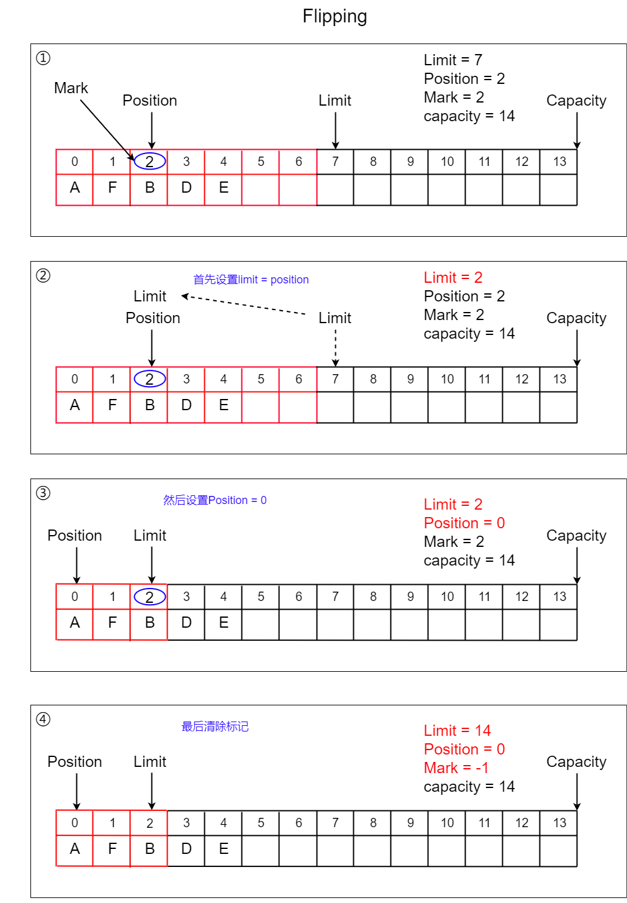

## Java-Buffer

### 简介

所谓`Buffer`（缓冲区）是一组特定的基本类型数据（除`Boolean`之外）的容器！底层实现则是一个数组。在这个容器内，数据可被存储并在之后用于检索。缓冲区可以被写满或释放。所有的`Buffer`类再`java.nio`包下：


可以注意到`Buffer`的子类有：

- `ByteBuffer`：
- `CharBuffer`：
- `DoubleBuffer`：
- `FloatBuffer`：
- `IntBuffer`：
- `LongBuffer`：
- `ShortBuffer`：

可以看到是没有`Boolean`类型的`Buffer`类的，另外尽管缓冲区作用于它们存储的原始数据类型，但缓冲区十分倾向于处理字节。非字节缓冲区可以在后台执行从字节或到字节的转换，这取决于缓冲区是如何创建的。

`Buffer`类的主要作用是提供一种缓冲和传输数据的功能，差分数据之间的读写，因此`Buffer`类非常适合`Java`网络编程环境，同时`Buffer`类还提供例如标记、回溯、位置顺序读取功能。一般情况下，`Buffer`除了内容之外，还具备下面的四个属性：

- `capacity`（容量）：代表缓冲区的大小，容量必须是非负数且一旦确定永远不变！
- `limit`（上限）：代表缓冲区第一个不能被读或写的元素，该值不能大于`capacity`，值非负且值可变！
- `position`（位置）：下一个要读或写的元素的索引，从`0`开始！值不能大于`limit`且非负！
- `Mark`（标记）：标记某个位置配合`reset()`实现回溯读写！与`IOStream`中的 `Mark`功能一样！标记不能超过`Position`！且如果没有标记的话，则会设置成`-1`！

由于`Buffer`的底层是一个数组，所以我们很容易就能描述出上面的四大属性：


从这个图中，可以看出四大属性之间具有如下关系：`0 <= mark <= position <= limit <= capacity`

### Buffer API

`Buffer`类中主要包含了对上面四大属性的`API`。如：

```java
// 获取Buffer的Capacity属性
public final int capacity();
// 获取Buffer的limit属性
public final int limit();
// 获取Buffer的position属性
public final int position();
```

```java
// 设置Buffer的limit属性，如果position > newLimit,则position = newLimit，如果mark > newLimit,则清空mark标记！（设置成-1）
public final Buffer limit(int newLimit);
// 设置Buffer的position属性，如果newPosition > limit则会抛出createPositionException，如果mark > 如果newPosition, 则清空Mark标记！
public final Buffer position(int newPosition);
```

上面这些`API`的源代码并不难看懂，无非就是`Getter`和`Setter`，后面的两个`Setter`需要注意其他属性的设置，如：


并且`Buffer`类中返回值是`Buffer`的方法都支持链式调用，如：

```java
Buffer b = ...;
b.flip();
b.position(23);
b.limit(42);

// 上面的代码等价于下面
b.flip().position(23).limit(42);
```

#### Buffer操作

除了四大属性的`Setter`和`Getter`之外，还有一些组合四大属性设置的操作，他们被归类为：

> `Clearing`（清除）

```java
public final Buffer clear();
```

`Clearing`操作并不会真的清除`Buffer`中的所有数据！它主要的步骤如下：

1. 移动`position`为`0`
2. 让`limit = capacity`
3. 清空`mark`标记

如源代码所示：

`Clearing`操作的作用是为下一次从头开始读或覆盖写数据做准备！同时清空`Mark`标记，官方文档中建议您在读或覆盖写`Buffer`之前调用该方法：

```java
buf.clear();     // Prepare buffer for reading
in.read(buf);    // Read data
```

虽然其并不具备清空数据的能力，但其表现出来的覆盖写数据却具备清除数据的能力，因此该操作取名`Clearing`：


> flipping（翻折）

```java
public final Buffer flip();
```

`flipping`操作将一个`Buffer`"折断"，其主要操作：

1. 设置`limit = position`
2. 移动`position`为`0`
3. 清除`Mark`

源代码如图：

翻折操作的作用是限制数据的读写边界，让读写保持在有内容的区域内，官方建议在往`Buffer`内写入数据之后，再次读取`Buffer`内数据之前调用一次该方法：

```java
buf.put(magic);    // Prepend header
in.read(buf);      // Read data into rest of buffer
buf.flip();        // Flip buffer
out.write(buf);    // Write header + data to channel
```



> rewinding（倒回）

```java
public final Buffer rewind();
```

`rewinding`和`flipping`的区别是，`rewinding`不会改变`limit`！其操作如下：

1. 移动`position`为`0`
2. 清除`Mark`

源代码如图：

`rewinding`主要用于当你往`IO`或`Channel`中写入数据之后，希望将写入的数据复制出来之前调用：

```java
out.write(buf);    // Write remaining data
buf.rewind();      // Rewind buffer
buf.get(array);    // Copy data into array
```


> Marking and resetting

`Marking`和`resetting`实际上是两个操作，但这两个操作一般绑定在一块使用：

```java
public final Buffer reset();
public final Buffer mark();
```

`Marking`标记当前`Position`：

而`resetting`则是让`position`回到`mark`的位置：


> remaining

`remaining`主要用于判断当前`Buffer`是否还有内容可读！`limit`标记了第一个不可读的位置，因此`remaining = limit - position `就能获取：

```java
// 获取还能读取几个数据
public final int remaining();
// 判断是否还有数据可读
public final boolean hasRemaining();
```

 


#### Buffer可选操作

同时`Buffer`抽象类中也定义了很多子类需要重写的抽象方法，这些方法在具体的子`Buffer`中稍有不同：

##### array-backed Buffer

```java
// 返回该Buffer的参考数组,具体的Buffer子类重写方法时需要更改返回值为具体类型的数组类型，如ByteBuffer则返回值Object改为byte[]，CharBuffer则返回值改为Char[]，以此类推！
public abstract Object array();
// arrayOffset代表数组所在底层Buffer的偏移，见Slicing操作小节中的偏移量说明！
// 所有的get、put等操作都会加上这个arrayOffset来进行Buffer寻址！
// 因此get(2)实际上等于get(arrayOffset() + 2)
// 新创建的Buffer的arrayOffset等于0
public abstract int arrayOffset();
// 判断是否有底层数组！
public abstract boolean hasArray();
```

1. 此方法旨在允许将一个`array-backed Buffer（不知道怎么译，后背数组Buffer？）`更有效地传递给本机代码。都知道`Buffer`底层结构实际上就是一个数组，而`array-backed Buffer`支持将这个底层的结构获取出来给程序代码使用。
2. 由于是底层的存储结构，因此调用`Buffer`的`Put`方法修改`Buffer`的内容将导致返回数组的内容也被修改，反之亦然。
3. 子`Buffer`类在创建是，底层数组结构可能为`null`，尤其是创建`Direct Buffer`时，因此官方建议在调用`array()`或者`arrayOffset()`方法之前，调用`hasArray()`判断是否有底层数组！

##### 只读Buffer（Read-Only Buffer）

```java
// 如果Buffer是只读Buffer，则返回true
public abstract boolean isReadOnly();
```

每个`Buffer`都是可读的，但不一定可写。每个`Buffer`类的可选操作方法和内容修改方法在只读`Buffer`上调用时会抛出`ReadOnlyBufferException`。只读`Buffer`不允许修改其内容，但其`Mark`、`Position`和`Limit`仍然是可变的。

##### Direct Buffer

```java
// 如果Buffer是一个Direct Buffer，则返回true
public abstract boolean isDirect();
```

###### Direct Buffer是什么

`Direct Buffer`实际上就是一块在`Java`堆外分配的，可以被`Java`程序访问的内存，即所谓的堆外内存。其作用有两个：

1. 避免在调用底层操作系统的`I/O`操作之前(或之后)将用户进程`Buffer`的内容复制到`I/O`设备的`Buffer`（反之亦然），提高`I/O`操作性能
2. 分配一块脱离`JVM`管理的稳定内存，减少垃圾回收的负担，降低垃圾回收对应用的影响！

###### 为什么需要Direct Buffer

出于`OS`的安全性等的考虑，**进程是无法直接操作I/O设备的，其必须通过系统调用请求内核来协助完成I/O动作，而内核会为每个I/O设备维护一个buffer**。


整个请求过程为： 用户进程发起请求，内核接受到请求后，从`I/O`设备中获取数据到`buffer`中，**再将buffer中的数据copy到用户进程（如JVM进程）的地址空间**！

当启动`Java`虚拟机运行某个`Java`程序时，不管`Java`程序有多么复杂，都只占用1个`JVM`进程，都使用该`JVM`进程的内存区。

由于`32`位地址寻址限制，系统最多分配`4G`个可用地址给一个进程，`JVM`进程也不例外（见下面的说明）。当`JVM`需要使用这些空间的时候，可以向系统要（`malloc`函数）。`JVM`进程向系统申请的空间中，有一块专门给`Java`程序创建对象使用，一般称这块空间为`Java`堆！`Java`堆的重要性不言而喻，它管理着所有的`Java`对象，程序使用到的所有数据几乎都存放在这个区域！

如果说，我们使用普通的`ByteBuffer`，那么这个`ByteBuffer`就会在`Java`堆内，被`JVM`所管理，相当于用户进程的`Buffer`：

```java
ByteBuffer buf = ByteBuffer.allocate(1024);
```

使用这种`Buffer`在进行`I/O`操作的时候，由于需要将`I/O`设备中的`Buffer`内的数据复制到用户进程的`Buffer`，这可能会降低程序`I/O`操纵的性能！并且在执行`GC`的时候，`JVM`实际上会做一些整理内存的工作，也就说`buf`这个对象在内存中的实际地址是会发生变化的。有些时候，`ByteBuffer`里都是大量的字节，这些字节在`JVM GC`整理内存时就显得很笨重，把它们在内存中拷来拷去显然不是一个好主意。

因此能不能分配一块空间，这块空间受操作系统管理，能被用作`I/O`设备的Buffer，同时又能被`Java`程序所访问，还能免于`JVM`进程的控制，这就是`Direct Buffer`！

###### 何时使用Direct Buffer

官方文档建议将`Direct Buffer`分配为受限于底层本地系统`I/O`操作的大型、持久的`I/O Buffer`，并且分配的`Direct Buffer`最好能对程序性能有显著的提升时才分配。

如网络编程中希望省去`IO Buffer`到用户进程内存复制，或者希望将磁盘文件的一个区域直接映射到内存中，这些场景都可以创建`Direct Buffer`来实现！

###### 使用Direct Buffer有哪些弊端

1. 由于是游离于`JVM`的内存，首先要面对的就是堆外内存回收问题，以及堆外内存的泄漏问题。

2. 堆外内存的数据结构问题：堆外内存最大的问题就是你的数据结构变得不那么直观，如果数据结构比较复杂，就要对它进行串行化（serialization），而串行化本身也会影响性能。另一个问题是由于你可以使用更大的内存，你可能开始担心虚拟内存（即硬盘）的速度对你的影响了。

###### 关于进程4G可用地址空间（补）

当我们的程序代码`new`一个对象的时候，我们实际上会得到一个`32`位的内存地址，代表该对象的入口，如：`0061FF1C`。因为是`32`位的，所以范围在：`00000000(全0，换成十进制也是0) - FFFFFFFF(全1,换成10进制就是4,294,967,295)`之间，中间总共有`2 ^ 32=4,294,967,296`。换句话说在`32`位的地址寻址内，我们最多能够使用的地址数就是`4,294,967,296`个，相当于有`4,294,967,296`个格子（存储单元）！

一个存储单元存储一个字节（8个1或者0）的数据！我们有`4,294,967,296`个存储单元，那最多就是存储`4,294,967,296`个字节=4 * 1024 *1024 * 1024 = 4GB数据！也正是因为这32位地址寻址的限制，系统最多能为一个进程分配`4G`虚拟内存！


#### Buffer内容管理和创建

`Buffer`类作为一个抽象类，她并不具备管理`Buffer`内容的方法，这些管理内容的方法由其子`Buffer`类实现！每一个`Buffer`子类都会有大量的`get`和`put`操作来进行内容管理。

另外一般情况下不能直接`new`具体的`Buffer`类，每个子`Buffer`类都提供了两个静态方法来方便创建`Buffer`对象：`allocate()`和`wrap()`。`allocate()`方法用于分配一个`Buffer`，指定`Buffer`的大小，也就是`Capacity`属性，而`wrap()`方法则是使用现有的数组来创建`Buffer`！

### 具体子Buffer

#### ByteBuffer

上节中介绍过，创建`Buffer`有两种方式：`allocate()`和`wrap()`。在`ByteBuffer`，可以使用下面的静态方法进行创建：

```java
// 分配一个ByteBuffer，其中capacity指定Byte类型值的个数！
// 如capacity = 1024则等于new byte[1024]
public static ByteBuffer allocate(int capacity);
// 将一个现成的byte[]来创建作为ByteBuffer
public static ByteBuffer wrap(byte[] array);
// 将一个现成的byte[]的一部分来创建ByteBuffer
public static ByteBuffer wrap(byte[] array, int offset, int length);

// 创建一个Direct Byte Buffer，也就是堆外内存！
// 需要注意的是DirectBuffer的创建是比较耗时的，所以在一些高性能的中间件或者应用下一般会做一个对象池，用于重复利用DirectBuffer。
public static ByteBuffer allocateDirect(int capacity);
```

新创建的`Buffer`的`Position`将会设置为`0`，`Limit`将等于`Capacity`，`Mark`等于`-1`，每一个成员将会被初始化成`0`并且`arrayOffset`也是`0`

```
The new buffer's position will be zero, its limit will be its
* capacity, its mark will be undefined, and each of its elements will be
* initialized to zero.  It will have a {@link #array backing array},
* and its {@link #arrayOffset array offset} will be zero.
```

##### 内容管理

基本的内容管理方法如下：

```java
// 获取当前Position，并且Position + 1
public abstract byte get();

// 相当于调用get(dst, 0, dst.length);
public ByteBuffer get(byte[] dst);

// 将Buffer中的数据复制到dst，如果length > remaining()则抛出异常，相当于调用了length次的get()方法，即和下面的代码等价：
/*
	for (int i = offset; i < offset + length; i++)
         dst[i] = get():
*/
// 因此调用该方法Position会移动到Position + length
public ByteBuffer get(byte[] dst, int offset, int length);

// 通过下标来字节，不会引发并且Position的增长！
public abstract byte get(int index);

// put存入内容
public abstract ByteBuffer put(byte b);
public final ByteBuffer put(byte[] src);
public ByteBuffer put(byte[] src, int offset, int length);
public ByteBuffer put(ByteBuffer src);
public abstract ByteBuffer put(int index, byte b);
```

还有另外一种以获取和设置特定类型字节的方法：

```java
// 读两个字节并将它转为Char，Position + 2
public abstract char getChar();
// 从特定的下标开始读两个字节并转为Char，不会改变Position
public abstract char getChar(int index);

// 读八个字节并将它转为Double，Position + 8
public abstract double getDouble();
// 从特定的下标开始读八个字节并转为Double，不会改变Position
public abstract double getDouble(int index);

// 读四个字节并将它转为float，Position + 4
public abstract float getFloat();
// 从特定的下标开始读四个字节并转为Float，不会改变Position
public abstract float getFloat(int index);

// 读四个字节并将它转为Int，Position + 4
public abstract int getInt();
// 从特定的下标开始读四个字节并转为Int，不会改变Position
public abstract int getInt(int index);

// 读八个字节并将它转为Long，Position + 8
public abstract long getLong();
// 从特定的下标开始读八个字节并转为Long，不会改变Position
public abstract long getLong(int index);

// 读两个字节并将它转为Short，Position + 2
public abstract short getShort();
// 从特定的下标开始读两个字节并转为Short，不会改变Position
public abstract short getShort(int index);
```

```java
public abstract ByteBuffer putChar(char value);
public abstract ByteBuffer putChar(int index, char value);
public abstract ByteBuffer putDouble(double value);
public abstract ByteBuffer putDouble(int index, double value);
public abstract ByteBuffer putFloat(float value);
public abstract ByteBuffer putFloat(int index, float value);
public abstract ByteBuffer putInt(int value);
public abstract ByteBuffer putInt(int index, int value);
public abstract ByteBuffer putLong(int index, long value);
public abstract ByteBuffer putLong(long value);
public abstract ByteBuffer putShort(int index, short value);
public abstract ByteBuffer putShort(short value);
```

##### 视图Buffers（View Buffers）

`View Buffers`是`ByteBuffer`的一个转换操作，允许将一个`ByteBuffer`转为任何的其他类型的`Buffer`，如`DoubleBuffer`等，可以使用下面的方法来创建`ViewBuffer`：

```java
// 创建一个CharBuffer
public abstract CharBuffer asCharBuffer();
// 创建一个DoubleBuffer
public abstract DoubleBuffer asDoubleBuffer();
// 创建一个FloatBuffer
public abstract FloatBuffer asFloatBuffer();
// 创建一个IntBuffer
public abstract IntBuffer asIntBuffer();
// 创建一个LongBuffer
public abstract LongBuffer asLongBuffer();
// 创建一个只读Buffer（参考Read-Only Buffer小节！）
public abstract ByteBuffer asReadOnlyBuffer();
// 创建一个ShortBuffer
public abstract ShortBuffer asShortBuffer();
```

1. 对视图`Buffer`的创建是相对于当前`Position`来说的！也就是说创建出来的`ViewBuffer`是`ByteBuffer`中`Position`到`Limit`这一段的内容

2. 对`ByteBuffer`进行`Put`操作将会同步影响到`ViewBuffer`，反之亦然！
3. `ByteBuffer`和`ViewBuffer`中的`Position`、`limit`、`mark`都是独立开的！

`ViewBuffer`相对于`putChar`、`putLong`等方法的优点在于：

1. A view buffer is indexed not in terms of bytes but rather in terms of the type-specific size of its values;
2. A view buffer provides relative bulk get and put methods that can transfer contiguous sequences of values between a buffer and an array or some other buffer of the same type;
3. A view buffer is potentially much more efficient because it will be direct if, and only if, its backing byte buffer is direct.

##### Compacting操作

```java
public abstract ByteBuffer compact();
```

压缩（`Compacting`）操作主要将剩余的数据移动到`Buffer`头！

1. 令`p = 当前Position`，将当前`Position`位置的字节复制到`Buffer`为`0`的位置
2. 将`Position + 1`位置的字节复制到`Buffer`为`1`的位置，以此类推
3. 直到复制完`Limit - 1`处的字节到`Limit - 1 - p`的位置，令`n = Limit - 1 - p`
4. 设置`position = n + 1`，设置`Limit`为`capacity`
5. 如果有`Mark`标记，则清除`Mark`标记

源代码如图所示：

如果写入数据不完整，则可以调用该方法用于缩小数据方便下一次继续写入！例如，下面的循环通过缓冲区缓冲区将字节从一个通道复制到另一个通道:

```java
 buf.clear();          // Prepare buffer for use
 while (in.read(buf) >= 0 || buf.position != 0) {
     buf.flip();		// Limit = posittion, position = 0
     out.write(buf);
     buf.compact();     // In case of partial write		    
     // 移动剩余没写完的数据到Buffer 0的位置，然后继续读入数据，然后再写入Buffer的数据
 }
```


##### duplicating操作

复制操作，复制一个完全一样的`Buffer`，源代码如下：

对复制出来的`Buffer`进行`Put`操作将会影响原来的`Buffer`，反之亦然，但他们的`Limit`、`Position`、`Mark`都是相对独立的！

##### slicing操作

子`Buffer`复制，将原`Buffer`的一部分内容复制出来！注意并不会真的复制一块新的空间，而是公用一个底层数组，子Buffer通过设置一个`Offset`偏移量（也就是`arrayOffset`）的形式来得到一个相对坐标

1. 会以`pos`作为第一个下标（相对下标）
2. 子`Buffer`默认不带父`Buffer`的`Mark`
3. 子`Buffer`的`Limit`和`capacity`都等于父`Buffer`的`Limit` - 父`Buffer`的`Position`
4. 对子`Buffer`的`Put`操作会影响到父`Buffer`，反之如果操作到子`Buffer`和父`Buffer`公用的部分位置则也会受影响！因为子`Buffer`和父`Buffer`共用一个底层数据！

源代码如下：


##### ENDIAN

大端（Big Endian）、小端（Little Endian）

#### CharBuffer

##### Buffer创建

```java
public static CharBuffer allocate(int capacity);
public static CharBuffer wrap(char[] array);
public static CharBuffer wrap(char[] array, int offset, int length);
public static CharBuffer wrap(CharSequence csq);
public static CharBuffer wrap(CharSequence csq, int start, int end);
```

##### 内容管理

```
public CharBuffer append(char c);
public CharBuffer append(CharSequence csq);
public CharBuffer append(CharSequence csq, int start, int end);

public final char charAt(int index);
public IntStream chars();

public abstract char get();
public CharBuffer get(char[] dst);
public CharBuffer get(char[] dst, int offset, int length);
public abstract char get(int index);

public final int length();

public abstract CharBuffer put(char c);
public final CharBuffer put(char[] src);
public CharBuffer put(char[] src, int offset, int length);
public CharBuffer put(CharBuffer src);
public abstract CharBuffer put(int index, char c);
public final CharBuffer put(String src);
public CharBuffer put(String src, int start, int end);

public int read(CharBuffer target) throws IOException;

public abstract CharBuffer subSequence(int start, int end);
```

##### 操作

```

```


#### DoubleBuffer


#### FloatBuffer


#### IntBuffer


#### LongBuffer


#### ShortBuffer


