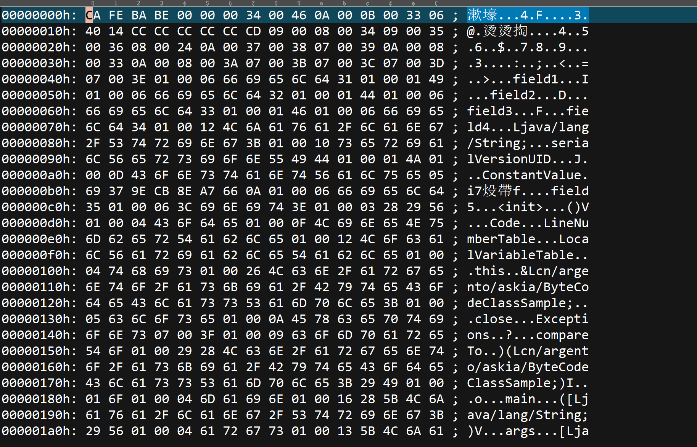
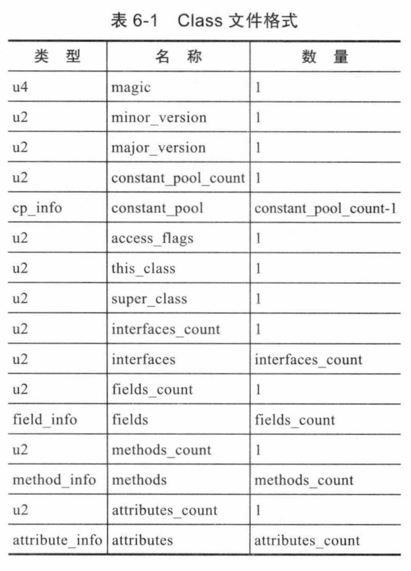

## Java-ByteCode

本章节主要介绍`Class`字节码文件中的文件结构，围绕一个专门编写的类编译出来的字节码进行分析，得到整个结构的说明，涉及到字节码的各个结构和指令，之后，我们尝试编写一个分析字节码结构的程序当作实践，最后介绍`Java`中大名鼎鼎的字节码框架`ASM`作为章节结束！

文章大量参考《`Java`虚拟机规范》和《深入理解`Java`虚拟机》两本书！

### 字节码文件结构

字节码文件的字节存储是非常紧凑的， 中间没有任何的分割符。当使用`Javac.exe`编译完一个类之后，得到的`class`二进制文件我们使用`UE`、`WinHex`等支持编辑`16`进制的软件打开之后就会显示如下图：



上面的结构很像内存结构，其中中间的`16`进制数字每一个单元代表一个字节，存储一个字节的内容，如开头的`CA`，左边是地址偏移，用于定位具体的位置，每一行内显示`16`个字节的内容，并且对应地址加`1`，地址从`0h`开始如：

```
CA --> 00000000h
FE --> 00000001h
// 以此类推
06 --> 0000000Fh
40 --> 00000010h
```

最右边的内容是左边字节对应的`ASCII`值！如`0x46 --> 70 --> F `。

啊没错，中间所有的`16`进制的内容就是我们要下手解析的字节码，这些字节码每一个字节都代表信息的一部分，都是有作用的，中间没有任何作为分隔符或者终止符的字节！

不像我们写代码的时候，需要空格、引号等分隔符号作为代码语义的切割，**字节码与其说没有分隔符不如说是根本不需要分割符号**，**因为所有的字节码要严格按照下表的顺序进行排列，某个字节或者某几个字节组成某个特定的项，这个项代表了这个类的类名、类字段数量、类方法数量等信息，具体项见下表：**



上表的类型主要有两种：

- `uX`等代表该项名称使用了多少个字节来表示，如`u1`代表使用1个字节、`u2`代表使用2个字节、`u4`代表使用4个字节
- 而除了`uX`等代表具体字节的项外，还有一些可变字节的项，这些项的类型是各种`XXX_info`，这是一种复合类型，具体占用字节多少需要看具体的子类型占用多少！类似于`C`语言的结构体一样！

所有通过`Javac.exe`编译出来的`class`字节码文件，无论其源文件中的代码有多复杂，代码行数有多少，其字节码文件都是遵循上面的结构的，这个结构定义了某个字节、或者某几个字节属于哪一项名称、有什么作用！如从`00000000h`到`00000004h`这四个字节就属于`magic`项，并且`magic`项永远都是`CA FE BA BE`这四个字节，从`00000005h`和`00000006h`代表`minor_version`项，具体该项有代表什么含义，我们在下面会进行介绍！

另外`16`进制字节的编排存在字节序问题（也叫端，`Endian`），这规定了内容的字节存储顺序：

- 大端（`Big-Endian`）：高位字节在低位地址，最低字节在高位地址！
- 小端（`Little-Endian`）：低位字节在低位地址，高位字节在高位地址！

如我们前面提到的`magic`项中存储的四个字节分别是：`CA FE BA BE`，换成二进制就是：`1100 1010 1111 1110 1011 1010 1011 1110`，对于一个二进制位，我们一般称左边的位为高位，右边的位为低位！

因此按照`Big-Endian`的存储方式：

```assembly
// 高位在低地址，低位在高地址！				
				0h          1h           2h            3h    
00000000h       CA          FE           BA            BE
```

而按照`Little-Endian`的存储方式：

```assembly
// 低位在低地址，高位在高地址！				
				0h          1h           2h            3h    
00000000h       BE          BA           FE            CA
```

`Java`字节码的字节序采用`Big-Endian`，一些`CPU`架构如`SPARC`、`PowerPC`也是使用这种字节序，而最常见的`x86`架构采用的是相反的`Little-Endian`

最后，要说明的是，在`Java`技术发展的初期，设计者们就曾经考虑过并实现让其他语言运行在`Java`虚拟机上的可能性，`Java`规范也被拆分成了两套规范，一套是`Java`虚拟机规范，另外一套是`Java`语言规范。而如今也出现了很多基于`JVM`的其他语言，如`Kotlin`、`Groovy`、`Scala`等（虽然其中不少实际上是`Java`换皮）！

`Java`虚拟机规范中规定了字节码应该以怎么样的顺序存储，哪个地方的哪几个字节组成什么意思，而`Java`语言规范则是规定`Java`语言的语法。`Java`语言的规范会比字节码要严格上不少，**因此一些在**`Java`**语法上非法的内容在字节码上却可以合法存在！**

时至今日，`Java`发展经历了十几个大版本、无数个小更新，在如今`Oracle`半年大更新、季度小更新的更新速度下，文章中介绍的字节码结构自`1997`年`JDK 1.2`开始就没有任何改变！尽管不同版本的《`Java`虚拟机规范》对`Class`文件格式进行了几次更新，但基本只是在原有的结构上新增内容、扩充功能、并没有对已定义的内容做出修改！

### 字节码解析

// 以什么文件进行解析


#### Magic项

> 占用4个字节，00000000h-00000004h

字节码文件头四个字节被称为魔数（`Magic Number`），它的作用是确定这个文件是否为一个能被虚拟机接收的`Class`文件。很多二进制文件都会使用魔数来标记文件类型，如`EXE`、`DLL`以`4D 5A`开头。文件格式的制定者可以自由地选择魔数，只要这个魔数值还没有被广泛采用过并且不会引起混肴。

`Class`文件的魔数是`CAFEBABE`，和`Java`的图标一样，使用了咖啡这个形象！

#### Minor Version和Major Version

> Minor Version：占2字节，00000005h-00000006h
>
> Major Version：占2字节，00000007h-00000008h

`Minor Version`代表小版本号！范围从0-65535
