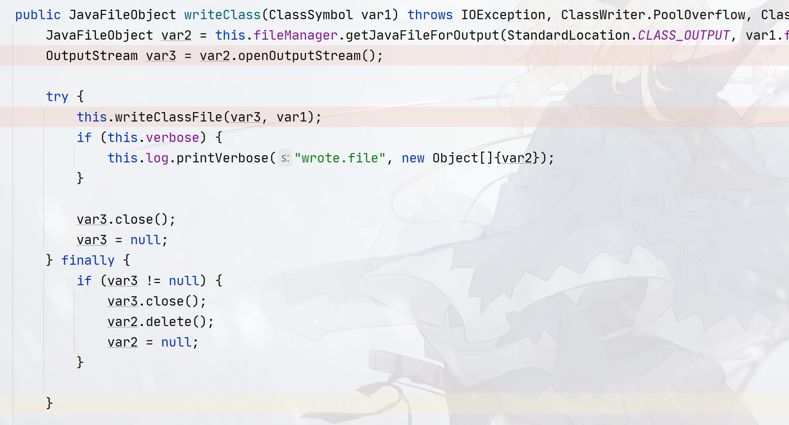

## Java-Compiler-Script

### Tools包

`Java SE 6`及之后提供了一套接口`javax.tools.*`（为了方便，称该包为：`Tools`接口包），提供了一套编译器`API`用于实现`Java API`编译`Java`代码，这套接口的依赖`tools.jar`包才能工作，`tools.jar`位于`JDK`的`lib`目录中，自`JDK`发布以来就一直存在。

早期没有`javax.tools.*`接口的时候，只能通过将`tools.jar`放在`classpath`，然后创建`com.sun.tools.javac.api`包下的`JavacTool`类的对象来实现在线编译。

`JDK 9`及之后引入模块化之后，`tools.jar`被整合进了`jdk.compiler`中，`tools.jar`不复存在。

#### 编译器API

##### Javac编译

编译器`API`的核心实现思路实际上是依赖`javac.exe`实现的，`Runtime`类中有一个`exec()`，用来执行系统命令（如`Windows`的`CMD`指令、`Linux`的`bash`命令），编译器`API`对这个执行方式进行了封装！

`Java API`中提供了`JavaCompiler`接口来编译代码，该接口的对象需要使用工厂类`ToolProvider`对象，使用下面的方法来创建：

```java
public static JavaCompiler getSystemJavaCompiler();
```

```java
final JavaCompiler javac = ToolProvider.getSystemJavaCompiler();
```

拿到`JavaCompiler`对象中，可以使用这个方法来将`java`文件编译成`class`文件

```java
int run(InputStream in, OutputStream out, OutputStream err, String... arguments);
// in ：代表标准输入流,会代替java文件内的System.in，如果传递null则使用System.in
// out：代表标准输出流,会代替java文件内的System.out，如果传递null则使用System.out
// err：代表标准错误流,会代替java文件内的System.err，如果传递null则使用System.err
// 上面三个流在编译文件时用于编译信息的传递，如java代码有语法错误的话，编译错误信息会传递给err流，如果有警告等信息则会传递给out
// arguments：代表传递给JavaCompiler的参数，如编译的java文件、编译参数等
```

```java
final int run = systemJavaCompiler.run(null, null, null, "-sourcepath", "src", "Test.java");
// 上面的代码相当于执行了javac.exe -sourcepath src Test.java
// 返回的是整数，0代表编译成功，其他整数代表失败！
```

当然上面的方法只能将`java`文件编译成`class`文件，要运行起来这个`class`文件，则需要使用`java.exe`。

不过`JDK`并没有提供`java.exe`的封装，所以要运行代码只能使用`Runtime`的`exec()`，代码可以参考：

> Java-Compiler/src/main/java/cn/argento/askia/DynamicCompilerDemo.java

##### 编译任务

然而，这种编译运行仍然是基于`java`文件，如果你希望通过`String`对象来存储`java`代码并编译运行，则需要使用`JDK 6`的另外提供的编译任务`API`：

```java
CompilationTask getTask(Writer out,
					JavaFileManager fileManager, 
					DiagnosticListener<? super JavaFileObject> diagnosticListener,
                    Iterable<String> options,
                    Iterable<String> classes,
                    Iterable<? extends JavaFileObject> compilationUnits);
// out:         用于输出错误信息的流，提供null则使用System.err。
// fileManager: 标准的文件管理器，提供null则使用系统默认fileManager
// diagnosticListener: 监听编译信息的监听器，提供null则使用System.err。
// options: 编译器的编译参数，如-sourcepath等，null则不传递任何编译参数
// classes: 该参数用于注解处理，如果要编译的代码中没有注解则传递null
// compilationUnits: 用于编译的代码，要求提供JavaFileObject接口对象，需要自己实现JavaFileObject接口

// 另外diagnosticListener的监听优先级会比out高，如果不提供diagnosticListener参数则会使用out来输出编译的错误信息！一般out参数提供null即可！
```

`getTask()`将会返回`CompilationTask`对象，该对象代表编译任务，所属的类是一个接口，并且实现了`Callable`接口，调用`getTask()`方法并不会启动编译过程，需要将其对象传递给`ExecutorService`以实现并行执行，或者直接调用`call()`方法进行同步调用即可开始编译：

```java
Boolean call();
// true代表编译成功，false代表编译失败
```

在`getTask()`方法中，几个参数可能比较陌生，如：`fileManager`、`diagnosticListener`，后三个参数则简单点，`Iterable`是`List`、`Set`等结构的顶层接口，可以创建`ArrayList`、`LinkedList`来传递，`JDK 11`还可以使用`List.of()`方法创建：

```java
// JDK 8
List<String> options = new ArrayList<>();
options.add("-d bin");
options.add("-sourcepath src");
options.add("-encoding GBK");

// JDK 11
List<String> options = List.of("-d bin", "-sourcepath src", "-encoding GBK");
```

`compilationUnits`参数代表要编译的参数，提供的是多个`JavaFileObject`接口对象，这些对象需要我们通过继承`JavaFileObject`接口的形式来实现，但该接口方法较多，`JDK`提供了一个简单的实现类`SimpleJavaFileObject`，使用该类我们可以避免编写一些不太重要且重复性高的属性方法，如`getKind()`、`getName()`。

创建一个类`JavaSourceJavaFileObject`，让他继承`SimpleJavaFileObject`类，重写下面方法用于返回`Java`代码（字符串形式）：

```java
public CharSequence getCharContent(boolean ignoreEncodingErrors) throws IOException;
```

```java
public class JavaSourceJavaFileObject extends SimpleJavaFileObject {

    // 存储Java代码（字符串形式）
    private StringBuilder javaCode;

    // 需要初始化父类，初始化kind和uri
    public StringSourceJavaFileObject(StringBuilder javaCode, String className) {
        // string:///cn/argento/askia/HelloWorld.java
        super(URI.create("string:///" + className.replaceAll("\\.", "/") + Kind.SOURCE.extension), Kind.SOURCE);
        this.javaCode = javaCode;
    }

    @Override
    public CharSequence getCharContent(boolean ignoreEncodingErrors) throws IOException {
        return javaCode.toString();
    }
}
```

`SimpleJavaFileObject`中有两个字段：`Kind kind`和`URI uri`，其中`kind`是一个枚举类，代表`getCharContent()`返回的内容的类型，有这几个值：

```java
Kind.CLASS		// 代表字节码文件
Kind.SOURCE		// 代表Java源文件
Kind.HTML		// 代表HTML
Kind.OTHER		// 代表其他文件
```

`uri`则代表一个定位标记，一般用于传递类名等信息，构造一个符合`uri`的格式即可，或者随便传递即可！编写方法可以参考`JavaSourceJavaFileObject`的构造器

然后我们来看看两个比较新的参数：`diagnosticListener`和`fileManager`，首先`diagnosticListener`很好解释，用于承载编译时的信息，需要提供一个泛型参数，作为导致出现这个错误信息的发生的发生源！

`DiagnosticCollector`类实现了`diagnosticListener`接口，代表收集到的所有的错误信息！可以提供这个类的对象即可！泛型写`SimpleJavaFileObject`或者`JavaFileObject`，因为我们要编译的源代码的类型就是这个类型！

```java
final DiagnosticCollector<JavaFileObject> javaFileObjectDiagnosticCollector = new DiagnosticCollector<>();
```

最后这个`fileManager`一般用于管理编译完成的编译产物，`JavaFileManager`还有一个子接口`StandardJavaFileManager`，当该`fileManager`传递`null`的时候，`getTask()`方法会调用下面的方法来获取一个默认的`JavaFileManager`

```java
StandardJavaFileManager getStandardFileManager(
    DiagnosticListener<? super JavaFileObject> diagnosticListener,
    Locale locale,
    Charset charset);
// diagnosticListener仍然是监听器，用于捕获文件缺失信息，直接传递之前的javaFileObjectDiagnosticCollector，
```

```java
final StandardJavaFileManager standardFileManager = systemJavaCompiler.getStandardFileManager(javaFileObjectDiagnosticCollector, null, null);
```

一般情况下我们采用这个默认的`StandardJavaFileManager`对象来处理即可，我们可以通过`getJavaFileObjects()`和`getJavaFileObjectsFromXXX()`将一个外部的`java`文件变成`JavaFileObject`对象（此时的`JavaFileObject`仍然是代表源代码而非字节码！）！然后交由`getTask()`方法！参考

> Java-Compiler/src/main/java/cn/argento/askia/DynamicCompilerTaskDemo.java

但这里我们的代码来源于`String`对象而不是文件，我们需要额外重写下面两个方法来**存储编译完成的字节码以及用来加载类的类加载器**，其他方法仍然交给默认实现处理即可

```java
ClassLoader getClassLoader(Location location);
JavaFileObject getJavaFileForOutput(Location location,
                                    String className,
                                    Kind kind,
                                    FileObject sibling);
// location代表操作标志
// className是源代码中的类名,系统会自动解析JavaSourceJavaFileObject对象getCharContent()的内容解析出类名
// Kind代表类型，一般这里会传递Kind.CLASS
// sibling代表原始代码，即上面的JavaSourceJavaFileObject对象
```

我们需要先定义一个`JavaFileObject`的子类`ByteCodeJavaFileObject`，代表字节码，

该类需要重写`openOutputStream()`，**系统会调用该方法往流中写入字节码**：



为了方便加载类我们还需要存储类名信息，因此完整的代码如下：

```java
public class ByteCodeJavaFileObject extends SimpleJavaFileObject {

    private ByteArrayOutputStream byteCode;
    private String className;

    protected ByteCodeJavaFileObject(String className) {
        // string:///cn/argento/askia/HelloWorld.java
        super(URI.create("bytes:///" + className.replaceAll("\\.", "/") + Kind.CLASS.extension), Kind.CLASS);
        byteCode = new ByteArrayOutputStream();
        this.className = className;
    }

    public String getClassName(){
        return className;
    }

    // 打开输出流，编译器会将存储结果放在这个输出流里面
    @Override
    public OutputStream openOutputStream() throws IOException {
        return byteCode;
    }

    
   	// 提供这个方法的好处是可以直接获得字节码而无需要后期重新获取流来读
    public byte[] getByteCodes(){
        return byteCode.toByteArray();
    }
}
```

我们在`getJavaFileForOutput()`中需要返回这个`ByteCodeJavaFileObject`对象来让系统写入编译信息到流！同时我们还需要提供一个类加载器来加载流中的字节码和处理注解！

我们定义一个`ClassFileManager`，继承自`StandardJavaFileManager`，重写`getClassLoader`和`getJavaFileForOutput`，其他方法交由默认的文件管理器实现：

```java
public class ClassFileManager2 implements StandardJavaFileManager {

    private StandardJavaFileManager systemDefault;
    private List<ByteCodeJavaFileObject> byteCodes;
    public ClassFileManager2(StandardJavaFileManager systemDefault){
        this.systemDefault = systemDefault;
        byteCodes = new ArrayList<>();
    }
    // 返回一个ByteCodeJavaFileObject对象用来装载字节码！
     @Override
    public JavaFileObject getJavaFileForOutput(Location location, String className, JavaFileObject.Kind kind, FileObject sibling) throws IOException {
        System.out.println("=============== StandardJavaFileManager:getJavaFileForOutput(Location, String, JavaFileObject.Kind, FileObject) ===============");
        System.out.println("Location：" + location.getName() + "，isOutput？" + location.isOutputLocation());
        System.out.println("className：" + className);
        System.out.println("kind：" + kind.extension);
        System.out.println("sibling：" + sibling + ",name：" + sibling.getName());
        // 如果是class类型，则输出对象让系统存储字节码
        if (kind == JavaFileObject.Kind.CLASS){
            ByteCodeJavaFileObject byteCodeJavaFileObject = new ByteCodeJavaFileObject(className);
            byteCodes.add(byteCodeJavaFileObject);
            return byteCodeJavaFileObject;
        }else{
            // 否则，则使用上层Filemanager进行处理
            return systemDefault.getJavaFileForOutput(location, className, kind, sibling);
        }
    }

    @Override
    public ClassLoader getClassLoader(Location location) {
        System.out.println("==================== ClassFileManager.getClassLoader ================");
        System.out.println("location:" + location);
        // 如果当前位置类型是CLASS_PATH
        if (location == StandardLocation.CLASS_PATH){
            System.out.println("使用SecureClassLoader加载...");
            return new SecureClassLoader(){
                @Override
                protected Class<?> findClass(String name) throws ClassNotFoundException {
                    System.out.println("搜索类" + name + "中...");
                    for (ByteCodeJavaFileObject b :
                            byteCodes) {
                        if (b.getClassName().equals(name) || b.getName().equals("/" + name.replace('.', '/') + ".class")){
                            System.out.println("搜索完毕!");
                            System.out.println("定义Class对象...");
                            final byte[] byteCode = b.getByteCodes();
                            final Class<?> aClass = defineClass(name, byteCode, 0, byteCode.length);
                            System.out.println("定义完毕，Class对象：" + aClass);
                            return aClass;
                        }
                    }
                    throw new ClassNotFoundException(name);
                }
            };
        }else{
            return systemDefault.getClassLoader(location);
        }

    }

	// 其他方法和这差不多
    // 存在大量重复的代码，可以继承ForwardingJavaFileManager<StandardJavaFileManager>来减少代码量！
    @Override
    public Iterable<JavaFileObject> list(Location location, String packageName, Set<JavaFileObject.Kind> kinds, boolean recurse) throws IOException {
        return systemDefault.list(location, packageName, kinds, recurse);
    }
```

我们重新梳理编写步骤：

1. 首先创建一个`JavaSourceJavaFileObject`类，实现`JavaFileObject`接口，重写`getCharContent()`方法以提供`Java`代码（字符串形式）

2. 其次创建一个`ByteCodeJavaFileObject`类，实现`JavaFileObject`接口，重写`openOutputStream()`以提供一个字节流让系统往里写入编译完成的类的字节码

3. 然后再创建一个`ClassFileManager2`，让其实现`StandardJavaFileManager`接口，重写`getClassLoader(Location location)`和`getJavaFileForOutput()`，其中`getJavaFileForOutput()`返回`ByteCodeJavaFileObject`对象提供给系统打开输入流写入字节码，其他方法使用系统默认文件管理器进行回调！

4. 创建`JavaCompiler`对象

   ```java
   final JavaCompiler javac = ToolProvider.getSystemJavaCompiler();
   ```

5. 创建`ClassFileManager2`对象，并将系统默认文件管理器传递给该类进行适配

   ```java
   // 获取默认文件管理器
   final StandardJavaFileManager standardFileManager = systemJavaCompiler.getStandardFileManager(null, null, null);
   // 创建自定义的文件管理器
   ClassFileManager2 classFileManager = new ClassFileManager2(standardFileManager);
   ```

6. 创建编译信息监听对象

   ```java
   final DiagnosticCollector<JavaFileObject> javaFileObjectDiagnosticCollector = new DiagnosticCollector<>();
   ```

7. 创建`JavaSourceJavaFileObject`对象并提供一段`Java`代码字符串

   ```java
   // 创建JavaSourceJavaFileObject
   JavaSourceJavaFileObject stringSourceJavaFileObject = new JavaSourceJavaFileObject(stringBuilder, className);
   // 转化成Iterable对象
   final List<JavaFileObject> javaFileObjects = new ArrayList<>();
   javaFileObjects.add(stringSourceJavaFileObject);
   ```

8. 调用`getTask()`方法，传递上面的对象，其他参数使用`null`即可

   ```java
   final JavaCompiler.CompilationTask task = systemJavaCompiler.getTask(
   null, classFileManager,
           javaFileObjectDiagnosticCollector, null, null, javaFileObjects);
   ```

9. 调用`CompilationTask`的`call`方法执行编译

   ```java
   final Boolean call = task.call();
   ```

10. 如果返回`false`，则输出错误日志，相关代码如下：

    ```java
    if (!call){
        System.out.println("编译失败");
        final List<Diagnostic<? extends JavaFileObject>> diagnostics = javaFileObjectDiagnosticCollector.getDiagnostics();
        for (Diagnostic<? extends JavaFileObject> diagnostic:
             diagnostics) {
            final long lineNumber = diagnostic.getLineNumber();
            final String code = diagnostic.getCode();
            final JavaFileObject source = diagnostic.getSource();
            final String message = diagnostic.getMessage(Locale.CHINA);
            System.out.println("lineNumber：" + lineNumber);
            System.out.println("code：" + code);
            System.out.println("source：" + source);
            System.out.println("message：" + message);
        }
        System.exit(1);
    }
    // 记得关闭文件管理器！！
    standardFileManager.close();
    classFileManager.close();
    ```

11. 返回`true`则进行类加载，反射调用方法：

    ```java
    // 获取类加载器
    final ClassLoader classLoader = classFileManager.getClassLoader(StandardLocation.CLASS_PATH);
    // 加载类得到Class对象
    final Class<?> loadClass = classLoader.loadClass(className);
    // 反射调用
    final Method main = loadClass.getMethod("main", String[].class);
    // 调用方法
    main.invoke(null, (Object) new String[0]);
    ```

为了方便大家理解这个代码的运作过程，这里贴出整个代码的时序图：


可以看出`javax.tools`包的`API`仍然很原始，甚至有点难用，我们可以对其进行一些简易的封装！具体封装方法在后面介绍！

#### Tools接口包详解

拿`Java`编译器举例，一般编译代码都需要`javac.exe`，并提供一些参数和编译的对象等，如：

```java
javac.exe -d D:/class cn.argento.askia.HelloWorld.java
```

这里就涉及到编译的**目标文件（java文件）**、**参数选项（-d）**，在编译的过程中会**输出代码中错误的地方**（如果有的话）还有编译完成之后的**编译产物（class文件）**，因此对`tools`接口包进行拆解，你会发现上面这些东西的抽象接口：

0. 用于定义工具本身接口：
   1. `Tool`：该接口代表一个工具，是顶级接口，在其底下，有两个子接口：
      1. `JavaCompiler`（代表`javac.exe`）
      2. `DocumentationTool`（代表`javadoc.exe`）
   2. `ToolProvider`：用于实例化工具的工厂类

1. 用于定义工具诊断信息，编译信息等：
   1. `Diagnostic`：代表一行诊断信息，提供了一个承载所有编译信息的实现：
      1. `DiagnosticCollector`：代表所有编译信息
   2. `DiagnosticListener`：用于监听编译过程产生的信息的监听器
2. 用于定义文件对象，也就是目标文件：
   1. `FileObject`：顶层抽象
   2. `JavaFileObject`：该接口代表一个`java`代码目标文件，提供字符串`java`代码存储能力
   3. `SimpleJavaFileObject`：`JavaFileObject`接口的一个简单实现，内部完成了一些属性的定义，可以继承该类来实现我们的`JavaFileObject`而不需要实现`JavaFileObject`接口
3. 用于定义参数是否合法：
   1. `OptionChecker`：提供判断参数是否合法的能力
4. 用于目标文件和编译产物之间的管理：
   1. `JavaFileManager`：用于管理`java`文件对象编译成功之后的字节码产物
   2. `StandardJavaFileManager`：`JavaFileManager`的子接口，提供了将一个`java`文件转为`JavaFileObject`的能力！

在该包中，还有一类`ForwardingXXXX`的类，这些类提供了对`XXX`接口对象的回调和内聚，以方便进行功能扩展和适配，这也是常见的对象适配器模式的变种：

```java
public class ForwardingFileObject<F extends FileObject> implements FileObject {
    // 适配对象
    protected final F fileObject;
    
    protected ForwardingFileObject(F fileObject) {
        fileObject.getClass(); // null check
        this.fileObject = fileObject;
    }
    
	@Override
    public URI toUri() {
        return fileObject.toUri();
    }
    @Override
    public String getName() {
        return fileObject.getName();
    }
    // 其他方法也大差不差！
}
```

##### 工具接口


#### 自定义工具集

### Script包

#### 脚本解析API

#### Script包详解


