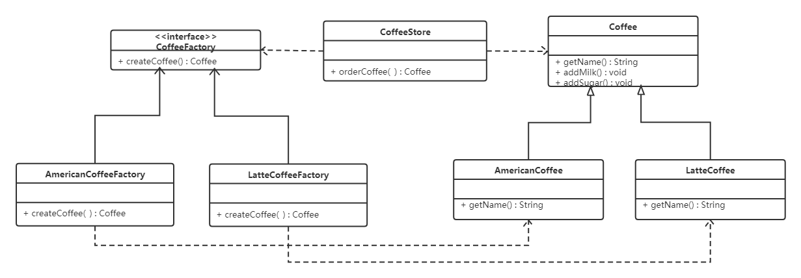

# Java-设计模式

本章来讨论`Java`中的设计模式，设计模式是一套被反复使用、多数人知晓的、经过分类编目的、代码设计经验的总结，是每个程序员的基本功！

本章虽然叫设计模式，但不仅仅介绍设计模式，本章会从基础的软件设计原则开始，然后再介绍`23`种设计模式，再到`JDK`中内置的两种设计模式，并尝试对这些设计模式进行代码层次的封装，最后会讨论一些经过实践的代码技巧和代码习惯！

本章中的大量内容参考了`GOF`的《软件设计模式》、《`Effective Java`》、《代码整洁之道》、《重构:改善既有代码的设计》等书籍以及黑马软件设计模式视频笔记。部分内容直接摘抄或整理自这些书本！

## 软件设计原则

> 开闭原则：对扩展开放、对修改关闭


> 里氏代换原则：子类扩展父类时不能改变父类原有的功能


> 依赖倒转原则：对抽象进行编程而不要对实现进行编程！


> 接口隔离原则：最小接口原则，一个类对另一个类的依赖应该建立在最小的接口上。


> 迪米特法则：代理法则，最少知识原则，使用第三方转发调用代替直接的相互调用


> 合成复用原则：优先使用组合或者聚合等关联关系其次才考虑继承

## 常见设计模式


### 创建型模式

#### 工厂方法（Factory Method）

工厂方法模式隶属于对象创建型模式，即定义一个用于创建对象的接口，让子类决定实例化哪一个类。`Factory Method`使一个类的实例化延迟到其子类。其主要结构如下：


- `Product`接口：工厂方法所需要创建的对象的接口（抽象产品）
- `ConcreteProduct`类：具体的要创建的对象（具体产品）
- `Creator`：提供工厂方法（`FactoryMethod()`），调用该方法将返回一个`Product`类型的对象（抽象工厂）
- `ConcreteCreator`：重写`FactoryMethod()`，返回具体的`ConcreteProduct`产品。

##### 实例

如下面的文档程序所示：


`Application`的子类重定义`Application`的抽象操作`CreateDocument()`以返回适当的`Document`子类对象一旦一个`Application`子类实例化以后，它就可以实例化与应用相关的文档，而无需知道这些文档的类，我们称`CreateDocument()`是一个工厂方法（Factory Method），因为它负责"生产"一个对象！

我们再看一个实例，下面的展示点咖啡程序例子来说明工厂方法模式，咖啡有很多种类，其设计类图如下：



抽象工厂：

```java
public interface CoffeeFactory {

    Coffee createCoffee();
}
```

具体工厂：

```java
public class LatteCoffeeFactory implements CoffeeFactory {

    @Override
    public Coffee createCoffee() {
        return new LatteCoffee();
    }
}

public class AmericanCoffeeFactory implements CoffeeFactory {

    @Override
    public Coffee createCoffee() {
        return new AmericanCoffee();
    }
}
```

咖啡店类：

```java
public class CoffeeStore {

    private CoffeeFactory factory;

    public CoffeeStore(CoffeeFactory factory) {
        this.factory = factory;
    }

    public Coffee orderCoffee(String type) {
        Coffee coffee = factory.createCoffee();
        coffee.addMilk();
        coffee.addsugar();
        return coffee;
    }
}
```

##### 优缺点

使用这种模式，用户可以做到：

1. 只需要知道具体的工厂名称就可以创建对应的产品对象，而无需关心对象的具体创建过程（如需要什么参数，创建的具体类型是什么等！），具体的创建过程交给工厂类来做！
2. 为子类方法提供了`hook`！使用工厂方法在类内部创建对象通常比直接创建对象更加灵活！你可以给工厂方法或者产品本身做更多的扩展，如可以增加一些`hook`方法来监听对象的创建过程：

另外在使用工厂方法时，由于产品和工厂是绑定的，因此增加一个新的产品就需要添加具体产品类和对应的具体工厂类，虽然这使你无须对原工厂进行任何修改，满足开闭原则。但随着产品类型的增加，系统中就会存在大量的产品和工厂类，这无疑增加了系统的复杂度。

要想解决上面的产品类和工厂类绑定的问题（即我们创建新的`Product`子类时需要同步创建`Creator`子类的问题），我们可以依赖泛型和`Class`对象来实现通用的工厂类：


另外工厂类的工厂方法一般有两种定义方法：非抽象方法的方式和抽象方法的方式。如果使用非抽象方法，则可以返回一个默认已知的产品实例，或者做一些子类具体工厂都会设置的工作！然后子类在重写工厂方法的时候通过`super`调用父类工厂方法进行兜底！一般建议采用非抽象方法设计的工厂方法带一个参数标识，以用于表示要创建的产品类型！（参数化工厂方法）


##### 使用场景

1. 当你的系统中，**某个类具有多种类型结构**，导致另一个类不知道它所必须创建的对象的类属于哪种结构的时候！
2. 当一个类有多种创建方式的时候！

// 具体的举例....


#### 抽象工厂方法

提供一个创建一系列相关或相互依赖对象的接口，而无需指定它们的具体的类。其主要结构如下：


`AbstractFactory`：提供了创建产品的接口，它包含多个创建产品的方法，可以创建多个不同等级的产品。

`ConcreteFactory`：具体的创建工厂

`AbstractProductA`：抽象`A`类产品

`AbstractProductB`：抽象`B`类产品

`ConcreteProduct`（`ProductA2`、`ProductA1`、`ProductB2`、`ProductB1`）：具体的产品

##### 实例


##### 优缺点

##### 使用场景


#### 单例模式

#### 原型模式

#### 创建者模式

将一个复杂对象的构建与它的表示分离，使得同样的构建过程可以创建不同的表示！


##### 实例


##### 优缺点

##### 使用场景

1. 当构造的对象需要的参数多且杂，参数可以随意组合，部分参数可以省略（有默认值）的时候可以使用！（`Effective Java`第2条建议）
2. 提供不同的参数构造出来的对象有不同的表现时。

### 结构型模式

#### 适配器模式（Adapter）


### 行为型模式

## JDK内置设计模式

`JDK`内置了两个设计模式的实现方案：代理模式（静态代理和动态代理）和观察者模式

### 静态代理

要想完全弄清楚代理，我认为还是要先从静态代理出发，首先我们传统方法上的调用可以被归纳为一个对应关系，**即调用方调用被调用方的方法，被调用方返回结果给调用方**：


这种调用很常见，但是如果遇到下面的情况：

- 被调用方不想暴露自己的方法给调用方
- 被调用方是一个已经打包好的包且调用方法前后需要做一些预处理事务

那么就需要一个“第三者”来帮助调用方进行方法调用。可以称这个“第三者”为**代理对象**


这样调用方调用的时候，代理对象对调用请求进行预处理，然后调用被调用方的相应方法，再返回。

所谓的静态代理模式，对应的设计类图可以参考：


这种设计方法应用场景非常多，比如在**交流通信中的黑名单功能**，可以参考下面代码的写法：

```java
// Connection.java
// Connection为接口，代理类和被调用方类都要实现
public interface Connection 
	// 建立连接通信通道，连接成功返回true，连接失败返回false
	boolean connect(Socket socket);
} 
```

```java
// ConnectionImpl.java
// 被调用方，负责具体的职责
public class ConnectionImpl implements Connection{
	public boolean connect(Socket socket){
		// 具体建立连接的代码
	}
}
```

```java
// ConnectionImplProxy.java
// 代理方，负责边缘职责，需要依赖被调用方
public class ConnectionImplProxy implements Connection{
	private ConnectionImpl impl;
	
	// 初始化impl的相关方法
    public ConnectionImplProxy(Connection impl){
        if(impl instanceof ConnectionImpl){
            this.impl = (ConnectionImpl)impl;
        }
    }
    public ConnectionImplProxy(ConnectionImpl impl){
        this.impl = impl;
    }
	
	public boolean connect(Socket socket){
		// 判断对方IP是否在黑名单内
		boolean isBlackGuy = checkFromBlacklist(socket.getInetAddress());
		
		// 如果对方是黑名单成员，则不建立通信连接，否则，建立连接
		if(isBlackGuy){
			return false;
		}else{
			return impl.connect(socket);
		}
	}
}
```

```java
// how to call
public class Main{
	public static void main(String[] args){
        Socket socket = ...;
        ConnectionImpl connectionImpl = new ConnectionImpl();
        Connection connection = new ConnectionImplProxy(connectionImpl);
        connection.connect(socket);
	}
}
```

上面的代码的好处就是连接的实现只需要专注于建立连接即可，而无需要再进行一些其他的判断（比如白名单黑名单`IP`过滤，`NAT`解析等），这些判断任务下发给代理类来完成，就好比明星和经纪人的关系，当明星团队接到一个表演任务的时候，明星只需要负责把表演的节目设计好表现好即可，至于表演的时间安排，场地安排等安排可以交给经纪人团队来做。

在面向对象思想的设计中，一般情况下，设计静态代理需要下面三大件：

- 负责边缘职责的代理类
- 核心单一职责的实现类

无论是代理类还是实现类，本质都是为了完成某件事情（上面的明星经纪人例子），因此，我们可以把这些对应的事情抽象出来：

- 所有职责封装成的抽象，一般是个接口

#### 静态代理总结

1. 首先需要一个**公共的被代理目标**，**可以是个接口，代理类和被调用方都要实现这个接口**
2. 代理类要**初始化一个被调用方类的对象作为字段**
3. **调用方通过调用代理类的方法**，**代理类调用被调用方的方法**，然后返回结果，这一个过程便是静态代理。

#### 静态代理扩展

在更加复杂的代理中，你可能会看到这种形式的变种：


就好比我们在明星和经纪人之间引入了经纪公司，经纪公司旗下可以有多个经纪人，也可以有多个明星，我们可以把上面的`Subjet`看成是经纪公司，在这复杂的体系下，我们引入了两个核心角色接口Actor、Manager代表明星和经纪人，同时一个经纪人也可以运行一个或者多个明星。这种代理方式结合了工厂模式！这也说明了每种设计模式之间并不独立！

另外，在`JDK`中，我们还能见到一种静态代理的扩展：`EventListener`和`EventListenerProxy<T extends EventListener>`


`EventListener`起到标记作用，这种变种静态代理模式的代理类使用了泛型来决定具体的被代理子接口！使用这种模式的一个好处是被代理的接口可以自定义接口方法，从而实现最小接口方法原则


### 动态代理

动态代理和静态代理在要求上没有区别，一半情况下都需要目标接口、代理类、具体职责实现类。

动态代理与静态代理的主要不同在于：

- 动态代理的代理对象会在程序运行时生成而不是靠程序员通过编码来实现（在编译器就已经实现）
- 动态代理对象不能事先知道自己当前代理的方法是什么，但是静态代理在编译时就已经确定自己要代理的方法是什么（因为静态代理类是实现了目标接口的）！

在`Java`中有，动态代理主要有两种实现方式：

- `JDK`原生的代理：原生代理中目标接口只能是接口
- 第三方库`CGLib`代理：第三方库代理中目标接口既可以是接口也可以是类（抽象和非抽象）

归根结底，动态代理中所谓的"动态"，是针对用`Java`代码实际编写了代理类的"静态"代理而言的，省去了编写代理类的那点工作量，它的优势在于实现了可以在原始类和接口还未知的时候，就确定了代理行为。

#### JDK原生代理

##### 被代理目标

在原生的代理实现中，代理目标只能是一个接口，`JDK`原生代理只能代理接口。

代理的目标接口相当于静态代理里面介绍的所有职责封装成的接口，在动态代理中，目标接口可以有一个，也可以有多个，一个目标接口也可以有多个方法，下面这些接口都可以被代理：

```java
public interface Connection 
	// 建立连接通信通道，连接成功返回true，连接失败返回false
	boolean connect(Socket socket);
} 
```

```java
// Socket写接口
public interface Writeable {
    boolean canWrite();
    int write(byte[] bytes);
}
```

```java
// Socket读接口
public interface Readable {
    byte[] read(int bufferSize, int readCount) throws IOException;
    boolean canRead();
}
```

##### 代理对象

在静态代理中，代理类需要实现目标接口，实际上动态生成的代理类也是如此，由于动态代理的代理类和代理对象是由程序运行时使用拼接字节码技术和反射`API`生成的，我们需要一些特殊手段才能看到生成的代理类的反编译代码，这个我们后面才介绍！

现阶段你可能更感兴趣的是这个动态代理对象如何生成的？在`java.lang.reflect`包下有一个类，叫`Proxy`，这个类是所有生成的代理类的父类。生成的代理类除了会继承`Proxy`之外，还会实现各个目标接口。可以使用下面的`API`来生成一个代理对象：

```java
public static Object newProxyInstance(ClassLoader loader,
                                      Class<?>[] interfaces,
                                      InvocationHandler h)
```

- `ClassLoader`：提供一个类加载器，用于加载生成的代理类！（参考`JVM`的类加载机制）

- `interfaces`：所有目标接口，生成的代理类会实现这些接口，这个实现的过程在游戏运行时完成，虽然你可能对此非常不可思议

- `InvocationHandler`：调用处理器接口，该接口是整个代理类的核心，该接口只有一个方法：

  - ```java
    // 参数：
    //  proxy：Proxy.newProxyInstance()生成的代理对象
    //  method：Method对象，代表目标接口中某个被调用的方法()
    //  args：代表调用方法的参数！
    public Object invoke(Object proxy, Method method, Object[] args) throws Throwable;
    ```

  - 所有对目标接口方法的调用都会转换到调用`invoke()`方法，`invoke()`方法的参数也是代理对象通过反射`API`转换目标接口方法来提供的。

  - 我们所有的边缘职责都可以在调用处理器中编写（实现`InvocationHandler`接口），通过`Method`对象在运行是判断调用了什么方法，通过`instanceof`具体的接口来查看当前的方法属于哪一个目标接口！

  - 无论是静态代理还是动态代理，**所有代理类中需要持有目标对象（被调用者）的字段**，并且只有在`invoke()`中调用了`method.invoke()`方法才会执行真正的业务，一种调用处理器的写法参考：

    ```java
    public class SocketHandler implements InvocationHandler{
        
        // 所有被调用者的字段，这些字段就是具体的业务，需要
        private Socket currentSocket;
        private Connection con;
        private Readable protReadable;
        private Writeable protWriteable;
        
        public SocketHandler(Connection con, 
                             Readable protReadable, Writeable protWriteable){
            this.currentSocket = con.getSocket();
            this.con = con;
            this.protReadable = protReadable;
            this.protWriteable = protWriteable;
        }
        
        // 判断采用哪一个被调用者
        private Object getRunner(Method meythod){
            // ...
        }
        
        public Object invoke(Object proxy, 
                             Method method, 
                             Object[] args) throws Throwable{
            // 在读写调用之前先把所有的内容输出，作为日志：
            logging.info("当前Socket：{}", currentSocket);
            logging.info("当前调用方法：{}", method);
            
            // 核心，调用这个方法才会真正地相应到具体的业务
            // 不调用相当于经纪人帮忙拒绝了本次活动，没到达明星手上
            Object caller = getRunner(method);
            Object ret = method.invoke(caller, args);
            logging.info("当前方法返回值：{}", ret);
           
            
            return ret;
        }
    }
    ```

创建代理对象代码可以参考：

```java
public class Main{
    public static void main(String[] args){
        Connection conImpl = ...;
        Readable readableImpl = ...;
        Writeable writeableImpl = ...;
        SocketHandler socketHandler = new SocketHandler(conImpl, 
                                                        readableImpl,
                                                        writeableImpl);
        // 核心创建代理对象
        Object proxy = Proxy.newProxyInstance(Main.class.getClassLoader(), 
                               new Class[]{
                                 Connection.class, Readable.class, Writeable.class
                               }, socketHandler);
        // 转为Connection接口调用，会间接调用invoke()方法
        Connection con = (Connection)proxy;
        con.connect(new DefaultSocket());
        
        // 转为Readable接口调用，会间接调用invoke()方法
        Readable readable = (Readable)proxy;
        readable.canRead();
      
    }
}
```

创建一个代理对象可以总结成下面的图：


**特别注意，对于一个特定的类加载器和预设的一组接口来说，只能有一个代理类，换句话说如果对同一个类加载器和接口调用多次newProxyInstance()，只会得到同一个代理类的多个代理对象**

如果想要获取代理类的`Class`对象，可以使用

```java
static Class<?> getProxyClass(ClassLoader loader, Class<?> …interfaces)
```

**代理类总是`public`和`final`的，如果代理类实现的所有接口都是`public`的，这个代理类就不属于任何特定的包，否则，所有的非`public`接口都必须要在同一个包，而且生成的代理类也会在这个包中。**

可以使用：

```java
static isProxyClass(Class<?> cl);
```

判断一个类是否为代理类。

##### 具体业务

在上面的`InvocationHandler`中，我们可以看到有这些字段：

```java
public class SocketHandler implements InvocationHandler{
    
    // 所有被调用者的字段，这些字段就是具体的业务，需要
    private Socket currentSocket;
    private Connection con;
    private Readable protReadable;
    private Writeable protWriteable;
    // 其他代码
}
```

这些具体的业务字段，会有具体的实现类，我们一般会设计出具体的实现类来继承自上面的接口，然后赋值给上面的被调用者字段，完整的`main`调用代码如下：

```java
public class Main{
    public static void main(String[] args){
        // 假设ConnectionImpl类实现了Connection接口，下面的同理
        Connection conImpl = new ConnectionImpl();
        Readable readableImpl = new TcpReader();
        Writeable writeableImpl = new TcpWriter();
        SocketHandler socketHandler = new SocketHandler(conImpl, 
                                                        readableImpl,
                                                        writeableImpl);
        // 核心创建代理对象
        Object proxy = Proxy.newProxyInstance(Main.class.getClassLoader(), 
                               new Class[]{
                                 Connection.class, Readable.class, Writeable.class
                               }, socketHandler);
        // 转为Connection接口调用，会间接调用invoke()方法
        Connection con = (Connection)proxy;
        con.connect(new DefaultSocket());
        
        // 转为Readable接口调用，会间接调用invoke()方法
        Readable readable = (Readable)proxy;
        readable.canRead();
      
    }
}
```

##### 使用JDK动态代理时的一些事项

1. 代理多个接口时，出现多个接口有同一个方法（返回值、方法签名、参数都相同）

2. 业务类不实现代理接口时，不能直接使用`method.invoke()`，会抛出下面的异常，间接说明了动态代理如果希望直接使用`method.invoke()`，业务类仍然需要实现所有的代理接口：

   当然如果确实不希望实现的话，也有方法！只要通过方法名来判别`Method`即可。

   

   

3. 在`InvocationHandler`实现类中不能调用部分与`Proxy`有关的代码（会导致`StackOverflowError`），类似于下面给出的，调用这些方法会导致代码在两个方法之间进行互相调用而进入死循环。具体原因可以参考<a href="#jdk">JDK动态代理原理</a>。

   ```java
   System.out.println(proxy);
   int i = proxy.hashCode();
   proxy.equals(...);
   ```

#### CGLib动态代理

在`CGLib`的代理中，被代理的目标不再局限于接口，可以是一个类，`CGLib`会通过修改字节码的形式来完成代理，唯一需要注意的是，`CGLib`不能对声明为`final`的方法进行代理，因为`CGLib`原理是动态生成被代理类的子类。

`CGlib`有两种`Jar`包：

- **cglib-nodep-X.X.jar**：使用nodep包不需要关联asm的jar包,jar包内部包含asm的类.
- **cglib-X.X.jar**：使用此jar包需要关联asm的jar包,否则运行时报错.

和原生动态代理一样，CGlib做动态代理需要下面两个东西：

- `MethodInterceptor`


#### JDK动态代理原理<a id="jdk"></a>

**所有的代理类都要扩展Proxy类，同时实现所有目标接口**，**这些代理类在运行时通过反射被生成，如果没有定义代理类名字，JVM对所有扩展了Proxy类的代理类赋予 `$Proxy`开头的类名。**

我们在运行代理类的`main`方法中加上下面的代码：

```java
System.getProperties().setProperty("sun.misc.ProxyGenerator.saveGeneratedFiles", "true");
```

上面代码作用是就是把创建的这个类文件保存到本地，是一个环境变量配置。多亏了这个方法，我们得以看到整个生成的代理类的代码：

```java
//
// Source code recreated from a .class file by IntelliJ IDEA
// (powered by FernFlower decompiler)
//

package com.sun.proxy;

import cn.argentoaskia.proxy2.interfaces.BinaryChanger;
import cn.argentoaskia.proxy2.interfaces.HexChanger;
import cn.argentoaskia.proxy2.interfaces.OctalChanger;
import java.lang.reflect.InvocationHandler;
import java.lang.reflect.Method;
import java.lang.reflect.Proxy;
import java.lang.reflect.UndeclaredThrowableException;

// 可以看到实际上生成的代理类是继承自Proxy类的，同时实现所有的目标接口
public final class $Proxy0 extends Proxy implements HexChanger, OctalChanger, BinaryChanger {
    private static Method m1;
    private static Method m2;
    private static Method m3;
    private static Method m8;
    private static Method m4;
    private static Method m5;
    private static Method m7;
    private static Method m6;
    private static Method m0;

    public $Proxy0(InvocationHandler var1) throws  {
        super(var1);
    }

    public final boolean equals(Object var1) throws  {
        try {
            // 实际上就是调用InvocationHandler的invoke()
            return (Boolean)super.h.invoke(this, m1, new Object[]{var1});
        } catch (RuntimeException | Error var3) {
            throw var3;
        } catch (Throwable var4) {
            throw new UndeclaredThrowableException(var4);
        }
    }

    public final String toString() throws  {
        try {
            return (String)super.h.invoke(this, m2, (Object[])null);
        } catch (RuntimeException | Error var2) {
            throw var2;
        } catch (Throwable var3) {
            throw new UndeclaredThrowableException(var3);
        }
    }

    public final String printHexChangerMessage() throws  {
        try {
            return (String)super.h.invoke(this, m3, (Object[])null);
        } catch (RuntimeException | Error var2) {
            throw var2;
        } catch (Throwable var3) {
            throw new UndeclaredThrowableException(var3);
        }
    }

    public final String toBinaryNumber(int var1) throws  {
        try {
            return (String)super.h.invoke(this, m8, new Object[]{var1});
        } catch (RuntimeException | Error var3) {
            throw var3;
        } catch (Throwable var4) {
            throw new UndeclaredThrowableException(var4);
        }
    }

    public final String toHexNumber(int var1) throws  {
        try {
            return (String)super.h.invoke(this, m4, new Object[]{var1});
        } catch (RuntimeException | Error var3) {
            throw var3;
        } catch (Throwable var4) {
            throw new UndeclaredThrowableException(var4);
        }
    }

    public final String printOctalChangerMessage() throws  {
        try {
            return (String)super.h.invoke(this, m5, (Object[])null);
        } catch (RuntimeException | Error var2) {
            throw var2;
        } catch (Throwable var3) {
            throw new UndeclaredThrowableException(var3);
        }
    }

    public final String printBinaryChangerMessage() throws  {
        try {
            return (String)super.h.invoke(this, m7, (Object[])null);
        } catch (RuntimeException | Error var2) {
            throw var2;
        } catch (Throwable var3) {
            throw new UndeclaredThrowableException(var3);
        }
    }

    public final String toOctalNumber(int var1) throws  {
        try {
            return (String)super.h.invoke(this, m6, new Object[]{var1});
        } catch (RuntimeException | Error var3) {
            throw var3;
        } catch (Throwable var4) {
            throw new UndeclaredThrowableException(var4);
        }
    }

    public final int hashCode() throws  {
        try {
            return (Integer)super.h.invoke(this, m0, (Object[])null);
        } catch (RuntimeException | Error var2) {
            throw var2;
        } catch (Throwable var3) {
            throw new UndeclaredThrowableException(var3);
        }
    }

    // 初始化所有Method字段的地方！
    static {
        try {
            m1 = Class.forName("java.lang.Object").getMethod("equals", Class.forName("java.lang.Object"));
            m2 = Class.forName("java.lang.Object").getMethod("toString");
            m3 = Class.forName("cn.argentoaskia.proxy2.interfaces.HexChanger").getMethod("printHexChangerMessage");
            m8 = Class.forName("cn.argentoaskia.proxy2.interfaces.BinaryChanger").getMethod("toBinaryNumber", Integer.TYPE);
            m4 = Class.forName("cn.argentoaskia.proxy2.interfaces.HexChanger").getMethod("toHexNumber", Integer.TYPE);
            m5 = Class.forName("cn.argentoaskia.proxy2.interfaces.OctalChanger").getMethod("printOctalChangerMessage");
            m7 = Class.forName("cn.argentoaskia.proxy2.interfaces.BinaryChanger").getMethod("printBinaryChangerMessage");
            m6 = Class.forName("cn.argentoaskia.proxy2.interfaces.OctalChanger").getMethod("toOctalNumber", Integer.TYPE);
            m0 = Class.forName("java.lang.Object").getMethod("hashCode");
        } catch (NoSuchMethodException var2) {
            throw new NoSuchMethodError(var2.getMessage());
        } catch (ClassNotFoundException var3) {
            throw new NoClassDefFoundError(var3.getMessage());
        }
    }
}
```

总结起来我们可以用这张图表示：


上面这个图可以说明为什么在`InvocationHandler`实现类中不能调用部分与`Proxy`有关的代码，比如`toString()`、`equals()`、`hashcode()`，因为调用方法会被代理对象拦截，最终的调用会转为对`InvocationHandler`中`invoke()`的调用：

```java
 public final String toString() throws  {
        try {
            return (String)super.h.invoke(this, m2, (Object[])null);
        } catch (RuntimeException | Error var2) {
            throw var2;
        } catch (Throwable var3) {
            throw new UndeclaredThrowableException(var3);
        }
    }
```

然后我们在`invoke()`中却再次调用`toString()`方法：

```java
@Override
public Object invoke(Object proxy, Method method, Object[] args) throws Throwable {
    System.out.println(proxy);
    // 上面的调用会调用了proxy.toString();
}
```

然后`toString()`里面再次调用`super.h.invoke()`，因此相当于两个方法在各自调用对方，出现了死循环！

这也就是为什么会抛出`StackOverflowError`的原因。

那为什么调用`getClass()`方法就不会出现死循环呢？因为`getClass()`并非在代理范围中，`getClass()`在`Object`类中定义：


#### 动态代理用途

1. 对目标对象的方法每次被调用，进行动态拦截。
2. 代理处理器可以储存多个目标对象，在`invoke`内部，可以根据不同的`method`，使用不同的目标对象。
3. 对接口方法进行预处理（增强方法），这也是所谓`AOP`的基础

### 观察者模式

观察者（`Observer`）模式的定义：指多个对象间存在一对多的依赖关系，当一个对象的状态发生改变时，所有依赖于它的对象都得到通知并被自动更新。这种模式有时又称作发布-订阅模式、模型-视图模式，它是对象行为型模式。


## 设计模式封装


## Effective Java

