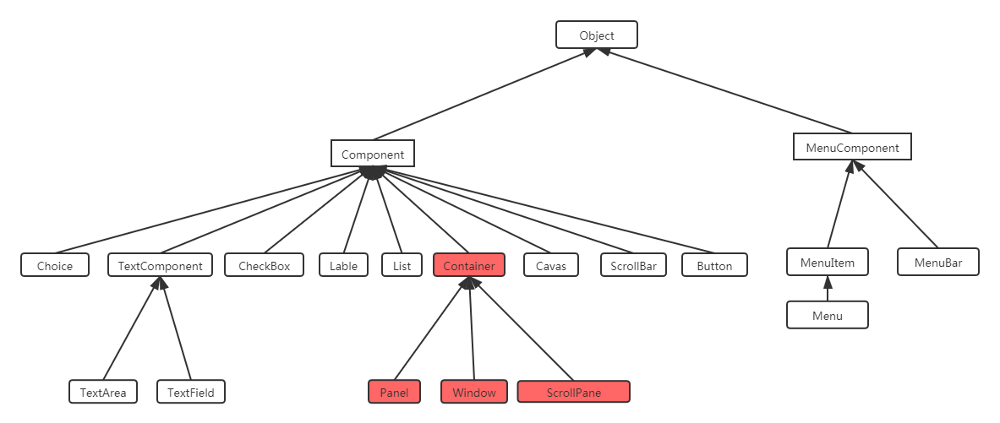
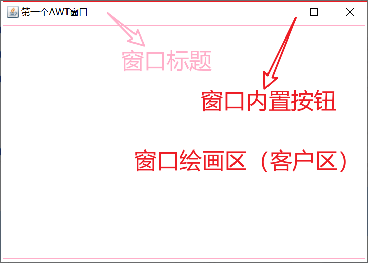
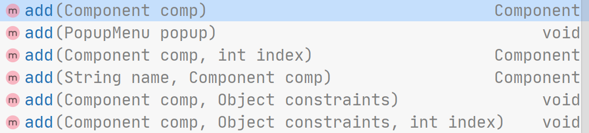
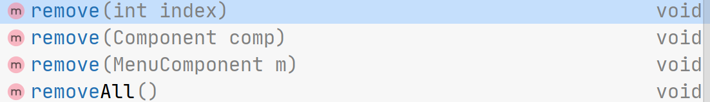
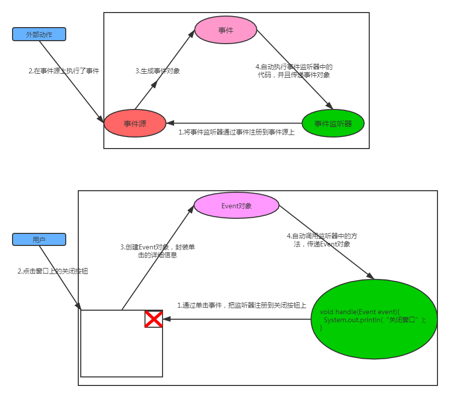
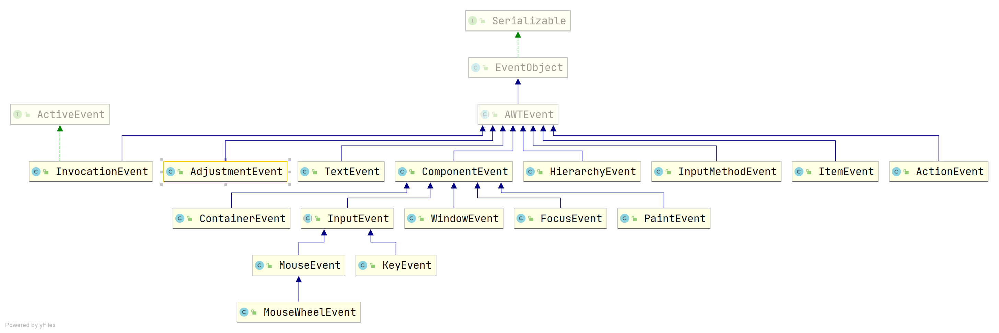

# Java图形化

首先`Java`本身图形化库比较丰富的，`Java`本身有三代图形化库：

- `AWT`
- `Swing`
- `JavaFX`

其中`AWT`在`Java`中更多的是充当底层事件基础的角色，一般谈到`Java`图形化时，我们更原因称`AWT`时窗口工具包的底层机制，`Swing`则是这底层机制的上层建筑。而`JavaFX`则是`2007`年为了打败`flash`的地位，`Sun`公司的一次尝试，它拥有更加现代化的`UI`感官，组件也更为丰富。本文章主要介绍上面这三种图形化库，文章比较长，可以挑着来看。

`Java`的图形化除了官网自带的这些（~~现在JavaFX也被剥离开交给社区维护了~~），也有很多第三方非常优秀的库，如`eclipse`的`SWT`、`JGoodies`这些，这些第三方库会在额外的章节里面给大家介绍。

要想学习`Java`的图形化，大概可以从下面这几个方向来搞：

- 窗口布局：也就是所谓的`layout`，决定组件的排列和对齐拉伸方式等。
- 容器和组件：最核心的内容，窗口组件如按钮、文本框、选择框、窗口等等。
- 事件处理：最核心的内容，决定了组件的行为，如当按下按钮时出发一些操作。
- 窗口感官：决定窗口和组件显示的`UI`形式，也可以叫窗口皮肤。（`Swing`中引入）
- 图形相关：比较杂的分类，任何和绘图相关的、操作系统操作相关的都算，如字体设置、图形绘画（矩形、圆等）、图像处理、显示模式（分辨率、全屏等）、底层的图形工具类、系统任务栏操作、系统桌面操作、桌面快捷方式、鼠标图标样式等等。

## 窗口图形基本知识

> 这个小节主要是为了给没有过多窗口图形基础知识的同学说明的，如果有这方面知识的同学可以跳过！

没有做过这些窗口程序的同学可能会对窗口的出现绘制等比较困惑，实际上窗口的显示可以比喻成是画图。平常使用`Windows`系统的会点开很多窗口，这些窗口都是`windows`系统直接画出来的（就是字面意思），通过这种画图的方式，绘画显示器上的任何东西，如窗口，按钮、编辑框等组件、图像甚至是屏幕上的字，这些都是通过屏幕上的像素画出来的，你甚至可以把屏幕理解成一块画布，看着操作系统在画布上尽情挥洒笔墨。

一般操作系统会提供一些基本的底层绘图`API`，在`Java`里面也有一个和绘图有关的类，叫`Graphics`（后面期为了提供更好的绘画效果，产生了`Graphics2D`），这些类能够帮助你在窗口区域绘画任何的图形，如果你不怕折腾，甚至还可以直接使用这种绘图类来画窗口。

### 窗口激活（窗口状态）

获取焦点

### 窗口重叠与重绘

### 窗口事件


## AWT

作为`Java`中经典的图形化界面，`AWT`当之无愧。`AWT`，全称`Abstract Window Toolkit`，可以说是整个`Java`图形化体系的底层建筑，即便如`Swing`这种提供了非常丰富组件和强大功能的`Java`图形库，其事件等机制仍然是基于`AWT`的。

`AWT`本身也提供一些组件库，但是数量非常有限，本身底层采用`C`语言编写，因此现阶段很少`Java`图形化是采用`AWT`组件的，大多数还是采用`Swing`或者更加好看的`JavaFX`。

使用`AWT`创建的图形界面应用和所在的运行平台有相同的界面风格，比如在`Windows`操作系统上，它就表现出`Windows`风格。在`UNIX`操作系统上，它就表现出`UNIX`风格。`Sun`希望采用这种方式来实现`Write Once, Run Anywhere`的目标。

### 第一个AWT的窗口

在`AWT`中，有一个类叫`Frame`（窗体），代表一个窗口，可以直接使用这个类来创建一个空白的窗口，一般的创建风格有两种：

1. 直接继承`Frame`类（推荐）：参考代码在`src/main/java/cn/argentoaskia/awt/AWTEmptyWindows1.java`
2. 创建一个类将`Frame`类对象变成私有属性：参考代码在`src/main/java/cn/argentoaskia/awt/AWTEmptyWindows2.java`

这两种创建方法优先推荐第一种，因为窗口的创建习惯来讲，第一种方法更加符合现实的习惯和设计，因为本质上你要创建窗口嘛，所以继承`Frame`让自己编写的类变成窗口（最简单的道理，你要创建的是窗口，`Frame`本身就代表窗口，那你自己写的类里面也应该能够具备`Frame`的方法吧）但这个还是要看个人习惯而言，因此确实习惯了第二种的也不是不行，实在不行的话大不了做一层聚合。

---

但无论哪一种创建风格，要想运行程序让窗口显示在屏幕上，就肯定要经过这些步骤：

1. 上面的类创建风格二选一
2. 设置窗口矩形大小（`bounds`），靠`Frame`中的`setBounds()`
3. 添加关闭按钮事件处理，具体是重写`WindowListener`接口中的`windowClosing`方法
4. 设置窗口可视，也就是`Visible`属性，靠`Frame`中的`setVisible()`方法

上面的步骤可以参考`demo`：`AWTEmptyWindows1`和`AWTEmptyWindows2`，这里稍微解释一下为什么这样做，首先，`frame`对象在被创建出来的时候，默认的窗口矩形是`x=0，y=0，width=0，height=0`，在这个设置下，所有的窗口长度，宽度因为都是`0`，所以运行程序的时候不会窗口对象会正常创建，但不会在屏幕上显示出来（这个很好理解吧，宽度和高度都是`0`还显示个得得），不信的话你可以将两个`demo`中的`setBound`方法去掉再运行，是不是啥都没显示，但是程序照常进行呀。ヾ(≧▽≦*)o

然后是添加关闭按钮事件处理器，默认情况下，`frame`窗体右上角会有三个按钮：最大化、最小化、关闭，其中最大化、最小化是能够用的，但是关闭按钮却没反应（~~奇怪的设计，后面Swing的JFrame就没那么多屁事~~），因此需要手动指定点击关闭按钮之后的操作，这就轮到组件事件出场啦，在窗口里面，控制窗口这些最大化、最小化、关闭等事件的处理器是`windowListener`接口，但是这个接口里面很多方法，如果直接实现这个接口的话，你要实现里面的所有方法，可能会比较繁琐，因为我们指定关闭按钮的事件就够了，最大化最小化按钮关我屁事，所以可以采用`WindowAdapter`类，这个类简单实现了`windowListener`接口，你可以选择你要指定的事件来重写就`ok`。

最后是`Visible`属性，默认情况下当`frame`实例创建出来之后，也不会直接显示在屏幕上，因为默认窗口实例是不可见的，可以理解成隐藏在屏幕上了（实际上在屏幕，但是你看不到）。早期`AWT`提供了`show()`方法，来让窗口变得课时，但是这个方法在`JDK1.5`版本之后被`setVisible()`方法给代替了。

第一个`demo`中可能有很多方法如果不太熟悉的话，可以先写着，这些方法在后面组件的介绍中会跟大家说明。

### 容器&组件

非常遗憾的，因为历史原因，`AWT`并没有提供太多的客户类组件。

下面是整个容器&组件继承图：



所有的组件大概能够分五类：

- 容器类组件：用于容纳其他组件的组件，`AWT`中这类组件有3种：
  - `Frame`：窗口
  - `Panel`：面板
  - `ScrollPane`：滚动面板
- 客户类组件：用户提供操作的组件，`AWT`中这类组件大概有9种：
  - `Button`：按钮
  - `Canvas`：画布
  - `Checkbox`：选择框
  - `Choice`：下拉列表框
  - `Label`：标签
  - `List`：列表框
  - `Scrollbar`：滑块条
  - `TextArea`：文本域
  - `TextField`：文本框
- 菜单类组件：菜单相关一类组件，`AWT`中这类组件大概6种：
  - `Menu`：基本菜单栏，内部可以容纳`MenuItem`（菜单项）
  - `MenuItem`：基本菜单项
  - `MenuBar`：菜单工具条
  - `MenuShortcut`：菜单快捷方式
  - `PopupMenu`：右键弹出式菜单
  - `CheckboxMenuItem`：选择式菜单项
- 对话框类组件：提供一些通用的对话框，`AWT`中这类组件大概有2种：
  - `Dialog`：通用对话框
  - `FileDialog`：文件选择对话框

#### 容器类组件

##### Frame

`AWT`中的容器，主要由`Frame`（窗口）和`Panel`（面板）组成，如果需要滚动的面板，可以采用类似于`ScrollPane`。

`Frame`代表一个窗口，在`Java`中一个简单的`Frame`展示如下，在这个窗口中，一般会被分成几大块：



一般我们的组件都是在窗口客户区上进行绘画。顶部的标题、图标和最大化最小化关闭按钮共同组成了装饰区（`frame decorations`，不知道翻译成装饰区对不对）。

窗口本身具有很多属性，可以通过相关`Setter`方法来设置，这些属性有：

- `alwaysOnTop`：是否总是显示在前端
- `autoRequestFocus`：当窗口被激活的时候是否自动获取焦点
- `Background`：背景色
- `Bounds`：bounds，相当于窗口矩形，指定x坐标、y坐标、宽度、高度
- `ComponentOrientation`：未知
- `ComponentZOrder`：窗口内组件刷新顺序。
- `Cursor`：窗口内鼠标样式
- `DropTarget`：拖放目标，只有窗口设置了允许拖放的时候才有效
- `Enabled`：是否可用
- `ExtendedState`：窗口状态，如最大化、最小化等等
- `Focusable`：窗口是否可以获取焦点，设置这个值，在焦点轮切的时候可以被切换上
- `FocusableWindowState`：窗口是否可以获取焦点，这个方法会根据窗口状态来影响判断
- `FocusTraversalKeys`：焦点切换按键
- `FocusTraversalKeysEnabled`：是否开启焦点切换功能
- `FocusTraversalPolicy`：焦点切换的方式
- `FocusTraversalPolicyProvider`：是否开启设置焦点切换的方式
- `Font`：字体
- `Foreground`：前景颜色
- `IconImage | IconImages`：图标图像（可以设置多个）
- `IgnoreRepaint`：是否忽略窗口重绘
- `Layout`：窗口布局
- `Locale`：`locale`，多语言支持的时候需要设置这个
- `Location`：窗口位置
- `LocationByPlatform`：是否由所在的平台来决定窗口位置
- `LocationRelativeTo`：窗口的父窗口
- `MaximizedBounds`：窗口的最大边界
- `MaximumSize`：窗口的最大大小
- `MenuBar`：窗口菜单栏
- `MinimumSize`：窗口最小大小
- `ModalExclusionType`：窗口模态排除类型，一般情况下当一个窗口弹出一些信息框，那么那个窗口将会被阻塞，动不了，设置了这个属性，则窗口可能将不会被阻塞。
- `Name`：组件名称，注意区别与`setTitle()`，`setTitle`是设置标题，而这个是在相当于为窗口设置一个名字，一般用于标记窗口或组件。
- `Opacity`：窗口透明度，值在`0.0f-1.0f`之间，需要注意，设置透明度需要先把窗口装饰区去掉，也就是`setUndecorated(true)`
- `PreferredSize`：组件更加偏向的大小，一般在布局的设置中会采用这个，注意设置组件的大小不一定就会起作用，`AWT`会计算组件的大小以更好适应布局情况
- `Resizable`：窗口是否可拉伸
- `Shape`：窗口的形状
- `Size`：窗口大小
- `State`：窗口状态
- `Title`：窗口标题
- `Type`：窗口类型
- `Undecorated`：是否去除装饰栏，当设置`true`则窗口最大化最小化，窗口标题，关闭按钮将被去除。
- `Visible`：可视

这些属性中大部分都有相关的`Setter`、`Getter`，大部分属性都有带`isXXX()`作为状态判别方法，小部分是`areXXX()`开头

----

> 如何往容器中添加组件？

除了这些方法之外，作为容器，你也可以往其内部添加组件，类似于`Frame`等容器内部维护了一个`ArrayList`用来存放组件，这也就是为什么会有`index`参数（也叫`ComponentZOrder`，也有相关的`API`，后面会讲）的原因，容器内组件的前后关系可能会影响最终的渲染效果，越排在前面的组件（`index`越小）越晚进行绘制，因此小`index`的组件最终会覆盖掉大`index`的组件。

相关方法签名如下：



所有的`add()`都是`addImpl()`的简便方法，`addImpl()`本身并不对外公开（`protected`），返回值大部分都是`comp`参数本身，这些简便方法大概的用途如下：

```
add(Component comp);		// 将组件放到容器的最后，该组件将会被最先进行绘制
add(PopupMenu popup);		// 添加弹出菜单
add(Component comp, 
	int index);				// 将组件放到容器组件列表的index位置中
add(String name,
	Component comp);		// 将组件放到容器的最后，该组件将会被最先进行绘制,并且用一个字符串与该组件关联
```

除了添加组件之外，你也可以讲某个组件从窗口中删除，`index`是上面提到的组件顺序。也可以使用`removeAll()`删除全部组件。

------

> Frame中一些addXXXListener的方法有什么作用？

在容器内，你可能会看到一些以`addXXXXListener()`样式的方法，这些方法用于注册一个事件（后面也会详细介绍），在图形化编程中，我们点击一次按钮，输入某些东西等这些动作，都会演变成触发特定的事件，通过触发这些事件，让操作系统做一些相关的事情。在`Frame`中，这些事件相关的方法大概有，这些事件在文章的后面也会和大家说明：

- `addComponentListener()`：
- `addContainerListener()`：
- `addFocusListener()`：
- `addHierarchyBoundsListener()`：
- `addHierarchyListener()`：
- `addInputMethodListener()`：
- `addKeyListener()`：
- `addMouseListener()`：
- `addMouseMotionListener()`：
- `addMouseWheelListener()`：
- `addPropertyChangeListener()`：
- `addWindowFocusListener()`：
- `addWindowListener()`：
- `addWindowStateListener()`：

当然既然能够添加事件，那么也可以移除事件，在`Frame`中还有一类方法，这种方法以`removeXXXXListener()`，参考上面的`addXXXXListener()`：

- `removeComponentListener()`：
- `removeContainerListener()`：
- `removeFocusListener()`：
- `removeHierarchyBoundsListener()`：
- `removeHierarchyListener()`：
- `removeInputMethodListener()`：
- `removeKeyListener()`：
- `removeMouseListener()`：
- `removeMouseMotionListener()`：
- `removeMouseWheelListener()`：
- `removePropertyChangeListener()`：
- `removeWindowFocusListener()`：
- `removeWindowListener()`：
- `removeWindowStateListener()`：

##### Panel

`Panel`，也叫面板，是用于存放其他组件的一个容器，一般情况下被用于划分功能相关的组件，调整组件布局等。但不能独立存在，只能被放置在窗口或者其他`Panel`中。

##### ScrollPane

#### 客户类组件

##### Button

##### Canvas

##### checkbox

##### choice

##### label

##### list

##### scrollbar

##### textarea

##### textfield

#### 菜单类组件

菜单类组件
#### 对话框类组件


### 窗口布局

一般我们的窗口上都有很多花里呼哨的组件，像按钮、编辑框这些，常规的桌面应用就是靠这些给堆积起来的，而且一般组件量都不少，因此如何管理这些组件就成了一个问题。

`AWT`中的所有组件可以参考这个`Demo`：`src/main/java/cn/argentoaskia/awt/widgets/component/AWTComponents.java`，里面展示了所有`AWT`可用的基本组件库。

在上面的的组件`Demo`中，你可以看到大量的`setBounds()`、`setSize()`、`setPreferredSize()`等设置组件大小的方法。这些方法规定了组件的定位。但是在这个窗口被拉伸或缩小的时候（因为设置了`setResizable(false);`，所以如果想能够拉伸窗口的话，需要去掉这一行），你会发现组件不会跟着窗口的拉伸缩小大小的改变而改变。因为我们并没有规定这些组件如何被拉伸或缩小。在传统的`windows`图形化编程中，需要开发者自己去定义每一个组件的拉伸缩小，非常麻烦。在`Java`图形化中，你仍然可以使用这种方法来实现，但`Java`提供了**窗口布局管理器**的东西来处理这种组件的拉伸和缩小，大大减少了布局上的麻烦。

在`AWT`中，共有`5`种常见的布局：

- `BorderLayout`：
- `CardLayout`：
- `FlowLayout`：
- `GridLayout`：
- `GripBagLayout`：

#### BorderLayout

#### CardLayout

#### FlowLayout

#### GridLayout

#### GripBagLayout


### 事件处理

#### 所谓事件

前面介绍了如何放置各种组件，从而得到了丰富多彩的图形界面，但这些界面还不能响应用户的任何操作。比如单击`Frame`窗口右上角的`X`按钮，但窗口依然不会关闭。因为在`AWT` 编程中，所有用户的操作，必须都需要经过一套**事件处理机制**来完成，而`Frame`和组件本身并没有事件处理能力 。

那所谓事件处理又是什么呢？学到这里的同学，都知道，`AWT`和`Swing`给大家提供了非常多的组件，包括按钮，列表框等等，所谓的事件是指我们对这些组件进行某一些操作，如点击按钮，选中列表框中的某个项目，滑动了滑块条，在编辑框内输入了内容等等。

**当我们做出这些动作的时候，组件会根据这些动作产生相应的事件，然后发送这些事件给事件处理器，事件处理器会对这些事件内容做处理，这个过程叫做事件响应。**

#### 事件处理机制

上述的描述中我们知道，整个事件过程共包括了三部分：

- 事件产生：用户或系统做了某个动作而产生一个或多个相应的事件，如：点击按钮产生动作事件等
- 事件封装投递和通知：`AWT`会将用户的操作，包括一些组件信息，如产生事件的组件，动作指令，事件的状态（鼠标事件中的点击次数，左键点击还是右键）等封装成一个事件对象，投递并通知相应的事件处理器，由事件处理器来处理事件
- 事件处理器：事件处理器需要完成一些事件的处理，通常由开发者编写相应的事件处理器来做解析，由开发者本身根据自身业务需要来处理事件！

这套事件处理机制比较通用，无论在各类的图形化库中，可能现实的细节不同，但是基本的流程一致！这样的一种事件处理机制也叫事件委派模型。

#### AWT中的事件处理机制

`AWT`的事件遵循上面的事件流程，因此有如下的概念：

- 事件源（`Event Source`）：指产生事件的组件，例如按钮、窗口的组件
- 事件（`Event`）：事件对象，就是产生事件之后`AWT`封装的各种信息，在`Java`中，所有事件对象都是以`XXXXEvent`类的形式，如`ActionEvent`代表动作事件，当用户点击按钮，选择`List`内的项目的时候，`AWT`就会产生这个`ActionEvent`并将其**以参数的形式**传递给事件处理器。
- 事件监听器（`Event Listener`）：就是事件处理器，处理事件的地方，在`Java`中，所有的事件处理器都是以接口的形式定义好，用户只需要实现接口重写事件方法才能完成对事件的处理。
- 事件监听器注册：当开发者编写好事件监听器之后，需要注册到具体的事件源上面，使用这种注册方法是为了方便将事件处理器和事件源（组件）绑定在一块。



> 一般组件可以产生多种类型的事件
>
> 一个事件源可以绑定多个不同类型的事件监听器
>
> 一个事件监听器可以被多个事件源注册

#### 如何绑定事件监听器

整个流程中除了事件的传递和封装之外，其他内容如事件源和事件监听器都是开发者看得见摸得着的东西，因此在定义好事件源和事件处理器之后，我们还需要做的就是如何将事件源和事件监听器绑定在一起：

在所有的组件中，都有一类叫`addXXXXXListener`的方法，这类方法一般就用来注册事件的，拿`Frame`窗口的关闭按钮举例：

首先我们需要知道当用户点击关闭按钮之后可能会发生的事情，一般都是关闭窗口，因此我们首先定义一个窗口的事件监听器（`WindowsListener`）：

```java
// 因为WindowsListener里面有很多接口方法，我们本次事件只需要关注关闭窗口时的事件, 因此我们直接使用WindowsListener的默认实现，然后重写我们需要的方法即可
WindowAdapter windowAdapter = new WindowAdapter() {
    @Override
    public void windowClosing(WindowEvent e) {
        System.exit(0);
    }
};
```

然后我们需要使用窗口组件的`addWindowListener`方法来注册事件监听器：

```java
frame.addWindowListener(windowAdapter);
```

这样事件源就事件处理器绑定在一块了，现在我们启动窗口，点击关闭按钮，然后`AWT`就会分发事件到对应的事件处理器上，调用相应的事件方法（这里就是`public void windowClosing(WindowEvent e)`），执行里面的`System.exit(0);`退出整个`Java`程序。

#### 常见的AWT事件对象

几乎所有的事件都是以`XXXXXEvent`命名，所有的事件类都是继承自`java.utils.EventObject`类，在这个类之下，还有一个子类`AWTEvent`，他是所有`AWT`事件类的父类，有些`Swing`组件会生成一些其他的事件对象，这些事件对象并不继承自`AWT`而是直接继承`EventObject`。

特别注意并不是所有的`AWT`事件类对`Java`程序员来说都实用！如`PaintEvent`，这是一个重绘事件，但是当我们需要控制重绘的时候，我们并不关注这个事件，而是重写`paintComponent()`或者`paint()`。

下面是`AWT`中所有的事件继承图以及他们的触发方式：



| 事件               | 触发时机                                                     |
| ------------------ | ------------------------------------------------------------ |
| `InvocationEvent`  | 用于多线程环境下运行`Runnable`的`Run()`的事件                |
| `AjustmentEvent`   | 调节事件，在滑动条上移动滑块以调节数值时触发该事件。         |
| `TextEvent`        | 文本事件，当文本框、文本域里的文本发生改变时触发该事件。     |
| `ComponentEvent`   | 组件事件 ，当组件尺寸发生变化、位置发生移动、显示/隐藏状态发生改变时触发该事件。 |
| `HierarchyEvent`   | 容器组件布局事件，当容器内的组件布局改变了的时候，如某个组件不可视了，某个组件的大小改变了时，会触发该事件。 |
| `FocusEvent`       | 焦点事件 ， 当组件得到焦点或失去焦点时触发该事件 。          |
| `InputMethodEvent` | 输入法事件，早期使用输入法的时候在输入法中按下任何按键将会触发此事件。 |
| `ItemEvent`        | 选项事件，当用户选中某项， 或取消选中某项时触发该事件 。     |
| `ActionEvent`      | 动作事件 ，当按钮、菜单项被单击，在`TextField`中按`Enter`键时，或者是`List`组件中双击选项触发。 |
| `MouseEvent`       | 鼠标事件，当进行单击、按下、松开、移动鼠标等动作时触发该事件。 |
| `PaintEvent`       | 组件绘制事件，该事件是一个特殊的事件类型 ， 当`GUI`组件调用`update/paint`方法来呈现自身时触发该事件，该事件并非专用于事件处理模型 。 |
| `KeyEvent`         | 键盘事件，当按键被按下、松开、单击时触发该事件。             |
| `WindowEvent`      | 窗口事件， 当窗口状态发生改变 ( 如打开、关闭、最大化、最 小化)时触发该事件 。 |
| `MouseWheelEvent`  | 滚轮事件，鼠标滚轮转动时或滚轮按下时触发。                   |
| `ContainerEvent`   | 容器事件 ， 当容器里发生添加组件、删除组件时触发该事件 。    |

所有事件类中，都有下面的通用方法，以用于获取事件源：

```java
// 注意获取的事件源一般需要强转！
public Object getSource();
```

在`AWT`事件中（继承自`AWTEvent`）的所有事件，将具备下面的方法：

```java
// 设置新的
public void setSource(Object newSource);
// 获取事件ID，一般每个事件都会有自己的一个事件ID,用来标记事件的唯一性,如AdjustmentEvent是601,TextEvent是900
public int getID();
// 打印事件状态，一般用于调试
public String paramString();
// 输出事件类信息
public String toString();
```

#### 相关事件及监听器对照表

| 监听器接口       | 监听方法          | 事件          | 事件信息方法                                                 |
| ---------------- | ----------------- | ------------- | ------------------------------------------------------------ |
| `ActionListener` | `actionPerformed` | `ActionEvent` | `getActionCommand`：用于传递动作指令的方法，可以与做数据传递，默认使用标题<br />`getWhen`：事件什么时候产生的<br />`getModifiers`：触发事件的时候是否按下`Alt`、`Ctrl`、`Shift`键 |
|                  |                   |               |                                                              |
|                  |                   |               |                                                              |


### AWT-Graphics


## Swing

### Swing概述

### Swing基本容器和组件

#### 容器


## 图形化自定义

### AWT和Swing的组件体系

### 布局管理器体系

### 感官设计

- flatlaf
- WebLaF
- beautyeye

### AWT事件模型


