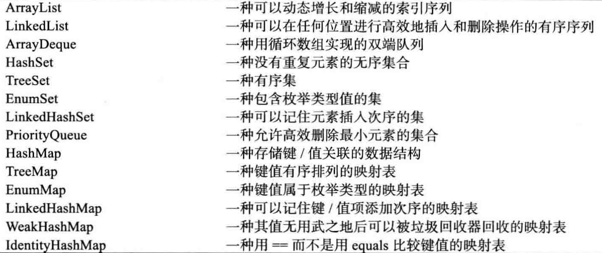
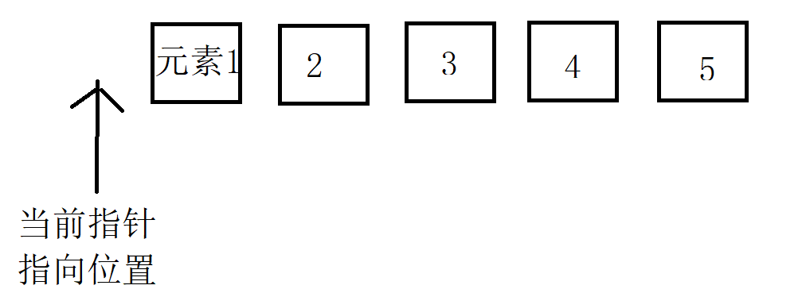
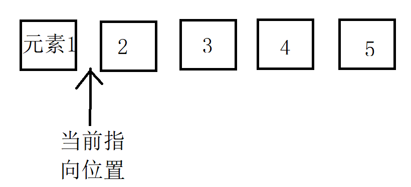
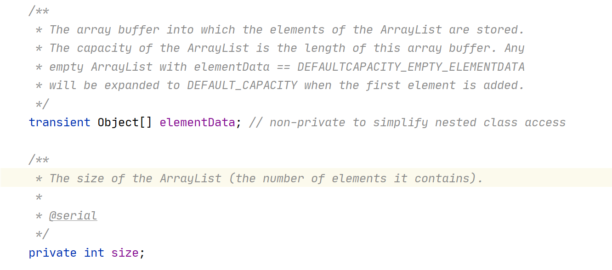

# Java JCF

## JCF

`Java`中的`JCF`全称`Java Collection Framework`（`Java`集合框架），是`Java`为了方便开发者而封装的一套数据结构，最初的该框架仅有寥寥无几的几个结构，随着`JDK`版本的迭代逐渐丰富。`JCF`类似于`C++`的`STL`，却没有`STL`那样复杂，采用**接口与实现分离**和**泛型**的设计方式，增加了`JCF`本身的扩展性。

如今的`JCF`可不仅仅只有数据结构，甚至还包括了一些常用的算法集，如：二分查找，排序等，这些算法以伴随类的形式存在于`JCF`中。

在本篇，主要讨论`JCF`中各种数据结构的基本`API`和使用场景，以及一些常用算法的使用，同时，会介绍`Google`对`JCF`进行扩展的框架——`Guava`，最后再简单介绍一下如何在`JCF`中扩展自己的数据结构。

## JCF数据结构一览


<center style="color: gray; font-size: 16px;">建议放大看</center>

这里稍微介绍下这类图上的各个类元素，**带虚线的都是接口**，**实线的是具体的实现类**，**加重实线的是常用结构**。其中，在所有的接口中，其中`Iterator`和`LinkIterator`代表的是**迭代器的顶层接口**，`Collection`是**数据结构的顶层接口**，在`Collection`之下，`JCF`的所有数据结构被**分成了三个大类**：`List`（列表）、`Set`（集合）、`Queue`（队列）。还有一类`Map`（映射）。

图上的数据结构根据具体的功能可以划分出好多子类：

`List`：`ArrayList`、`LinkedList`

`Set`：`EnumSet`、`HashSet`、`LinkedHashSet`、`TreeSet`、`BitSet`

`Queue`：`PriorityQueue`、`ArrayDeque`

`Map`：`EnumMap`、`HashMap`、`IdentityHashMap`、`LinkedHashMap`、`TreeMap`、`WeakHashMap`

还有四类旧集合：`Stack`、`Vector`、`Hashtable`、`Properties`

那具体这些子结构都实现了什么功能可以参考下面：



其中你可能看到一些结构形如：`AbstractXXXX`开头的类，如`AbstractCollection`，**这些都是抽象类，这些类的一大工作就是简化顶层接口的方法**，为顶层接口方法提供一套默认实现，**开发者如果需要自定义自己的数据结构，只需要继承这种带**`Abstract`**开头的类即可**（**相当于一个适配器**）。举个例子，**如果开发者直接实现Collection接口，则需要重写接口中的10多个方法，但当开发者选择继承**`AbstractCollection`，**则只需要重写两个方法即可**，因为`AbstractCollection`留了两个抽象方法，其他方法`AbstractCollection`根据留下的这两个抽象方法编写了默认实现。

这些带`Abstract`的类由于历史原因，而被保留下来，按照现在版本`JDK`的实现方式，只要采用接口的`default`级方法即可，而无需额外创建一个`AbstractXXXX`来过滤掉一些方法。

## 迭代器和层级接口

在整个`JCF`中，实际上核心的只有两大数据结构顶层接口：`Collection`和`Map`，一种迭代器接口`Iterator`。我们先介绍迭代器：

### Iterator

首先迭代器接口`Iterator`，他的职责主要是负责元素的迭代，也就是元素遍历，核心的接口：

- `hasNext()`：判断还有没有下一个元素，如果有，则返回`true`，否则返回`false`
- `next()`：获取下一个元素，如果没有元素能获取了再次调用`next()`，将会抛出`NoSuchElementException`。

```java
public interface Iterator<E> {
    boolean hasNext();
    E next();

    default void remove() {
        throw new UnsupportedOperationException("remove");
    }
    
    default void forEachRemaining(Consumer<? super E> action) {
        Objects.requireNonNull(action);
        while (hasNext())
            action.accept(next());
    }
}
```

在`Collection`接口中，留有`iterator()`方法（下面会介绍）来获取迭代器，一般迭代器的使用代码如下：

```java
Collection<String> collection = ...;
Iterator<String> iterator = collection.iterator();
// 关键代码
while(iterator.hasNext()){
	String s = iterator.next();
    // 省略其他代码
}
```

然后，你可能还看到有两个默认方法：`remove()`、和`forEachRemaining`，其中`forEachRemaining`涉及到函数式编程，一般用于`foreach`迭代。

你可能会好奇，为什么`remove()`没有参数。

注意到迭代器内部迭代的指针实际上不指向元素，当我们调用`collection.iterator();`实际上你拿到的迭代器模型长这样：



这也就是为什么我们需要先调用`hasNext()`，然后再调用`next()`的原因。

当我们调用一次`hasNext()`，判断指针右边是否还有元素，**如果有，则再调用**`next()`，指针往后移动一个元素，变成这样：



**然后返回指针左边的元素**，也就是元素1，这个时候指针被夹在元素1和2之间。

现在能理解为什么`remove()`方法不需要传递参数了吧，因为默认删除指针左边的元素。

因此，**在调用**`remove()`**之前如果没有调用**`next()`**将是不合法的**，会抛出`IllegalStateException`。如下面的代码将会出错：

```java
Collection<String> collection = ...;
Iterator<String> iterator = collection.iterator();
// 下面的代码会出错，要先调用next()再删除元素
while(iterator.hasNext()){
    // 先删除元素
    iterator.remove();
    // 再调用next()
	String s = iterator.next();
    // 省略其他代码
}
```

因为你需要调用`next()`**将待删除的元素排在指针的左边**。

### LinkIterator

### Iterable

`Iterable`是`Java`的语法糖，所有增强循环（`foreach`）都需要实现`Iterable`接口，在实现这个接口之后，重写`iterator()`方法来获取`Iterator`遍历器。

`Iterator`也是接口，因此当想要自定义遍历器的时候，首先需要编写`Iterator`的实现类，然后在实现了`Iterable`的实现类中返回编写的`Iterator`的实现类即可。

稍后会给出自定义`Iterator`的案例。

```java
public interface Iterable<T> {

    // 获取迭代器
    Iterator<T> iterator();

    // 函数式foreach
    default void forEach(Consumer<? super T> action) {
        Objects.requireNonNull(action);
        for (T t : this) {
            action.accept(t);
        }
    }

    default Spliterator<T> spliterator() {
        return Spliterators.spliteratorUnknownSize(iterator(), 0);
    }
}
```

### Collection

`Collection`接口是大部分数据结构包括列表、集合、队列的顶层接口（注意不包括映射），该接口主要定义了各大数据结构的通用方法：

```java
public interface Collection<E> extends Iterable<E> {
    // 获取集合元素大小
    int size();
    // 判断集合是否为空
    boolean isEmpty();
    // 判断集合是否包含某个元素
    boolean contains(Object o);
    // 获取集合的迭代器
    Iterator<E> iterator();
    // 将集合的元素转为数组
    Object[] toArray();
    // 将集合的元素转为数组
    <T> T[] toArray(T[] a);
    // 添加元素
    boolean add(E e);
    // 移除元素
    boolean remove(Object o);
    // 判断集合是否包含参数中集合的所有元素
    boolean containsAll(Collection<?> c);
    // 将参数中的所有元素全部添加到集合中
    boolean addAll(Collection<? extends E> c);
    // 将参数中的所有元素全部从集合中移除
    boolean removeAll(Collection<?> c);
    // 移除不符合条件的元素
    default boolean removeIf(Predicate<? super E> filter) {
        Objects.requireNonNull(filter);
        boolean removed = false;
        final Iterator<E> each = iterator();
        while (each.hasNext()) {
            if (filter.test(each.next())) {
                each.remove();
                removed = true;
            }
        }
        return removed;
    }
    // 交集
    boolean retainAll(Collection<?> c);
    // 清空集合
    void clear();
    // 比较两个集合的元素是否相同
    boolean equals(Object o);
    int hashCode();
    
    @Override
    default Spliterator<E> spliterator() {
        return Spliterators.spliterator(this, 0);
    } 
    default Stream<E> stream() {
        return StreamSupport.stream(spliterator(), false);
    }
    default Stream<E> parallelStream() {
        return StreamSupport.stream(spliterator(), true);
    }
}
```

说到`Collection`接口就不得不提`AbstractCollection`：

```java
public abstract class AbstractCollection<E> implements Collection<E> {
    protected AbstractCollection() {}
    
    public abstract Iterator<E> iterator();
    public abstract int size();
    // 判断集合是否为空
    public boolean isEmpty() {
        return size() == 0;
    }
    // 判断集合是否包含对象o
    public boolean contains(Object o) {
        Iterator<E> it = iterator();
        if (o==null) {
            while (it.hasNext())
                if (it.next()==null)
                    return true;
        } else {
            while (it.hasNext())
                if (o.equals(it.next()))
                    return true;
        }
        return false;
    }
	// 集合类型转成数组
    public Object[] toArray() {
        // Estimate size of array; be prepared to see more or fewer elements
        Object[] r = new Object[size()];
        Iterator<E> it = iterator();
        for (int i = 0; i < r.length; i++) {
            if (! it.hasNext()) // fewer elements than expected
                return Arrays.copyOf(r, i);
            r[i] = it.next();
        }
        return it.hasNext() ? finishToArray(r, it) : r;
    }
    // 集合类型转成数组2
    @SuppressWarnings("unchecked")
    public <T> T[] toArray(T[] a) {
        // Estimate size of array; be prepared to see more or fewer elements
        int size = size();
        T[] r = a.length >= size ? a :
                  (T[])java.lang.reflect.Array
                  .newInstance(a.getClass().getComponentType(), size);
        Iterator<E> it = iterator();

        for (int i = 0; i < r.length; i++) {
            if (! it.hasNext()) { // fewer elements than expected
                if (a == r) {
                    r[i] = null; // null-terminate
                } else if (a.length < i) {
                    return Arrays.copyOf(r, i);
                } else {
                    System.arraycopy(r, 0, a, 0, i);
                    if (a.length > i) {
                        a[i] = null;
                    }
                }
                return a;
            }
            r[i] = (T)it.next();
        }
        // more elements than expected
        return it.hasNext() ? finishToArray(r, it) : r;
    }

    @SuppressWarnings("unchecked")
    private static <T> T[] finishToArray(T[] r, Iterator<?> it) {
        int i = r.length;
        while (it.hasNext()) {
            int cap = r.length;
            if (i == cap) {
                int newCap = cap + (cap >> 1) + 1;
                // overflow-conscious code
                if (newCap - MAX_ARRAY_SIZE > 0)
                    newCap = hugeCapacity(cap + 1);
                r = Arrays.copyOf(r, newCap);
            }
            r[i++] = (T)it.next();
        }
        // trim if overallocated
        return (i == r.length) ? r : Arrays.copyOf(r, i);
    }

    private static int hugeCapacity(int minCapacity) {
        if (minCapacity < 0) // overflow
            throw new OutOfMemoryError
                ("Required array size too large");
        return (minCapacity > MAX_ARRAY_SIZE) ?
            Integer.MAX_VALUE :
            MAX_ARRAY_SIZE;
    }

    // 添加元素方法
    public boolean add(E e) {
        throw new UnsupportedOperationException();
    }
    // 移除元素方法
    public boolean remove(Object o) {
        Iterator<E> it = iterator();
        if (o==null) {
            while (it.hasNext()) {
                if (it.next()==null) {
                    it.remove();
                    return true;
                }
            }
        } else {
            while (it.hasNext()) {
                if (o.equals(it.next())) {
                    it.remove();
                    return true;
                }
            }
        }
        return false;
    }
    // 是否包含集合c中的所有元素
    public boolean containsAll(Collection<?> c) {
        for (Object e : c)
            if (!contains(e))
                return false;
        return true;
    }

    // 添加全部元素
    public boolean addAll(Collection<? extends E> c) {
        boolean modified = false;
        for (E e : c)
            if (add(e))
                modified = true;
        return modified;
    }

    // 移除包含在集合c中的全部元素
    public boolean removeAll(Collection<?> c) {
        Objects.requireNonNull(c);
        boolean modified = false;
        Iterator<?> it = iterator();
        while (it.hasNext()) {
            if (c.contains(it.next())) {
                it.remove();
                modified = true;
            }
        }
        return modified;
    }
    
    // 移除不包含在集合c中的全部元素
    public boolean retainAll(Collection<?> c) {
        Objects.requireNonNull(c);
        boolean modified = false;
        Iterator<E> it = iterator();
        while (it.hasNext()) {
            if (!c.contains(it.next())) {
                it.remove();
                modified = true;
            }
        }
        return modified;
    }
    // 清空集合所有元素
    public void clear() {
        Iterator<E> it = iterator();
        while (it.hasNext()) {
            it.next();
            it.remove();
        }
    }
    
    public String toString() {
        Iterator<E> it = iterator();
        if (! it.hasNext())
            return "[]";

        StringBuilder sb = new StringBuilder();
        sb.append('[');
        for (;;) {
            E e = it.next();
            sb.append(e == this ? "(this Collection)" : e);
            if (! it.hasNext())
                return sb.append(']').toString();
            sb.append(',').append(' ');
        }
    }

}
```

可以看到`AbstractCollection`中很多方法是继承自`Collection`接口的，提供给了两个抽象方法，让具体的结构实现：

```java
public abstract Iterator<E> iterator();
public abstract int size();
```

其他大部分方法或多或少都是调用了上面这两个抽象方法来写的默认实现。

因此，为什么创建自己的数据结构的时候，建议继承`AbstractCollection`类，因为你只需要实现两个方法，其他大部分方法都已经写好，但是当你实现`Collection`接口的话，那么接口中的几十个方法你都要考虑具体实现，除非你有比`AbstractCollection`中的默认实现更加高效的实现方式，不然不建议。

### List

`List`接口继承自`Collection`接口，代表数据结构中的列表，除去旧的结构外核心有两种实现：`ArrayList`（数组表）、`LinkedList`（链表）在`List`接口中主要新增的方法有如下：

```java
public interface List<E> extends Collection<E> {
    // 从下标index开始添加c中的所有元素
    // add方法接受在尾部添加新元素，index可以等于size()
    boolean addAll(int index, Collection<? extends E> c);
    // 
    default void replaceAll(UnaryOperator<E> operator) {
    	Objects.requireNonNull(operator);
    	final ListIterator<E> li = this.listIterator();
    	while (li.hasNext()) {
        	li.set(operator.apply(li.next()));
    	}
    }
    // 
    default void sort(Comparator<? super E> c) {
        Object[] a = this.toArray();
        Arrays.sort(a, (Comparator) c);
        ListIterator<E> i = this.listIterator();
        for (Object e : a) {
            i.next();
            i.set((E) e);
        }
    }
    // 获取下标为index的元素，不建议在链式结构中使用
    E get(int index);
	// 替换下标为index的元素，不建议在链式结构中使用
    // set方法不接受在尾部添加新元素，也就是说当index参数传递size()时，会抛出IndexOutOfBoundsException
    E set(int index, E element);

    // 替换下标为index的元素，不建议在链式结构中使用
    // add方法接受在尾部添加新元素，index可以等于size()
    void add(int index, E element);

    // 删除下标为index的元素，不建议在链式结构中使用 
    E remove(int index);
    
    // Search Operations

    // 定位某个元素的第一次出现的下标位置
    int indexOf(Object o);
    
 	// 定位某个元素的最后一次出现的下标位置
    int lastIndexOf(Object o);

    // List Iterators
    // 获取ListIterator
    ListIterator<E> listIterator();
    ListIterator<E> listIterator(int index);
    
    // 获取子列表（截断List），不建议在链式结构中使用
    List<E> subList(int fromIndex, int toIndex);
}
```

同样在`List`接口下，也有一个`AbstractList`的抽象类帮我们把大部分方法实现了，当开发者需要实现自己的结构的时候可以考虑继承`AbstractList`，当然除非有必要！

同时还要注意，`ArrayList`还实现了一个`RandomAccess`来提供所谓的随机存取。

### Queue

`Queue`接口也是继承了`Collection`接口的，代表一个队列，它允许你高效地在尾部添加元素，并在头部删除元素。

同时在`Queue`下，还有一个子接口`Deuqe`，`JDK 6`引入，代表双端队列，允许你在头部和尾部都高效地添加和删除元素。

```java
// Queue
public interface Queue<E> extends Collection<E> {
    // 前面两个都是添加元素的方法
    // 区别在于当队列已经满了的时候，add方法会抛出IllegalStateException
    // 而offer方法则不会抛出异常而是直接返回false
    boolean add(E e);
    boolean offer(E e);
    // 下面两个都是出队方法，区别在于当队列为空的时候
    // remove()方法抛出NoSuchElementException异常
    // poll()返回null
    E remove();
    E poll();
    // 下面两个方法都是查看队首元素的方法，不删除
    // 区别同remove和poll
    E element();
    E peek();
}
```


## 各类数据结构及其用法

### List结构

#### ArrayList

`Java`中`ArrayList`的实现是基于数组顺序表，当查看`ArrayList`源代码的时候可以发现`ArrayList`内部实际上维护了一个`Object`类型的数组：



这便是典型的数组结构顺序表，其优点在于能够实现$O(1)$的元素获取。但在插入、删除、修改元素的时候，就可能要付出$O(n)$的代价来实现。因此，线性表用于参考，**需要经常通过下标的形式来获取数据的，同时，增删改不频繁的时候优先考虑。**


### Set结构

### Queue结构

### Map结构

### 工具类


