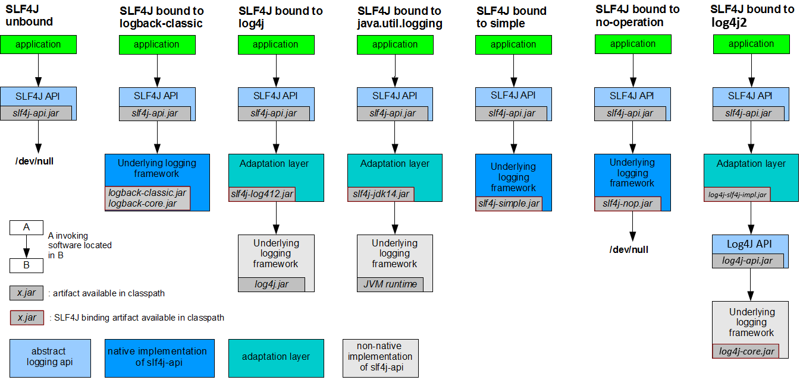

## Java日志框架

### 简介

`Java`中的日志组件最早可以追溯到`1999`年诞生的`log4j`，随后`JDK`在`1.4`版本也加入了自己的`Log`系统（该系统位于`java.util.logging`包下，因此也叫`JUL`），随着系统的不断更新迭代变得越来越复杂，系统在日志框架迁移方面也出现了很多问题，核心问题在于`API`的兼容（当项目需要替换日志实现的时候，你需要重写你系统中所有日志代码），为了实现日志框架兼容，因此诞生了最早的日志门面组件`Jakarta Commons Logging(JCL, 也叫Apache Commons Logging)`。

所谓日志门面，类似于日志组件的公共接口一样的存在，是设计模式中外观模式的一个经典应用，其核心是外部与一个子系统的通信必须通过一个统一的外观对象进行，使得子系统更易于使用。类似于`JDBC`需要依赖具体的数据库驱动包一样，日志门面也需要依赖具体的日志框架才能运作！（当然日志门面本身也会带一个简单实现，不过一般不使用！）

因为具体的日志实现框架的`API`不同（参考`Log4j`和`JUL`），不能直接将他们统一到日志门面，正所谓任何问题都可以通过增加一个间接的中间层来解决，为了适配日志实现框架，增加了一层日志适配器组件，用于适配日志实现，如`log4j-jcl.jar`适配件就是用来适配`JCL`和`Log4j`的。

**自此，日志框架的组件被拆分成了日志门面、日志实现和日志适配件三个子组件，构成了现代日志框架系统，基于日志门面的日志系统虽然降低了对日志实现的耦合度，但随着日志框架的不断推陈出新，也导致了日志组件的jar包依赖混乱的局面！**

随着`log4j`被`Apache`收入门下之后，`log4j`的作者因理念不合离开并在后续开发了如今火爆的日志门面`slf4j(Simple Logging Facade for Java)`和日志实现`logback`。`logback`是基于`slf4j`来开发的，因此他俩中间不需要日志适配器！

在`logback`之后又数年，`Apache Logging`也在后续发布了`log4j2`。

----

至此，如今`Java`的日志框架主要有：`Log4j`、`JUL`、`Logback`、`Log4j2`，日志门面主要有：`JCL`、`slf4j`，以及非常多的各种中间适配器！

他们的出现顺序：`log4j -->JUL-->JCL--> slf4j --> logback --> log4j2`

### 日志框架依赖关系

在《阿里巴巴开发手册》中，有一条强制规定：

> 应用中不可直接使用日志系统（Log4j、Logback）中的API，而应依赖使用日志框架SLF4J中的API，使用门面模式的日志框架，有利于维护和各个类的日志处理方式统一。

因此在开发中一般会导入日志门面和日志实现，在后期如果需要替换日志框架，则替换实现即可！`SLF4J`给出了一张`SLF4J`的绑定（图我做了点改动，添加了`log4j2`的绑定）：



另外还有一些特殊说明：

- 由于`JNDI`漏洞原因，`Log4j`作者发起了一个`reload4j`的项目，他是`Log4j1.2`的一个`Fork`，目的是解决紧迫的安全问题，因此可以使用`reload4j`替换掉`Log4j1.2`，在整合`slf4j`的时候，`slf4j-log412.jar`需要替换成`slf4j-reload4j.jar`
- `slf4j-simple.jar`：`slf4j`的简单实现，所有的东西都会输出到`System.err`，并且只打印`info`及以上级别的日志
- `slf4j-nop.jar`：用于屏蔽所有日志的输出！
- `slf4j-jcl.jar`：将对`slf4j`的`API`调用转到`JCL`
- `slf4j`更新到`2.x`，中间层建议使用`log4j-slf4j2-impl.jar`而不是`log4j-slf4j-impl.jar`

而对于`JCL`的绑定，由于`JCL`的诞生比`Log4j`和`JUL`晚，所以`JCL`和`JUL`、`JCL`和`Log4j`的绑定无需任何适配层，和`Log4j2`则需要适配包`log4j-jcl.jar`


`JCL`和`Logback`适配则比较麻烦，因为`Logback`是基于`slf4j`写的，也就是说`Logback`是`slf4j`的直接实现，要想让`JCL`适配`Logback`，则需要先适配`slf4j`。

在日志中间层中，有很多类似于`xxx-over-xxx.jar`、`xxx-xxx.jar`、`xxx-to-xxx.jar`，这些都是中间适配器，比如希望将`JCL`的`API`适配到`slf4j`，则有`jcl-over-slf4j.jar`，一般带`over`的中间包，你都需要移除掉被`over`了包，比如使用`jcl-over-slf4j.jar`之后你就需要移除掉项目中的`commons-logging.jar`！

想要让`JCL`适配`Logback`，你需要添加`jcl-over-slf4j.jar`、`slf4j-api.jar`、`logback-core.jar`和`logback-classic.jar`，具体的参考下图：


除了`Logback`，剩余其他日志框架都可以回转`slf4j`：

- `jcl-over-slf4j.jar`：将`JCL`的`API`调用转到`slf4j`，使用该包需要删除项目的`commons-logging.jar`
- `log4j-over-slf4j.jar`：将`log4j`的`API`调用转到`slf4j`，使用该包需要删除项目的`log4j.jar`
- `jul-to-slf4j.jar`：将`JUL`的`API`调用转到`slf4j`，使用该包无需任何改动！
- `log4j-to-slf4j.jar`：将对`Log4j2(log4j-api.jar)`的`API`调用转到`slf4j`，使用该包需要移除`log4j-core.jar`，否则可能会出现循环依赖。

另外，`log4j2`之间也有一些桥接：

- `log4j2-jcl.jar`：前面介绍过，是`jcl`和`log4j2`的桥接器

- `log4j2-jul.jar`：如果项目中使用了`JUL`的`API`，希望转接到`Log4j2`的话可以使用这个桥接器！
- `log4j-1.2-api.jar`：如果项目中使用了`Log4j`的`API`，希望转接到`Log4j2`的话可以使用这个桥接器！使用这个转接器需要移除所有`Log4j-1.x`包

最后，在包关系如此混乱的情况下，**要特别注意中间层包的循环依赖**，比如在项目中引入`log4j-slf4j-impl.jar`和`log4j-to-slf4j.jar`则会报错，这是因为你将`slf4j`的`API`转调到`log4j`（`log4j-slf4j-impl.jar`），但`log4j`又通过`log4j-to-slf4j.jar`转调回`slf4j`（即出现了循环），同样的情况也会出现在`jcl-over-slf4j.jar`和`slf4j-jcl.jar`、`log4j-over-slf4j.jar`和`slf4j-log4j12.jar`等，在导入中间层的时候要特别注意！

### Log4j

#### Log4j的日志级别

每个`Logger`都被了一个日志级别（`log level`），用来控制日志信息的输出。

日志级别从低到高分为：`all < trace < debug < info < warn < error < fatal < off`，其中：

- `all`：最低等级，用于打开所有日志记录。
- `trace`：是程序追踪，可以用于输出程序运行中的变量，显示执行的流程。（`1.2.12`引入）
- `debug`：一般用于细粒度级别上，对调试应用程序非常有帮助。（调试信息）
- `info`：一般和在粗粒度级别上，强调应用程序的运行全程。（一般信息）
- `warn`：表明会出现潜在的错误情形。（警告信息）
- `error`：指出虽然发生错误事件，但仍然不影响系统的继续运行。（错误信息）
- `fatal`：指出每个严重的错误事件将会导致应用程序的退出。（严重错误信息）
- `off`：最高等级，用于关闭所有日志记录。

上面这些级别是定义在`org.apache.log4j.Level`类中。`Log4j`只建议使用`error,warn,info,debug`。

通过使用日志级别，可以控制应用程序中相应级别日志信息的输出。例如，如果使用了`info`级别，则应用程序中所有高于`info`级别的（如`info`、`warn`、`error`、`fatal`）日志信息都会被打印出来，而低于`info`的`debug`、`trace`级别将不会被输出！

#### Log4j基础三大组件

`Log4j`的核心组件有三个：

- `Logger`：日志记录器，负责收集日志记录（如何处理日志）
- `Appender`：日志输出目的地，负责日志的输出（输出到什么地方）
- `Layout`：日志格式化，负责对输出的日志进行格式化处理（以什么形式展示）

一个`logger`可以对应多个`appender`、一个`appender`只能对应一个`layout`！

##### Logger

日志记录器的操作由程序员决定，比如决定要记录的日志使用哪个级别等，在`Log4j`中可以使用下面的方法获取一个`Logger`对象：

```java
// Logger类中：
public static Logger getLogger(Class clazz);
public static Logger getLogger(String name);
// LogManager类中：
public static Logger getLogger(Class clazz);
public static Logger getLogger(String name);
```

```java
Logger logger = LogManager.getLogger(”Logger name“);
Logger logger = LogManager.getLogger(Log4jLoggerLevelTest.class);
Logger logger = Logger.getLogger(”Logger name“);
Logger logger = Logger.getLogger(Log4jLoggerLevelTest.class);
```

提供的参数是一个`Class`对象或者是一个字符串，代表`Logger`的名字，这个名字一般使用全限定类名，传递`Class`对象也会调用`Class`的`getName()`来获取全限定类名如：

```java
Logger logger = LogManager.getLogger(”cn.argento.askia.Log4jLoggerLevelTest“);
Logger logger = LogManager.getLogger(Log4jLoggerLevelTest.class);
// 可以使用getName()获取Logger名称：
System.out.println(logger.getName());	// cn.argento.askia.Log4jLoggerLevelTest
```

另外`Logger`的名字大小写敏感，且具有在名称上的继承机制（以`.`来划分父子），如名字是`org.apache.commons`的`logger`会继承名字为`org.apache`的`logger`！

`Log4j`中有一个特殊的`logger`叫`root`，他是所有`Logger`的根，其他所有子`Logger`都会直接或者间接地继承自`root`，`root Logger`只能通过`Logger`或者`LogManager`的`getRootLogger()`获取。

`Logger`的这种继承机制在配置`Log4j`的时候很有用，子`Logger`会继承父`Logger`的配置，同时因为所有`Logger`都会继承`root`的`Logger`，根`Logger`的日志输出格式、输出位置等配置会被子`Logger`继承！

`Logger`可以使用这些方法来记录日志：

```java
// 记录trace级别日志,同下
public void trace(Object message);
// 记录trace级别日志,后面的Throwable代表抛出的异常，该方法会在记录日志的同时记录异常信息链！一般在抛出异常时使用！
public void trace(Object message, Throwable t);

public void debug(Object message);
public void debug(Object message, Throwable t);

public void info(Object message);
public void info(Object message, Throwable t);

public void warn(Object message);
public void warn(Object message, Throwable t);

public void error(Object message);
public void error(Object message, Throwable t);

public void fatal(Object message);
public void fatal(Object message, Throwable t);
```

可以使用下面的方法判别是否开启了特定的级别：

```java
public boolean isDebugEnabled();
public boolean isTraceEnabled();
public boolean isInfoEnabled()
```

##### Appender

`Appender`用来指定日志输出到哪个地方，在`Log4j`中有非常多的`Appender`实现：

其中常用的有：

- `JDBCAppender`：把日志保存到数据库中
- `SocketAppender`：通过`Socket`发送日志给日志服务器！
- `WriterAppender`：将日志信息以流格式写到任意指定的地方（一般不直接配置这个`Appender`，他是`FileAppender`和`ConsoleAppender`的子类）
- `FileAppender`：写到具体的文件
- `ConsoleAppender`：写到控制台
- `RollingFileAppender`：将日志信息输出到一个日志文件，并且指定文件的尺寸，当文件大小达到指定尺寸时，会自动把文件改名，同时产生一个新的文件
- `DailyRollingFileAppender`：将日志输出到一个日志文件，并且每天输出到一个新的文件
- `ExternallyRolledFileAppender`：监听一个端口，当在这个端口上收到消息时，日志文件马上滚动备份并且会返回一个确认消息。这种方法触发滚动的好处是独立于系统，快速，可靠

##### Layout

`Layout`用来指定输出的日志的格式：


其中核心的Layout有：

- `TTCCLayout`：包含日志产生的时间、线程、类别等等信息

- `SimpleLayout`：简单的日志输出格式化，打印的日志格式为（`info - message`）

- `HTMLLayout`：格式化日志输出为`HTML`表格形式

- `PatternLayout`：最强大的格式化期，可以根据自定义格式输出日志，如果没有指定转换格式，

  就是用默认的转换格式

- `EnhancedPatternLayout`：`PatternLayout`的增强版本，官方建议使用这个替代`PatternLayout`

- `XMLLayout`：格式化日志输出为`XML`表格形式

#### Log4j配置写法

`Log4j`在系统中运行须事先设定配置文件，配置文件事实上也就是对`Logger`、`Appender`、`Layout`进行相应设定。

`Log4j`支持两种配置文件格式：`xml`和`properties`。

`Log4j`的配置很简单，只需要在项目的根目录创建一个`log4j.properties`或者`log4j.xml`，如果是`Maven`项目，则在`resources`内创建即可：


另外前面介绍过：一个`logger`可以对应多个`appender`、一个`appender`只能对应一个`layout`！，因此在写配置文件的时候要遵循这条规则来写！

`Log4j`中所有的配置项可以参考类`org.apache.log4j.PropertyConfigurator`，该类内部定义了所有配置的配置头。


另外`Appender`和`Layout`的配置可以参考具体的`Appender`实现和`Layout`实现的内部字段（一般字段名就是配置节名称），如果不明白这句话是什么意思请往下看！

##### 配置写法

这里只讲述一些常用的配置项和习惯，`Log4j`的配置一般以下面的配置为模板：

```properties
# 配置根Logger、子Logger会继承根Logger的配置！
# 配置的格式如下，其中level代表根Logger的输出日志级别
# appenderName1 appenderName2等代表appender的名称（一个logger可以对应多个appender）
log4j.rootLogger=[level], appenderName1, appenderName2,...

# 配置子Logger,其中的loggerName，就是Logger.getLogger()传递的参数
# 如果传递的是一个Class对象，则一般是对象的全限定类名
# 单独配置子Logger的话，该子Logger的配置会覆盖掉父Logger的
log4j.logger.[loggerName]=[level], appenderName1, appenderName2,...

# 然后需要配置Appender，所有appender的配置都是以log4j.appender.[appenderName].* 开头
# 首先需要指定采用哪种Appender实现
log4j.appender.[appenderName]=Appender实现类的全限定类名
# field1、field2对应Appender实现类中的Setter方法，value1、value2对应设置的值！
log4j.appender.[ppenderName].[field1]=value1
log4j.appender.[appenderName].[field2]=value2

# 最后配置Layout,所有Layout的配置都是以log4j.appender.[ppenderName].layout.*开头，配置和
# 配置方式和Appender一样
# 实际上layout就是Appender实现的一个字段，这个字段位于Appender接口的抽象实现AppenderSkeleton中，并且有相应的Setter方法，参考下图！
log4j.appender.[ppenderName].layout=Layout实现类的全限定类名
# field1、field2参考具体的layout实现的Setter方法
log4j.appender.[ppenderName].layout.[field1]=value1
log4j.appender.[ppenderName].layout.[field2]=value2
```


在了解了`Log4j`的配置组成之后，我们来看一个简单的配置示例：

```properties
# 定义rootLogger
log4j.rootLogger=DEBUG,console

# 使用ConsoleAppender
log4j.appender.console=org.apache.log4j.ConsoleAppender
# 对应ConsoleAppender的SetThreshold()
log4j.appender.console.threshold=DEBUG
# 对应ConsoleAppender的SetImmediateFlush()
log4j.appender.console.immediateFlush=true
# 对应ConsoleAppender的SetTarget()，下面以此类推
log4j.appender.console.target=System.err
log4j.appender.console.encoding=UTF-8
log4j.appender.console.name=consoleAppender

# 对应ConsoleAppender的SetLayout()
log4j.appender.console.layout=org.apache.log4j.PatternLayout
# 指定日志的输出格式
# ConversionPattern是PatternLayout的一个Setter方法（）
log4j.appender.console.layout.ConversionPattern=[%-5p] %d(%r) --> [%t] %l: %m %x %n
```

`ConversionPattern`后面的写法可以参考：[PatternLayout](#PatternLayout)

再来看一个复杂的配置：

```properties
# rootLogger
log4j.rootLogger=DEBUG,console,dailyFile,im,logFile,rollingFile
    
# 子Logger
log4j.logger.cn.hooxi=TRACE,LF5_APPENDER,mail,socket,database
    
# 控制台(console)
log4j.appender.console=org.apache.log4j.ConsoleAppender
log4j.appender.console.Threshold=DEBUG
log4j.appender.console.ImmediateFlush=true
# 指定输出到哪个标准输出流，err和out二选一
log4j.appender.console.Target=System.err
log4j.appender.console.layout=org.apache.log4j.PatternLayout
log4j.appender.console.layout.ConversionPattern=[%-5p] %d(%r) --> [%t] %l: %m %x %n
    
# 日志文件(logFile)
log4j.appender.logFile=org.apache.log4j.FileAppender
log4j.appender.logFile.Threshold=DEBUG
log4j.appender.logFile.ImmediateFlush=true
log4j.appender.logFile.Append=true
# log4j.appender.logFile.File的值将会传递给File类作为创建File对象.
log4j.appender.logFile.File=D:/logs/log.log4j
log4j.appender.logFile.layout=org.apache.log4j.PatternLayout
log4j.appender.logFile.layout.ConversionPattern=[%-5p] %d(%r) --> [%t] %l: %m %x %n
    
# 回滚文件(rollingFile)
log4j.appender.rollingFile=org.apache.log4j.RollingFileAppender
log4j.appender.rollingFile.Threshold=DEBUG
log4j.appender.rollingFile.ImmediateFlush=true
log4j.appender.rollingFile.Append=true
log4j.appender.rollingFile.File=D:/logs/log.log4j
log4j.appender.rollingFile.MaxFileSize=200KB
log4j.appender.rollingFile.MaxBackupIndex=50
log4j.appender.rollingFile.layout=org.apache.log4j.PatternLayout
log4j.appender.rollingFile.layout.ConversionPattern=[%-5p] %d(%r) --> [%t] %l: %m %x %n
    
# 定期回滚日志文件(dailyFile)
log4j.appender.dailyFile=org.apache.log4j.DailyRollingFileAppender
log4j.appender.dailyFile.Threshold=DEBUG
log4j.appender.dailyFile.ImmediateFlush=true
log4j.appender.dailyFile.Append=true
log4j.appender.dailyFile.File=D:/logs/log.log4j
log4j.appender.dailyFile.DatePattern='.'yyyy-MM-dd
log4j.appender.dailyFile.layout=org.apache.log4j.PatternLayout
log4j.appender.dailyFile.layout.ConversionPattern=[%-5p] %d(%r) --> [%t] %l: %m %x %n
    
# 应用于socket
log4j.appender.socket=org.apache.log4j.net.SocketAppender
log4j.appender.socket.RemoteHost=localhost
log4j.appender.socket.Port=5001
log4j.appender.socket.LocationInfo=true
log4j.appender.socket.layout=org.apache.log4j.PatternLayout
log4j.appender.socket.layout.ConversionPattern=[%-5p] %d(%r) --> [%t] %l: %m %x %n
    
# Log Factor 5 Appender
log4j.appender.LF5_APPENDER=org.apache.log4j.lf5.LF5Appender
log4j.appender.LF5_APPENDER.MaxNumberOfRecords=2000
log4j.appender.LF5_APPENDER.layout=org.apache.log4j.PatternLayout
log4j.appender.LF5_APPENDER.layout.ConversionPattern=[%-5p] %d(%r) --> [%t] %l: %m %x %n
    
# 发送日志到指定邮件
log4j.appender.mail=org.apache.log4j.net.SMTPAppender
log4j.appender.mail.Threshold=FATAL
log4j.appender.mail.BufferSize=10
log4j.appender.mail.From = xxx@mail.com
log4j.appender.mail.SMTPHost=mail.com
log4j.appender.mail.Subject=Log4J Message
log4j.appender.mail.To= xxx@mail.com
log4j.appender.mail.layout=org.apache.log4j.PatternLayout
log4j.appender.mail.layout.ConversionPattern=[%-5p] %d(%r) --> [%t] %l: %m %x %n
    
# 应用于数据库
log4j.appender.database=org.apache.log4j.jdbc.JDBCAppender
log4j.appender.database.URL=jdbc:mysql://localhost:3306/test
log4j.appender.database.driver=com.mysql.jdbc.Driver
log4j.appender.database.user=root
log4j.appender.database.password=
log4j.appender.database.sql=INSERT INTO LOG4J (Message) VALUES('=[%-5p] %d(%r) --> [%t] %l: %m %x %n')
log4j.appender.database.layout=org.apache.log4j.PatternLayout
log4j.appender.database.layout.ConversionPattern=[%-5p] %d(%r) --> [%t] %l: %m %x %n
 
# 自定义Appender
log4j.appender.im = net.cybercorlin.util.logger.appender.IMAppender
log4j.appender.im.host = mail.cybercorlin.net
log4j.appender.im.username = username
log4j.appender.im.password = password
log4j.appender.im.recipient = corlin@cybercorlin.net
log4j.appender.im.layout=org.apache.log4j.PatternLayout
log4j.appender.im.layout.ConversionPattern=[%-5p] %d(%r) --> [%t] %l: %m %x %n
```

这个复杂的配置中所有内容都可以参考具体的`Appender`实现的字段注释说明，这里简单解释一下：

##### Threshold属性

> `Appender`的`Threshold`属性一般用于过滤日志，相当于二级过滤

可以理解为下图：

举个例子，我们配置了如下的`log4j.properties`：

```properties
# 定义rootLogger
log4j.rootLogger=DEBUG,console,logFile

# 使用ConsoleAppender
log4j.appender.console=org.apache.log4j.ConsoleAppender
log4j.appender.console.threshold=DEBUG
log4j.appender.console.immediateFlush=true
log4j.appender.console.target=System.err
log4j.appender.console.encoding=UTF-8
log4j.appender.console.name=consoleAppender
log4j.appender.console.layout=org.apache.log4j.PatternLayout
log4j.appender.console.layout.ConversionPattern=[%-5p] %d(%r) --> [%t] %l: %m %x %n

log4j.appender.logFile=org.apache.log4j.FileAppender
log4j.appender.logFile.Threshold=INFO
log4j.appender.logFile.ImmediateFlush=true
log4j.appender.logFile.Append=true
log4j.appender.logFile.File=D:/logs/log.txt
log4j.appender.logFile.layout=org.apache.log4j.PatternLayout
log4j.appender.logFile.layout.ConversionPattern=[%-5p] %d(%r) --> [%t] %l: %m %x %n
```

其中`rootLogger`是`Debug`级别，所以`Logger`将会收集所有`Debug`级别及以上的日志，`rootLogger`配置了两个`Appender`，则按照上图的过程：当`rootLogger`的`Debug`级别日志传递给`ConsoleAppender`的时候，`ConsoleAppender`的`Threshold`也是`Debug`级别，所以`rootLogger`的所有日志都不会被过滤，然而`FileAppender`的`Threshold`是`Info`级别，所有经过`FileAppender`的过滤之后，`rootLogger`的`Debug`级别的日志就会被排除，剩余`Info`及以上级别的日志！

另外我们再看一种情况：

```properties
log4j.rootLogger = OFF, STDOUT

log4j.appender.STDOUT=org.apache.log4j.ConsoleAppender
log4j.appender.STDOUT.layout=org.apache.log4j.PatternLayout
log4j.appender.STDOUT.layout.conversionPattern=%d %-5p [%t] - %c -%m%n

log4j.appender.STDOUT.Threshold=warn

# 子Logger
log4j.logger.com.yveshe=error
log4j.logger.com.yveshe.Test=debug
```

由于子`Logger`会继承父`Logger`的配置，所以子`Logger`（`log4j.logger.com.yveshe`会收集`error`级别及以上的日志和`log4j.logger.com.yveshe.Test`会收集`debug`级别及以上的日志）的`Threshold`也会是`warn`，所以`log4j.logger.com.yveshe.Test`中`debug`级别日志将会被过滤，`log4j.logger.com.yveshe`因为没有`warn`级别日志，所以全是`error`以上！

##### name属性

`name`属性用于配置`Appender`的名称，可以随意，如：

```properties
log4j.appender.STDOUT.name=consoleAppender
```

##### immediateFlush属性

> immediateFlush属性建议保持默认的true

`immediateFlush`是立即打印日志的意思，如果为`true`，那么马上打印日志，如果设置为`false`除非覆盖`shouldFlush()`，否则无法立即打印。立即刷新较慢，但可确保实际写入每个追加请求。如果将`immediateFlush`设置为`false`，那么在应用程序崩溃时，很有可能最后几个日志事件实际上没有写入持久介质。 `immediateFlush`变量默认设置为`true`。（注释来自`JavaDoc`翻译）

```properties
log4j.appender.STDOUT.immediateFlush=true
```

##### ConsoleAppender常用选项

> `target`：指将日志输出到控制台，默认是`System.out`

```properties
log4j.appender.STDOUT.target=System.err
```

##### FileAppender常用选项

> FileAppender及其子类的File属性使用File类创建File对象

```properties
log4j.appender.logFile=org.apache.log4j.FileAppender
log4j.appender.logFile.File=D:/logs/log.log4j
```

`FileAppender`内部使用的是

所以如果想要使用相对路径，则需要满足`File`类的创建条件！

> append：true=将日志增加拼接到文件底部，false=将日志覆盖到指定的文件

```properties
log4j.appender.logFile.append=true
```

##### DailyRollingFileAppender常用选项

`FileAppender`的子类，在`FileAppender`的基础上增加了文件滚动规则：

> `dataPattern`：默认值是`'.'yyyy-MM-dd`，指每天产生一个新文件，其他值如下：

```properties
'.'yyyy-MM = 每月新增一个日志文件
'.'yyyy-ww = 每周新增一个日志文件
'.'yyyy = 每年新增一个日志文件
'.'yyyy-MM-dd = 每天新增一个日志文件
'.'yyyy-MM-dd-a = 每天两次
'.'yyyy-MM-dd-HH = 每小时新增一个日志文件
'.'yyyy-MM-dd-HH-mm = 每分钟新增一个日志文件
```

```properties
log4j.appender.logFile.dataPattern='.'yyyy-MM-dd-HH
```

##### RollingFileAppender常用选项

`FileAppender`的子类，具备`FileAppender`的属性，并添加了：

> MaxFileSize=100KB，后缀可以是KB、MB、GB

在日志文件到达该大小之后，将会自动滚动，即创建新的日志文件`xxx.txt`，并将源日志文件的内容移到`xxx.log.1`文件中

```properties
log4j.appender.logFile.MaxFileSize=2GB
```

> MaxBackupIndex=2，指定产生的滚动文件的最大数

```properties
log4j.appender.logFile.MaxBackupIndex=2
```

##### JDBCAppender常用选项

> URL=jdbc:mysql://localhost:3306/test

配置`JDBC`的`URL`

> Driver=com.mysql.jdbc.Driver

配置`JDBC`的驱动

> User=root

配置`JDBC`的用户名

> Password=root

配置`JDBC`的密码

> BufferSize=1

未知作用！

> LocationInfo=true，输出`java`文件名称和行号，默认false

位置信息提取相对来说非常慢，除非不考虑性能，否则应该避免使用

> Sql=要插入的SQL语句

```sql
INSERT INTO log(project_name,create_date,level,category,file_name,thread_name,line,all_category,message) values('itcast','%d{yyyy-MM-ddHH:mm:ss}','%p','%c','%F','%t','%L','%l','%m')
```

##### SocketAppender常用选项

待补充

##### ExternallyRolledFileAppender常用选项

待补充

##### TTCCLayout常用选项

> CategoryPrefixing=true，是否打印`Logger`的名称，默认是true

```properties
log4j.appender.console.layout=org.apache.log4j. TTCCLayout
log4j.appender.console.layout.CategoryPrefixing=true
```

> ContextPrinting=true，是否打印当前线程的嵌套上下文信息

```properties
log4j.appender.console.layout=org.apache.log4j. TTCCLayout
log4j.appender.console.layout.ContextPrinting=true
```

> DataFormat="yyyy-MM-dd HH:mm:ss"，指定日期的输出格式

```properties
log4j.appender.console.layout=org.apache.log4j. TTCCLayout
log4j.appender.console.layout.DataFormat=yyyy-MM-dd HH:mm:ss
```

> TimeZone=UTC，指定TimeZone

```properties
log4j.appender.console.layout=org.apache.log4j. TTCCLayout
log4j.appender.console.layout.TimeZone=UTC
```

##### PatternLayout常用选项<a id="PatternLayout"></a>

> `ConversionPattern=%d %-5p [%t] - %c -%m%n`，写法类似于`C`语言的`Printf`，其参数如下：

```java
%p：输出日志信息的优先级，即DEBUG，INFO，WARN，ERROR，FATAL。
%d：输出日志时间点的日期或时间，默认格式为ISO8601，也可以在其后指定格式，如：%d{yyyy/MM/dd HH:mm:ss,SSS}，输出类似2002/10/18 22:00:00,921
%r：输出自应用程序启动到输出该log信息耗费的毫秒数。
%t：输出产生该日志事件的线程名。
%l：输出日志事件的发生位置，相当于%c.%M(%F:%L)的组合，包括类全名、方法、文件名以及在代码中的行数。例如：test.TestLog4j.main(TestLog4j.java:10)。
%c：输出日志信息所属的类目，通常就是所在类的全名。
%M：输出产生日志信息的方法名。
%F：输出日志消息产生时所在的文件名称。
%L:：输出代码中的行号。
%m:：输出代码中指定的具体日志信息。
%n：输出一个回车换行符，Windows平台为"\r\n"，Unix平台为"\n"。
%x：输出和当前线程相关联的NDC(嵌套诊断环境)，尤其用到像java servlets这样的多客户多线程的应用中。
%%：输出一个"%"字符。

* 另外可以在 % 与字符之间加上修饰符来控制最小宽度、最大宽度和文本的对其方式。如：
%20：指定输出category的名称，最⼩的宽度是20，如果category的名称⼩于20的
话，默认的情况下右对⻬。
%-20c:指定输出category的名称，最⼩的宽度是20，如果category的名称⼩于20的
话，”-”号指定左对⻬。
%.30c:指定输出category的名称，最⼤的宽度是30，如果category的名称⼤于30的
话，就会将左边多出的字符截掉，但⼩于30的话也不会有空格。
%20.30c:如果category的名称⼩于20就补空格，并且右对⻬，如果其名称⻓于30字
符，就从左边多出的字符截掉。
%-20.30c:如果category的名称⼩于20就补空格，并且左对齐，如果其名称⻓于30字
符，就从左边多出的字符截掉。
   
%-5p：输出的优先级至少5个字符，左对齐，如果不过5字符则补空格，如：[%-5p]
    ,INFO级别则会输出:[INFO ]
```

##### HTMLLayout常用选项

> LocationInfo=true：输出java文件名称和行号，默认值是false。

```properties
log4j.appender.console.layout=org.apache.log4j.  HTMLLayout
log4j.appender.console.layout.LocationInfo=true
```

> Title=My Logging： 默认值是Log4J Log Messages。

```properties
log4j.appender.console.layout=org.apache.log4j.  HTMLLayout
log4j.appender.console.layout.Title=My Logging
```

##### XMLLayout常用选项

> locationInfo=true，你懂的！

```properties
log4j.appender.console.layout=org.apache.log4j.xml. XMLLayout
log4j.appender.console.layout.locationInfo=true
```

> properties=true，默认false，是否输出MDC键值对

```properties
log4j.appender.console.layout=org.apache.log4j.xml. XMLLayout
log4j.appender.console.layout.properties=true
```


最后，一些可选的配置介绍：

```properties
log4j.additivity.org.apache=false
log4j.debug=false
log4j.reset=false
```

### JUL

`JUL`（`Java util logging`）`Java`原生日志框架，不需要引入第三方依赖包，使用简单方便，一般在小型项目中使用较多。

`JUL`包中的类不是很多，所以日志功能相对`Log4j`等稍显简陋：


#### JUL的日志级别

JUL日志级别由类`java.util.logging.Level`记录，总共有七个日志级别，从高到低分别是：

- `SEVERE`（最高值）：错误信息，一般是记录导致系统终止的信息。
- `WARNING`：警告信息，一般记录程序的问题，该问题不会导致系统终止，但是却值得我们关注。
- `INFO`（默认级别）：一般信息，一般记录一些连接信息，访问信息等。
- `CONFIG`：一般记录加载配置文件等日志信息
- `FINE`：`Debug`日志信息，一般记录程序一般运行的状态。执行的流程参数的传递等信息
- `FINER`：与`FINE`类似，只是记录的颗粒度要高一些
- `FINEST`（最低值）：与上面两个类似，只是记录的颗粒度要高一些

还有两个特殊的级别：

- `OFF`，可用来关闭日志记录。
- `ALL`，启用所有消息的日志记录。

同样低级别的日志会输出高级别的日志，如`INFO`，则会输出`WARNING`和`SEVERE`

#### JUL基础组件


`JUL`中的基础组件包括：

- `Logger`：日志记录器，应用程序通过获取`Logger`对象，调用其`API`来发布日志信息。`Logger`通常时应用程序访问日志系统的入口程序。
- `Filter`：过滤器，根据需要定制哪些信息会被记录，哪些信息会被放过
- `Handler`：相当于`Log4j`的`Appender`，`Handler`决定了日志输出到哪里，一个`Logger`同样拥有多个`Handlers`
- `Formatter`：相当于`Log4j`的`Layout`，决定了日志的输出格式！

##### Logger

要想创建一个`Logger`对象，可以使用下面的`API`：

```java
public static Logger getLogger(String name);
public static Logger getLogger(String name, String resourceBundleName);
 
// 获取全局Logger（不建议，只为了贪图方便）
public static final Logger getGlobal();
```

```java
Logger logger = Logger.getLogger("cn.argento.askia.JUL.JULLogger4jLoggerLevelTest");
```

`Logger`类中用于记录日志的方法如下：

```java
// 基本的记录方法
// 记录severe级别日志
public void severe(String msg);
public void severe(Supplier<String> msgSupplier);
// 记录warning级别日志
public void warning(String msg);
public void warning(Supplier<String> msgSupplier);
// 记录info级别日志
public void info(String msg);
public void info(Supplier<String> msgSupplier);
// 记录config级别日志
public void config(String msg);
public void config(Supplier<String> msgSupplier);
// 记录fine级别日志
public void fine(String msg);
public void fine(Supplier<String> msgSupplier);
// 记录finer级别日志
public void finer(String msg);
public void finer(Supplier<String> msgSupplier);
// 记录finest级别日志
public void finest(String msg);
public void finest(Supplier<String> msgSupplier);

// 通用的记录方法
// 参数level：指定日志的级别，Level类中枚举了各个日志级别
// 参数msg：要记录的信息，用{X}（X从0开始）占位符填充参数
// 参数params：待填入的参数
public void log(Level level, String msg, Object params[]);
// 该方法只能接收一个占位符{0}
public void log(Level level, String msg, Object param1);
// 记录异常的通用日志方法
public void log(Level level, String msg, Throwable thrown);
public void log(Level level, String msg);
public void log(Level level, Supplier<String> msgSupplier);
public void log(Level level, Throwable thrown, Supplier<String> msgSupplier);
public void log(LogRecord record);

// 在log()的基础上增加记录所在类及其类方法支持的记录
// sourceClass:日志发生在的类
// sourceMethod:日志发生在的方法
public void logp(Level level, String sourceClass, String sourceMethod, String msg);
public void logp(Level level, String sourceClass, String sourceMethod, String msg, Object param1);
public void logp(Level level, String sourceClass, String sourceMethod, String msg, Object params[]);

// 
public void logrb(Level level, String sourceClass, String sourceMethod, ResourceBundle bundle, String msg, Object... params);
public void logrb(Level level, String sourceClass, String sourceMethod, ResourceBundle bundle, String msg, Throwable thrown);
```

`JUL`的`Logger`也存在父子关系：


在`JUL`中，存在一个类`LogManager`，专门用来管理`Logger`，另外存在一个接口`LoggingMXBean`，还获取`Logger`的内存记录信息！

```

```


##### Handler


##### Formatter


#### JUL配置写法


### JCL

#### JCL的日志级别

#### JCL基础三大组件

#### JCL配置写法

### SLF4J

### Logback

### Log4j2

