## Java-Annotation(95%)

`Java`中注解可以说是`Java`编程的一大特性，本章节主要内容：

1. 如何定义一个注解：包括元注解、重复注解等的定义方式和标记方式
2. 注解标记的位置：注解能够标记在哪个地方
3. `JDK`内置注解：包括`java.lang`、`java.lang.annotation`、`javax.annotation`包中的非元注解的使用
4. 注解处理器：注解的定义一般有三种级别（源码级、字节码级、运行级），对应三类的注解处理器，将会一一介绍！
5. 注解的结构：该小节会反编译注解的字节码，从底层来查看一个注解的源代码
6. 注解应用框架：会介绍常见的注解驱动框架的基本使用，如`core java`中介绍到的[Jcommander](jcommander.org)、大名鼎鼎的[Lombok](https://projectlombok.org/)

### 注解的定义

首先要知道注解在`Java`代码中并不起任何实际的作用，他的唯一作用只有标记，标记该对象具备某个性质，在`java`中所有带`@`开头的都是注解，如常见的`@Override`，标记`@Override`代表该方法是一个重写方法！

定义注解的方式很像定义接口，其格式如下：

```java
public @interface Common {
}
```

在`interface`前面加上`@`定义出来的就是注解，`idea`提供了快速定义的方式，你可以通过`new --> new java class`，选中`Annotation`，就可以创建一个注解：

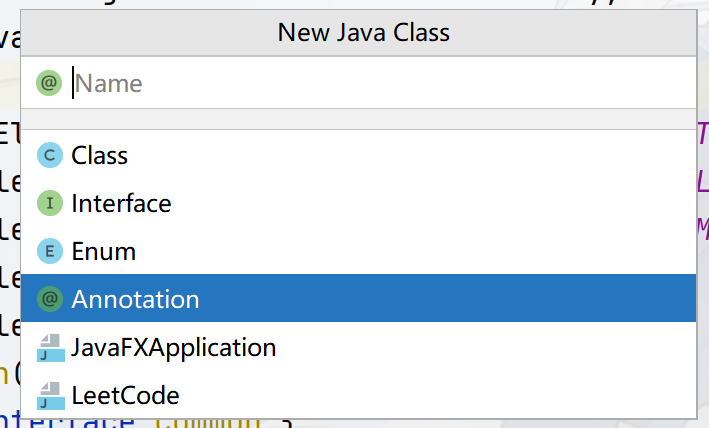

回到`@Override`注解，你可以在任何重写方法上标记`@Override`，但如果你把注解标记在字段上，则`IDE`会报错！这是因为`@Override`注解的标记是有范围限定的！他只能标记在方法上，我们查看`@Override`的源代码：

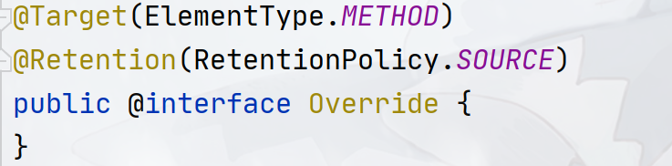

发现其上有两个注解`@Target`、`@Retention`，这两个注解就是用于规定`@Override`作用范围和存储级别，这种规定注解接口的作用范围和行为属性的注解一般被称之为元注解（即用来定义注解的注解），`JDK`中的元注解有`5`个：

- `@Target`：表示该注解能标记在哪个地方，可以传递多个`ElementType`的枚举值，其枚举量如下：

  - `TYPE`：标记在类型上，如类、接口、枚举类

  - `FIELD`：标记在字段上，如类或接口的字段或常量字段、枚举量

  - `METHOD`：标记在方法上，包括静态或非静态

  - `PARAMETER`：标记在方法参数上

  - `CONSTRUCTOR`：标记在构造器上

  - `LOCAL_VARIABLE`：标记在局部变量上

  - `ANNOTATION_TYPE`：标记在注解的定义上，元注解一般都是这个级别

  - `PACKAGE`：标记在包上，一般和`package-info.java`有关

  - `TYPE_PARAMETER`（`JDK 1.8`）：标记在泛型类型参数上，如`T`，这里举个例子：

    ```java
    @Target({ElementType.TYPE_PARAMETER, ElementType.TYPE_USE})
    @Retention(RetentionPolicy.RUNTIME)
    public @interface Common {
    }
    
    public class Main<@Common T>{
    	private Class<@Common ?> clazz;
    }
    ```

  - `TYPE_USE`（`JDK 1.8`）：标记在所有使用的类型上（只要是类型就行），如抛出的异常、继承时的类名、泛型的`?`等，这里举个例子：

    ```java
    @Target({ElementType.TYPE_PARAMETER, ElementType.TYPE_USE})
    @Retention(RetentionPolicy.RUNTIME)
    public @interface Common {
    }
    
    public class Main extends @Common Number implement @Common Closable{
    	private Class<@Common ?> getClass() throws @Common IOException;
    }
    ```

- `Retention`：表示该注解的存储级别，有三个值，只能填其一

  - `SOURCE`：源码级别，该注解在编译成字节码的时候会被去掉，类似于注释的处理！
  - `CLASS`：字节码级别，该注解在编译成字节码的时候会被保留，但不会被`JVM`加载，在处理字节码的时候能获取，但无法被反射`API`获取！
  - `RUNTIME`：运行级别，该注解在编译成字节码的时候会被保留，并且会被`JVM`加载，可以通过反射来获取`API`

- `Documented`：指明该注解是否会被`Javadoc`记录

- `Inherited`：指定注解是否能够被继承，标记了该元注解的注解标记在父类的代码上时，子类也能够获取！

- `Repeatable`（`JDK 8`）：表示注解是否可重复标记！

这`5`大元注解中，其中`Target`和`Retention`是必须的，其他都是可选的，根据实际情况标记即可，因此完整创建一个注解需要如下的模板：

```java
@Target({ElementType.TYPE_PARAMETER, ElementType.TYPE_USE})
@Retention(RetentionPolicy.RUNTIME)
public @interface Common {
}
```

> @Target可以指定多个，你甚至可以指定所有的`ElementType`（`github`链接）
>
> ```java
> package cn.argento.askia.annotation.define;
> 
> import java.lang.annotation.ElementType;
> import java.lang.annotation.Retention;
> import java.lang.annotation.RetentionPolicy;
> import java.lang.annotation.Target;
> 
> @Target({ElementType.PACKAGE, ElementType.ANNOTATION_TYPE,
>         ElementType.CONSTRUCTOR, ElementType.FIELD,
>         ElementType.LOCAL_VARIABLE, ElementType.METHOD,
>         ElementType.PARAMETER, ElementType.TYPE,
>         ElementType.TYPE_PARAMETER})
> @Retention(RetentionPolicy.RUNTIME)
> public @interface Common {
> }
> ```

虽然`Target`和`Retention`是必须的，但你仍然可以不指定，这样`JDK`会使用`Target`和`Retention`的默认值，默认情况下的`Target`可以指代任何位置，即`Target`注解的所有值，而`Retention`的默认值是`CLASS`级别。

到此，注解的声明方式介绍完毕，那么注解内部的定义呢？正如类内部可以定义字段、方法一样，注解内部也可以定义一些字段，用来标记一些信息，注解内部允许定义下面的数据：

- 基本类型（`int`、`short`、`long`、`byte`、`char`、`double`、`float`和`boolean`）
- `String`
- `Class`，如：`Class<?>`、`Class<Integer>`
- `Enum`类型
- 注解类型
- 上面这些类型的数组，如`Class<?>[]` `String[]`

我们仍然能在注解内部定义内部类、内部接口等，注解声明实际上是当作接口看的，在下面的类`cn.argento.askia.annotation.full.BugReport`中，你将可以看到如何声明这样的注解：

> Github源码跳转链接：
>
> ```java
> package cn.argento.askia.annotation.define;
> 
> import java.lang.annotation.*;
> 
> /**
>  * 定义注解时可以编写的东西
>  * @interface实际上也是一个类，因此可以在@interface定义枚举类型和嵌套类,甚至是@interface
>  */
> 
> @Target({ElementType.FIELD, ElementType.METHOD, ElementType.TYPE, ElementType.ANNOTATION_TYPE})
> @Retention(RetentionPolicy.RUNTIME)
> @Documented
> public @interface BugReport {
>     long value() default 2000;
>     String versions() default "1.1.0";
>     int version() default 1;
>     double subVersion() default 1.0;
>     boolean showStopper() default false;
>     String assignedTo() default "[none]";
>     Class<?> testCase() default Void.class;
>     Status status() default Status.CONFIRMED;
>     Reference ref() default @Reference;
>     String[] reportedBy() default "";
>     Class<?>[] clazz() default {};
> 
>     enum Status {UNCONFIRMED, CONFIRMED, FIXED, NOTABUG}
> 
>     public @interface Reference{
>         String ref() default "";
>         String url() default "";
>     }
>     public interface B{
> 
>     }
> 
>     // 定义inner class的时候默认是public级别的
>     // 并且除了public级别，其他级别不允许！
>     public class A{
>         public void test(){
> 
>         }
>     }
> }
> ```

值得注意的一点是：

- 在注解中定义内部类、内部枚举类、内部注解、内部接口等，默认都是`public`并且不允许使用其他的修饰级别如`private`、`protected`，这点也和接口一摸一样！

注解数据的定义也很简单，只需要在定义数据变量加上括号即可，如：

```java
@Target({ElementType.TYPE_PARAMETER, ElementType.TYPE_USE})
@Retention(RetentionPolicy.RUNTIME)
public @interface Common {
	String version();
	Class<?> testClazz();
}
```

如果希望数据成员有默认值，则可以使用`default`，但是注意，注解成员不允许有`null`值，可以使用`Void.class`、`""`、`-1`、`{}`等作为代替！

```java
@Target({ElementType.TYPE_PARAMETER, ElementType.TYPE_USE})
@Retention(RetentionPolicy.RUNTIME)
public @interface Common {
	String version() default "1.5.1";
	Class<?> testClazz() default Void.class;
}
```

那么在标记注解的时候如何提供数据呢？假如这里有一个注解：

```java
@Target({ElementType.TYPE_PARAMETER, ElementType.TYPE_USE})
@Retention(RetentionPolicy.RUNTIME)
public @interface Common {
    String value() default "1.5.1";
	String version() default "1.5.1";
	Class<?> testClazz() default Void.class;
    int[] ip default {192, 168, 0, 1}
}
```

这个注解包含了四个数据成员，其中一个是数组。提供数据的时候需要写出具体要提供的项等于值的格式，提供多个项使用逗号分隔：

**提供数据给注解无需全部提供，只提供需要的即可，其他都会使用默认值，如**：

```java
public class @Common(version = "1.0.3", testClazz = Main.class) Main {
    // Common注解内各个成员的值：
    // value = "1.5.1"
    // version = "1.0.3"
    // testClazz = Main.class
    // ip = {192, 168, 0, 1}
}
```

如果注解中定义了一个特殊的数值成员`value`，并且当你只需要给这个`value`提供值的时候，可以不写项名：

```java
public class @Common("1.0.3") Main {
    // Common注解内各个成员的值：
    // value = "1.0.3"
    // version = "1.5.1"
    // testClazz = Void.class
    // ip = {192, 168, 0, 1}
}
```

如果提供的注解数值成员是一个数组，则提供内容的时候需要使用`{}`,但是当提供的数组数据只有一个成员的时候，括号可以省略：

```java
public class @Common(ip = {192, 168, 0, 3}) Main {
    // Common注解内各个成员的值：
    // value = "1.5.1"
    // version = "1.5.1"
    // testClazz = Void.class
    // ip = {192, 168, 0, 3}
}

// 数组数据只有一个成员
public class @Common(ip = 192) Main {
    // Common注解内各个成员的值：
    // value = "1.5.1"
    // version = "1.5.1"
    // testClazz = Void.class
    // ip = {192}
}
```

如果只标注注解而不提供任何成员数据时，所有的数据都会使用默认值，这个时候注解无需加括号：

```java
// 数组数据只有一个成员
public class @Common Main {
    // Common注解内各个成员的值：
    // value = "1.5.1"
    // version = "1.5.1"
    // testClazz = Void.class
    // ip = {192, 168, 0, 1}
}
```

### 注解标记的位置

`@Target`元注解中共定义了`10`处位置给注解标记，关键的问题就是如何标记，或者说标记在哪里才算合法？

> TYPE类型

`Type`类型允许你将注解标记在类、接口、枚举类上，需要将注解放置在`class`、`interface`、`enum`前面：

```java
@Common
public class Main {
}

@Common
public interface Main{
    
}
@Common
public enum Main{
    
}

@Common
public @interface Main{
    
}
```

> FIELD类型

如果是字段（包括常量）类型，则需要标记在类型前面，枚举值则在枚举值前标记

```java
public enum C{
    @Common A, @Common B
}

public class Main {

	// 三种方式皆可！
	@Common
	private A name;
	@Common private A name;
    private @Common A name;
}

public interface Main{
    @Common
    String c = "Hello World!";
}
```

> METHOD类型

标记在方法上即可，如：

```java
public interface Main{
   @Common
   void hello();
}
```

> PARAMETER类型

标记在方法的参数上即可，如：

```java
public interface Main{
   void hello(@Common String name);
}
```

> CONSTRUCTOR类型

标记在构造器上即可：

```java
public class Main{

   @Common
   public Main(){
   
   }
}
```

> ANNOTATION_TYPE类型

标记在注解定义上，如：

```java
@Common
public @interface Main{
   int version() default 2;
}
```

> LOCAL_VARIABLE类型

标记在局部变量上，注意定义该类型的注解，其源码级别只能是`SOURCE`级别

```java
public class Main{

   public Main(){ 
     @Common String a = "123";
   }
}
```

> PACKAGE

标记在`package-info.java`里面的`package`上，如：注意定义该类型的注解，其源码级别只能是`SOURCE`级别

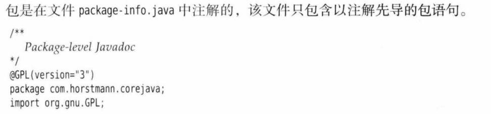

```java
// package-info.java
/**
 * package级别的注解只能在package-info.java中使用
 */
@Common
package cn.argento.askia.annotation.full;
```

> TYPE_PARAMETER

定义在所有类型参数变量的位置上，如：

```java
public class Main<@Common T>{
	public <@Common S> S getType();
}
```

> TYPE_USE

定义在所有使用类型上，只要是单独的类型都可，如：`List<@Common String>`、`public void test() throws @Common IOException`、`public class Main extends @Common Main2`，该方式的定义位置非常多样，这里引用`core java`的结论：

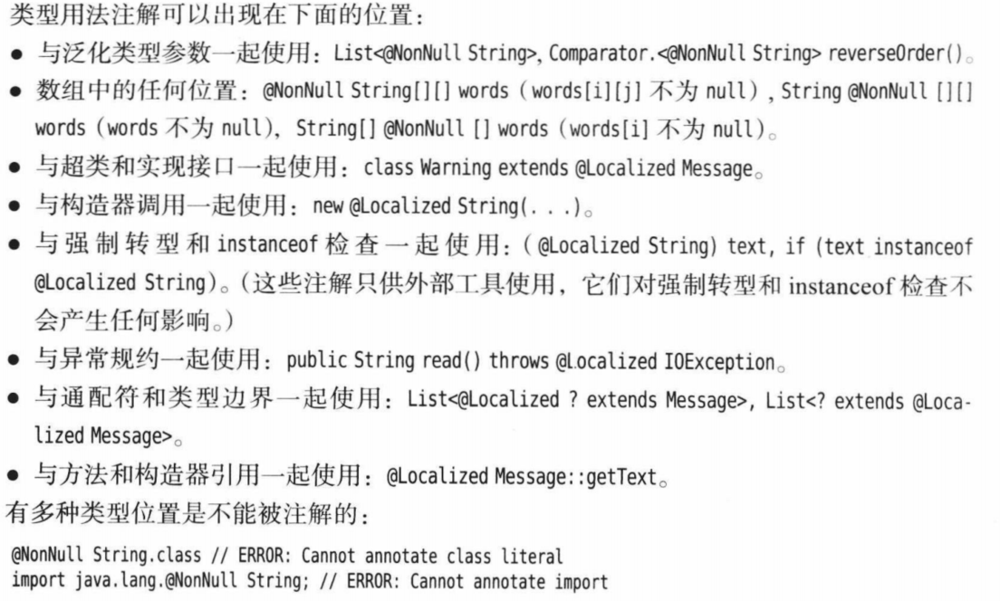

### 内置标准注解

在`java.lang`、`java.lang.annotation`、`javax.annotation`中，有非常多标准注解！

`java.lang`包：`@Deprecated`、`@FunctionalInterface`、`@Override`、`@SafeVarargs`、`@SuppressWarnings`

`java.lang.annotation`包（元注解包）：`@Documented`、`@Inherited`、`@Native`、`@Repeatable`、`@Retention`、`@Target`

`javax.annotation`包：`@Generated`、`@PostConstruct`、`@PreDestroy`、`@Resource`等

其中`javax.annotation`包是扩展的标准化注解包，其中包括了`jsr`标准规定的一些注解，该包中的注解并不是重点，这些注解你将在`Spring`框架中遇到

`@Retention`和`@Target`我们已介绍过，则无需再花篇幅！

#### 可继承的注解

标记了`@Inherited`元注解的注解标记在类上的时候可以在子类中被获取，我们定义一个注解：

```java
@Target({ElementType.FIELD, ElementType.CONSTRUCTOR, ElementType.METHOD, ElementType.TYPE})
@Retention(RetentionPolicy.RUNTIME)
@Inherited
public @interface InheritedAnnotation {
    String version() default "1.0";
    String name() default "askia";
    Class<?> clazz() default Void.class;
}
```

注意这种带`@Inherited`的注解只有标记在类上的时候才有继承性，如果标记在方法上或者标记在接口上或其他位置，则无法实现注解继承！

定义一个`Father`类和`FatherInterface`接口，在`Father`类和`FatherInterface`接口上标记`@InheritedAnnotation`注解，在`Father`类上的某个方法上标记`@InheritedAnnotation`注解，然后让`Son`类继承`Father`类，`Son2`类实现`FatherInterface`，进行测试！

> InheritedAnnotation.java

```java
@Target({ElementType.FIELD, ElementType.CONSTRUCTOR, ElementType.METHOD, ElementType.TYPE})
@Retention(RetentionPolicy.RUNTIME)
@Inherited
public @interface InheritedAnnotation {
    String version() default "1.0";
    String name() default "askia";
    Class<?> clazz() default Void.class;
}
```

> Father.java

```java
@InheritedAnnotation(name = "Askia3")
public class Father {
    private String name;

    public Father() {
        this.name = "Askia";
    }

    public Father(String name) {
        this.name = name;
    }

    @InheritedAnnotation(name = "Askia2")
    public String getName() {
        return name;
    }

    @InheritedAnnotation(name = "Askia2")
    public Father setName(String name) {
        this.name = name;
        return this;
    }
}
```

> FatherInterface.java

```java
@InheritedAnnotation
public interface FatherInterface {

}
```

> Son.java

```java
public class Son extends Father implements Serializable, Comparable<Son> {

    @Override
    public String getName() {
        return super.getName() + " = " + LocalDateTime.now();
    }

    @Override
    public int compareTo(Son o) {
        return 0;
    }
}
```

> Son2.java

```java
public class Son2 implements FatherInterface{
}
```

在反射`API`中，获取`Runtime`级别的注解可以通过`getAnnotations()`和`getDeclaredAnnotations()`获取，他们的区别是`getDeclaredAnnotations()`不会获取继承性的注解！

> 测试代码

```java
public class InheritedTest {
    public static void main(String[] args) throws NoSuchMethodException {
        // 方法上不会被继承
        // 结果：[]
        final Method getName = Son.class.getMethod("getName");
        final Annotation[] annotations = getName.getAnnotations();
        System.out.println(Arrays.toString(annotations));

        // 子类被继承 Son类继承Father类，Father类上标记有@InheritedAnnotation注解！
        // 结果：[@cn.argento.askia.annotation.inherited.InheritedAnnotation(name=Askia3, clazz=class java.lang.Void, version=1.0)]
        final Annotation[] annotations1 = Son.class.getAnnotations();
        System.out.println(Arrays.toString(annotations1));
        
        // DeclaredAnnotations获取直接注解！
        // 结果：[]
        final Annotation[] annotations12 = Son.class.getDeclaredAnnotations();
        System.out.println(Arrays.toString(annotations12));

        // 接口上也不会被继承
        // 结果: []
        final Annotation[] annotations2 = Son2.class.getAnnotations();
        System.out.println(Arrays.toString(annotations2));
    }
}
```

结果只有标记在`Father`类上的注解能够被反射`API`获取，其他的都无法获取！具体可以参考`Demo`：

> src/main/java/cn/argento/askia/annotation/inherited/InheritedTest.java

另外继承性可以多级继承，如：

```java
@Target(ElementType.TYPE)
@Retention(RetentionPolicy.RUNTIME)
@Inherited
@interface Anno{

}

@Anno
class A{

}

class B extends A{

}

class C extends B{
    public static void main(String[] args) {
        // 可以获取
        final Anno annotation = C.class.getAnnotation(Anno.class);
        System.out.println(annotation);
    }
}
```

> 实际上方法上、字段上也能获取类似于继承性质的注解，如果子类继承了父类，但是却没有重写父类的某个方法，则通过子类的Class对象获取该方法时（注意，`getMethod()`的核心有两：1.只能获取public，2.获取Class对象对应的类及其所有父类）可以获取，如上面的Father类中的setName()，该方法由于是public的，且Son类没有重写，所以通过Son.class.getMethod("setName", String.class).getAnnotations()可以获取到@InheritedAnnotation。同样的，字段、接口中的常量和方法、接口中的默认方法也适用这个规则！

#### 可重复标记的注解

`@Repeatable`源代码如下：

```java
@Documented
@Retention(RetentionPolicy.RUNTIME)
@Target(ElementType.ANNOTATION_TYPE)
public @interface Repeatable {
    Class<? extends Annotation> value();
}
```

标记了`@Repeatable`的元注解的注解支持重复标记在类、方法等上面。我们先定义一个注解，并将其变成可重复标记的注解：

```java
@Target({ElementType.FIELD, ElementType.CONSTRUCTOR, ElementType.METHOD, ElementType.TYPE})
@Retention(RetentionPolicy.RUNTIME)
@Documented
public @interface RepeatableAnnotation {

    String description() default "";
}
```

`@Repeatable`需要一个装载重复注解的容器，这个容器一般也是一个注解。为了区分，其命名一般是可重复注解的名称加上`s`。

另外这个容器注解的定义有下面的要求：

1. `@Target`必须是可重复标记注解的全集或者子集
2. `@Retention`必须和可重复标记注解相同
3. 必须要定义`value()`数据成员来装载可重复注解，并且`value()`数据成员的类型是可重复标记注解的数组类型！
4. 可重复的注解标记了`@Documented`，则注解容器也要标记`@Documented`

我们现在根据上面的`4`个要求来定义这个容器注解：

```java
// 根据第一条规则，这里必须是RepeatableAnnotation的@Target的全集或者子集，如下面的结果都是合法的
// {ElementType.FIELD, ElementType.CONSTRUCTOR, ElementType.METHOD, ElementType.TYPE}
// {ElementType.CONSTRUCTOR, ElementType.METHOD, ElementType.TYPE}
// {ElementType.FIELD, ElementType.METHOD, ElementType.TYPE}
// {ElementType.FIELD, ElementType.TYPE}
// .....
// 但是注意，只有这里的target的位置才能实现重复标记，如下面的{ElementType.FIELD、, ElementType.CONSTRUCTOR, ElementType.METHOD}，则只能在FIELD、CONSTRUCTOR、METHOD才能重复标记，在TYPE上无法重复标记！
@Target({ElementType.FIELD, ElementType.CONSTRUCTOR, ElementType.METHOD})
// 根据第二条规则，这里要和RepeatableAnnotation保持一致
@Retention(RetentionPolicy.RUNTIME)
// 根据第四条规定，因为@RepeatableAnnotation有@Documented，则其容器注解也要有
@Documented
// 容器注解的命名规则是可重复标记注解的名称 + s
@interface RepeatableAnnotations{
    // 根据第三条规则的定义！类型是RepeatableAnnotation[] 
    RepeatableAnnotation[] value() default {};
}
```

然后在`RepeatableAnnotation`标记上`@Repeatable`注解！指定其对应的容器注解！

```java
@Target({ElementType.FIELD, ElementType.CONSTRUCTOR, ElementType.METHOD, ElementType.TYPE})
@Retention(RetentionPolicy.RUNTIME)
@Documented
// @Repeatable的源代码中是带有一个Class<? extends Annotation> value();成员的还记得不？
@Repeatable(RepeatableAnnotations.class)
public @interface RepeatableAnnotation {

    String description() default "";
}
```

现在分别在`ElementType.FIELD, ElementType.CONSTRUCTOR, ElementType.METHOD, ElementType.TYPE`上进行标记，可以看到只有`ElementType.TYPE`无法重复！

可以通过反射`API`中的`getAnnotationsByType(RepeatableAnnotation.class)`来获取重复的注解！

> src/main/java/cn/argento/askia/annotation/repeat/RepeatableTest.java

#### 文档注解

该注解主要和`javadoc`文档有关，如果希望注解被记录在文档，则标上即可，这里引用`core java`的说明：

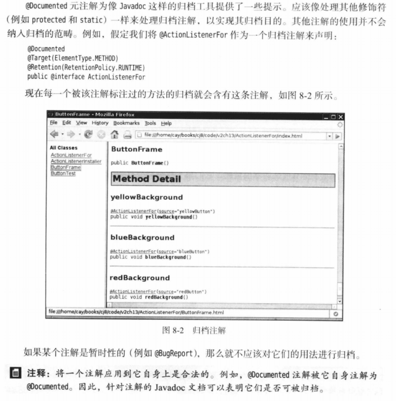

#### 本地变量

首先查看一下`@Native`注解的源码信息，如下所示：

```java
/**
 * Indicates that a field defining a constant value may be referenced
 * from native code.
 *
 * The annotation may be used as a hint by tools that generate native
 * header files to determine whether a header file is required, and
 * if so, what declarations it should contain.
 *
 * @since 1.8
 */
@Documented
@Target(ElementType.FIELD)
@Retention(RetentionPolicy.SOURCE)
public @interface Native {
}
```

可以看到`@Native`注解自`jdk1.8`引入，用于解释该字段是一个常量，其值引用`native code`，该注解更多和`@Override`一样，是起到纯标记作用！可以发现它的保留时间为`SOURCE`阶段，这个用的不是很多，在`JNI`中可能用到，常常被代码生成工具使用。

#### 重写方法

`@Override`注解标记的方法是重写方法：

```java
@Target(ElementType.METHOD)
@Retention(RetentionPolicy.SOURCE)
public @interface Override {
}
```

作为一种习惯，建议在所有的重写方法上都标记该注解

```java
class Father{
	public void eat(){
		...
	}
}
class Son extends Father{
	@Override
	public void eat(){
	
	}
}
```

#### 废弃方法

标记`@Deprecated`的方法作为是废弃方法

```java
@Documented
@Retention(RetentionPolicy.RUNTIME)
@Target(value={CONSTRUCTOR, FIELD, LOCAL_VARIABLE, METHOD, PACKAGE, PARAMETER, TYPE})
public @interface Deprecated {
}
```

**`@Deprecated`标记的内容，在被使用时会被加上删除线**

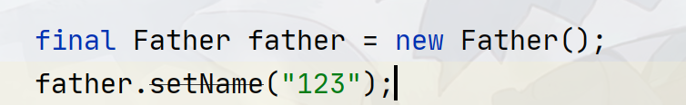

#### 函数式接口

只有一个公开方法（`public`，`default`方法不算）的接口就被称之为函数式接口，如：

```java
public interface FatherInterface {
    
    int size();
    
    default boolean isEmpty(){
        return size() == 0;
    }
    
    default boolean isNotEmpty(){
    	return !isEmpty();
    }
}
```

我们可以在这些函数式接口上标记`@FunctionalInterface`

```java
@FunctionalInterface
public interface FatherInterface {
    
    int size();
    
    default boolean isEmpty(){
        return size() == 0;
    }
    
    default boolean isNotEmpty(){
    	return !isEmpty();
    }
}
```

#### 安全可变参数

`@SafeVarargs`用于标记可变参数是安全的，在声明具有**模糊类型（比如：泛型）的可变参数的构造函数或方法时**，`Java`编译器会报`unchecked`警告。鉴于这些情况，如果程序员断定声明的构造函数和方法的主体不会对其可变参数执行潜在的不安全的操作，可使用`@SafeVarargs`进行标记，这样的话，`Java`编译器就不会报`unchecked`警告。

```java
@Documented
@Retention(RetentionPolicy.RUNTIME)
@Target({ElementType.CONSTRUCTOR, ElementType.METHOD})
public @interface SafeVarargs {}
```

**@SafeVarargs注解，对于非static或非final声明的方法，不适用，会编译不通过，对于非static或非final声明的方法，请使用@SuppressWarnings("unchecked")**

#### 警告抑制

`@SuppressWarnings`用于忽略某些警告，如上面的`unchecked`，参数`Value`可以填入警告类型，支持同时抑制多种警告

> 2023.12.17：@SuppressWarnings的可选项取决于你使用哪个发行商的`Java`编译器的哪个版本以及所使用的`IDE`环境!
>
> 如`eclipse`支持的选项参考：https://help.eclipse.org/latest/index.jsp?topic=/org.eclipse.jdt.doc.user/tasks/task-suppress_warnings.htm，
>
> `idea`的参考选项：https://gist.github.com/vegaasen/157fbc6dce8545b7f12c
>
> 其中`Java`语言规范中规定，任何的编译器和`IDE`都需要实现这两个选项：`unchecked`和`deprecation`，可以使用`javac -X`指令来查看当前版本编译器支持的选项！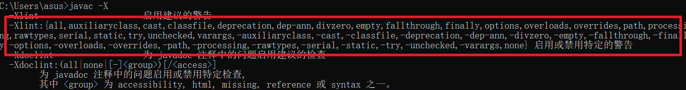
>
> `idea`支持自动生成`@Suppresswarnings`注解的值：https://www.jetbrains.com/help/idea/disabling-and-enabling-inspections.html#suppress-inspections
>
> 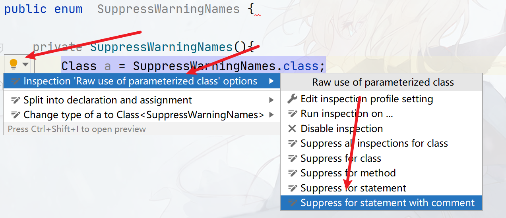
>
> ref：https://stackoverflow.com/questions/1205995/what-is-the-list-of-valid-suppresswarnings-warning-names-in-java

可惜我并没有找到关于这个注解的`value`值有哪些，下表中的值来源于各大网站：

部分无法翻译的或者没有把握是什么意思的则保留原文，写未知的则代表该警告值不知道用在什么用途但确实存在该值！部分地方提供了`idea`的警告显示！

加粗的为常用值：

| value                        | 中文描述                                                     | IDEA中警告显示                                               |
| ---------------------------- | ------------------------------------------------------------ | ------------------------------------------------------------ |
| **all**                      | **压制所有警告**                                             |                                                              |
| `boxing`                     | 抑制装箱、拆箱的警告                                         |                                                              |
| **cast**                     | **抑制强制转换产生的警告**                                   |                                                              |
| **dep-ann**                  | **抑制使用了@deprecated的注解**                              |                                                              |
| **deprecation**              | **抑制使用了@deprecated的方法或者字段**                      |                                                              |
| **fallthrough**              | **抑制在switch中缺失break的警告**                            |                                                              |
| `FragmentNotInstantiable`    | 未知                                                         |                                                              |
| **finally**                  | **抑制finally模块不返回的警告**                              |                                                              |
| `hiding`                     | `to suppress warnings relative to locals that hide variable` |                                                              |
| `incomplete-switch`          | 忽略没有`case`的`switch`语句警告                             |                                                              |
| `nls`                        | `to suppress warnings relative to non-nls string literals`   |                                                              |
| `null`                       | 忽略对`null`的操作（`to suppress warnings relative to null analysis`） |                                                              |
| `path`                       | 在类路径、源文件路径等中有不存在的路径时的警告。             |                                                              |
| `PointlessBitwiseExpression` | 未知                                                         |                                                              |
| **rawtypes**                 | **使用泛型时忽略没有指定相应类型的警告**                     |                                                              |
| `restriction`                | `to suppress warnings relative to usage of discouraged or forbidden references` |                                                              |
| `ReferenceEquality`          | 未知                                                         |                                                              |
| `ResultOfMethodCallIgnored`  | 压制返回值被忽略的警告                                       |  |
| `SameParameterValue`         | 压制参数总是等于某个值的警告                                 | 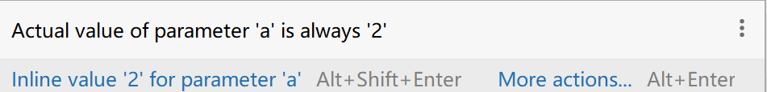 |
| **serial**                   | **忽略在serializable类中没有声明serialVersionUID变量**       |                                                              |
| `static-access`              | 抑制不正确的静态访问方式警告（`to suppress warnings relative to incorrect static access`） |                                                              |
| `sunapi`                     | `sunapi suppresses javac's warning about using Unsafe; 'all' suppresses eclipse's warning about the unspecified 'sunapi' key. Leave them both. Yes, javac's definition of the word 'all' is quite contrary to what the dictionary says it means. 'all' does NOT include 'sunapi' according to javac.` | 来自`Lombok`                                                 |
| `synthetic-access`           | 抑制子类没有按最优方法访问内部类的警告（`to suppress warnings relative to unoptimized access from inner classes`） |                                                              |
| **try**                      | **抑制没有catch时的警告**                                    |                                                              |
| **unchecked**                | **抑制没有进行类型检查操作的警告**                           |                                                              |
| `unqualified-field-access`   | 抑制没有权限访问的字段的警告（`to suppress warnings relative to field access unqualified`） |                                                              |
| `NullableProblems`           | 未知                                                         |                                                              |
| **unused**                   | **抑制没被使用过的代码（方法、字段、局部变量等）的警告，有几个子抑制，如：UnusedReturnValue、UnusedParameters** |                                                              |
| `UnusedReturnValue`          | 压制方法返回值从未被使用                                     | 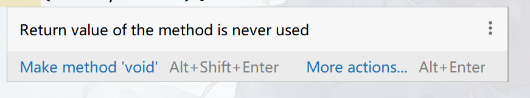 |
| `UnusedParameters`           | 压制未使用的方法参数                                         |                                                              |
| `WeakerAccess`               | 未知                                                         |                                                              |

### 注解处理器

根据注解的三种存储策略，因此处理不同策略的注解要使用对应的方式。

需要注意，注解处理器的处理能力有限，部分注解的处理难度相当大，如`@Target(ElementType.TYPE_USE)`，还有一些，如`@Target(ElementType.LOCAL_VARIABLE)`级别的注解，目前没有更多有效的获取方式！

另外注解处理方法也存在通用性，一般：

1. `SOURCE`级别的注解处理手段同样适用于`CLASS`级别和`RUNTIME`级别
2. 因为`RUNTIME`级别注解也会存在字节码中，所以使用`CLASS`级别的注解处理方法也能处理`RUNTIME`级别的注解

#### RUNTIME级别注解处理

在反射`API`中，有一套专门处理注解的`API`，这些`API`位于`java.lang.reflect`包中，包括所有以`AnnotatedXXX`的接口：

- `AnnotatedElement`：代表被注解标记的元素，如被一个或者多个注解标记的类、字段、方法等。（`JDK 1.5`），`AnnotatedElement`接口是整个`RUNTIME`级别注解处理中最核心的接口！
- `AnnotatedType`：代表被注解的元素的类型，在`Type`系统引入之后同时引入的接口，该接口继承自`AnnotatedElement`，不仅拥有获取、处理注解的能力，还返回一个`Type`对象，代表一个对象、方法参数、返回值、异常等所属的具体类型（`JDK 1.8`）
- `AnnotatedArrayType`：代表被注解的类型是一个数组类型，如`String[]`，该接口是`AnnotatedType`的子接口（`JDK 1.8`）
- `AnnotatedParameterizedType`：代表被注解的类型是一个参数化类型（泛型），如`List<String>`、`Set<List<String>>`等，该接口是`AnnotatedType`的子接口（`JDK 1.8`）
- `AnnotatedTypeVariable`：代表被注解的类型是一个泛型变量，如`T`、`U`、`S`，该接口是`AnnotatedType`的子接口（`JDK 1.8`）
- `AnnotatedWildcardType`：代表被注解的类型是一个继承性的泛型，如：`List<? extends MyClass>`、`List<T extends MyClass>`（`JDK 1.8`）

除了上面的`6`大接口外，还有一个类`AnnotatedTypeBaseImpl`，它代表所有除上面`6`大接口对应的类型外的其他类型，如`String`、`Integer`、`int`等都会返回`AnnotatedTypeBaseImpl`实现，该类在`sun.reflect.annotation`包下！

`AnnotatedElement`可以说是整个处理中最核心，最重要的接口，其主要用于获取标记在元素（如类、方法、字段等）上的注解：

```java
public interface AnnotatedElement {

    // JDK 1.5
    // 判断类、字段、构造器、方法上是否有某个注解
    default boolean isAnnotationPresent(Class<? extends Annotation> annotationClass);
    // JDK 1.5
    // 获取类、字段、构造器、方法上的某个特定注解，包括类上的可继承性的注解
    <T extends Annotation> T getAnnotation(Class<T> annotationClass);
    // JDK 1.5
    // 获取类、字段、构造器、方法上的所有注解，包括可重复的注解（可重复注解容器来获得可重复的注解）
    Annotation[] getAnnotations();
    // JDK 1.8
    // 获取类、字段、构造器、方法上的可重复注解！
    default <T extends Annotation> T[] getAnnotationsByType(Class<T> annotationClass);
    // JDK 1.8
    // 和getAnnotation()方法相同，但不能获取继承性的注解
    default <T extends Annotation> T getDeclaredAnnotation(Class<T> annotationClass);
    // JDK 1.8
    // 和getAnnotationsByType方法相同，但不能获取继承性的可重复注解
    default <T extends Annotation> T[] getDeclaredAnnotationsByType(Class<T> annotationClass);
    // JDK 1.5
    // 和getAnnotations()方法相同，但不能获取继承性的可重复注解
    Annotation[] getDeclaredAnnotations();
}
```

相关的`Demo`可以参考:

> src/main/java/cn/argento/askia/annotation/runtime/AnnotationAPIs.java

`AnnotatedElement`接口的所有子接口和类基本可以分成两大类：一类是以`AnnotatedType`及其子接口为主代表类型的接口，另一类则是形如`Class<T>`、`Constructor<T>`等对象的组成元素！采用这种设计能帮让你在获取注解的同时获取相关元素的类型，如获取标记在方法返回值上的注解的同时获取该方法返回值的类型！

`AnnotatedType`及其所有的子接口除了用于获取注解外，额外提供了用于获取具体类型的功能

```java
// AnnotatedType接口
// JDK 1.8
// 获取类型名称
public interface AnnotatedType extends AnnotatedElement {
    // 获取Type对象，代表一个类型
    public Type getType();
}

// AnnotatedArrayType接口
// 代表数组类型：T[]、String[]
public interface AnnotatedArrayType extends AnnotatedType {
    // 获取标记在数组上的原始类型,如String[]则获取的是String, T[]则获取的是T
    //（注意该类型可能是一个泛型变量，所以返回类型还是一个AnnotatedType）
    // 如T[]调用该方法将获取AnnotatedTypeVariable对象，代表泛型变量T
    AnnotatedType  getAnnotatedGenericComponentType();
}

// AnnotatedParameterizedType接口
// 代表参数化类型：List<String>、Map<String,Object>
public interface AnnotatedParameterizedType extends AnnotatedType {
    // 获取泛型的具体类型，如List<String>则返回String类型, Map<String, Object>则返回String类型、Object类型（AnnotatedTypeBaseImpl实现）
    AnnotatedType[] getAnnotatedActualTypeArguments();
}

// AnnotatedTypeVariable接口
// 代表类型参数，如T、T extends Number
public interface AnnotatedTypeVariable extends AnnotatedType {
    // 获取泛型的界，如T extends Number则返回Number、T则返回Object
    // 同样的理由，由于获取的可能还是一个参数化类型，如：T extends List<String>
    // T extends List<String>返回的List<String>仍然是一个参数化类型（AnnotatedParameterizedType）
    AnnotatedType[] getAnnotatedBounds();
}
// AnnotatedWildcardType接口
// 如? extends Number，? super Integer
public interface AnnotatedWildcardType extends AnnotatedType {

    // 获取下界，如? super Integer则返回Integer
    AnnotatedType[] getAnnotatedLowerBounds();

    // 获取上界，如? extends Number则返回Number
    AnnotatedType[] getAnnotatedUpperBounds();
}
```

而另外一类继承了`AnnotatedElement`接口的对象组成元素，这些对象组成元素可能有多个可被注解标注的地方，比如：在方法上，注解可以标记在方法返回值、方法参数，如果方法抛出异常，则还有可能会标记在异常上！因此通常对象组成元素提供了各种`getAnnotatedXXX()`方法来获取在这些特定位置上的`AnnotatedType`及其子接口实例！

继承了`AnnotatedElement`接口的对象组成元素主要有：`Class<T>`、`Constructor<T>` 、`Field`、`Method`、`Package`、`Parameter`，其中他们的获取方法如下：

- `Constructor`、`Method`的`getAnnotatedReturnType()`、`getAnnotatedReceiverType()`、`getAnnotatedParameterTypes()`、`getAnnotatedExceptionTypes()`
- `Field`、`Parameter`的`getAnnotatedType()`
- `Class`类上的`getAnnotatedSuperclass()`、`getAnnotatedInterfaces()`

```java
// 获取标记在方法、构造器上的可被注解的异常的类型
public AnnotatedType[] getAnnotatedExceptionTypes();
// 获取标记在方法、构造器上的可被注解的参数的类型
public AnnotatedType[] getAnnotatedParameterTypes();
// 获取标记在方法、构造器上的可被注解的接收器类型，所谓接收器类型指的是this
public AnnotatedType getAnnotatedReceiverType();
// 获取标记在方法上的可被注解的返回值的类型
public abstract AnnotatedType getAnnotatedReturnType();
// 获取标记在字段、参数上的可被注解的类型
public AnnotatedType getAnnotatedType();
// 获取类上的可被注解的父类、父接口类型
public AnnotatedType[] getAnnotatedInterfaces();
public AnnotatedType getAnnotatedSuperclass();
```

> Demo参考：src/main/java/cn/argento/askia/annotation/runtime/AnnotatedAPIs.java

`receiverType`指的是这种类型：

```java
public class MyClass<@MyAnnotation T> {
    // 下面的@MyAnnotation MyClass<T> this就是receiverType,参数名必须是this,
    // 实际上就是this对象
    // 当我们需要对this进行一些标记的时候，就可以使用这种方式定义,
    // 一般这种情况不常见！
    public void myMethod(@MyAnnotation MyClass<T> this) {}
}
```

> 特别注意，`method.getAnnotatedReceiverType().getAnnotations()`和`method.getAnnotations()`的区别：
>
> ```java
> public class MyClass{
>  public void myMethod(@MyAnnotation MyClass this) {
>     }
>        
>     public static void main(String[] args){
>              MyClass obj = new MyClass<>();
>         Class<?> clazz = obj.getClass();
>         Method md = clazz.getMethod("myMethod");
>    
>         // 该方法获取的是标记在方法上的注解
>         Annotation[] myMethods = md.getAnnotations();
>      // 结果：[]
>         // 该方法获取的是标记在方法参数this上的注解！
>         AnnotatedType annotatedType = md.getAnnotatedReceiverType();
>         Annotation[] annotations = annotatedType.getAnnotations();
>         // 结果 [MyAnnotation]
>    
>         
>          }
>    }
> ```
> 
>- `method.getAnnotatedReceiverType().getAnnotations()` 是获取方法receiverType上的注解
> - `method.getAnnotations()`是获取标记在方法上的注解！
> - 同理应用于其他`getAnnotatedXXXX()`方法
> - 参考：src/main/java/cn/argento/askia/annotation/runtime/MyClass.java

> 2024.2.19
>
> 对同一个`Class`对象，调用多次getAnnotation()（对getDeclaredAnnotation()同理）将获取相同引用对象：
>
> ```
> @Utility(name = "AnnotationProcessingHelper", version = "1.0")
> public class A {
> }
> @Utility(name = "AnnotationProcessingHelper", version = "1.0")
> public class B{
> }
> 
> public static void main(String[] args){
> 	    final Utility annotation = A.class.getAnnotation(Utility.class);
>         final Utility annotation1 = A.class.getAnnotation(Utility.class);
>         final Utility annotation2 = B.class.getAnnotation(Utility.class);
>         final Utility annotation3 = B.class.getAnnotation(Utility.class);
>         System.out.println(annotation == annotation1);	// true
>         System.out.println(annotation2 == annotation1);	// false
>         System.out.println(annotation3 == annotation2);	// true
>         System.out.println(annotation2.equals(annotation1)); // true
>         
> }
> ```
>
> 这是因为Class类中使用Map来记录所有获取过的注解，当注解第一次被获取并创建对象之后就会被存放在这个Map中（缓存起来），下一次在获取不会重新创建而是直接在这个Map中拿！因此它们实际上是同一个对象
>
> 注解中的equals()的比较原理是比较各个属性是否相同，因此只需要属性值相同即可而无需考虑是否来自相同的Class对象

`Runtime`级别的注解处理器`API`实际上和反射`API`是高度重合的，部分`API`甚至都能重合在一块：

```java
package cn.argento.askia.processors.runtime;

import cn.argento.askia.annotation.inherited.Son;

import java.lang.reflect.AnnotatedType;
import java.lang.reflect.Type;

/**
 * 此Demo主要说明：
 * `Runtime`级别的注解处理器`API`实际上和反射`API`是高度重合的，部分`API`甚至都能重合在一块：
 */
public class ExtendsAPITest {
    public static void main(String[] args) {
        // 以下代码和本次测试无关！！！！！

        // 获取继承的可被Annotated的类型！
        final AnnotatedType[] annotatedInterfaces = Son.class.getAnnotatedInterfaces();
        final AnnotatedType annotatedSuperclass = Son.class.getAnnotatedSuperclass();
        for (AnnotatedType a :
                annotatedInterfaces) {
            System.out.println(a.getType().getTypeName());
        }
        System.out.println(annotatedSuperclass.getType().getTypeName());
        System.out.println();

        // 获取泛型化的接口和超类
        final Type[] genericInterfaces = Son.class.getGenericInterfaces();
        final Type genericSuperclass = Son.class.getGenericSuperclass();
        for (Type a :
                genericInterfaces) {
            System.out.println(a.getTypeName());
        }
        System.out.println(genericSuperclass.getTypeName());
    }
}
```

#### SOURCE级别的注解处理

`source`级别的注解在编译的时候会被去除，所以唯一能对该类注解进行处理的就是在编译`java`代码之前，也就是在将`java`代码编译成字节码这个过程之前进行处理，基于这个特性决定了处理这些`SOURCE`级别的注解最好的工具就是`javac.exe`，也就是`java`编译器（这样可以方便在处理完注解之后立即进行源代码的编译）

`JDK 5`时期提供了一个可以处理注解的命令行工具：`Annotation Processing Tool`（[`APT`](https://docs.oracle.com/javase/6/docs/technotes/guides/apt/)），可惜工具没有集成到`javac.exe`，需要额外运行，并且`api`在`com.sun.mirror`包下而非标准包，因此`APT`在`JDK 7`以后就被废弃了，取而代之的是`JDK 6`加入的`PAP`（`Pluggable Annotation Processinig API`，插件式注解处理`API`），该`API`解决了`APT`工具遗留的问题。该`API`位于`javax.annotation.processing`包中，其中的核心是：

- `Processor`接口：注解处理器顶层接口

- `AbstractProcessor`抽象类：抽象注解处理器，对顶层接口中的部分方法提供了实现，需要自定义处理器时继承该抽象类即可！
- `@SupportedAnnotationTypes`：待处理的注解的全限定类名
- `@SupportedOptions`：用于指定`javac`编译代码的编译参数
- `@SupportedSourceVersion`：待处理的注解的源代码版本
- `ProcessingEnvironment`接口：代表处理注解环境
- `RoundEnvironment`接口：代表注解轮询处理环境接口
- `Messager`接口：代表处理过程中产生的警告信息！
- `Filer`接口：

定义一个注解处理器只需要继承`AbstractProcess`抽象类实现`process()`方法即可，并且使用`@SupportedAnnotationTypes`和`@SupportedAnnotationTypes`指定需要处理的注解：

```java
@SupportedAnnotationTypes("cn.argento.askia.processors.source.ToString")
@SupportedSourceVersion(SourceVersion.RELEASE_8)
public class ToStringAnnotationProcessor extends AbstractProcessor {
    @Override
    public boolean process(Set<? extends TypeElement> annotations, RoundEnvironment roundEnv) {
        return false;
    }
}
```

```java
import static java.lang.annotation.RetentionPolicy.*;
import static java.lang.annotation.ElementType.*;

@Target({TYPE})
@Retention(SOURCE)
public @interface ToString {
    String delimiter() default ", ";
    boolean ignoreFieldName() default false;
    boolean appendHashCode() default false;
}
```

可以使用`@SupportedOptions()`指定编译参数，如：

```java
@SupportedAnnotationTypes("cn.argento.askia.processors.source.ToString")
@SupportedSourceVersion(SourceVersion.RELEASE_8)
@SupportedOptions("-parameters")
public class ToStringAnnotationProcessor extends AbstractProcessor {
    @Override
    public boolean process(Set<? extends TypeElement> annotations, RoundEnvironment roundEnv) {
        return false;
    }
}
```

**源码级注解处理器理论上只能生成新的源代码文件，而无法修改现有的源代码，想要实现修改现有源代码，可以通过修改字节码实现（即使用Class级别的注解处理）**，但源码级注解处理器却可以干预`javac`对源代码的分析，从而干预字节码的最终生成。`javac`对源代码进行分析时，会生成一棵抽象语法树（`AST`），最终编译出来的字节码也是以这颗`AST`为原型进行编译的，类似于`DOM`的`XML`。可以通过直接修改`AST`的节点的形式来改变最终的字节码的生成，举例就是`Lombok`中的`@Data`注解为实体类添加`Getter`、`Setter`方法！特别注意这种修改`AST`的方式并没有修改源文件，只是对源文件做了增强，类似于`AOP`！

但想要修改`AST`并非易事，首先修改`AST`的相关`API`并没有标准化（在`tools.jar`中），这意味着需要自行承担使用`tools.jar`中代码产生的所有风险，其次这些`API`可能缺少文档和`Demo`，需要自行研究（这才是使用这些`API`最大的阻碍！）。

我们先介绍如何使用源码注解处理器来生成新的代码源文件，在注解处理器中，核心就是`process()`方法的参数，以及`AbstractProcessor`类中的`processingEnv`变量：

```java
Set<? extends TypeElement> annotations：
代表要处理的注解，其值是@SupportedAnnotationTypes()的value值

RoundEnvironment currentRoundEnv：
代表轮询环境。process()会被轮询调用，因为源代码上可能拥有多个注解，需要多个注解处理器进行处理，所以会多次调用process()运行每一个注解处理器。即一个源码级别的注解处理器会触发一次process()
在每一轮中，process()都会被调用一次，调用时会传递改轮中所有文件中发现的所有注解构成的Set集合，以及当前的处理轮询的信息的RoundEnvironment引用。   
```

关于`RoundEnvironment`，它主要有三个方法：

```java
Set<? extends Element> getRootElements();	// 返回当前注解处理器输入的文件
Set<? extends Element> getElementsAnnotatedWith(TypeElement a);	// 获取标记了a注解的所有类、字段、方法等元素
Set<? extends Element> getElementsAnnotatedWith(Class<? extends Annotation> a);
// 同上
boolean errorRaised();
// 判断是否出现错误！
boolean processingOver();
// 判断是否处理结束
```

前面有提到，虽然我们无法直接使用现有的标准化的`API`来修改`AST`树，但`JDK`还是提供了相应的`API`供我们访问`AST`树中的各种节点，它们叫语言模型`API`，位于`javax.lang.model`包中，注解处理器使用到了其下的`element`子包，在该子包下定义了各类`AST`树的节点接口：

- `TypeElement`：代表一个类型节点，可以代表一个注解类型、类、接口、枚举等等
- `TypeParameterElement`：代表泛型参数节点，如`T`，`V extends Number`
- `VariableElement`：代表字段，变量，方法参数等
- `PackageElement`：代表包
- `ExecutableElement`：代表可执行的元素，如方法、构造器

这里简单介绍下各个节点接口的`API`，更多的细节参考`LanguageModel`模块：

```java
// Element接口，这是所有节点接口的父接口
// 获取注解的类型（包含全限定类名和TypeMirror的一些判别方法）
TypeMirror asType();
// 获取注解的类型
ElementKind getKind();
// 获取修饰符，如public等
Set<Modifier> getModifiers();
// 获取简单名称，各子节点接口获取的值不一样，如类则是类名，方法则是获取方法名，字段则是字段名，构造器一般返回<init>
Name getSimpleName();
Element getEnclosingElement();
List<? extends Element> getEnclosedElements();
// 获取标记在
List<? extends AnnotationMirror> getAnnotationMirrors();
// 获取节点上的注解，注意，此处的getAnnotation()即使注解是SOURCE级别，也可以获取！
<A extends Annotation> A getAnnotation(Class<A> annotationType);
// 获取节点上的可重复注解，注意，此处的getAnnotation()即使注解是SOURCE级别，也可以获取！
<A extends Annotation> A[] getAnnotationsByType(Class<A> annotationType);

// ExecutableElement接口
AnnotationValue getDefaultValue();
List<? extends VariableElement> getParameters();
TypeMirror getReceiverType();
TypeMirror getReturnType();
List<? extends TypeMirror> getThrownTypes();
List<? extends TypeParameterElement> getTypeParameters();
boolean isDefault();
boolean isVarArgs();
Name getQualifiedName();

// PackageElement接口
boolean isUnnamed();

// TypeElement
List<? extends TypeMirror> getInterfaces();
NestingKind getNestingKind();
TypeMirror getSuperclass();
Name getQualifiedName();
List<? extends TypeParameterElement> getTypeParameters();

// TypeParameterElement
Element getGenericElement();
List<? extends TypeMirror> getBounds();

// VariableElement
Object getConstantValue();
```

`ProcessingEnvironment`参数主要用于处理语言模型`API`，关于语言模型，请参考`LanguageModel`模块。其中的方法：

```java
// 获取传递给注解处理器的参数
// 也就是注解@SupportedOptions的值！
Map<String,String> getOptions();
// 返回用于报告错误、警告和其他通知的Message对象。
Messager getMessager();
// 返回用于创建源文件、类和辅助文件（xml、properties等）的Filer对象
Filer getFiler();
// 返回对Elements对象用于对一个类的元素（类名、包、是否被废弃等，具体见语言模型API的Element接口）
Elements getElementUtils();
// 返回Types对象用于对一个元素的类型进行解析
Types getTypeUtils();
// 获取源代码版本
SourceVersion getSourceVersion();
// 获取locale
Locale getLocale();
```

如果希望创建一个源文件，则可以使用`getFiler()`方法，获取`Filer`对象之后调用`createSourceFile()`获取一个`JavaFileObject`对象，该对象代表一个`Java`源文件，在编译器`API`一节中经常用到。

// todo 补充SOURCE级别注解的运行流程，即从源代码，到指令，到最终的编译字节码的步骤图

> 那么如何编写一个注解处理器？可以按照下面的步骤：
>
> 1. 调用`RoundEnvironment`的`Set<? extends Element> getElementsAnnotatedWith(TypeElement a);`，传递`Set<? extends TypeElement> annotations：`参数来获取所有标记了该注解的`Element`对象
> 2. 对标记了注解的元素进行处理，处理过程需要了解语言模型`API`
>
> 参考：Java-Annotation/src/main/java/cn/argento/askia/processors/source/ToStringAnnotationProcessor.java

代码编写完之后就是编译的问题，那么如何编译注解处理器并使用注解处理器编译其他代码？

要想使用`Processor`处理源代码，你可以使用下面的方式：

1. 直接使用编译参数指定，格式：

   ```java
   javac.exe -processor [注解处理器全限定类名1, 注解处理器全限定类名2, ...] [源代码1.java, 源代码2.java, ...]
       
   // 如果希望能够看到轮询轮次，可以加上-XprintRounds参数：
   javac.exe -processor [注解处理器全限定类名1, 注解处理器全限定类名2, ...] [源代码1.java, 源代码2.java, ...] -XprintRounds
   // 他会打印出如下的轮询信息（这信息可能使用中文的形式来输出）：
   // Round 1:
   //   input files: {源代码1}
   //   annotations: [标记在源代码1上的SOURCE注解]
   //   last round : false
   // Round 2:
   //   input files: {生成的源代码}
   //   annotations: []
   //   last round : false 
   // Round 3:
   //   input files: {}
   //   annotations: []
   //   last round : true 
   ```

2. 通过服务注册（也就是所谓的`SPI`机制）指定，在项目根路径下创建：`META-INF/services/javax.annotation.processing.Processor`文件，添加上自己的注解处理器的全限定类名，多个注解处理器换行分割！

   ```java
   cn.argento.askia.processors.source.EnumInnerConstantProcessor
   cn.argento.askia.processors.source.ToStringAnnotationProcessor
   ```

3. 通过`Maven`的编译插件的配置指定如下：

   ```xml
   <plugin>
                  
   	<artifactId>maven-compiler-plugin</artifactId>
   	<version>3.5.1</version>
   	<configuration>
           <source>1.8</source>
           <target>1.8</target>
           <encoding>UTF-8</encoding>
           <annotationProcessors>
                     <annotationProcessor>
                   cn.argento.askia.processors.source.EnumInnerConstantProcessor
               </annotationProcessor>
           </annotationProcessors>
   	</configuration>
   </plugin>
   ```

使用这些方式的大前提是，**注解处理器已经编译完成**。因此您需要先对注解处理器进行编译再去编译带注解的源代码，或者是把注解处理器放到一个独立的`Jar`包引入，然后运行！

为了演示，我们先把所有源代码准备好，所有的源代码都位于`cn.argento.askia.processors.source`包下，**如果你需要更换包，则可能需要修改注解处理器中的代码，因为该注解处理器生成的`Java`文件都是基于`cn.argento.askia.processors.source`包的**


##### 基于命令行编译运行

我们演示第一种编译方式。首先，我们需要先将注解处理器进行编译（特别注意，您的注解处理器应该也会依赖待处理的注解，**如果有则要先把待处理的注解编译然后再编译注解处理器**，**基于命令参数的编译方式非常依赖类的编译顺序**！）：

```cmd
# 编译注解
# ToString.java所在位置：D:\MinecraftModProject\AnnotationProcessTest\src\main\java\cn\argento\askia\processors\source\ToString.java
# 这要求您当前CMD的位置是：D:\MinecraftModProject\AnnotationProcessTest\src\main\java\cn\argento\askia\processors\source\：
javac -encoding utf-8 ToString.java


# -----------------------------
# 编译注解处理器
javac -encoding utf-8 -classpath  D:\MinecraftModProject\AnnotationProcessTest\src\main\java  ToStringAnnotationProcessor.java
```

1. 指定`encoding`参数是因为`Java`源代码文件内有中文，不加上这个参数会出现：

   ```java
   错误: 编码GBK的不可映射字符
   ```

2. 由于注解处理器的编译依赖注解`@ToSting`，当我们编译完`@ToString`之后，需要告诉`java`编译器`@ToString.class`所在的位置，即指定编译参数`-classpath`，该位置也比较特殊，需要去掉`@ToString`所在包，如`@ToString.class`所在位置是：`D:\MinecraftModProject\AnnotationProcessTest\src\main\java\cn\argento\askia\processors\source\ToString.java`

   所在包：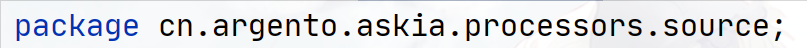

   则需要指定编译参数：`javac -classpath D:\MinecraftModProject\AnnotationProcessTest\src\main\java ToStringAnnotationProcessor.java `

然后，我们编译待处理用户类：

```cmd
javac -cp D:\OpenSourceProject\JavaProject\Java-Annotation\src\main\java -processor cn.argento.askia.processors.source.ToStringAnnotationProcessor User.java -XprintRounds


# 生成的ToStrings.java会放在javac运行的回显位置，如你的cmd是这样的：
C:\Users\asus>javac -cp D:\OpenSourceProject\JavaProject\Java-Annotation\src\main\java -processor cn.argento.askia.processors.source.ToStringAnnotationProcessor D:\OpenSourceProject\JavaProject\Java-Annotation\src\main\java\cn\argento\askia\processors\source\User.java -XprintRounds
# 则生成的ToStrings.java会放在C:\Users\asus里面！


# 当然你可以使用-s 参数指定生成的源文件的位置
# 另外说一下 -d 是指定生成的class文件的位置
# -h 指定生成的头文件的位置
javac -s D:\ -cp D:\OpenSourceProject\JavaProject\Java-Annotation\src\main\java -processor cn.argento.askia.processors.source.ToStringAnnotationProcessor D:\OpenSourceProject\JavaProject\Java-Annotation\src\main\java\cn\argento\askia\processors\source\User.java -XprintRounds
```

编译过程会显示下面的注解处理循环信息：

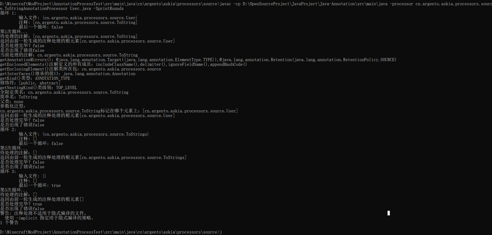

等待编译完成之后，则在源代码中会出现生成的代码文件和字节码文件：

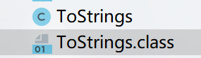

##### 基于服务注册编译运行

1. 我们先将注解处理器代码和对应的注解代码放在一个新的项目中：

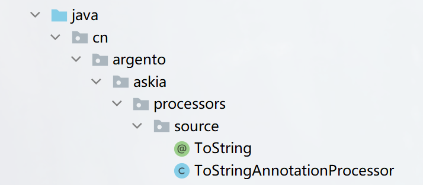

2. 在项目根目录中添加`SPI`文件，如果是普通的`Idea Java`项目，则在`src`添加，如果是`maven`项目，则在`resources`

3. SPI文件内填写注解处理器的全限定类名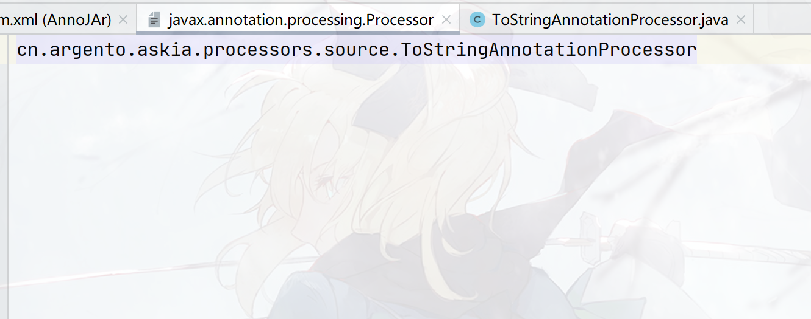

4. 使用`IDEA`或者`Maven`编译成`jar`包，请确保编译出来的`jar`包有如下文件：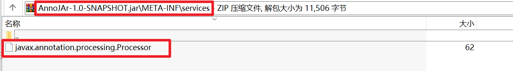
   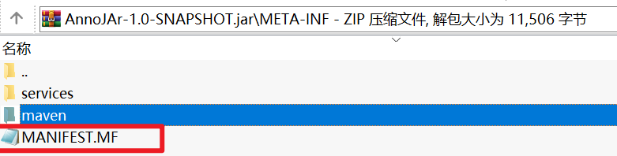

   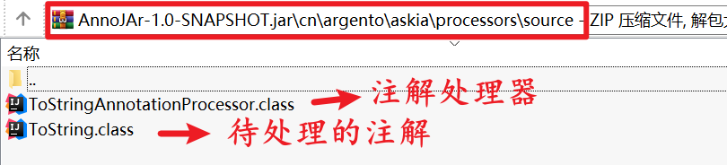

5. 接下来使用这个`Jar`包来编译`Java`文件（即使用`Javac`的`-cp`或者`-classpath`参数指定依赖的`Jar`）就可以触发注解处理器了，命令如下：

   ```cmd
   javac -classpath AnnoJAr-1.0-SNAPSHOT.jar User.java
   ```

   如果是`maven`项目，则可以采用添加本地`Jar`依赖的方式（只要能够将`Jar`放入`classpath`就`ok`）

   1. 新建另外一个项目，放入待编译的代码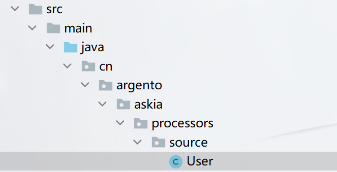

   2. 引入`Jar`依赖（本地依赖，把`Jar`包放在项目根本目录，然后写`Dependency`）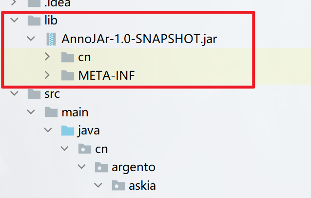

      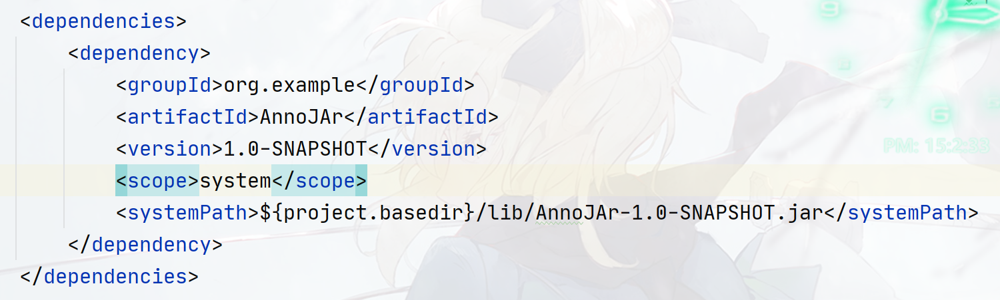

   3. 现在点击就可以看到注解处理编译了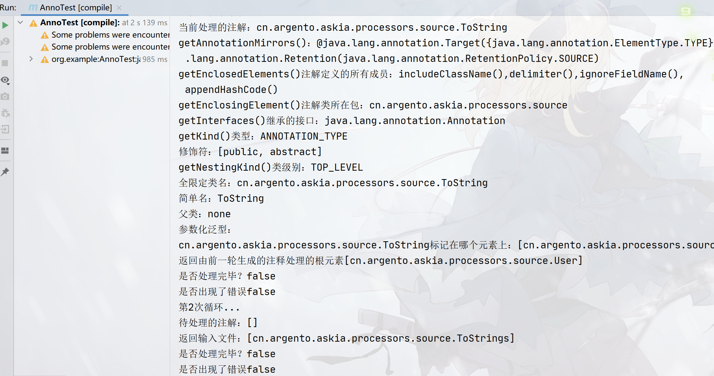
   4. 同时在`target`目录下会有我们生成的代码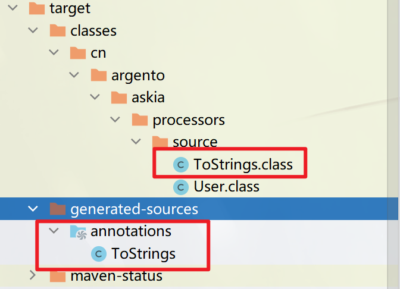

##### 基于Maven编译插件中注解处理器参数运行

这种方式和基于服务注册编译运行一致，区别在于如果编译出来的`Jar`没有带`SPI`文件，如：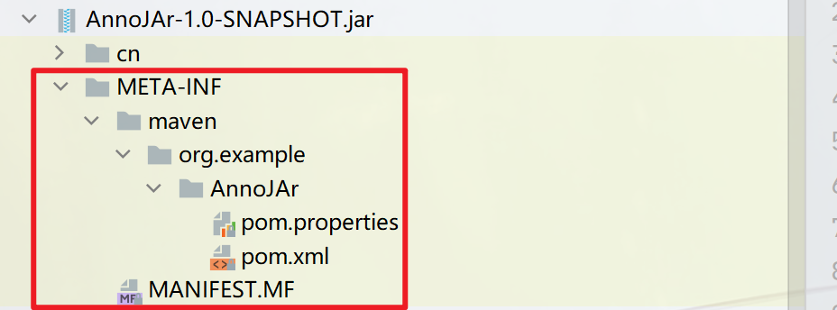

则您可以在`pom.xml`中指定编译插件的注解处理器参数来编译项目，参数如下：

```xml
<build>
    <plugins>
        <plugin>
            <artifactId>maven-compiler-plugin</artifactId>
            <version>3.6.1</version>
            <configuration>
                <source>1.8</source>
                <target>1.8</target>
                <encoding>UTF-8</encoding>
                <annotationProcessors>
                    <!-- 核心是这里，改成注解处理器的全限定类名 -->
                    <annotationProcessor>
                     cn.argento.askia.processors.source.ToStringAnnotationProcessor
                    </annotationProcessor>
                </annotationProcessors>
            </configuration>
        </plugin>
    </plugins>
</build>
```

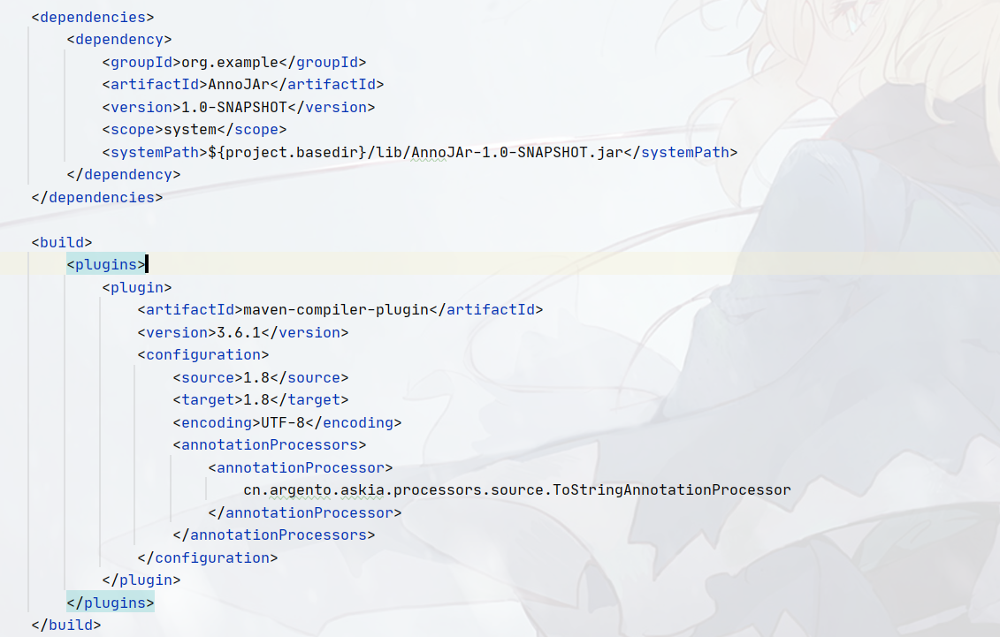

这样也可以运行注解处理器而无需在`META-INF/services`下编写`SPI`文件！

#### CLASS级别注解处理

在`SOURCE`级别处理中，我们演示过如何借助插件式注解处理`API`（`PAP API`）来实现通过现阶段的类来生成新的类。我们也说过，在`SOURCE`级别处理中，理论上只能生成新的源代码而无法干预现有的源代码，当然实际上也可以通过修改`AST`语法树的形式来干预编译过程，从而达到在编译源代码到字节码前实现修改源代码的需要，但这种方式存在两个难点，第一是相关的`AST`的`API`，官方并没有标准化地提供出来，因此需要开发者自己接触`JDK`的非标准化包，学习难度大大提高，第二是这些`AST`的`API`存在于`tools.jar`中，本质上不是提供给开发者使用的，因此一旦使用了之后，后期随着`JDK`的版本更新，`API`发生改变之后，之前写的代码可能就不使用了甚至会出错，更何况高版本的`JDK`基本已看不见`tools.jar`的身影。这也是为什么你在使用一些`API`时会出现这个警告的原因：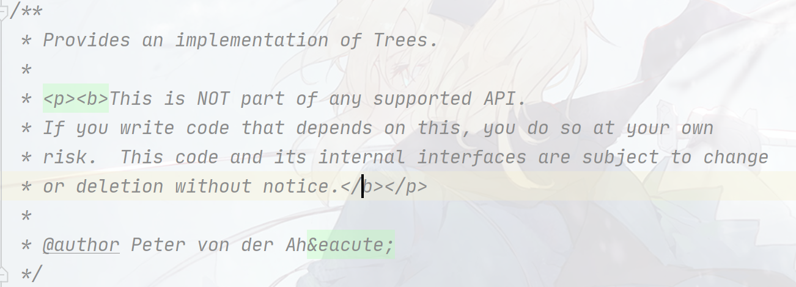

那到底有没有办法能够实现通过注解的形式来修改源代码呢？有的兄弟，有的。既然在编译前修改`AST`的方式很难实现，那我可以换个思路，即通过修改编译后的字节码，往字节码中插入代码，从而影响`JVM`最终加载和运行的类功能。

我们回想一个`Java`的运行流程：从`Java`代码通过编译器（`javac.exe`）编译成字节码，然后`jvm`通过加载字节码来运行`Java`程序。

而修改`AST`语法树干预编译器编译过程实现代码插入的方式很难实现，那么修改字节码的方式又如何呢？这就需要我们了解字节码工程。

此处我们不会具体介绍`Java`中的字节码结构，其一是我们的目的是介绍通过注解往现有代码中插入代码的方法，其二是相关的内容可以在介绍`JVM`的时候进行开展。在此章节，我们通过实现在我们的代码中插入`Logger`对象的方式来说明`Class`级别注解如何修改字节码来影响代码的最终执行结果（类似于`Lombok`的`@Slf4j`的功能，该`demo`参考自`core java`）。

通过编译后修改字节码来实现注解代码插入的实现步骤如下：

1. 编写一段带`Class`级别注解的源代码
2. 编译这段源代码成第一阶段的字节码（此时的字节码还未被插入任何代码）
3. 使用`ASM`框架对字节码进行修改，通过注解的内容，插入特定的代码（这一步相当于`CLASS`级别的注解处理器，后续使用`CLASS`级别注解处理器称呼）
4. `JVM`加载修改后的字节码并运行代码

基本上编译后修改字节码的方式步骤就是这样，但是这个过程存在一些小问题，即第三个步骤的启动方式问题。我们先准备前面的两个步骤的内容，然后再讨论第三点如何解决。

我们准备一个带修改字节码的类`Item`，该类有一个填充字段`Logger`，代表日志对象。这个字段不需要做初始化，直接留给`CLASS`级别注解处理器去进行初始化即可。

> 对使用过Lombok的同学可能想问，不能实现到类似于@Slf4j这样的效果嘛？

```java
package cn.argento.askia.processors.bytecode;

import java.util.logging.Logger;

@JuLogger
public class Item {
    private String address;
    // 仅作为填充字段
    private static Logger logger;

    public static void main(String[] args) {
        Item item = new Item();
        item.setAddress("123456");
        item.getAddress();
    }

    public String getAddress() {
        logger.entering(Item.class.getName(), "getAddress()");
        return address;
    }

    public void setAddress(String address) {
        logger.entering(Item.class.getName(), "setAddress(\"" + address+ "\")");
        this.address = address;
    }
}
```

该类顶部标记了一个`Class`级别的注解：`@JuLogger`，你实际上可以对这个注解进行修改，添加类似于日志级别，输出位置等属性。

```java
@Target(ElementType.TYPE)
@Retention(RetentionPolicy.CLASS)
public @interface JuLogger {
}
```

通过初次编译，我们能够得到这样的`Item.class`，当然此时运行这个`Item`会报错，因为`logger`对象未初始化。

```java
//
// Source code recreated from a .class file by IntelliJ IDEA
// (powered by FernFlower decompiler)
//

package cn.argento.askia.processors.bytecode;

import java.util.logging.Logger;

@JuLogger
public class Item {
    private String address;
    private static Logger logger;

    public Item() {
    }

    public static void main(String[] args) {
        Item item = new Item();
        item.setAddress("123456");
        item.getAddress();
    }

    public String getAddress() {
        logger.entering(Item.class.getName(), "getAddress()");
        return this.address;
    }

    public void setAddress(String address) {
        logger.entering(Item.class.getName(), "setAddress(\"" + address + "\")");
        this.address = address;
    }
}
```

我们预计通过`CLASS`级别注解处理器之后，`Item.class`会变成这样：

```java
//
// Source code recreated from a .class file by IntelliJ IDEA
// (powered by FernFlower decompiler)
//
// 1. 去除@JuLogger注解
// 2. 初始化logger对象（静态代码块）
package cn.argento.askia.processors.bytecode;

import java.util.logging.ConsoleHandler;
import java.util.logging.Level;
import java.util.logging.Logger;

public class Item {
    private String address;
    // 注意此处
    private static final Logger logger = Logger.getLogger("cn.argento.askia.processors.bytecode.Item");
    // 注意此处
    static {
        logger.setLevel(Level.ALL);
        ConsoleHandler consoleHandler = new ConsoleHandler();
        consoleHandler.setLevel(Level.ALL);
        logger.addHandler(consoleHandler);
    }

    public Item() {
    }

    public static void main(String[] args) {
        Item item = new Item();
        item.setAddress("123456");
        item.getAddress();
    }

    public String getAddress() {
        logger.entering(Item.class.getName(), "getAddress()");
        return this.address;
    }

    public void setAddress(String address) {
        logger.entering(Item.class.getName(), "setAddress(\"" + address + "\")");
        this.address = address;
    }
}
```

因此我们的CLASS级别注解处理器的写法是这样的：

```java
package cn.argento.askia.processors.bytecode;

import org.objectweb.asm.*;
import org.objectweb.asm.util.CheckClassAdapter;

import java.io.File;
import java.io.FileOutputStream;
import java.io.IOException;
import java.nio.file.Files;
import java.nio.file.Path;
import java.nio.file.Paths;

public class JuLoggerAnnotationProcessor extends ClassVisitor {

    private String className;

    public static byte[] process(String className, byte[] bytecode){
        final ClassReader classReader = new ClassReader(bytecode);
        final ClassWriter classWriter = new ClassWriter(ClassWriter.COMPUTE_MAXS | ClassWriter.COMPUTE_FRAMES);
        CheckClassAdapter checkClassAdapter = new CheckClassAdapter(classWriter);
        final JuLoggerAnnotationProcessor juLoggerAnnotationProcessor = new JuLoggerAnnotationProcessor(checkClassAdapter, className);
        classReader.accept(juLoggerAnnotationProcessor, ClassReader.EXPAND_FRAMES);
        return classWriter.toByteArray();
    }

    public JuLoggerAnnotationProcessor(CheckClassAdapter writer, String className){
        super(Opcodes.ASM8, writer);
        this.className = className;
    }


    private boolean modifiedLoggerField = false;
    private boolean modifiedStaticLogger = false;
    @Override
    public AnnotationVisitor visitAnnotation(String descriptor, boolean visible) {
        // 如果类上标记了@JuLogger
        if (descriptor.equals("Lcn/argento/askia/processors/bytecode/JuLogger;") && !visible){
            // 代表需要修改
            modifiedLoggerField = true;
        }
        return null;
    }

    @Override
    public FieldVisitor visitField(int access, String name, String descriptor, String signature, Object value) {
        // 修改logger字段为static final
        if (modifiedLoggerField && "logger".equals(name)){
            access = access | Opcodes.ACC_FINAL | Opcodes.ACC_STATIC;
            modifiedStaticLogger = true;
            modifiedLoggerField = false;
            return cv.visitField(access, name, descriptor, signature, value);
        }
        return super.visitField(access, name, descriptor, signature, value);
    }


    @Override
    public MethodVisitor visitMethod(int access, String name, String descriptor, String signature, String[] exceptions) {
        System.out.println(name);
        if (modifiedStaticLogger){
            modifiedStaticLogger = false;
            // 获取或添加静态代码块方法
            final MethodVisitor methodVisitor = cv.visitMethod(Opcodes.ACC_STATIC, "<clinit>", "()V", null, null);
            // 插入代码
            methodVisitor.visitCode();
            // 插入 logger = Logger.getLogger("cn.argento.askia.processors.bytecode.Item");
            Label label0 = new Label();
            methodVisitor.visitLabel(label0);
            methodVisitor.visitLdcInsn(className);
            methodVisitor.visitMethodInsn(Opcodes.INVOKESTATIC, "java/util/logging/Logger", "getLogger", "(Ljava/lang/String;)Ljava/util/logging/Logger;", false);
            methodVisitor.visitFieldInsn(Opcodes.PUTSTATIC, "cn/argento/askia/processors/bytecode/Item", "logger", "Ljava/util/logging/Logger;");
            
            //  插入logger.setLevel(Level.ALL);
            Label label1 = new Label();
            methodVisitor.visitLabel(label1);
            methodVisitor.visitFieldInsn(Opcodes.GETSTATIC, "cn/argento/askia/processors/bytecode/Item", "logger", "Ljava/util/logging/Logger;");
            methodVisitor.visitFieldInsn(Opcodes.GETSTATIC, "java/util/logging/Level", "ALL", "Ljava/util/logging/Level;");
            methodVisitor.visitMethodInsn(Opcodes.INVOKEVIRTUAL, "java/util/logging/Logger", "setLevel", "(Ljava/util/logging/Level;)V", false);
            
            //  插入ConsoleHandler consoleHandler = new ConsoleHandler();
            Label label2 = new Label();
            methodVisitor.visitLabel(label2);
            methodVisitor.visitTypeInsn(Opcodes.NEW, "java/util/logging/ConsoleHandler");
            methodVisitor.visitInsn(Opcodes.DUP);
            methodVisitor.visitMethodInsn(Opcodes.INVOKESPECIAL, "java/util/logging/ConsoleHandler", "<init>", "()V", false);
            methodVisitor.visitVarInsn(Opcodes.ASTORE, 0);
            
            //  插入consoleHandler.setLevel(Level.ALL);
            Label label3 = new Label();
            methodVisitor.visitLabel(label3);
            methodVisitor.visitVarInsn(Opcodes.ALOAD, 0);
            methodVisitor.visitFieldInsn(Opcodes.GETSTATIC, "java/util/logging/Level", "ALL", "Ljava/util/logging/Level;");
            methodVisitor.visitMethodInsn(Opcodes.INVOKEVIRTUAL, "java/util/logging/ConsoleHandler", "setLevel", "(Ljava/util/logging/Level;)V", false);
            
            // 插入logger.addHandler(consoleHandler);
            Label label4 = new Label();
            methodVisitor.visitLabel(label4);
            methodVisitor.visitFieldInsn(Opcodes.GETSTATIC, "cn/argento/askia/processors/bytecode/Item", "logger", "Ljava/util/logging/Logger;");
            methodVisitor.visitVarInsn(Opcodes.ALOAD, 0);
            methodVisitor.visitMethodInsn(Opcodes.INVOKEVIRTUAL, "java/util/logging/Logger", "addHandler", "(Ljava/util/logging/Handler;)V", false);
            Label label5 = new Label();
            methodVisitor.visitLabel(label5);
            methodVisitor.visitInsn(Opcodes.RETURN);
            methodVisitor.visitLocalVariable("consoleHandler", "Ljava/util/logging/ConsoleHandler;", null, label3, label5, 0);
            methodVisitor.visitMaxs(2, 1);
            methodVisitor.visitEnd();
        }
        return super.visitMethod(access, name, descriptor, signature, exceptions);
    }
}
```

那么要如何引导出`CLASS`注解处理器来处理`Item`类的字节码呢？

插件式注解处理`API`（`PAP API`）是集成在`javac.exe`中的，也就是说在运行`javac.exe`编译类的时候，我们可以通过指定`-processor`来启动`SOURCE`级别的注解处理器处理注解，`RUNTIME`级别的注解处理依赖反射`API`，因此我们直接通过代码（或者编写所谓的`RUNTIME`级别的注解处理器类）即可启动对注解的处理，但是`CLASS`级别的注解处理器怎么启动呢？

> 总不能编写一个带`main`方法的`CLASS`注解处理器，然后指定玩第一步得到字节码之后，再启动这个带`main`方法的`CLASS`注解处理器处理这段字节码，最后再执行第四步让`JVM`加载这个修改过后的字节码吧！
>
> 你说对吧！

`CLASS`级别的注解处理器高度依赖字节码框架，`CLASS`级别注解处理器的启动时间必须要在`javac`编译完成代码之后到`JVM`加载修改过的字节码之前这段时间内，这里面的衔接选择就有两种：要么`javac`编译器提供一种编译后服务，即当`javac`完全编译完代码到字节码之后能够启动特定的类的服务，但是`javac`不具备这样的编译后服务。

因此我们只能寄托于`java.exe`在运行类之前能够启动`CLASS`级别注解处理器，基于这个想法，我们很容易想到类加载器，因为`JVM`加载类的时候需要使用到类加载器，我们可以通过自定义的类加载器来启动`CLASS`级别注解处理器处理注解，修改字节码，然后返回修改过的字节码给`JVM`进行解析即可。

我们先编写一个专门加载`Item`类的类加载器：

```java
package cn.argento.askia.processors.bytecode;

import java.io.File;
import java.io.FileNotFoundException;
import java.io.FileOutputStream;
import java.io.IOException;
import java.nio.file.Files;
import java.nio.file.Paths;
import java.util.Objects;

public class JuLoggerAnnotationClassLoader extends ClassLoader{

    private byte[] itemBytes;

    // 必须要定义这个构造器
    // 该构造器负责读入未处理之前的Item类的字节码，保存起来，以调用CLASS注解处理器的process()静态方法传递给注解处理器进行字节码插桩处理
    public JuLoggerAnnotationClassLoader(ClassLoader classLoader){
        super(classLoader);
        final String classPath = findClassPath();
        try {
            itemBytes = Files.readAllBytes(Paths.get(classPath, "cn/argento/askia/processors/bytecode/Item.class"));
        } catch (IOException e) {
            e.printStackTrace();
        }
    }
    // 寻找maven中编译之后的classpath
    private static String findClassPath(){
        final String property = System.getProperty("java.class.path", "");
        final String[] split = property.split(";");
        for (int i = 0; i < split.length; i++){
            if (split[i].contains("target\\classes")){
                return split[i];
            }
        }
        return null;
    }

    @Override
    public Class<?> loadClass(String name) throws ClassNotFoundException {
        System.out.println("class name:" + name);
        // 如果是cn.argento.askia.processors.bytecode.Item, 则单独处理，否则委托双亲委托模型处理
        if (name.equalsIgnoreCase("cn.argento.askia.processors.bytecode.Item")){
            System.out.println("进入处理,处理Item类的字节码...");
            // 得到处理后的字节码文件,我们将其结果保存一份为Item_after_annotation_processor.class
            final byte[] newItemBytes = JuLoggerAnnotationProcessor.process(name, itemBytes);
            System.out.println("处理完毕！");
            System.out.println("写出一份处理结果，参考Item_after_annotation_processor.class...");
            try {
                FileOutputStream fos = new FileOutputStream(Paths.get(Objects.requireNonNull(findClassPath()),
                        "cn/argento/askia/processors/bytecode/Item_after_annotation_processor.class").toFile());
                fos.write(newItemBytes);
                fos.close();
                System.out.println("写出成功！");
            } catch (IOException e) {
                e.printStackTrace();
                System.out.println("写出失败！");
            }
            System.out.println("开始定义类...");
            // 加载item_test.class
            return defineClass(name, newItemBytes, 0, newItemBytes.length);
        }
        return super.loadClass(name);
    }
}
```

想要能够运行此处的代码，我们需要先编译所有的类：

```shell
# 假设我们当前在D盘的跟目录
D:\> javac Item.java JuLogger.java JuLoggerAnnotationClassLoader.java JuLoggerAnnotationProcessor.java
```

运行的时候，我们需要指定类加载器来加载类，这个类加载器必须在`Classpath`中，因此我们需要将`D:\`加入到`Classpath`中，其次，由于双亲委托模型的存在，系统的类大部分由`BootstrapClassLoader`和`ExtClassLoader`来加载（这些类加载器被定义在类`sun.misc.Launcer`类中），而我们自定义的类（位于`Classpath`中的类）一般由`AppClassLoader`来加载，这个加载器也被称为`SystemClassLoader`。

我们需要将我们自己写的类加载器替换掉这个`AppClassLoader`，指定`java.system.class.loader`参数即可，因此我们的启动指令是：

```shell
E:\RTE\JDK\OracleJDK\jdk-8u311\bin\java.exe
-Djava.system.class.loader=cn.argento.askia.processors.bytecode.JuLoggerAnnotationClassLoader
-Dfile.encoding=UTF-8 
-classpath 
D:\;
E:\SDK\MavenRepo\org\ow2\asm\asm\9.2\asm-9.2.jar;
E:\SDK\MavenRepo\org\ow2\asm\asm-commons\9.2\asm-commons-9.2.jar;
E:\SDK\MavenRepo\org\ow2\asm\asm-tree\9.2\asm-tree-9.2.jar;
E:\SDK\MavenRepo\org\ow2\asm\asm-analysis\9.2\asm-analysis-9.2.jar;
E:\SDK\MavenRepo\org\ow2\asm\asm-util\9.2\asm-util-9.2.jar cn.argento.askia.processors.bytecode.Item
```

运行之后你将会得到两个字节码，一个是经过注解处理器处理之前的，另外一个是经过注解处理器处理之后的，并且`JVM`只会加载经过注解处理器处理之后的。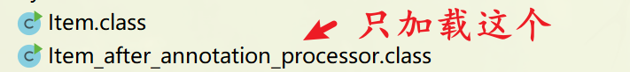

// 补充javaagent的方法

### 注解源码结构

所有的注解实际上都隐式地继承于`java.lang.annotation.Annotation`**接口**，该接口是个**常规接口**，定义如下：

```java
public interface Annotation {
    boolean equals(Object obj);
    int hashCode();
    String toString();
    // 获取注解的类型
    Class<? extends Annotation> annotationType();
}
```

注解类型直接通过`getClass()`获得的`Class`对象不是注解类型本身，而是代理对象（注解的结构和动态代理有关），也就是注解接口的具体实现对象，想要获取真正的注解类型，必须使用`Annotation`接口提供给的`annotationType()`

```java
Test test = this.getClass().getAnnotation(Test.class);
System.out.println(test.annotationType());
System.out.println(test.getClass());
/*
输出：
interface Test
class com.sun.proxy.$Proxy1
*/
```

`Annotation`接口的`String toString();`将会输入一个包含注解接口及其元素名称和默认值的字符串表示，如：

```java
System.out.println(test.toString());
// @Test(timeout=100)
```

同样回到`BugReport`注解：

```java
@Target({ElementType.FIELD, ElementType.METHOD, ElementType.TYPE, ElementType.ANNOTATION_TYPE})
@Retention(RetentionPolicy.RUNTIME)
@Documented
public @interface BugReport {
    long value() default 2000;
    String versions() default "1.1.0";
    int version() default 1;
    double subVersion() default 1.0;
    boolean showStopper() default false;
    String assignedTo() default "[none]";
    Class<?> testCase() default Void.class;
    Status status() default Status.CONFIRMED;
    Reference ref() default @Reference;
    String[] reportedBy() default "";
    Class<?>[] clazz() default {};

    enum Status {UNCONFIRMED, CONFIRMED, FIXED, NOTABUG}

    @interface Reference{
        String ref() default "";
        String url() default "";
    }
    interface B{

    }

    class A{
        public void test(){

        }
    }
}
```

对注解进行反编译（使用`javap.exe`），获取到底层处理注解的方式：

```java
// 0.所有的@interface实际上都会被编译成interface XXX extends Annotation
// 1.继承自Annotation接口
public interface cn.argento.askia.annotation.full.BugReport 
    extends java.lang.annotation.Annotation {
  // 2.所有的数据成员都会被处理成方法
  public abstract long value();

  public abstract java.lang.String versions();

  public abstract int version();

  public abstract double subVersion();

  public abstract boolean showStopper();

  public abstract java.lang.String assignedTo();

  public abstract java.lang.Class<?> testCase();

  public abstract cn.argento.askia.annotation.full.BugReport$Status status();

  public abstract cn.argento.askia.annotation.full.BugReport$Reference ref();

  public abstract java.lang.String[] reportedBy();

  public abstract java.lang.Class<?>[] clazz();
}
```

到此位置，我们知道定义注解的`@interface`和相关数据成员会被进行怎样的处理，但还有一个关键问题，注解中的数据成员的默认值是如何绑定到方法的呢？

既然注解技术依赖于动态代理，我们可以尝试将代理对象的源代码拿出来进行分析，在代码中，添加这个系统属性可以将代理类导出！

```java
System.getProperties().setProperty("sun.misc.ProxyGenerator.saveGeneratedFiles", "true");
```

拿到这个代理类的源代码如下：

```java
//
// Source code recreated from a .class file by IntelliJ IDEA
// (powered by FernFlower decompiler)
//
package com.sun.proxy;
import cn.argento.askia.annotation.full.BugReport;
import cn.argento.askia.annotation.full.BugReport.Reference;
import cn.argento.askia.annotation.full.BugReport.Status;
import java.lang.reflect.InvocationHandler;
import java.lang.reflect.Method;
import java.lang.reflect.Proxy;
import java.lang.reflect.UndeclaredThrowableException;

public final class $Proxy2 extends Proxy implements BugReport {
    private static Method m1;
    private static Method m6;
    private static Method m12;
    private static Method m2;
    private static Method m8;
    private static Method m14;
    private static Method m5;
    private static Method m11;
    private static Method m0;
    private static Method m10;
    private static Method m7;
    private static Method m9;
    private static Method m13;
    private static Method m3;
    private static Method m4;

    // 关键就在这个InvocationHandler对象中，因为所有的方法都是委托InvocationHandler对象来完成的
    public $Proxy2(InvocationHandler对象中 var1) throws  {
        super(var1);
    }

    public final boolean equals(Object var1) throws  {
        try {
            return (Boolean)super.h.invoke(this, m1, new Object[]{var1});
        } catch (RuntimeException | Error var3) {
            throw var3;
        } catch (Throwable var4) {
            throw new UndeclaredThrowableException(var4);
        }
    }

    public final Reference ref() throws  {
        try {
            return (Reference)super.h.invoke(this, m6, (Object[])null);
        } catch (RuntimeException | Error var2) {
            throw var2;
        } catch (Throwable var3) {
            throw new UndeclaredThrowableException(var3);
        }
    }

    public final Class testCase() throws  {
        try {
            return (Class)super.h.invoke(this, m12, (Object[])null);
        } catch (RuntimeException | Error var2) {
            throw var2;
        } catch (Throwable var3) {
            throw new UndeclaredThrowableException(var3);
        }
    }

    public final String toString() throws  {
        try {
            return (String)super.h.invoke(this, m2, (Object[])null);
        } catch (RuntimeException | Error var2) {
            throw var2;
        } catch (Throwable var3) {
            throw new UndeclaredThrowableException(var3);
        }
    }

    public final boolean showStopper() throws  {
        try {
            return (Boolean)super.h.invoke(this, m8, (Object[])null);
        } catch (RuntimeException | Error var2) {
            throw var2;
        } catch (Throwable var3) {
            throw new UndeclaredThrowableException(var3);
        }
    }

    public final Class annotationType() throws  {
        try {
            return (Class)super.h.invoke(this, m14, (Object[])null);
        } catch (RuntimeException | Error var2) {
            throw var2;
        } catch (Throwable var3) {
            throw new UndeclaredThrowableException(var3);
        }
    }

    public final Status status() throws  {
        try {
            return (Status)super.h.invoke(this, m5, (Object[])null);
        } catch (RuntimeException | Error var2) {
            throw var2;
        } catch (Throwable var3) {
            throw new UndeclaredThrowableException(var3);
        }
    }

    public final String assignedTo() throws  {
        try {
            return (String)super.h.invoke(this, m11, (Object[])null);
        } catch (RuntimeException | Error var2) {
            throw var2;
        } catch (Throwable var3) {
            throw new UndeclaredThrowableException(var3);
        }
    }

    public final int hashCode() throws  {
        try {
            return (Integer)super.h.invoke(this, m0, (Object[])null);
        } catch (RuntimeException | Error var2) {
            throw var2;
        } catch (Throwable var3) {
            throw new UndeclaredThrowableException(var3);
        }
    }

    public final String versions() throws  {
        try {
            return (String)super.h.invoke(this, m10, (Object[])null);
        } catch (RuntimeException | Error var2) {
            throw var2;
        } catch (Throwable var3) {
            throw new UndeclaredThrowableException(var3);
        }
    }

    public final int version() throws  {
        try {
            return (Integer)super.h.invoke(this, m7, (Object[])null);
        } catch (RuntimeException | Error var2) {
            throw var2;
        } catch (Throwable var3) {
            throw new UndeclaredThrowableException(var3);
        }
    }

    public final double subVersion() throws  {
        try {
            return (Double)super.h.invoke(this, m9, (Object[])null);
        } catch (RuntimeException | Error var2) {
            throw var2;
        } catch (Throwable var3) {
            throw new UndeclaredThrowableException(var3);
        }
    }

    public final String[] reportedBy() throws  {
        try {
            return (String[])super.h.invoke(this, m13, (Object[])null);
        } catch (RuntimeException | Error var2) {
            throw var2;
        } catch (Throwable var3) {
            throw new UndeclaredThrowableException(var3);
        }
    }

    public final Class[] clazz() throws  {
        try {
            return (Class[])super.h.invoke(this, m3, (Object[])null);
        } catch (RuntimeException | Error var2) {
            throw var2;
        } catch (Throwable var3) {
            throw new UndeclaredThrowableException(var3);
        }
    }

    public final long value() throws  {
        try {
            return (Long)super.h.invoke(this, m4, (Object[])null);
        } catch (RuntimeException | Error var2) {
            throw var2;
        } catch (Throwable var3) {
            throw new UndeclaredThrowableException(var3);
        }
    }

    static {
        try {
            m1 = Class.forName("java.lang.Object").getMethod("equals", Class.forName("java.lang.Object"));
            m6 = Class.forName("cn.argento.askia.annotation.full.BugReport").getMethod("ref");
            m12 = Class.forName("cn.argento.askia.annotation.full.BugReport").getMethod("testCase");
            m2 = Class.forName("java.lang.Object").getMethod("toString");
            m8 = Class.forName("cn.argento.askia.annotation.full.BugReport").getMethod("showStopper");
            m14 = Class.forName("cn.argento.askia.annotation.full.BugReport").getMethod("annotationType");
            m5 = Class.forName("cn.argento.askia.annotation.full.BugReport").getMethod("status");
            m11 = Class.forName("cn.argento.askia.annotation.full.BugReport").getMethod("assignedTo");
            m0 = Class.forName("java.lang.Object").getMethod("hashCode");
            m10 = Class.forName("cn.argento.askia.annotation.full.BugReport").getMethod("versions");
            m7 = Class.forName("cn.argento.askia.annotation.full.BugReport").getMethod("version");
            m9 = Class.forName("cn.argento.askia.annotation.full.BugReport").getMethod("subVersion");
            m13 = Class.forName("cn.argento.askia.annotation.full.BugReport").getMethod("reportedBy");
            m3 = Class.forName("cn.argento.askia.annotation.full.BugReport").getMethod("clazz");
            m4 = Class.forName("cn.argento.askia.annotation.full.BugReport").getMethod("value");
        } catch (NoSuchMethodException var2) {
            throw new NoSuchMethodError(var2.getMessage());
        } catch (ClassNotFoundException var3) {
            throw new NoClassDefFoundError(var3.getMessage());
        }
    }
}
```

代理对象不出意外地实现了注解`BugReport`接口，动态代理的关键就在`InvocationHandler`对象中，代理对象的所有方法都是委托`InvocationHandler`对象来完成的！那传递给这个代理对象的`InvocationHandler`对象又是什么呢？

幸好，动态代理的`API`提供了获取`InvocationHandler`对象的方法：

```java
public static InvocationHandler getInvocationHandler(Object proxy)
    throws IllegalArgumentException
```

使用下面的代码获取具体的`InvocationHandler`对象：

```java
final BugReport annotation = Myclass2.class.getAnnotation(BugReport.class);
final InvocationHandler invocationHandler = Proxy.getInvocationHandler(annotation);
System.out.println(invocationHandler.getClass());
```

得到结果：

```java
class sun.reflect.annotation.AnnotationInvocationHandler
```

`AnnotationInvocationHandler`类中的主要核心如下：

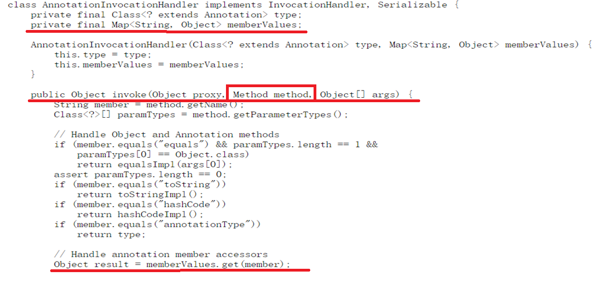

其中`memberValues`用于存放数据成员的值，`invoke()`方法对注解中的方法的调用进行拦截，然后返回值！

据此可以得到初步结论：

- 注解采用接口中的方法来表示变量
- `Java`为注解创建一个代理类。这个代理类包括一个`AnnotationInvocationHandler`成员变量
- `AnnotationInvocationHandler`有一个`Map`成员变量，用于存储所有的注解的属性赋值！
- 在程序中，调用注解接口的方法，将会被代理类接管，然后根据方法名字，到`Map`里面拿相应的`Value`并返回。
- 传递给`AnnotationInvocationHandler`的用于初始化`Map`成员变量的各种注解方法的默认值被`AnnotationParser`类的`parseXXX()`解析获得

> 2024.1.22
>
> 虽然没有什么意义，但你仍然可以采用匿名类的形式直接new注解并且直接调用他的方法，这时注解属性的default将不起作用，相当于new接口！
>
> ```java
> @Target(ElementType.TYPE)
> @Retention(RetentionPolicy.RUNTIME)
> @Inherited
> public @interface Report{
>     String value() default "";
> }
> 
> Report report = new Report(){
>     @Override
>     public String value() {
>         return null;
>     }
>     @Override
>     public Class<? extends Annotation> annotationType() {
>         return null;
>     }
> };
> report.value();	// null;
> ```
>

#### 可重复标记注解的实现

如下面的类，他标记了可重复注解`@RepeatableAnnotation`

```java
@BugReport(2)
@InheritedAnnotation
class Bug{
    @BugReport(2)
    @RepeatableAnnotation(description = "setBug method1")
    @RepeatableAnnotation(description = "setBug method2")
    public Bug setBug(String bug) {
        this.bug = bug;
        return this;
    }
}
```

经过编译之后，它实际上会变成这样（`InheritedAnnotationContainer`是`InheritedAnnotation`的注解容器）：

```
@BugReport(2)
@InheritedAnnotation
class Bug{
    @BugReport(2)
    @InheritedAnnotationContainer({
    	@RepeatableAnnotation(description = "setBug method1"),
    	@RepeatableAnnotation(description = "setBug method2")
    })
    public Bug setBug(String bug) {
        this.bug = bug;
        return this;
    }
}
```

没错，当可重复注解标记了一个的时候，则会只显示一个可重复注解，但是如果标记了多个的话则会使用注解容器！

使用反射获取注解时，特别注意`getAnnotationsByType()`方法是`JDK 1.8`才引入的，在`1.8`以前，只能通过获取可重复注解的注解容器的形式来获取。

```java
@Target({ElementType.FIELD, ElementType.CONSTRUCTOR, ElementType.METHOD, ElementType.TYPE})
@Retention(RetentionPolicy.RUNTIME)
@Documented
@Repeatable(RepeatableAnnotation.RepeatableAnnotations.class)
public @interface RepeatableAnnotation {

    String description() default "";

    @Documented
    @Target({ElementType.FIELD, ElementType.CONSTRUCTOR, ElementType.METHOD})
    @Retention(RetentionPolicy.RUNTIME)
    @interface RepeatableAnnotations{
        RepeatableAnnotation[] value() default {};
    }
}
```

```java
// 下面两个方式获取的结果相同
// 获取方式1（JDK 1.5版本）
final RepeatableAnnotation.RepeatableAnnotations annotation1 = setBug.getAnnotation(RepeatableAnnotation.RepeatableAnnotations.class);
final RepeatableAnnotation[] value = annotation1.value();
System.out.println(Arrays.toString(value));

// 获取方式2（JDK 1.8版本）
final RepeatableAnnotation[] annotationsByType = setBug.getAnnotationsByType(RepeatableAnnotation.class);
System.out.println(Arrays.toString(annotationsByType));
```

在标记可重复注解的时候，实际上最终被编译成字节码的时候标记在元素上的不是可重复注解而是注解容器，所以使用`isAnnotationPresent()`判断是否标记上可重复注解时，永远都返回`false`，**除非你只标记了一个可重复注解！**

```java
// 注意可重复注解的获取，标记的永远是注解容器
// false
System.out.println("setBug方法上是否标记了RepeatableAnnotation注解=" + setBug.isAnnotationPresent(RepeatableAnnotation.class));
// true
System.out.println("setBug方法上是否标记了RepeatableAnnotations注解容器=" + setBug.isAnnotationPresent(RepeatableAnnotation.RepeatableAnnotations.class));
```

### 注解应用框架

#### Lombok

`Lombok`是一个非常优秀的`java`类库，它利用注解方式自动生成`java bean`中`getter`、`setter`、`equals`等方法，还能自动生成 `logger`、`toString`、`hashCode`、`builder`等 日志相关变量。

在`Lombok`的使用中，核心的注解主要位于：

- `lombok.*`（主包），该包下的注解都是功能稳定的注解，如常用的`@Setter`、`@Getter`、`@Data`等
- `lombok.experimental.*`（实验包）该包下的注解都是带实验性质的（不稳定），一些测试注解或者从主包被废弃的注解会被移动到这里
- `lombok.extern.*`（扩展包）该包下的注解针对其他第三方库（主要是日志），如`slf4j`、`log4j`、`commonLog`等

##### 主包注解

- 用于生成实体类的`@Data`、`@AllArgsConstructor`、`@EqualsAndHashCode`、`@Getter`、`@Setter`、`@NoArgsConstructor`、`@RequiredArgsConstructor`、`@ToString`

- 用于实体类扩展的`@Value`、`@With`
- 用于创建实体的`Builder`类的`@Builder`、`@Singular`

- 用于`IO`流自动关闭的`@Cleanup`
- 用于自定义日志的`@CustomLog`（该注解我们连同扩展包一起讲！）
- 用于判空的`@NonNull`
- 用于异常的`@SneakyThrows`
- 用于锁的`@Synchronized`
- 匿名局部变量特性：`val`、`var`

###### val&&var

首先`lombok`中支持你在局部变量里面使用`val`和`var`来代替具体的类型，`val`会生成`final`的局部变量

```java
public void test(){
    var a = new ArrayList<String>();
    // lombok会生成 ArrayList<String> a = new ArrayList<String>();
    val b = new User();
    // lombok会生成 final User b = new User();
}
```

###### @Data及相关的注解

对于实体类，使用`@Data`注解将会为：

- 默认构造器（空构造器，如果有`final`字段或者字段被标记了`@NonNull`，则为这些字段生成一个构造器）
- 为所有非`final`字段生成`Setter`
- 为所有字段生成`Getter`
- 生成`equals()`和`hashCode()`
- 生成一个以逗号分割成员，括号作为左右链接符的`toString()`

`@Data`中有一个数据成员:

```java
String staticConstructor() default ""
```

如果指定了数据成员，则使用工厂的方式来初始化实体类，会将构造器定义为`private`，然后生成一个`public static` 的工厂方法，工厂方法名就是`staticConstructor()`的值！

```java
@Data(staticConstructor = "newInstance")
public class StaticUser{
    // ...
}
// 将生成
public class StaticUser{
    private StaticUser(){}
    
    public static StaticUser newInstance() {
        return new StaticUser();
    }
}
```

由于默认情况下`@Data`注解只会生成默认构造器或者为`final`成员生成构造器。在`lombok`中，有三个和构造器生成有关的注解：

- `@AllArgsConstructor`：生成全参构造器
- `@NoArgsConstructor`：生成无参构造器
- `@RequiredArgsConstructor`：和`@Data`注解的构造器生成一样，专门生成`final`字段和`@NonNull`字段的构造器

注意当标记了`@Data`和`@AllArgsConstructor`的时候，`@AllArgsConstructor`会覆盖掉`@Data`的默认构造器，使类只有一个`AllArgs`的构造器，因此如果希望实体类既有无参构造器，又有全参构造器，则需要将`@AllArgsConstructor`和`@NoArgsConstructor`都标记上！

```java
@Data
@AllArgsConstructor
@NoArgsConstructor
public class StaticUser{
    // 这样实体类里面就会有无参构造、全参构造、Setter、Getter、ToString、hashCode
}
```

如果希望生成无参构造、全参构造和部分参数构造，则可以这三个注解配合来使用：

```java
@Data
@NoArgsConstructor
@AllArgsConstructor
@RequiredArgsConstructor
public class  User {

    @NonNull
    private String name;
    @NonNull
    private int id;
    private int age;
    private List<String> cards;
}
// 将生成
public User(){}
public User(String name, int id){}
public User(String name, int id, inta age, List<String> cards){}
```

这三个构造器注解中，有两个比较重要的数据属性：

- `staticName()`：和`@Data`的`staticConstructor()`作用相同
- `access()`：代表访问级别，如`public`、`private`等

除了使用`@Data`之外，还可以使用`@Getter`和`@Setter`为其添加响应字段的`Setter`和`Getter`方，`@Getter`和`@Setter`的`value`属性可以指定方法的访问级别。

`@Getter`和`@Setter`也可以标记在单个字段上，这样则只会为该字段生成`Getter`和`Setter`

```java
@Getter
@Setter
public class  User {

    @NonNull
    private String name;
    @NonNull
    private int id;
    @Getter
	@Setter("lombok.AccessLevel.protected")
    private int age;
    private List<String> cards;
}
```

也可以单独使用`@ToString`来为实体类生成`toString()`，`@ToString`中，你可以使用下面属性：

- `boolean includeFieldNames()`：输出的`toString()`中是否包含字段名称，默认是`true`
- `boolean callSuper()`：子类的`toString`是否调用`super.toString()`来打印父类的字段，默认是`false`
- `boolean doNotUseGetters() default false;`：是否不使用`getter`方法来获取值，一般情况下`@ToString`生成的`toString()`是调用`getter`来获取值的，设置为`true`则直接使用字段而非`Getter`

另外还有两个数据成员：`exclude()`和`of()`，他们分别代表打印`toString`时需要排除掉的字段和需要打印的字段，这两个数据成员将会被`@ToString.Exclude`注解和`@ToString.Include`注解替代。

当前`Lombok`中，`@ToString`默认情况下会自动输出全部字段的`toString()`，只有设置了`boolean onlyExplicitlyIncluded()`为`true`，这样他就只会输出标记了`@ToString.Include`的字段。

`@EqualsAndHashCode`注解数据成员和`@ToString`相同！

###### @Builder和@Singular

`@Builder`注解用于为一个实体类生成一个`Builder`类，如果实体类中有`List`、`Set`等集合类型，则额外添加清空所有成员的`clearXX()`方法，并且可以配合

`@Singular`使用为这些集合类型生成一个添加单个成员的`add()`，该`add()`方法名由`@Singular`的`value`数据成员控制

`@Builder`注解生成如下：

```java
// Before: 
 @Builder
   class Example<T> {
   	private T foo;
   	private final String bar;
    @Singular("addCard")
    private List<String> cards;   
   }
   
// After:
   class Example<T> {
   	private T foo;
   	private final String bar;
    private List<String> cards;  
   	
   	private Example(T foo, String bar, List<String> cards) {
   		this.foo = foo;
   		this.bar = bar;
        this.cards = cards;
   	}
   	// 生成一个静态的builder()方法，方法名有数据成员String builderMethodName()控制
   	public static <T> ExampleBuilder<T> builder() {
   		return new ExampleBuilder<T>();
   	}
   	// 生成一个Builder类，该类的类名由String builderClassName()控制
   	public static class ExampleBuilder<T> {
   		private T foo;
   		private String bar;
        private List<String> cards;  
        
        //  @Singular添加单个成员的方法，方法名时注解的value值
         public User2.User2Builder addCard(String addCard) {
            if (this.cards == null) {
                this.cards = new ArrayList();
            }

            this.cards.add(addCard);
            return this;
        }
        
        
        public User2.User2Builder cards(Collection<? extends String> cards) {
            if (cards == null) {
                throw new NullPointerException("cards cannot be null");
            } else {
                if (this.cards == null) {
                    this.cards = new ArrayList();
                }

                this.cards.addAll(cards);
                return this;
            }
        }
        
        // 集合类型添加清空所有成员的方法
        public User2.User2Builder clearCards() {
            if (this.cards != null) {
                this.cards.clear();
            }

            return this;
        }
   		
   		private ExampleBuilder() {}
   		
   		public ExampleBuilder foo(T foo) {
   			this.foo = foo;
   			return this;
   		}
   		
   		public ExampleBuilder bar(String bar) {
   			this.bar = bar;
   			return this;
   		}
   		
   		@java.lang.Override public String toString() {
   			return "ExampleBuilder(foo = " + foo + ", bar = " + bar + ", cards = " + this.cards + ")";
   		}
   		// build()方法，该方法方法名由数据成员String buildMethodName()控制
   		public Example build() {
   			return new Example(foo, bar, cards);
   		}
   	}
   }
```

###### @Cleanup

`@Cleanup`将用于自动关闭`IO`流，注意他将会包裹整个方法的所有代码！该注解接收一个数据成员，用于指定关闭外部资源的方法的名称！

```java
  public void copyFile(String in, String out) throws IOException {
       @Cleanup FileInputStream inStream = new FileInputStream(in);
       @Cleanup FileOutputStream outStream = new FileOutputStream(out);
       // 下面的所有代码都将会被try...catch... 包裹
       byte[] b = new byte[65536];
       while (true) {
           int r = inStream.read(b);
           if (r == -1) break;
           outStream.write(b, 0, r);
       }
   }
   
  // 会生成：
   public void copyFile(String in, String out) throws IOException {
       @Cleanup FileInputStream inStream = new FileInputStream(in);
       try {
           @Cleanup FileOutputStream outStream = new FileOutputStream(out);
           try {
               byte[] b = new byte[65536];
               while (true) {
                   int r = inStream.read(b);
                   if (r == -1) break;
                   outStream.write(b, 0, r);
               }
           } finally {
               if (outStream != null) outStream.close();
           }
       } finally {
           if (inStream != null) inStream.close();
       }
   }
```

###### @NonNull

`@NonNull`可以标记在字段、参数上，标记在字段上，则会在判断是否字段为`null`的基础上，在构造器添加该字段的初始化！注意如果构造方法中有`this()`和`super()`则会在这行代码之后添加`null`检查

```java
package cn.argento.askia.apps.lombok;

import lombok.NonNull;
import lombok.RequiredArgsConstructor;

@RequiredArgsConstructor
public class NonNullExample extends Object {
    private String name;
    @NonNull
    private Integer id;

    public NonNullExample(@NonNull String person) {
        super();
        this.name = person;
    }
}
```

```java
// 生成：
// Source code recreated from a .class file by IntelliJ IDEA
// (powered by FernFlower decompiler)
//

package cn.argento.askia.apps.lombok;

import lombok.NonNull;

public class NonNullExample {
    private String name;
    @NonNull
    private Integer id;

    public NonNullExample(@NonNull String person) {
        if (person == null) {
            throw new NullPointerException("person is marked non-null but is null");
        } else {
            this.name = person;
        }
    }

    public NonNullExample(@NonNull Integer id) {
        if (id == null) {
            throw new NullPointerException("id is marked non-null but is null");
        } else {
            this.id = id;
        }
    }
}
```

###### @SneakyThrows

`@SneakyThrows`用于再抛出异常，数据成员`value`指定再抛出的类型，生成的代码会调用`Lombok`类的下面两个方法抛出异常：

```java
public static RuntimeException sneakyThrow(Throwable t) {
   if (t == null) throw new NullPointerException("t");
   return Lombok.<RuntimeException>sneakyThrow0(t);
}

@SuppressWarnings("unchecked")
private static <T extends Throwable> T sneakyThrow0(Throwable t) throws T {
   throw (T)t;
}
```

```java
public class SneakyThrowsExample implements Runnable {
  @SneakyThrows(UnsupportedEncodingException.class)
  public String utf8ToString(byte[] bytes) {
    return new String(bytes, "UTF-8");
  }
  
  @SneakyThrows
  public void run() {
    throw new Throwable();
  }
}
```

生成：

```java
import lombok.Lombok;

public class SneakyThrowsExample implements Runnable {
  public String utf8ToString(byte[] bytes) {
    try {
      return new String(bytes, "UTF-8");
    } catch (UnsupportedEncodingException e) {
      throw Lombok.sneakyThrow(e);
    }
  }
  
  public void run() {
    try {
      throw new Throwable();
    } catch (Throwable t) {
      // !!  
      throw Lombok.sneakyThrow(t);
    }
  }
}
```

###### @Synchronized

`@Synchronized`作用于方法，代表方法是同步的！使用`value`数据成员指定锁！（指定锁的时候，锁一定要已经存在！）

```java
public class SynchronizedExample {
  private final Object readLock = new Object();
  
  @Synchronized
  public static void hello() {
    System.out.println("world");
  }
  
  @Synchronized
  public int answerToLife() {
    return 42;
  }
  
  @Synchronized("readLock")
  public void foo() {
    System.out.println("bar");
  }
}
```

```java
 public class SynchronizedExample {
  private static final Object $LOCK = new Object[0];
  private final Object $lock = new Object[0];
  private final Object readLock = new Object();
  
  public static void hello() {
    synchronized($LOCK) {
      System.out.println("world");
    }
  }
  
  public int answerToLife() {
    synchronized($lock) {
      return 42;
    }
  }
  
  public void foo() {
    synchronized(readLock) {
      System.out.println("bar");
    }
  }
}
```

###### @Value

`@Value`和`@Data`很像，但`@Value`不会生成`Setter`方法，并且类和字段都会被设置成`final`形式，数据成员`staticConstructor()`和`@AllArgsConstructor`等的相同，可以指定`@NonFinal`注解来改变是否需要加`final`关键字：

```java
import lombok.AccessLevel;
import lombok.experimental.NonFinal;
import lombok.experimental.Value;
import lombok.experimental.With;
import lombok.ToString;

@Value public class ValueExample {
  String name;
  @With(AccessLevel.PACKAGE) @NonFinal int age;
  double score;
  protected String[] tags;
  
  @ToString(includeFieldNames=true)
  @Value(staticConstructor="of")
  public static class Exercise<T> {
    String name;
    T value;
  }
}
```

生成：

```java
import java.util.Arrays;

public final class ValueExample {
  private final String name;
  private int age;
  private final double score;
  protected final String[] tags;
  
  @java.beans.ConstructorProperties({"name", "age", "score", "tags"})
  public ValueExample(String name, int age, double score, String[] tags) {
    this.name = name;
    this.age = age;
    this.score = score;
    this.tags = tags;
  }
  
  public String getName() {
    return this.name;
  }
  
  public int getAge() {
    return this.age;
  }
  
  public double getScore() {
    return this.score;
  }
  
  public String[] getTags() {
    return this.tags;
  }
  
  @java.lang.Override
  public boolean equals(Object o) {
    if (o == this) return true;
    if (!(o instanceof ValueExample)) return false;
    final ValueExample other = (ValueExample)o;
    final Object this$name = this.getName();
    final Object other$name = other.getName();
    if (this$name == null ? other$name != null : !this$name.equals(other$name)) return false;
    if (this.getAge() != other.getAge()) return false;
    if (Double.compare(this.getScore(), other.getScore()) != 0) return false;
    if (!Arrays.deepEquals(this.getTags(), other.getTags())) return false;
    return true;
  }
  
  @java.lang.Override
  public int hashCode() {
    final int PRIME = 59;
    int result = 1;
    final Object $name = this.getName();
    result = result * PRIME + ($name == null ? 43 : $name.hashCode());
    result = result * PRIME + this.getAge();
    final long $score = Double.doubleToLongBits(this.getScore());
    result = result * PRIME + (int)($score >>> 32 ^ $score);
    result = result * PRIME + Arrays.deepHashCode(this.getTags());
    return result;
  }
  
  @java.lang.Override
  public String toString() {
    return "ValueExample(name=" + getName() + ", age=" + getAge() + ", score=" + getScore() + ", tags=" + Arrays.deepToString(getTags()) + ")";
  }
  
  ValueExample withAge(int age) {
    return this.age == age ? this : new ValueExample(name, age, score, tags);
  }
  
  public static final class Exercise<T> {
    private final String name;
    private final T value;
    
    private Exercise(String name, T value) {
      this.name = name;
      this.value = value;
    }
    
    public static <T> Exercise<T> of(String name, T value) {
      return new Exercise<T>(name, value);
    }
    
    public String getName() {
      return this.name;
    }
    
    public T getValue() {
      return this.value;
    }
    
    @java.lang.Override
    public boolean equals(Object o) {
      if (o == this) return true;
      if (!(o instanceof ValueExample.Exercise)) return false;
      final Exercise<?> other = (Exercise<?>)o;
      final Object this$name = this.getName();
      final Object other$name = other.getName();
      if (this$name == null ? other$name != null : !this$name.equals(other$name)) return false;
      final Object this$value = this.getValue();
      final Object other$value = other.getValue();
      if (this$value == null ? other$value != null : !this$value.equals(other$value)) return false;
      return true;
    }
    
    @java.lang.Override
    public int hashCode() {
      final int PRIME = 59;
      int result = 1;
      final Object $name = this.getName();
      result = result * PRIME + ($name == null ? 43 : $name.hashCode());
      final Object $value = this.getValue();
      result = result * PRIME + ($value == null ? 43 : $value.hashCode());
      return result;
    }
    
    @java.lang.Override
    public String toString() {
      return "ValueExample.Exercise(name=" + getName() + ", value=" + getValue() + ")";
    }
  }
}
```

###### @With

`@With`注解用来实现给类字段生成一个`withXXX`(`XXX`为字段名)的方法，其内部方法代码如下：

```java
public WithExample withAge(int age) {
    return this.age == age ? this : new WithExample(name, age);
}
```

`@With`可以标记在类和字段上,标记在类上，则为类的所有字段生成`withXXX()`，标记在字段上则单独生成`withXXX()`

```java
@Target({ElementType.FIELD, ElementType.TYPE})
@Retention(RetentionPolicy.SOURCE)
public @interface With {
	// 用来设置访问级别
	AccessLevel value() default AccessLevel.PUBLIC;
	AnyAnnotation[] onMethod() default {};
	AnyAnnotation[] onParam() default {};
}
```

```java
import lombok.AccessLevel;
import lombok.NonNull;
import lombok.With;

public class WithExample {
  @With(AccessLevel.PROTECTED) @NonNull private final String name;
  @With private final int age;
  
  public WithExample(@NonNull String name, int age) {
    this.name = name;
    this.age = age;
  }
}
```

生成：

```java
import lombok.NonNull;

public class WithExample {
  private @NonNull final String name;
  private final int age;

  public WithExample(String name, int age) {
    if (name == null) throw new NullPointerException();
    this.name = name;
    this.age = age;
  }

  protected WithExample withName(@NonNull String name) {
    if (name == null) throw new java.lang.NullPointerException("name");
    return this.name == name ? this : new WithExample(name, age);
  }

  public WithExample withAge(int age) {
    return this.age == age ? this : new WithExample(name, age);
  }
}
```

##### 扩展包注解（日志）

扩展包中的注解主要用来生成日志`Logger`对象，如：

```java
private static final Logger log = LoggerFactory.getLogger(LogExample.class);
```

相关的注解主要有及其生成的`Logger`对象：

- `Apache Commons Log`：`@CommonsLog`

  ```java
  private static final org.apache.commons.logging.Log log = org.apache.commons.logging.LogFactory.getLog(LogExample.class);
  ```

- `Flogger`：`@Flogger`

  ```java
  private static final com.google.common.flogger.FluentLogger log = com.google.common.flogger.FluentLogger.forEnclosingClass();
  ```

- `JDK Log`：`@Log`

  ```java
  private static final java.util.logging.Logger log = java.util.logging.Logger.getLogger(LogExample.class.getName());
  ```

- `JBoss Log`：`@JBossLog`

  ```java
  private static final org.jboss.logging.Logger log = org.jboss.logging.Logger.getLogger(LogExample.class);
  ```

- `Log4j`：`@Log4j`、`@Log4j2`

  ```java
  private static final org.apache.log4j.Logger log = org.apache.log4j.Logger.getLogger(LogExample.class);
  
  private static final org.apache.logging.log4j.Logger log = org.apache.logging.log4j.LogManager.getLogger(LogExample.class);
  ```

- `Slf4J`：`@Slf4j`、`@XSlf4j`

  ```java
  private static final org.slf4j.Logger log = org.slf4j.LoggerFactory.getLogger(LogExample.class);
  
  private static final org.slf4j.ext.XLogger log = org.slf4j.ext.XLoggerFactory.getXLogger(LogExample.class);
  ```

- `CustomLog`：`@CustomLog`

使用方法如下：

```java
@Log
public class LogExample {
  
  public static void main(String... args) {
  	// 这个log对象直接使用即可，lombok会生成！
    log.severe("Something's wrong here");
  }
}
```

将会生成：

```java
public class LogExample {
  private static final java.util.logging.Logger log = java.util.logging.Logger.getLogger(LogExample.class.getName());
  
  public static void main(String... args) {
    log.severe("Something's wrong here");
  }
}
```

##### 实验包注解

- https://blog.csdn.net/qq_39249094/article/details/107313582

#### Jcommander

http://jcommander.org/#_overview

// 带补充...

## 引用文章参考

- `《core java 11》`
- `document JDK 8`
- 华东师范大学慕课`Java`核心技术
- `CSDN`文章
  - 语言级别`API`：https://www.cnblogs.com/wellcherish/p/17147811.html
  - 源码级别注解处理器：https://blog.csdn.net/zjcsuct/article/details/125285983
- `Lombok`：
  - 官方文档
  - https://blog.csdn.net/qq_39249094/article/details/107313582

## JDK 11更新

### @Deprecated

`JDK 11`时，该注解添加了两个数据成员：

```java
@Documented
@Retention(RetentionPolicy.RUNTIME)
@Target(value={CONSTRUCTOR, FIELD, LOCAL_VARIABLE, METHOD, PACKAGE, MODULE, PARAMETER, TYPE})
public @interface Deprecated {
    String since() default "";				// 从哪个版本开始废弃
    boolean forRemoval() default false;		// 是否后期移除
}
```

