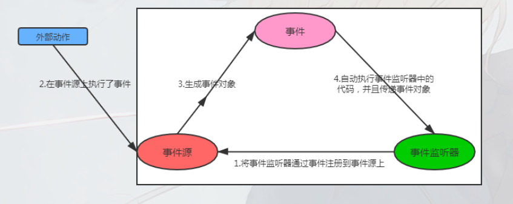
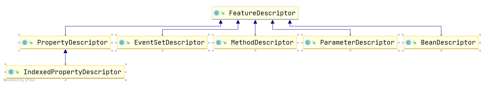
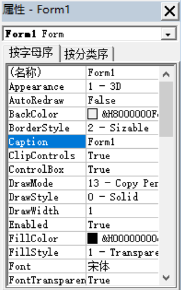
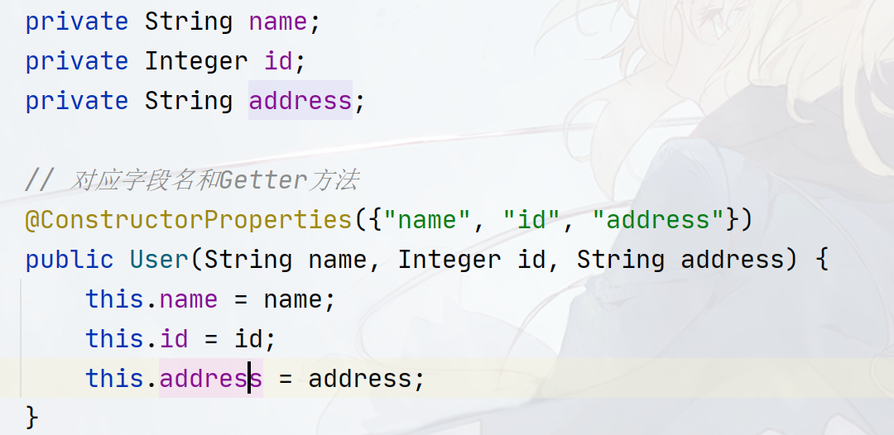
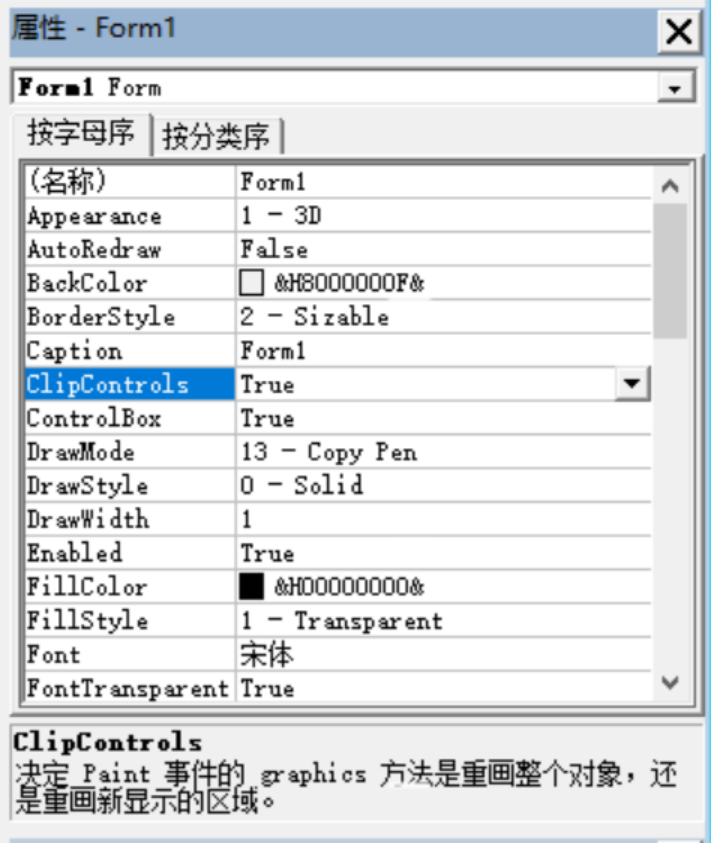
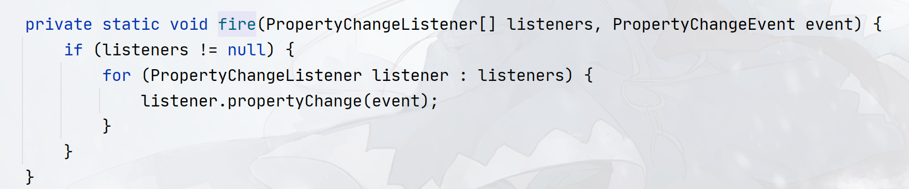

## JavaBean-API

本篇的介绍`JavaBean`的最早用于桌面端程序`Swing`开发为主，在`web`兴起的时候一并被引入，如今使用`JavaBean`的相关`API`主要还是用来处理实体类为主。

你可能对`JavaBean`这个词陌生，但你几乎能在`Java`的任何位置见到它的身影，无论是`Web`领域还是桌面端领域，`JavaBean`经常被用于作为数据传输对象（`DTO`），持久化对象、消息对象等。`Java`中许多成熟的框架都会用到`JavaBean`的`API`，包括常用的`Spring Framework`、`BeanUtils`、`ModelMapper`、`MyBatis`等等。

本文介绍`JavaBean`遵守三步走策略，即是什么、为什么、怎么用，其中重点在于是什么和怎么用！先会介绍`JavaBean`是什么以及核心库为`JavaBean`提供了哪些功能，然后解释怎么做，包括如何使用`JavaBean`的`API`以及常见的第三方`JavaBean`库，在最后，作者结合个人的见解说明`JavaBean` 存在的意义和必要，探讨`get/set`是否真的已死？

### JavaBean

所谓的`JavaBean`可以理解为是一种承载和传递数据的对象，这种对象的类一般有如下要求：

1. 类必须是具体的（非`abstract`和接口）和公共的（`public`）

2. 至少拥有一个无参数的构造器（默认构造器）

3. 有一个或者多个代表数据的字段（成员属性）

4. 相关用于获取和设置字段的属性访问方法，也叫`Setter`和`Getter`

5. 具备响应某些动作（也叫`event`，事件）的能力，允许其他对象监听其状态变化。即能够添加，移除，获取某个动作监听器的方法，如：`addXXXListener`、`removeXXXListener`、`getXXXXListener`
6. 具备继承自`Object`类的一些规范方法，如`toString()`, `equals(Object obj)`, `hashCode()` 等，这些方法不是必需的，但通常被实现以提供更多的功能。
7. 具备序列化和持久化的能力

这里给出一个`JavaBean`的例子：

```java
package cn.argento.askia.bean;

public class User {
    // properties
    private String name;
    private Integer id;
    private String address;

    public User() {
    }

    // setters getters
    public Integer getId() {
        return id;
    }

    public void setId(Integer id) {
        this.id = id;
    }

    public String getAddress() {
        return address;
    }

    public void setAddress(String address) {
        this.address = address;
    }

    public String getName() {
        return name;
    }

    public void setName(String name) {
        this.name = name;
    }
    
    // event
    public void addMouseListener(MouseListener mouseListener){
        // add Listener code
    }
    
    public void removeMouseListener(MouseListener mouseListener){
        // remove Listener code
    }
    
    public MouseListener[] getMouseListener(){
        // get mouse listener code!
    }
}
```

这是一个最基础的`JavaBean`的定义，早期`JavaBean`的作用主要界面之间的信息传递，`Web`兴起的时候作用于`Web`，作用于控制器层、数据库层、`GUI`层等。

一个`JavaBean`理论上由三部分组成：属性（`properties`）、方法（`method`）、事件（`event`），在上面的定义中，并没有看到`event`部分的代码，这是因为事件是由一种类似于触发机制而产生的东西，在现代的`Web`开发中很少使用到这种机制，我们将在后续中补上相关的代码！

#### JavaBean的核心库功能支持

使用核心类库中提供的`JavaBean`的相关`API`，你可以实现下面的功能：

- 分析`JavaBean`（也叫内省，`introspection`）
- 为`JavaBean`提供事件机制，包括属性监听事件，约束事件等。
- `JavaBean`持久化
- `Javabean`属性编辑器，也叫属性定制器或属性修改器

其中，内省是`JavaBean`的核心，内省是分析`Bean`的过程，通过内省来允许其他应用程序（例如设计工具）获取关于组件的信息。没有内省机制，`JavaBean`技术就不可能起作用。

`JavaBean`的设计者可以使用两种方式，指定`Bean`应当暴露哪些属性、事件和方法，以供内省进行分析。在第一种方式中，使用简单的命名约定（参考上一节的`JavaBean`的定义方式），这些约定使内省机制能够推断出与Bean相关的信息。在第二种方式中，提供一个扩展了`BeanInfo`接口的附加类，该类显示地提供这些信息。

事件机制在`JavaBean`中会伴随着属性来实现，具有绑定属性的`Bean`，当属性发生改变时，会生成事件，事件将被发送到之前注册的对接收这种通知感兴趣的对象。同时你还可以实现带约束输入的属性的值的改变，具有约束属性的`Bean`，当尝试改变属性值时会生成事件，事件将被发送到之前注册的对接收这种通知感兴趣的对象中，但是，其他对象可以通过抛出异常的形式来否决属性修改。

// 持久化介绍和属性编辑器介绍


#### Java中的事件机制

这种基于事件的触发机制基于设计模式的观察者模式，主要有三大成员组成（包括事件本身）：

- 事件源（`Event Source`）：事件源本身具备很多"动作"，这些动作由外部因素（如用户或者其他组件等）进行触发，可以说`JavaBean`本身就是事件源！
- 事件（`Event`）：事件源的"动作"被触发之后，会产生一个对应的事件对象，该对象会包含一些重要的信息（如触发"动作"的事件源、触发"动作"的时间等），产生的事件对象会被发送给事件监听器
- 事件监听器（`Event Listener`）：响应事件的场所，开发者在监听器内定义当事件发生时，需要做的事情！事件监听器一般需要预先被注册到事件源上才能触发。

他们的触发流程如下图：



- 一个事件源（`Event Source`）具有多种事件（`Event`），不同的事件源也可以拥有相同的事件
- 一类事件（`Event`）包含一个或者多个"触发动作"（`Action`）
- 一类事件一般由专门的一个监听器接口（`Event Listener`）进行监听，监听器接口为该类事件的每一个触发动作（`Action`）对应一个监听方法（`Action Method`）！
- 一个监听器对象（`Event Listener`）可以被多个事件源（`Event Source`）共享，一个事件源（`Event Source`）也可以绑定多个事件监听器（`Event Listener`）！

> 举个例子，在一个编辑框（事件源）中，注册了两类事件：键盘事件（KeyboardEvent）和鼠标事件（MouseEvent），
>
> 其中键盘事件一般将一个按键分为了两个状态（"触发动作"） ：按下状态和复位状态
>
> 同样有专门的监听器KeyboardListener负责监听KeyboardEvent，并且KeyboardListener中会有两个监听方法keyPressed()和keyRelease()，代表按下状态和复位状态
>
> 鼠标事件同理！

学过`AWT`事件模型的同学就知道了，`AWT`的事件处理也是基于该机制实现的！

在`java.util`包中定义了事件和事件监听器的公共接口：`EventObject`和`EventListener`，其中`EventListener`还有进一步的抽象代理实现：`EventListenerProxy<T extends EventListener>`，当需要定义事件监听器的时候可以实现这个抽象代理对象！

`EventHandler`类则为动态生成事件监听器提供支持，生成的事件监听器的方法执行一条包括`EventObject`对象和目标对象（也就是事件源）的简单语句（对不起我实在不知道怎么翻译`EventHandler`文档的这段话，大概意思就是生成的监听器只能执行简单的代码）。

```
The <code>EventHandler</code> class provides
support for dynamically generating event listeners whose methods
execute a simple statement involving an incoming event object
and a target object.
```


### JavaBean API对照表及分类

在`rt.jar`中，有专门处理`JavaBean`的`API`，该组`API`位于`java.beans`包中，其中包括公开的类`28`个，接口`9`个，注解`2`个，为：

> 接口

| 接口名                   | 用途描述                                                     |
| ------------------------ | ------------------------------------------------------------ |
| `AppletInitializer`      | 该接口中的方法用于初始化`applet`的`Java Bean`，由于`applet`的没落，现在已很少使用，并且该接口也在`JDK 9`中被废弃 |
| `BeanInfo`               | 该接口主要用于描述一个`Bean`的属性、事件、方法相关信息       |
| `Customizer`             | 该接口允许设计者提供用于配置`Bean`的图形用户界面             |
| `DesignMode`             | 该接口的方法用于确认`Bean`是否正在设计模式下执行             |
| `ExceptionListener`      | 异常监听器接口，当`Bean`需要单独额外处理异常时，可以添加该监听器的事件方法 |
| `PropertyChangeListener` | 属性变更监听器接口，当`Bean`绑定的属性发生改变时，如需要监听这种变化，则可以添加该监听器的事件方法 |
| `PropertyEditor`         | 实现了这个接口的对象允许设计者修改和显示属性值               |
| `VetoableChangeListener` | 属性约束变更监听器接口，当`Bean`绑定的属性发生改变时，如需要监听这种变化，则可以添加该监听器的事件方法，和`PropertyChangeListener`最大的不同在于`VetoableChangeListener`监听的属性一般会有范围约束！ |
| `Visibility`             | 这个接口中的方法允许在图形化用户界面不可用的环境中执行`Bean` |

> 类

| 类名                          | 用途描述                                                     |
| ----------------------------- | ------------------------------------------------------------ |
| `BeanDescriptor`              | 提供了关于Bean的信息，另外该类还可以提供一个关联的配置器界面 |
| `Beans`                       | 用于获取关于Bean的信息，这是一个辅助类                       |
| `DefaultPersistenceDelegate`  | `PersistenceDelegate`的默认子类实现                          |
| `Encoder`                     | 对一组`Bean`的状态进行编码，可将这一信息写入流中             |
| `EventHandler`                | 事件处理器，该类非常重要，支持创建动态的事件监听器           |
| `EventSetDescriptor`          | 这个类的实例描述了能够由`Bean`生成的事件                     |
| `Expression`                  | 封装对返回结果的方法的调用                                   |
| `FeatureDescriptor`           | 该类是`BeanDescriptor`、`EventSetDescriptor`、`MethodDescriptor`、`ParameterDescriptor`等的超类！ |
| `IndexedPropertyChangeEvent`  | `PropertyChangeEvent`子类，代表数组索引属性的某个变化        |
| `IndexedPropertyDescriptor`   | 该类的实例描述了`Bean`的索引属性                             |
| `IntrospectionException`      | 分析`Bean`时如果出现问题，就会抛出该异常                     |
| `Introspector`                | 采用低级反射技术分析`Bean`，并创建对应的`BeanInfo`对象，该类直译为`"内省"` |
| `MethodDescriptor`            | 该类描述了`Bean`的方法属性                                   |
| `ParameterDescriptor`         | 该类描述了`Bean`的参数属性                                   |
| `PersistenceDelegate`         | 用于处理对象的状态信息                                       |
| `PropertyChangeEvent`         | 当绑定属性或约束属性发生变化时，生成这种事件，事件被发送到已经注册过的实现了`VetoableChangeListener`或者`PropertyChangeListener`的对象中 |
| `PropertyChangeListenerProxy` | 扩展`lang`包中的`EventListenerProxy`并实现了`PropertyChangeListener`接口，开发者需要创建`PropertyChangeListener`监听器时可以使用该类来辅助实现而无需直接实现`PropertyChangeListener`接口 |
| `PropertyChangeSupport`       | 支持绑定属性的`Bean`可以使用这个类通知所有的`PropertyChangeListener`监听器 |
| `PropertyDescriptor`          | 该类描述了`Bean`的字段属性                                   |
| `PropertyEditorManager`       | 属性编辑管理器，通常用于配合`PropertyEditor`来管理属性编辑相关 |
| `PropertyEditorSupport`       | 该类为一个`Bean`提供属性编辑支持                             |
| `PropertyVetoException`       | 如果修改的属性的属性值超过约束范围，则抛出此类异常           |
| `SimpleBeanInfo`              | `BeanInfo`接口的简单实现，可以继承该类来编写`BeanInfo`来避免编写大量的重复方法 |
| `Statement`                   | 封装对方法的调用                                             |
| `VetoableChangeListenerProxy` | 扩展`lang`包中的`EventListenerProxy`并实现了`VetoableChangeListener`接口，开发者需要创建`VetoableChangeListener`监听器时可以使用该类来辅助实现而无需直接实现`VetoableChangeListener`接口 |
| `VetoableChangeSupport`       | 支持绑定属性的`Bean`可以使用这个类通知所有的`VetoableChangeListener`监听器 |
| `XMLDecoder`                  | 用于从`XML`中读取`Bean`                                      |
| `XMLEncoder`                  | 用于将`Bean`写入到`XML`                                      |

> 注解

| 注解                   | 描述 |
| ---------------------- | ---- |
| @ConstructorProperties |      |
| @Transient             |      |

对上面的所有类，接口，注解根据其用途划分，可以分出以下`6`个核心，这些核心模块可以实现四个大功能：解析`JavaBean`，为`JavaBean`事件触发机制提供支持、实现`Javabean`属性编辑以及`JavaBean`序列化和反序列化。

#### BeanInfo接口

该接口的实现类代表一个`JavaBean`的所有信息，约定上`JavaBean`类会有一个对应的`BeanInfo`接口实现，以用于对`JavaBean`的方法、字段和事件三大属性进行访问！如现有一个`JavaBean`类：`cn.argento.askia.User`，则会有一个对应`BeanInfo`类`UserBeanInfo`，里面记录着`User`类的三大内容！`UserBeanInfo`类可以由程序员通过实现`BeanInfo`接口实现，也可以通过反射`API`来创建。

`BeanInfo`接口有一个默认实现`SimpleBeanInfo`类，该类帮助你实现了大部分方法，你仅需重写需要的方法即可！

#### FeatureDescriptor体系



`FeatureDescriptor`类直译叫特性描述元数据，是一个超类，他的作用主要是描述`JavaBean`的相关特点（如`JavaBean`的三大组成），因此在其子类中，`JavaBean`三大组成会被封装成相应的`FeatureDescriptor`子类：

1. `EventSetDescriptor`：事件集描述元数据，代表`JavaBean`支持的一组事件

2. `PropertyDescriptor`：代表`JavaBean`内部字段的描述元数据，并提供相应的获取数据和设置数据的方法！

3. `MethodDescriptor`：代表`JavaBean`内部所有方法的描述元数据，包括方法名、参数、参数个数等

除了这三个之外，还有一些扩展的描述元数据：

1. `BeanDescriptor`：代表`JavaBean`的全局信息，如`displayName`，类名等！

2. `ParameterDescriptor`：允许`JavaBean`实现者在`java.lang.reflect.Method`类提供的低级类型信息之外，提供关于它们的每个参数的附加信息。

3. `IndexedPropertyDescriptor`：代表`JavaBean`内部数组字段的描述元数据，提供对数组操作的支持！

#### 工具辅助类

1. `Beans`类提供了一些通用的`bean`控制方法

2. `Introspector`类用于创建`BeanInfo`对象

#### JavaBean序列化

序列化只要涉及到三个类：`PersistenceDelegate`类、`XMLEncoder`、`XMLDecoder`

1. `PersistenceDelegate`提供了一种干预`JavaBean`序列化的机制，你可以继承`PersistenceDelegate`，重写`WriteObject()`以实现干预`JavaBean`的序列化！

2. `PersistenceDelegate`底下有一个默认实现：`DefaultPersistenceDelegate`

3. 使用`XMLEncoder`能够将一个`JavaBean`序列化成`XML`文件，使用`XMLDecoder`反序列化！

4. `XMLEncoder`和`XMLDecoder`是`ObjectInputStream`和`ObjectOutputStream`的一个扩展，在序列化`JavaBean`的时候，官方建议使用`XMLEncoder`和`XMLDecoder`代替

#### 事件监听与实现事件

1. `java.bean`包中预定义了一种事件：`PropertyChangeEvent`，该事件在`JavaBean`的属性被更改的时候（这可以看作是`JavaBean`触发动作！）会产生，并发送给监听器（`Listener`）：`PropertyChangeListener`和`VetoableChangeListener`，他们的区别是`VetoableChangeListener`支持抛出`PropertyVetoException`异常！

2. `PropertyChangeEvent`还有一个子事件：`IndexedPropertyChangeEvent`，该事件专门应付数组类型的属性！同样被`PropertyChangeListener`和`VetoableChangeListener`监听。

3. `PropertyChangeListener`和`VetoableChangeListener`也有`PropertyChangeListenerProxy`和`VetoableChangeListenerProxy`代理实现，可以使用代理实现作为监听器！

4. 另外为了实现上文提到的事件触发机制，提供了相应的辅助类：`VetoableChangeSupport`和`PropertyChangeSupport`

5. 通常认为使用`PropertyChangeListener`的属性是没有边界的，在进行修改时可以随意替换的，而`VetoableChangeListener`的属性是有范围限制的，即取值必须在特定的范围内，否则就会抛出越界异常等！

> 注解

- `@ConstructorProperties`：指定该`JavaBean`有什么属性名，标记在构造器上！
- `@Transient`：指定哪些属性不需要序列话到`XML`文件中，标记在方法上！

`@ConstructorProperties`的作用是显示该构造函数的参数如何对应于构造对象的`getter`方法，因为`JavaBean`规定属性成员不能直接被访问和修改（需要通过方法来修改、访问），同时由于方法的参数名通常在运行时不可获取（想要获取参数名一种方法是编译时加上`-D`，但仅限于类），所以可以指定该注解以方便获取`JavaBean`属性名！

> 方法、表达式声明

`Statement`和`Expression`类


#### 属性修改器与Bean定制器

实现`PropertyEditor`接口允许设计者编辑和显示给定类型的属性值，常见的如提供了一种将字符串转为具体类型的值。

如你可能在一些集成环境中看到类似的属性编辑窗口：



在`Java`中，如果想要做出类似的属性窗口，则需要借助`PropertyEditor`接口和`Customizer`接口来实现！前者主要负责做数据显示和数据转换操作，后者主要负责提供上面的配置`Bean`属性的`GUI`组件

又如在`Spring`框架中，我们可以使用`@Value`注解为`URL`对象、`UUID`对象、`File`对象、`Path`对象插入值，实际上是靠对应的`org.springframework.beans.propertyeditors.URIEditor`、`org.springframework.beans.propertyeditors.URIEditor`、`org.springframework.beans.propertyeditors.FileEditor`等`PropertyEditor`的子类实现的！

`PropertyEditor`的使用遵从下面的说明：

1. `PropertyEditor`的类名命名是`JavaBean + Editor`的形式，你需要为哪个`JavaBean`类实现这种转换服务就需要定义对应的`JavaBeanEditor`，如：`cn.argento.askia.User`则需要创建一个`UserEditor`的`PropertyEditor`子类

2. `PropertyEditor`接口也有一个子代理实现：`PropertyEditorSupport`，可以继承该类而非直接实现`PropertyEditor`，同时，该类也可以用于委托代理实现，类似于`PropertyChangeSupport`

3. `PropertyEditorManager`类则用于定位给定任何`Java`类型的`PropertyEditor`对象。`PropertyEditorManager`使用下面三个步骤来定位`PropertyEditor`对象：
   1. `PropertyEditorFinder`中有一个专门存储`Java`类型和类型对应的`PropertyEditor`对象的`Map`，`PropertyEditorManager`提供了一个`registerEditor`方法，用于往这个`Map`中存储`PropertyEditor`对象，然后当给定`JavaBean`类型的时候，优先从这个`Map`中寻找`PropertyEditor`。
   1. 如果步骤`1`找不到对应的`PropertyEditor`，则会尝试给目标类型的全限定类名加上`Editor`来寻找，如`cn.argento.askia.User`类，则寻找`cn.argento.askia.UserEditor`作为`User`类的`PropertyEditor`
   1. 如果步骤`2`中的类不存在，则在`Classpath`中寻找类`UserEditor`作为`User`类的`PropertyEditor`


默认情况下，`JDK`提供了所有基本类型的`PropertyEditor`，还有`String`类、`java.awt.Color`类、`java.awt.Font`类的`PropertyEditor`，以及所有的枚举类型通用的`EnumEditor`！

### 内省机制（introspection）


#### @ConstructorProperties

一般我们可以在`JavaBean`的全参数构造器中使用`@ConstructorProperties`指定`JavaBean`内部有哪些属性，其注解定义如下：

```java
@Documented 
@Target(CONSTRUCTOR) 
@Retention(RUNTIME)
public @interface ConstructorProperties {
    String[] value();
}
```

如：



`@ConstructorProperties`只起到标记作用，代表着该`JavaBean`对象有哪些属性（属性名）

#### Beans工具类

`Beans`工具类中常用的方法如下：

```java
// 提供一个类的全限定类名(beanName)和ClassLoader来初始化一个对象
// instantiate()优先在classpath中寻找一个后缀名为.ser的文件来实例化，如类cn.argento.askia.User则会寻找cn/argento/askia/User.ser文件来反序列出Java对象
// initializer参数用于初始化Applet程序
// beanContext未知
public static Object instantiate(ClassLoader cls, String beanName);
public static Object instantiate(ClassLoader cls, String beanName, BeanContext beanContext);
public static Object instantiate(ClassLoader cls, String beanName, BeanContext beanContext, AppletInitializer initializer);
// 判断bean对象是否是targetType类或者targetType类的子类的实例对象！
public static boolean isInstanceOf(Object bean, Class<?> targetType);
```

```java
// 设置和获取当前环境是否是设计环境
public static void setDesignTime(boolean isDesignTime);
public static boolean isDesignTime();
```

#### FeatureDescriptor体系

在使用`GUI`组件时（如`JButton`、`JList`等），他们的相关属性（如`PreferSize`、`Font`、`Name`等）一般都是由`FeatureDescriptor`体系内的类进行定义和存储！举个例子，`JButton`内有`Name`、`Font`等属性，则会创建`Name`、`Font`等`FeatureDescriptor`子类代表这些属性！

`FeatureDescriptor`类内提供了组件的一些通用的属性，包括：

- `displayName`：代表该`Descriptor`的显示名称，该名称一般用于`GUI`中显示给用户看。
- `name`：代表该`Descriptor`的内部名称，该名称一般用于标记`Descriptor`。
- `ShortDescription`：代表该`Descriptor`的描述，好的描述控制在`40`个字符内。

使用`FeatureDescriptor`中相应的`Setter`设置这些属性的值：

```java
public void setDisplayName(String displayName);
public void setName(String name);
public void setShortDescription(String text);
public String getDisplayName();
public String getName();
public String getShortDescription();
```

如下图中：



我们可以将`Form1`看作是一个`JavaBean`，则表格内每一行都是一个`FeatureDescriptor`的子类，表格行左边的所有属性名都是`FeatureDescriptor`的子类的`displayName`属性，下边的描述是`ShortDescription`，`name`属性一般作为程序内部使用，因此这里无法公开知道！

在`FeatureDescriptor`中，还有一个`table`属性，是一个`Hashtable`，用于保存属性的值（也就是表格右边的数据）！因为右边的数据复杂，所以采用了Ha`shtable<String, Object>`存储！使用`SetValue()`来添加属性：

```java
public Object getValue(String attributeName);
public void setValue(String attributeName, Object value);
```

另外在`FeatureDescriptor`还有一些标记记号（`boolean`类型），这些记号用于区分`FeatureDescriptor`的等级，因为`JavaBean`中并不是所有的属性都会公开给用户，参考上面的`name`属性，它只需要作为内部使用即可！一般有三个级别：

- `hidden`：设置该记号为`true`则代表该`FeatureDescriptor`无需对外暴露！
- `preferred`：设置该记号为`true`则代表该`FeatureDescriptor`应该优先用户使用的！

- `expert`：设置该记号为`true`则代表该`FeatureDescriptor`是提供给高级用户使用的！

这三个属性并不互斥，你可以定义一个`FeatureDescriptor`即使`preferred`又是`expert`！

使用`Setter`设置标记：

```java
public void setExpert(boolean expert);
public void setHidden(boolean hidden);
public void setPreferred(boolean preferred);
public boolean isExpert();
public boolean isHidden();
public boolean isPreferred();
```

#### BeanDescriptor

`BeanDescriptor`用于描述一个类的`Class`对象，`JavaBean`的`Class`对象会被`BeanDescriptor`包装，`BeanDescriptor`提供了下面的构造器和方法给用户进行包装：

```java
public BeanDescriptor(Class<?> beanClass);
public BeanDescriptor(Class<?> beanClass, Class<?> customizerClass);

public Class<?> getBeanClass();
public Class<?> getCustomizerClass();
```

其中的`customizerClass`指代的是属性编辑器的`Class`对象，常见如上面的`GUI`界面等，如果你的`Bean`支持使用某种手段（`GUI`接口，内部对象等）进行修改，则应该提供该属性编辑器的`Class`给`BeanDescriptor`！

#### PropertyDescriptor

`PropertyDescriptor`用于描述`JavaBean`中属性及其`Getter`、`Setter`等访问方法！同时支持获取一个`PropertyEditor`对象。`PropertyDescriptor`的作用是提供一套公共的`JavaBean`属性访问修改方案！任何`JavaBean`的属性都可以通过`PropertyDescriptor`来访问。

你可以使用下面三个构造方法来创建`PropertyDescriptor`：

```java
// 提供JavaBean的属性名和类型
public PropertyDescriptor(String propertyName, Class<?> beanClass) throws IntrospectionException;
// 提供JavaBean的属性名和类型及其对应的Setter、Getter方法名称！
public PropertyDescriptor(String propertyName, Class<?> beanClass,
                String readMethodName, String writeMethodName)
                throws IntrospectionException;
// 提供JavaBean的属性名和readMethodg、WriteMethod对象
public PropertyDescriptor(String propertyName, Method readMethod, Method writeMethod) throws IntrospectionException;
```

在`PropertyDescriptor`，重要的内容主要有：

- `ReadMethod`：代表属性的`Setter`
- `WriterMethod`：代表属性的`Getter`
- `PropertyEditorClass`：代表属性的`PropertyEditor`，即属性编辑器对象，这个在后面会介绍！

```java
public synchronized void setReadMethod(Method readMethod) throws IntrospectionException;
public synchronized void setWriteMethod(Method writeMethod) throws IntrospectionException;
public void setPropertyEditorClass(Class<?> propertyEditorClass);

public Class<?> getPropertyEditorClass();
public synchronized Method getReadMethod();
public synchronized Method getWriteMethod();
```

可以使用下面方法获取该属性的类型：

```java
public synchronized Class<?> getPropertyType();
```

另外有，由于`Bean`包提供了一种监听属性变化的机制，所以提供了两个类型字段来绑定`JavaBean`的监听机制：

- `Bound`：值是`true`或者`false`，指定为`true`代表该`JavaBean`的属性是一个`Bound`属性，即通过`Setter`更新属性会触发`PropertyChange`事件
- `Constrained`：值是`true`或者`false`，指定为`true`代表该`JavaBean`的属性是一个`Constrained`属性，即通过`Setter`更新属性会触发`VetoableChange`事件

如果`JavaBean`实现了`PropertyChangeListener`接口，并提供了`addPropertyChangeListener()`，则需要指定`Bound`为`true`，同理，如果`JavaBean`实现了`VetoableChangeListener`接口，则需要指定`Constrained`为`true`。

这两个字段的设置遵顼上面的原则，有对应的`Setter`和`Getter`方法：

```java
public void setBound(boolean bound);
public void setConstrained(boolean constrained);

public boolean isBound();
public boolean isConstrained();
```

#### IndexedPropertyDescriptor

`IndexedPropertyDescriptor`是`PropertyDescriptor`的扩展，用于访问数组类型的`JavaBean`属性！额外提供了类似于下面的`Setter`和`Getter`方法：

```java
public void setArrayField(int index, Object target);
public Object getArrayField(int index);
```

实际上不仅仅是数组，只要是符合上面的`Setter`、`Getter`方法的都可以！

构造器：

```java
// 默认使用Setter和Getter的重载作为数组访问
public IndexedPropertyDescriptor(String propertyName, Class<?> beanClass) throws IntrospectionException;

public IndexedPropertyDescriptor(String propertyName, Class<?> beanClass, String readMethodName, String writeMethodName, String indexedReadMethodName, String indexedWriteMethodName) throws IntrospectionException;

public IndexedPropertyDescriptor(String propertyName, Method readMethod, Method writeMethod, Method indexedReadMethod, Method indexedWriteMethod) throws IntrospectionException;
```

方法：

```java
// 获取数组的原始类型
public synchronized Class<?> getIndexedPropertyType();
public synchronized Method getIndexedReadMethod();
public synchronized Method getIndexedWriteMethod();
public synchronized void setIndexedWriteMethod(Method writeMethod) throws IntrospectionException;
public synchronized void setIndexedReadMethod(Method readMethod)
throws IntrospectionException;
```

#### MethodDescriptor && ParameterDescriptor

`ParameterDescriptor`代表`JavaBean`的方法上的参数，并提供描述该参数的相关信息！

`ParameterDescriptor`并没有其他的方法，你可以重用`FeatureDescriptor`的属性即可！

而`MethodDescriptor`则代表`JavaBean`的方法，包括对象本身的方法（如继承自`Object`的`hashCode()`、`toString()`等等）、Getter、Setter等等，你可以使用下面的构造器创建他：

```java
// 代表一个没有参数描述的方法
public MethodDescriptor(Method method);
// 代表一个没有参数描述的方法并提供参数描述
public MethodDescriptor(Method method, ParameterDescriptor parameterDescriptors[]);
```

你可以使用下面的

```java
// 获取方法
public synchronized Method getMethod();
// 获取参数描述
public ParameterDescriptor[] getParameterDescriptors();
```

#### EventSetDescriptor

事件集描述元素据，代表`JavaBean`支持的多个事件的集合，`EventSetDescriptor`更多地描述的是事件监听器的内容，它具有如下属性：

- `eventSetName`：事件名称，可随意！但为了区分，一般该名字就代表了一类事件，如`Mouse`代表鼠标的所有事件

- `listenerType`：监听器类型，一般的事件监听器都需要实现或者继承`EventListener`接口。

  ```java
  public Class<?> getListenerType();
  ```

- `listenerMethodNames`：监听器内的所有监听方法的方法名，如`MouseListener`的各种`mouseXXX`方法

  ```java
  public synchronized MethodDescriptor[] getListenerMethodDescriptors();
  public synchronized Method[] getListenerMethods();
  ```

- `addListenerMethodName`：添加监听器对象的方法名，通常以`addXXXXListener`为方法名

  ```java
  public synchronized Method getAddListenerMethod();
  ```

- `removeListenerMethodName`：移除监听器对象的方法名，通常以`removeXXXListener`为方法名

  ```java
  public synchronized Method getRemoveListenerMethod();
  ```

- `getListenerMethodName`：代表获取监听器对象的方法名，通常以`getXXXListeners`为方法名

  ```java
  public synchronized Method getGetListenerMethod();
  ```

- `Unicast`：该事件属于单播事件还是多播事件，该属性决定了事件本身是否能注册多个同类的监听器，常见的做法是如果一个事件不能接受多个监听器，则需要在他的`addXXXListener()`声明并当尝试添加多个监听器时抛出`TooManyListenersException`异常

  ```java
  public void setUnicast(boolean unicast);
  public boolean isUnicast();
  ```

- `inDefaultEventSet`：该事件是否属于默认事件！留`true`即可，一般用于当一个`JavaBean`具有可选择的触发事件时使用！

  ```java
  public void setInDefaultEventSet(boolean inDefaultEventSet);
  public boolean isInDefaultEventSet();
  ```

> 这里补充一点，一般情况下，一类事件是可以注册多个监听器的，当该事件被触发的时候，多个监听器都将会被触发，例如在PropertyChangeSupport类中的fire()可以看到：
>
> 是使用一个for循环来逐个监听器进行触发的！

#### BeanInfo

##### BeanInfo接口

`BeanInfo`可以说是`Class`对象的一个另外一种解决方案，主要用于简单介绍`JavaBean`的属性、方法、事件等！

`BeanInfo`接口内的主要方法如下：

```java
public interface BeanInfo {

    // 获取JavaBean的Bean类描述元素据，如类名、类继承
    BeanDescriptor getBeanDescriptor();
    // 获取JavaBean的事件集描述元素据
    EventSetDescriptor[] getEventSetDescriptors();
    /**
     * A bean may have a default event typically applied when this bean is used.
     *
     * @return  index of the default event in the {@code EventSetDescriptor} array
     *          returned by the {@code getEventSetDescriptors} method,
     *          or -1 if there is no default event
     */
    int getDefaultEventIndex();

    // 返回JavaBean的属性描述元数据，如果JavaBean中的属性是一个数组类型的属性，则会返回IndexedPropertyDescriptor类型的元数据，因此PropertyDescriptor[]中可能包含了IndexedPropertyDescriptor和PropertyDescriptor两种类型的元素据，客户代码可以使用instanceof来判断是哪种类型！
    PropertyDescriptor[] getPropertyDescriptors();

    /**
     * A bean may have a default property commonly updated when this bean is customized.
     *
     * @return  index of the default property in the {@code PropertyDescriptor} array
     *          returned by the {@code getPropertyDescriptors} method,
     *          or -1 if there is no default property
     */
    int getDefaultPropertyIndex();
    
    // 返回JavaBean方法元数据描述
    MethodDescriptor[] getMethodDescriptors();

    /**
     * This method enables the current {@code BeanInfo} object
     * to return an arbitrary collection of other {@code BeanInfo} objects
     * that provide additional information about the current bean.
     * <p>
     * If there are conflicts or overlaps between the information
     * provided by different {@code BeanInfo} objects,
     * the current {@code BeanInfo} object takes priority
     * over the additional {@code BeanInfo} objects.
     * Array elements with higher indices take priority
     * over the elements with lower indices.
     *
     * @return  an array of {@code BeanInfo} objects,
     *          or {@code null} if there are no additional {@code BeanInfo} objects
     */
    BeanInfo[] getAdditionalBeanInfo();

    /**
     * Returns an image that can be used to represent the bean in toolboxes or toolbars.
     * <p>
     * There are four possible types of icons:
     * 16 x 16 color, 32 x 32 color, 16 x 16 mono, and 32 x 32 mono.
     * If you implement a bean so that it supports a single icon,
     * it is recommended to use 16 x 16 color.
     * Another recommendation is to set a transparent background for the icons.
     *
     * @param  iconKind  the kind of icon requested
     * @return           an image object representing the requested icon,
     *                   or {@code null} if no suitable icon is available
     *
     * @see #ICON_COLOR_16x16
     * @see #ICON_COLOR_32x32
     * @see #ICON_MONO_16x16
     * @see #ICON_MONO_32x32
     */
    Image getIcon(int iconKind);

    /**
     * Constant to indicate a 16 x 16 color icon.
     */
    final static int ICON_COLOR_16x16 = 1;

    /**
     * Constant to indicate a 32 x 32 color icon.
     */
    final static int ICON_COLOR_32x32 = 2;

    /**
     * Constant to indicate a 16 x 16 monochrome icon.
     */
    final static int ICON_MONO_16x16 = 3;

    /**
     * Constant to indicate a 32 x 32 monochrome icon.
     */
    final static int ICON_MONO_32x32 = 4;
}
```

自定义的`JavaBean`类应该有属于自己的`BeanInfo`，因此开发者需要实现自己`JavaBean`的`BeanInfo`。

`BeanInfo`接口有一个默认实现`SimpleBeanInfo`类，该类帮助你实现了大部分方法，可以继承该类来实现自己的`BeanInfo`

#### Introspector工具类

`Introspector`工具类的一个用途是创建`BeanInfo`对象。对于属性、方法、事件这三种信息中的每一种，`Introspector`类将分别分析`bean`的类和超类，寻找显式或隐式的信息，并使用这些信息构建全面描述`JavaBean`的`BeanInfo`对象。

`Introspector`工具类创建`BeanInfo`对象的方法如下：

```java
// 提供JavaBean的Class对象获取响应的BeanInfo
public static BeanInfo getBeanInfo(Class<?> beanClass) throws IntrospectionException;
// 会递归分析JavaBean类及JavaBean类的继承链上stopClass之前的所有父类的BeanInfo，
public static BeanInfo getBeanInfo(Class<?> beanClass, Class<?> stopClass) throws IntrospectionException;
// 会递归分析JavaBean类及JavaBean类的父类，分析出多个JavaBean类的BeanInfo
// Flag支持三个选项：
/*
USE_ALL_BEANINFO
任何可以被发现的BeanInfo都会被分析

IGNORE_IMMEDIATE_BEANINFO
忽略beanClass的自定义BeanInfo和内部BeanInfo

IGNORE_ALL_BEANINFO
忽略beanClass和beanclass的所有父类（直到stopClass）的自定义BeanInfo和内部BeanInfo
*/
// 另外stopClass或其父类中的任何方法/属性/事件都会在分析中被忽略。（即不包含边界）
public static BeanInfo getBeanInfo(Class<?> beanClass, Class<?> stopClass, int flags) throws IntrospectionException;
// 
public static BeanInfo getBeanInfo(Class<?> beanClass, int flags)
throws IntrospectionException;
```

`Introspector`类中的`getBeanInfo()`搜索`BeanInfo`对象的顺序我们在`API`简介中简单介绍过：

1. 首先会搜索和`JavaBean`类相同包名的`JavaBeanBeanInfo`类，如有`JavaBean`：`com.x.y.User`，则首先会搜索`com.x.y.UserBeanInfo`（通常这个类是开发者自定义的）作为`User`类的`BeanInfo`类
2. 如果第一步的搜素得不到`BeanInfo`类，则会使用`UserBeanInfo`作为类名，在系统路径中搜索，系统路径为下面两个包：`sun.beans.infos`和`com.sun.beans.infos`
3. 如果系统路径仍然也找不到，则`Introspector`类会调用反射`API`来进行类分析并创建`BeanInfo`对象！

默认情况下，如果`JavaBean`类具有继承关系，则`getBeanInfo()`默认会分析`JavaBean`类和所有`JavaBean`父类的`BeanInfo`，当然如果希望`getBeanInfo()`分析到某个父类就停止分析，则可以指定`stopClass`参数（不包括`stopClass`），比如现在有下面的`JavaBean`：

```java
// User类、 VipUser类、PartnerUser类，他们的继承关系如下：
User <---- VipUser <----- PartnerUser
  
// 则当我们调用
Introspector.getBeanInfo(PartnerUser.class);
// 会分析出所有的的父类的BeanInfo，即User类中的属性、方法、事件，VipUser类中的属性、方法、事件，PartnerUser类中的属性、方法、事件都会被分析出来！

// 如果希望只分析到User类（即分析VipUser类中的属性、方法、事件，PartnerUser类中的属性、方法、事件，不分析User类的），则可以：
Introspector.getBeanInfo(PartnerUser.class, User.class);
```

另外在`getBeanInfo()`的方法参数中，还有一个整型的`flags`参数，这个参数用来控制是否使用上面的第一步和第二步的方法来获取`BeanInfo`：

- `USE_ALL_BEANINFO`：`beanClass`及`beanClass`对应的类的所有父类都会遵循上面的三个步骤来搜索分析出`BeanInfo`
- `IGNORE_IMMEDIATE_BEANINFO`：`beanClass`不进行第一第二步的分析，直接由`Introspector`类调用反射`API`来分析出`BeanInfo`，而`beanClass`的所有父类都采用上面的三个步骤来搜索分析出`BeanInfo`
- `IGNORE_ALL_BEANINFO`：`beanClass`及`beanClass`对应的类的所有父类都直接由`Introspector`类调用反射`API`来分析出`BeanInfo`

最后，搜索`BeanInfo`对象的第二步中涉及到的系统路径，我们可以手动添加更多的包进去，可以使用下面的`API`来获取、增加系统的搜索路径：

```java
// 设置系统BeanInfo的所有路径包，默认：sun.beans.infos，你可以添加自己的路径如：com.y.x.pack
public static void setBeanInfoSearchPath(String[] path);
// 获取系统的搜索路径
public static String[] getBeanInfoSearchPath();
```

#### BeanInfo解析实践

在经历了前面`FeatureDescriptor`体系和`BeanInfo`的介绍之后，我们现在来将这些内容进行实践：                                      


### 事件监听和触发机制

属性事件监听、属性约束事件

单播事件和多播事件

bean包中内置的三大事件！


#### 自定义事件监听

#### 事件触发实践


### 属性编辑器


#### 属性编辑器实践


### JavaBean序列化机制


