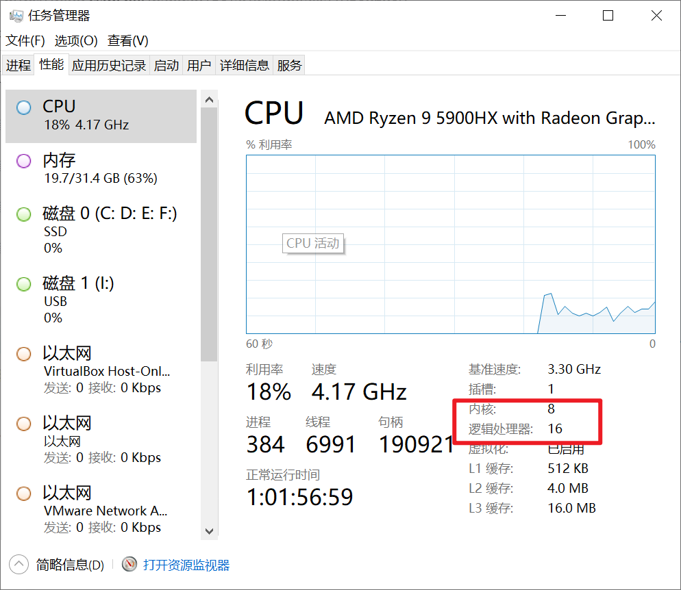
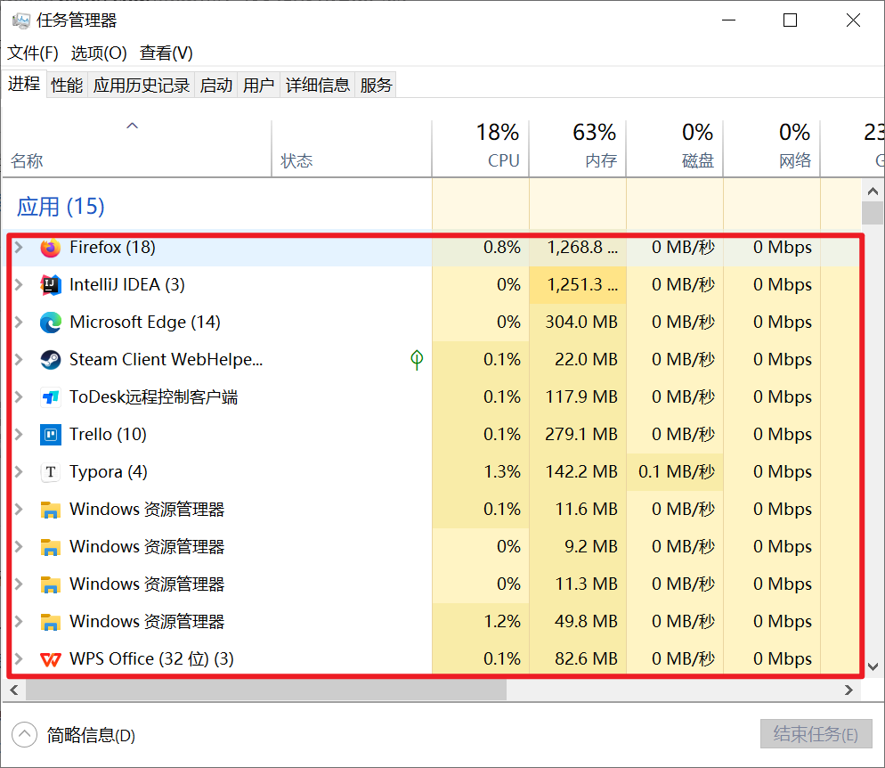
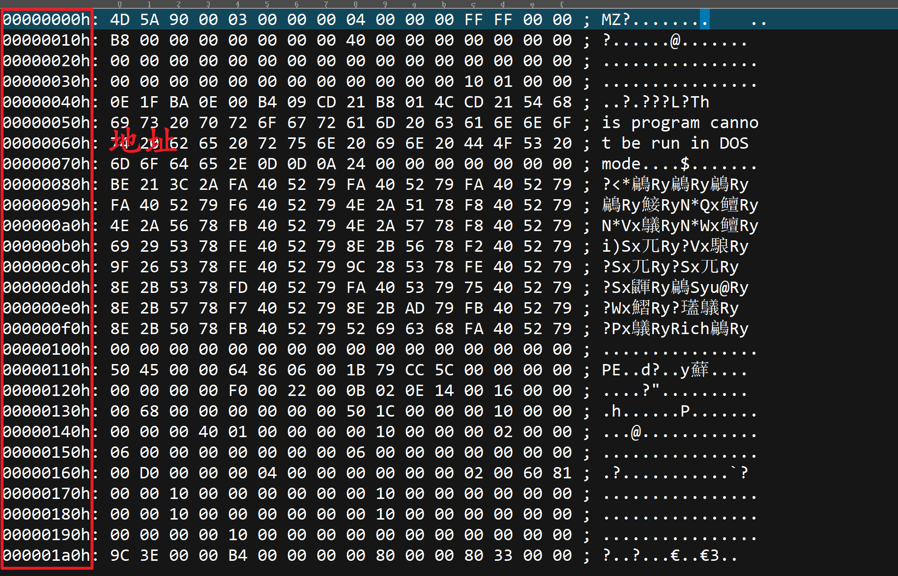
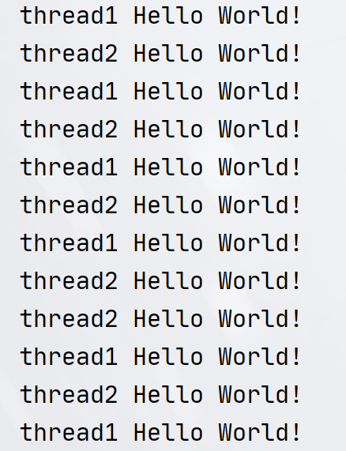

## Java-Thread

本章节主要介绍`Java`中比较重要的知识点：并发，其中包括多线程，两大关键字，线程通信，以及最最最为重要的`JUC`工具包（`java.util.concurrent`包，其内部包括原子操作（`CAS`），各种锁，`AQS`、并发数据结构，信号量以及线程池框架）。文章在临近结束，还会讨论在代码设计及设计模式中，使用多线程的注意事项！

本笔记首先会先从基本的使用开始上手，着重介绍其中的一些注意事项，再到后面的`JUC`工具包中，除了使用之外还会剖析其代码设计结构。

因此本笔记篇幅较长（预计在`10w`字左右），内容上会做好标注，尽量不让知识点与知识点之间有联系，本篇笔记的编写参考了大量的书籍和资料，希望将`Java`多线程的核心内容尽收囊中！

## 前置

本小节主要介绍一些并发的底层硬件支持知识，从`CPU`、进程、线程等角度说明多线程系统或多线程环境的基本情况！

> 参考文章：
>
> - 核心参考：https://blog.csdn.net/nandao158/article/details/105896980
> - CPU图片出处：https://www.cnblogs.com/cwff/p/15420847.html

### CPU核心数、CPU线程数

> 多核心：也指单芯片多处理器(`Chip Multiprocessors`，简称`CMP`)，`CMP`是由美国斯坦福大学提出的,其思想是将大规模并行处理器中的`SMP`(对称多处理器)集成到同一芯片内,各个处理器并行执行不同的进程。

简单来讲就是将多个处理器核心（以下简称核心）塞到一个芯片里面，组成一个大的处理器，我们常说的`4`核`CPU`，`8`核`CPU`实际上就是指`CPU`芯片的核心数，**核心数越多，代表计算机同时处理的任务的能力越强**（打个比较理想化的比方，如运行一个程序需要一个核心，则4核CPU理论上可以同时运行`4`个程序，以此类推）


这种依靠多个核心同时并行地运行程序是实现超高速计算的一个重要方向，称为并行处理！

另外为了区分，我们这里称`CPU`或者处理器指代整张芯片，而说核心的时候才指代芯片上的其中一个核心

> 多线程：`Simultaneous Multithreading`，简称`SMT`。让一个CPU上的多个线程同步执行并共享CPU的执行资源。 

硬件上的线程实际上是一个逻辑概念，在`intel`的超线程技术出现之前，一个核心就代表一个线程，在超线程技术（`HT, Hyper-Threading`）诞生之后，`1`个核心能够做到模拟`2`个线程计算。因此常说的8核16线程，实际上是基于这项技术而来的。

换句话说，在`intel`的超线程技术下，以前则`4`核`CPU`理论上可以同时运行`4`个程序，现在可以同时执行`8`个！

> 关于intel的这项技术可以参考：
>
> - https://zhuanlan.zhihu.com/p/680442243
> - https://zhuanlan.zhihu.com/p/661770188

要查看自己的CPU是几核几线程，可以打开任务管理器观看：

### 线程、进程

本小节主要说明线程、进程等概念，旨在给读者理解或者明白程序是如何在计算机中运行起来的！

#### 何为进程？

> 参考：https://baike.baidu.com/item/%E8%BF%9B%E7%A8%8B/382503?fr=ge_ala

进程是程序运行资源分配的最小单位 。进程是一个具有独立功能的程序关于某个数据集合的一次运行活动。

进程可以申请和拥有系统资源（包括：`CPU`、内存空间、 磁盘`IO`等），是一个动态的概念，是一个活动的实体。它不只是程序的代码，还包括当前的活动，通过程序计数器的值和处理寄存器的内容来表示。同一进程中的多条线程共享该进程中的全部系统资源,而进程和进程之间是相互独立的。

说人话就是进程是一个包含程序代码，程序资源、系统资源等内容的实体，程序代码和程序资源很好理解，因为计算机是要运行程序的，我们打开任务管理器，看到的都是各类现在运行中的进程，同时，程序本身也需要资源，比如程序图标、程序运行时需要读写的外部文件等等，这些资源都是程序在运行时候需要用到的！

然而除了这些之外，进程可能还需要和系统资源打交道，比如我们的程序调用了操作系统中的某个`API`，使用操作系统中的某个库，或者需要等待用户的`IO`操作等，这些哦都需要系统为我们分配响应的资源！

当然实际上的进程所包含的内容远远不止程序代码，程序资源、系统资源这么简单，并且由于操作系统通常会加载多个进程，所以中间还会涉及到进程的生命周期何相关调度算法等等，另外由于操作系统本身也会有一些自己的进程（如常见的`Windows`资源管理器），因此进程可以分为系统进程和用户进程，但这些都不是我们本次讨论的范畴了。

#### 进程是如何工作的

你有没有好奇？只要点击`Windows`系统上的`EXE`文件，就会有一个程序窗口弹出给我们看，这中间是什么原理？当你运行一个`EXE`程序，笼统上讲你就启动了一个进程，这里面就涉及到两个东西，一个是我们之前说的进程，而第二个则是这个`EXE`文件。

首先要知道一点：**进程的所有内容是存在内存中的**，而我们的**EXE文件是存在于硬盘上的**。当我们点击EXE文件，**操作系统要做的事情是读取EXE文件内容并使用这些内容在内存上创建一个或者多个（如果有必要的话）进程**，所以，我们其实可以称磁盘上的`EXE`文件实际上就是进程的镜像（即该程序的可运行机器码在磁盘中的映像），如果换到面向对象的概念的话，就可以说**EXE文件是一个类，而进程就是这个类所创建出来的各个对象**。

所以`EXE`文件实际上和进程是有相同的结构的，因此要查看进程的内容结构，实际上可以通过查看`EXE`文件来查看（这里就涉及到`EXE`的`PE`结构：`BV1us411P7nL`）

在之前曾说过：进程所包含的内容远远不止程序代码，程序资源、系统资源这么简单。实际上包括的内容有：

```
可运行代码（一般是机器码）、特定于进程的数据（输入、输出）、调用堆栈、堆栈（用于保存运行时运数中途产生的数据，也可以说是公共堆栈）。 分配给该进程的资源的操作系统描述符，诸如文件描述符（Unix术语）或文件句柄（Windows）、数据源和数据终端。 安全特性，诸如进程拥有者和进程的权限集（可以容许的操作）。 处理器状态（内文），诸如寄存器内容、物理存储器寻址等。
# 来自：https://baike.baidu.com/item/%E8%BF%9B%E7%A8%8B/382503?fr=ge_ala
```

另外由于每个进程在内存中都有自己的地址空间，因此还会设计到寻址问题，当我们打开一个`EXE`文件的时候，因为是二进制文件，所有也会有地址显示：

当我们把`EXE`文件加载到内存的时候，就会涉及到地址偏移，比如我们创建的进程入口地址是，则会把EXE文件的`00000000h`对准`78151ac3h`来加载。

#### 何为线程？

如果说进程是资源的最小单位，那线程就是`CPU`运行、运算和调度的最小单位，也是所谓"跑代码"的地方。

// 线程和进程之前的关系

我们创建的所有线程实际上属于JVM进程，因此也有限制

> 需要明确：在多线程`OS`，进程大概率不是一个可执行的实体（当然具体也要看操作系统实现），所有的机器码运行都是在线程中执行的
>
> 参考：https://blog.csdn.net/qq_40024178/article/details/122020246

// 介绍线程，包括和为线程，线程状态

// 介绍线程切换和线程调度


#### 多线程环境下存在的各种问题

// 多线程在代码中的运行情况！main

// 线程安全和线程非安全！（读写、脏读？线程模型）

总之，在多线程环境下，代码的运行是不可循迹的，多线程编程之所以难，是因为代码的运行是动态的，需要开发者考虑并预防各种潜在的并发危险，因此面向多线程编程时，要做到不信任任何多线程环境下的代码，做好最坏打算！尤其在一些不确定是否一定需要并发的情况下，除非性能到了瓶颈，否则还是建议考虑纳入并发代码范畴！

## Thread类和Runnable接口

`Java`中多线程的基础就是`Thread`类和`Runnable`接口，`Thread`类的一个实例对象即代表一个线程，`Runnable`接口的一个实例对象代表线程需要完成的任务。在实际开发中，由于内存开销，虽然很少直接使用`Thread`类而是使用线程池（`ThreadPool`），但熟悉`Thread`类的`API`，仍然有必要！

`Runnable`接口是一个函数式接口（指接口只有一个待实现的方法），并且接口方法没有返回值（在`JUC`并发包中还有另外一个带返回值的`Runnable`接口：`Callable`）

```java
public interface Runnable {
    public abstract void run();
}
```

`Thread`类的`API`如下（`Thread`类的这些`API`文后会分用途来讲解明白）：

> 声明

```java
public class Thread implements Runnable
```

> 构造器

```java
// 默认构造器会创建一个名为Thread-X（X为数字，代表线程编号）
public Thread();
// 提供一个Runnable接口的对象，代表该线程要执行的“任务”
public Thread(Runnable target);
// ThreadGroup代表线程组，一个线程组是一组线程对象的总称
public Thread(ThreadGroup group, Runnable target);
// 该构造器可以为线程提供命名，线程默认名称是Thread-X（X为数字，代表线程编号）
public Thread(String name);
// 参考上面
public Thread(ThreadGroup group, String name);
// 参考上面
public Thread(Runnable target, String name);
public Thread(ThreadGroup group, Runnable target, String name);
// stackSize代表新线程所需的堆栈大小，或者为零表示忽略此参数。
public Thread(ThreadGroup group, Runnable target, String name, long stackSize);
```

> 方法

```java
// ========================= 静态方法 =========================
// 获取当前线程对象
public static native Thread currentThread();
// 放弃当前CPU资源，让其他任务去占用CPU时间片
public static native void yield();
// 让当前线程暂停执行多少毫秒
public static native void sleep(long millis) throws InterruptedException;
// 让当前线程暂停执行多少毫秒+纳秒（更加精准）
public static void sleep(long millis, int nanos) throws InterruptedException;
// 
public static boolean interrupted();
public static int activeCount();
public static int enumerate(Thread tarray[]);
public static void dumpStack();
public static native boolean holdsLock(Object obj);
public static void setDefaultUncaughtExceptionHandler(UncaughtExceptionHandler eh);
public static UncaughtExceptionHandler getDefaultUncaughtExceptionHandler();
// ========================= 静态方法 =========================

// ========================= 对象方法 =========================
public synchronized void start();
public void run();
public void interrupt();
public boolean isInterrupted();
public final native boolean isAlive();
public final void setPriority(int newPriority);
public final int getPriority();
public final synchronized void setName(String name);
public final String getName();
public final ThreadGroup getThreadGroup();
public final synchronized void join(long millis) throws InterruptedException;
public final synchronized void join(long millis, int nanos) throws InterruptedException;
public final void join() throws InterruptedException;
public final void setDaemon(boolean on);
public final boolean isDaemon();
public String toString();
public StackTraceElement[] getStackTrace();
public static Map<Thread, StackTraceElement[]> getAllStackTraces();
public long getId();
public State getState();
public UncaughtExceptionHandler getUncaughtExceptionHandler();
public void setUncaughtExceptionHandler(UncaughtExceptionHandler eh);

public final void checkAccess();
public ClassLoader getContextClassLoader();
public void setContextClassLoader(ClassLoader cl);


@Deprecated public final void suspend();
@Deprecated public final void stop();
@Deprecated public final void resume();
@Deprecated public native int countStackFrames();
// ========================= 对象方法 =========================
```

另外还有两个方法：`public final synchronized void stop(Throwable obj)`和`public void destroy()`，这两个方法从定义之初到如今都没有实现，并且也不应该实现这两个方法，因此对这两个方法的调用会直接抛出`Error`异常！可见`Thread`类在设计之初的复杂性和困难！

### 创建并运行线程

`Thread`类提供了大量的构造器来创建线程（我们先忽略那些带`ThreadGroup`参数的构造器，这些会在介绍`ThreadGroup`的时候介绍）：

```java
// 默认构造器会创建一个名为Thread-X（X为数字，代表线程编号）
public Thread();
// 提供一个Runnable接口的对象，代表该线程要执行的“任务”
public Thread(Runnable target);
// 该构造器可以为线程提供命名，线程默认名称是Thread-X（X为数字，代表线程编号）
public Thread(String name);
// 参考上面
public Thread(Runnable target, String name);
// stackSize代表新线程所需的堆栈大小，或者为零表示忽略此参数。
public Thread(ThreadGroup group, Runnable target, String name, long stackSize);
```

要创建一个线程，首先需要`new`出`Thread`对象，然后给线程指定其需要完成的任务（`Runnable`接口对象），还可以为该`Thread`对象进行命名，以方便后期的管理！由于`Thread`类本身实现了`Runnable`接口，因此实际上有两种方法来为线程指定要执行的任务：

1. 重写`Thread`类的`run()`

   ```java
   Thread thread1 = new Thread(){
       @Override
       public void run() {
           while(true){
               System.out.println("Thread1 Hello World!");
           }
       }
   };
   ```

2. 传递`Runnable`接口对象

   ```java
   Runnable task = new Runnable() {
       public void run() {
           while(true){
               System.out.println("Thread2 Hello World!");
           }
       }
   };
   Thread thread2 = new Thread(task);
   ```

使用哪种完全看开发者习惯，在创建完`Thread`对象之后，可以调用`Thread`对象的`start()`方法，开启线程：

```java
thread2.start();
thread1.start();
```

启动了之后，就会在控制台看到不断输出的`Thread1 Hello World!`和`Thread2 Hello World!`：



在线程运行这块，需要注意两点：

1. 线程运行调用的是`start()`方法（不是`run()`，调用`run()`相当于直接执行，**不会启动线程**），在线程处于运行状态的时候，它会去调用`run()`方法，执行`run()`方法的代码，执行完毕退出`run()`方法之后，该线程对象基本就没用了，剩下等待`GC`回收把它一波带走！
2. **调用start()的顺序不代表线程的真正执行顺序！**，`start()`的作用仅仅是标记该线程对象可以运行了而已，该线程对象会被放入操作系统的线程队列中，至于什么时候运行，由操作系统说了算，因此上面的代码中，我们先调用`thread2`再调用`thread1`的`start()`，但是输出却是先输出`thread1`的，这是正常的！
3. **线程的运行是无序的**，要运行哪个线程，由`CPU`说了算，所有你可能会看到，`thread2`运行了两次，输出了两个`thread2 Hello World!`，也可能看到`thread2`和`thread1`并排运行的情况，之所以会这样是因为`CPU`将时间片分给不同的线程，线程获得时间片后就执行任务，所以这些线程在随机地执行并输出，导致输出结果呈现乱序的效果。

所谓时间片即`CPU`分给各个程序的时间，每个线程被分配一个时间片，在当前的时间片内`CPU`去执行线程中的任务，如果分配给当前线程的时间片用完了（即到时间了），`CPU`将会保留当前线程状态，然后进行线程切换，即从众多等待运行的线程对象中选择一个运行（这个过程也叫轮询），当然这种轮询也是可以轮回到当前线程上的，所以才有会执行两次`thread2`的情况。

因此`CPU`在不同的线程上进行切换也是需要耗时的，并不是创建的线程越多，软件运行效率就越高，反而相反，线程数过多会降低软件执行效率。

### 获取当前线程

```java
// 获取当前线程对象
public static native Thread currentThread();
```

可以获取当前线程

### 判断线程是否激活

// isAlive()


### 线程休眠

// sleep()


### 获取线程唯一标识

// getId()


### 停止线程

// 线程停止的三种方法


### 暂停线程

// 线程暂停


### 放弃当前CPU时间片

// yield()


### 线程优先级


### 守护线程


## 两大关键字

本小节主要介绍`Synchronized`关键字和`volatile`关键字的作用和其使用技巧。

### Synchronized

`Synchronized`主要能标记在方法和语句块上，当标记在方法上时：

1. `Synchronized`关键字标记在对象方法上的时候，获取的是对象锁，即锁当前方法的调用对象（即`this`），一旦`this`被锁住，则`this`中的所有`synchronized`方法都会被锁住。
2. `Synchronized`关键字标记在静态方法上的时候，获取的是`Class`对象锁，即锁当前类的`Class`对象
3. `Synchronized`拥有锁重入功能
4. `Synchronized`方法出现异常时自动释放锁
5. 同步不具有继承性

我们首先证明第一点：

// 对象锁

// 对象锁但是调用了不同方法（Synchronized和非Synchronized方法）


Synchronized方法的弊端：


----

标记在语句块的`Synchronized`锁的结构如下：

```java
// 如何使用代码块来实现Synchronized锁
```


### volatile

`volatile`关键字能够实现的功能主要有三：

1. 保证变量可见性，同步公有和私有堆栈变量：`B`线程能马上看到`A`线程更改的数据
2. 保证`32`位`JDK`中`long`和`double`数据类型的写原子性
3. 禁止代码重排序


## 线程通信方法


## JUC并发工具包

`JUC`并发工具包实际上是指`java.util.concurrent.*`下的所有内容，其提供了一套通用的并发编程相关的工具实现，其中包括`java.util.concurrent.atomic.*`子包，该包主要实现原子操作，以及`java.util.concurrent.locks.*`包，主要提供锁机制。

而在`java.util.concurrent.*`中则主要提供了很多并发数据结构和线程池框架以及信号量、执行管理器（即带返回值的`Runable`接口）、同步器等内容。

### 原子操作及atomic子包

何为原子操作？

### 锁（lock子包）


### 并发数据结构


### 线程池框架


### 信号量


### 执行管理器


## JUC源代码分析


## 死锁问题


