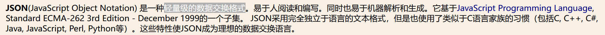
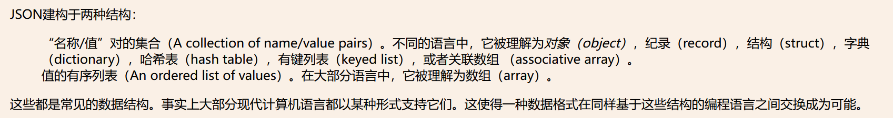
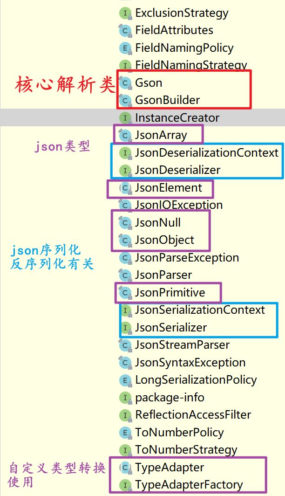
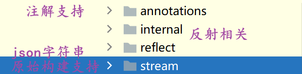
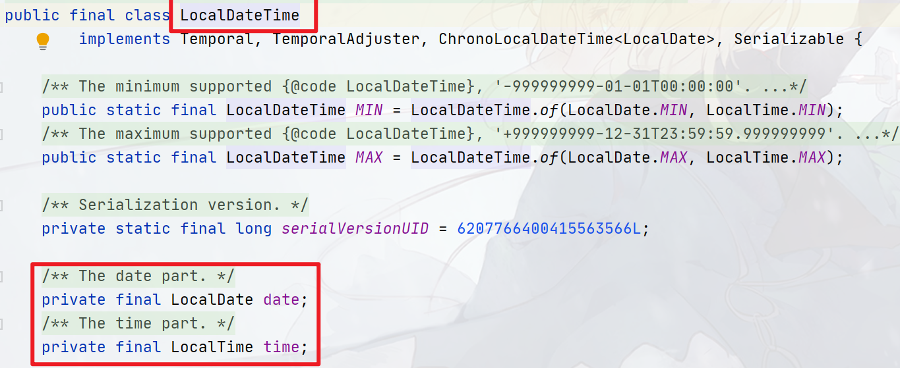
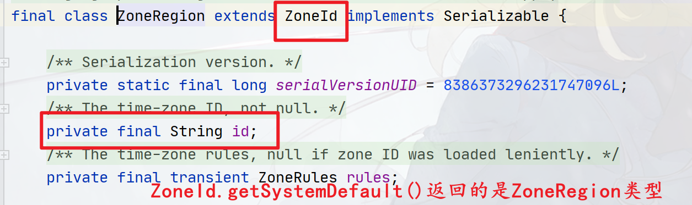
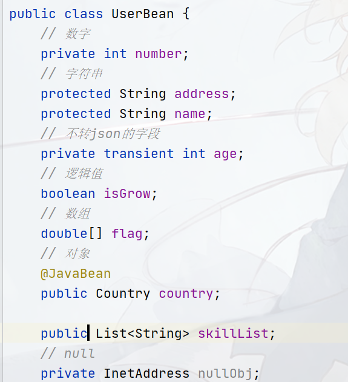

## Java-Json

所谓的`Json`是一种简单的数据传递格式，其[官网](https://www.json.org/json-zh.html)的介绍如下：



处理`Json`的库在`Java`中有非常多，具体可以参考官网的清单，本篇文章根据众多库的热度（更新时间和使用人数）和规模（包的数量，不算传递依赖）进行统筹，选择了部分`Json`库进行介绍：

- `Gson`：`google`出品，最后一次更新时间`Jan 06, 2023`，最新版本`2.10.1`，标准规模（单包，库），千人规模使用！
- `Jackson`：`fasterxml`出品，最后一次更新时间`May 31, 2023`，版本`2.15.2`，大规模（基础`Json`解析包含`3`个包，另外官网`GitHub`上有各种和其他库的联动包），千人规模使用！
- `fastjson`：`alibaba`出品，最后一次更新在`Sep 03, 2023`，版本是`2.0.40`，标准规模（单包，库），另有`fastjson2`版本，效率和安全性上比一代版本要好！使用规模没有`jackson`和`Gson`高
- `JSON In Java`：`Json`官方的解析器，最后一次更新在`Jun 18, 2023`，版本是`20230618`，属轻量级框架（单包，工具类），百人规模使用
- `Json-lib`：`apache`出品的`Json`库，非常老的解析库了，最后一次更新是`13`年前！
- `MJson`：全程`Minimal Json Library`，超轻量级包（单类）
- `JSONUtil`：[官方地址](https://github.com/billdavidson/JSONUtil)，最后一次更新`Oct 05, 2016`，属轻量级框架

所有`Json`库的功能无外乎：

- `Json`解析与转换（`Json`库的核心功能，包括`Json`与`Bean`的转换、`Java`类型和`Json`类型对应等）
- `Json`库特性（包括库的一些工具类和注解使用、`Json`的`CRUD`、`Json`验证、`Json`格式化等）。所上面所有的库也是围绕这几块内容来进行介绍。

> 注意：
> 博主一直有一个困扰,，那就是FastXML到底是一家公司还是一个库, 因为在使用Json的库的时候，博主一直以为fastxml是阿里巴巴的一个开源库,导致傻傻分不清。
>
> 这里做最后总结：
> 1. 阿里巴巴开源的Json库名字就叫FastJSON, 现在已经出到2版本, 即FastJSON2。阿里巴巴从来都没有一个叫FastXML的库, 但在FastJSON中，存在一个FastXML的模块，使用这个模块可以处理简单的XML文件
> 2. fastxml是一家公司, 这家公司开发了一个专门处理Json的库叫Jackson。

### Gson

`Gson`库是`google`出品的`Json`解析库，基于反射，可以实现`Json`对象、`Json`字符串和`Java`对象互转换。

- 官网`Github`地址：https://github.com/google/gson
- 官方`UserGuide`：https://github.com/google/gson/blob/main/UserGuide.md#gson-user-guide

`Gson`的核心类库内容不多，其包中供我们使用的基础功能类如下：

除了上面这些之外，我们还需要注意`JsonParser`和`JsonStreamParser`类，这两个类能将`json`字符串直接转为`json`的类型，即`JsonElement`及其子类。

除此之外，包中还有很多`XXXPolicy`和`XXXStrategy`类，这些类一般用来解决`Json`的转换策略以及特殊类型的转换方式。

而在`Gson`的子包中，还包含了一些基础功能：

#### 解析与转换

`Gson`库中核心用于解析和转换的类就是`Gson`类，该类可以直接`new Gson()`来使用：

```java
Gson gson = new Gson();
```

`Gson`类中使用`toJson()`方法将一个`Java`对象转为`Json`字符串（序列化），`toJson()`方法有很多重载：

```java
// 提供一个JsonElement对象，代表一个Json对象，该对象介于Java对象和Json字符串中间，类似于一个中间产物
public String toJson(JsonElement jsonElement);
// Appendable代表一个可拼接字符串序列的对象，如StringBuilder、StringBuffer、所有Writer的IO子类、CharBuffer及其子类等
// jsonElement转出来的json字符串会被拼接在writer里面
public void toJson(JsonElement jsonElement, Appendable writer) throws JsonIOException;
// 同上，JsonWriter是Gson用于生成Json字符串的Writer IO类
// 生成的Json字符串会被放在这个JsonWriter对象内。
// 如果你只想创建一个临时的Json字符串，可以使用这个类代替手工拼接的方式！
public void toJson(JsonElement jsonElement, JsonWriter writer) throws JsonIOException;

// ！！最常用！！，将任何Java对象转为Json字符串！
public String toJson(Object src);
// 同上，转化的Json字符串会被放在writer对象中
public void toJson(Object src, Appendable writer) throws JsonIOException;
// Type接口是Java反射中Type系统的顶层接口，Class<T>实现了该接口
// 因此可以在调用该方法的时候传递src的Class对象来确定类型！
public String toJson(Object src, Type typeOfSrc);
public void toJson(Object src, Type typeOfSrc, Appendable writer) throws JsonIOException;
public void toJson(Object src, Type typeOfSrc, JsonWriter writer) throws JsonIOException;
```

而其中最常用的方法如下：

```java
// ！！最常用！！，将任何Java对象转为Json字符串！
public String toJson(Object src);
```

在上面的重载体中，你可能会对`JsonWriter`、`JsonElement`等类感兴趣，这些类我们会在后面介绍，他们是`Gson`库的重要部分。使用`Gson`序列化的过程中，要特别注意：

1. `Gson`的序列化是基于字段方面的而非`Setter`、`Getter`方法，因此序列化的时候，即便没有`Setter`、`Getter`方法也会序列化、反序列化成功！

2. 另外序列化过程中，如果`Gson`序列化的是一个`Java`对象而非基本类型或者`String`，则他会递归序列化该`Java`对象的内部字段，直到该对象的所有成员字段被输出成`json`字符串为止，如有以下对象：

   ```java
   public class Country {
       // 值：China
       private String countryName;
       // 值：Asia/Shanghai
       private ZoneId zoneId;
       // 值：2023-11-2T18:23:29.934
       private LocalDateTime now;
       // 其他Setter和Getter
   }
   ```

   则序列化结果会是：

   ```json
   {
       "countryName":"China",
       "zoneId":{"id":"Asia/Shanghai"},
       "now":{
           "date":{
               "year":2023,
               "month":11,
               "day":2
           },
           "time"{
           	"hour":18,
               "minute":23,
               "second":29,
               "nano":934000000
       	}
   	}
   }
   ```

   你可能会好奇`now`里面的`date`、`time`字段还有`zoneId`里面的`id`是怎么回事？他们实际上都是`LocalDateTime`类和`ZoneId`类内部的字段

3. `Gson`默认不序列化`transient`字段！

   ```java
   class BagOfPrimitives {
     private int value1 = 1;
     private String value2 = "abc";
     private transient int value3 = 3;
     BagOfPrimitives() {
       // no-args constructor
     }
   }
   
   // Serialization
   BagOfPrimitives obj = new BagOfPrimitives();
   Gson gson = new Gson();
   String json = gson.toJson(obj);
   
   // ==> {"value1":1,"value2":"abc"}
   // value3是transient字段，所以不序列化！
   ```

4. `Gson`默认不序列化`null`字段！

   ```java
   public class Country {
       // 值：China
       private String countryName;
       // 值：null
       private ZoneId zoneId;
          // 值：null
       private LocalDateTime now;
       // 其他Setter、Getter等
   }
   ```

   结果：

   ```json
   {"countryName":"China"}
   // zoneId和now因为是null将会被忽略！
   ```

----

`Gson`类中使用`fromJson()`方法将一个`Json`字符串转为`Java`对象，同样`fromJson()`方法有很多重载：

```java
public <T> T fromJson(JsonElement json, Class<T> classOfT) throws JsonSyntaxException;
public <T> T fromJson(JsonElement json, Type typeOfT) throws JsonSyntaxException;
public <T> T fromJson(JsonElement json, TypeToken<T> typeOfT) throws JsonSyntaxException;
// JsonReader是JsonWriter的对应读IO
public <T> T fromJson(JsonReader reader, Type typeOfT) throws JsonIOException, JsonSyntaxException;
public <T> T fromJson(JsonReader reader, TypeToken<T> typeOfT) throws JsonIOException, JsonSyntaxException;

public <T> T fromJson(Reader json, Class<T> classOfT) throws JsonSyntaxException, JsonIOException;
public <T> T fromJson(Reader json, Type typeOfT) throws JsonIOException, JsonSyntaxException;
public <T> T fromJson(Reader json, TypeToken<T> typeOfT) throws JsonIOException, JsonSyntaxException;

// classOfT代表待转换的Java类型
// 常用！！！
public <T> T fromJson(String json, Class<T> classOfT) throws JsonSyntaxException;
// typeOfT代表待转换的Java类型
public <T> T fromJson(String json, Type typeOfT) throws JsonSyntaxException;
// TypeToken<T>代表待转换的类型，该方法一般用于泛型和数组，前面两个重载体都不支持泛型！因为类型擦除之后都会变成Object
public <T> T fromJson(String json, TypeToken<T> typeOfT) throws JsonSyntaxException;
```

`TypeToken<T>`，一些旧版本你可以直接`new`一个`TypeToken`对象，然后传递一个泛型类型：

```java
TypeToken<List<String>> typeToken = new TypeToken<>();
```

但在后面的版本中，`TypeToken`被设置为无法`new`，你可以通过其静态方法进行创建：

```java
public static <T> TypeToken<T> get(Class<T> type);
public static TypeToken<?> get(Type type);
// 如果待转换对象是一个数组类型，只需要指定数组的原始类型
public static TypeToken<?> getArray(Type componentType);
// 如果待转换对象是一个泛型
public static TypeToken<?> getParameterized(Type rawType, Type... typeArguments);
```

#### GsonBuilder（定制序列化规则）

定制化`Gson`的一些设置可以使用`GsonBuilder`类，`GsonBuilder`类是一个专门实例化`Gson`实例的类，采用构建者模式实现，要创建一个`Gson`可以这样调用：

```java
GsonBuilder builder = new GsonBuilder();
// 一些设置代码
Gson gson = builder.create();
```

设置代码如下：

> 设置序列化和反序列化排除规则

```java
// 应用ExclusionStrategy接口中的shouldSkipClass()、shouldSkipField()来再序列化和反序列化过程中排除掉某些字段！
public GsonBuilder addDeserializationExclusionStrategy(ExclusionStrategy strategy);
public GsonBuilder addSerializationExclusionStrategy(ExclusionStrategy strategy);
public GsonBuilder setExclusionStrategies(ExclusionStrategy... strategies);
// 排除带有指定修饰符的字段，modifiers可以使用反射中的Modifiers类
public GsonBuilder excludeFieldsWithModifiers(int... modifiers);
// 排除所有不带@Expose注解的字段！
public GsonBuilder excludeFieldsWithoutExposeAnnotation();
```

> 开关类配置：

```java
// Gson默认在序列化String对象的时候，使用Unicode编码点转义String对象中Html的一些关键字符，如：<会被转义成：\u003c、>会被转义成：\u003e，调用该选项禁止转义，保留源字符！
public GsonBuilder disableHtmlEscaping();
// 禁止序列化内部类
public GsonBuilder disableInnerClassSerialization();
// 不使用sun.misc.Unsafe类来创建不带默认构造器的反序列化对象！
public GsonBuilder disableJdkUnsafe();
// 允许使用引用类型作为map的key进行序列化和反序列化，如序列化Map<Pointer, String>，默认调用key的toString()方法作为key，如Pointer的toString()
public GsonBuilder enableComplexMapKeySerialization();
// 通过为生成的JSON添加一些特殊的文本前缀，使输出的JSON在Javascript中不可执行。这可以防止第三方网站通过脚本来源进行攻击。
public GsonBuilder generateNonExecutableJson();
// Gson默认不序列化值为null的字段，调用此项让Gson序列化null字段！
public GsonBuilder serializeNulls();
// 序列化特殊浮点型，如infinite、NaN等
public GsonBuilder serializeSpecialFloatingPointValues();
```

> 自定义类型适配器

```java
public GsonBuilder registerTypeAdapter(Type type, Object typeAdapter);
public GsonBuilder registerTypeAdapterFactory(TypeAdapterFactory factory);
public GsonBuilder registerTypeHierarchyAdapter(Class<?> baseType, Object typeAdapter);
```

> Json key序列化规则

```java
public GsonBuilder setFieldNamingPolicy(FieldNamingPolicy namingConvention);
public GsonBuilder setFieldNamingStrategy(FieldNamingStrategy fieldNamingStrategy);
```

> 设置日期序列化格式

```java
public GsonBuilder setDateFormat(String pattern);
public GsonBuilder setDateFormat(int style);
public GsonBuilder setDateFormat(int dateStyle, int timeStyle);
```

> Json规范、格式化等

```java
public GsonBuilder setLenient();
public GsonBuilder setLongSerializationPolicy(LongSerializationPolicy serializationPolicy);
public GsonBuilder setNumberToNumberStrategy(ToNumberStrategy numberToNumberStrategy);
public GsonBuilder setObjectToNumberStrategy(ToNumberStrategy objectToNumberStrategy);
public GsonBuilder setPrettyPrinting();
```

> 版本限制

```java
public GsonBuilder setVersion(double version);
```

##### 排除规则

1. 可以排除指定修饰符的字段：

   ```java
   public GsonBuilder excludeFieldsWithModifiers(int... modifiers);
   ```

   如有下`JavaBean`：

   

   则我们排除`Public`、`Default`级别的字段的输出：

   ```java
   // 默认：
   {"number":174,"address":"XXX省XXX市XXX镇XXXXX","name":"5955c18d-2e04-4186-8ab5-bcad5da2f02c","isGrow":false,"flag":[2.5,3.5999999046325684,4.800000190734863,5.099999904632568,3.9000000953674316],"country":{"countryName":"Asia/Shanghai","zoneId":{"id":"Asia/Shanghai"},"now":{"date":{"year":2023,"month":11,"day":2},"time":{"hour":19,"minute":44,"second":21,"nano":536000000}}},"skillList":["C++","Java","C"]}
   
   // 设置：GsonBuilder gsonBuilder = new GsonBuilder().excludeFieldsWithModifiers(Modifier.PROTECTED, Modifier.PUBLIC);
   {"number":174,"age":71,"isGrow":false,"flag":[2.5,3.5999999046325684,4.800000190734863,5.099999904632568,3.9000000953674316]}
   ```

2. 排除所有不带`@Expose`注解的字段！

   ```
   
   ```

   

#### 树型解析、流式解析、数据类型解析和绑定


#### 序列化和反序列化


#### 原始Json字符串解析和创建


#### Gson中的注解


### FastJson


