# Java图形化

首先`Java`本身图形化库比较丰富的，`Java`本身有三代图形化库：

- `AWT`
- `Swing`
- `JavaFX`

其中`AWT`在`Java`中更多的是充当底层事件基础的角色，一般谈到`Java`图形化时，我们更原因称`AWT`时窗口工具包的底层机制，`Swing`则是这底层机制的上层建筑。而`JavaFX`则是`2007`年为了打败`flash`的地位，`Sun`公司的一次尝试，它拥有更加现代化的`UI`感官，组件也更为丰富。本文章主要介绍上面这三种图形化库，文章比较长，可以挑着来看。

`Java`的图形化除了官网自带的这些（~~现在JavaFX也被剥离开交给社区维护了~~），也有很多第三方非常优秀的库，如`eclipse`的`SWT`、`JGoodies`这些，这些第三方库会在额外的章节里面给大家介绍。

我们会先从`AWT`开始介绍，由于`Swing`中部分内容仍然引用`AWT`，比如事件处理，所以我们在介绍Swing时，部分内容会采用补充的方式来介绍，比如在Swing中引入了哪些新事件和新布局等，如不理解，可以跳转到相关章节补充完前置知识。

## AWT

作为`Java`中经典的图形化界面，`AWT`当之无愧。`AWT`，全称`Abstract Window Toolkit`，可以说是整个`Java`图形化体系的底层建筑，即便如`Swing`这种提供了非常丰富组件和强大功能的`Java`图形库，其事件等机制仍然是基于`AWT`的。

`AWT`本身也提供一些组件库，但是数量非常有限，本身底层采用`C`语言编写，因此现阶段很少`Java`图形化是采用`AWT`组件的，大多数还是采用`Swing`或者更加好看的`JavaFX`。

使用`AWT`创建的图形界面应用和所在的运行平台有相同的界面风格，比如在`Windows`操作系统上，它就表现出`Windows`风格。在`UNIX`操作系统上，它就表现出`UNIX`风格。`Sun`希望采用这种方式来实现`Write Once, Run Anywhere`的目标。

要想学习`AWT`的图形化，大概可以从下面这几个方向来处理：

- 窗口布局：也就是所谓的`layout`，决定组件的排列和对齐拉伸方式等。
- 窗口组件：最核心的内容，窗口组件如按钮、文本框、选择框、窗口等等。
- 事件处理：最核心的内容，决定了组件的行为，如当按下按钮时出发一些操作。
- 图形相关：比较杂的分类，任何和绘图相关的、操作系统操作相关的都算，如字体设置、图形绘画（矩形、圆等）、图像处理
- 桌面环境：显示模式（分辨率、全屏等）、底层的图形工具类、系统任务栏操作、系统桌面操作、桌面快捷方式、鼠标图标样式等等
- 实现底层：`AWT`事件模型、`Swing MVC`架构、感官设计、自定义实现组件等

其中【窗口布局】、【窗口组件】、【事件处理】为学习图形化的基础，了解这三个内容后，你将能够完全创建自己的交互界面，保证基本的业务功能实现，而了解完这三方面内容之后，如果你对`Swing`感兴趣，则可以直接跳转到`Swing`相关的章节，而如果此时你需要更加高级别的自定义，比如学习`Canvas`画板，自定自己的字体、图形绘制以及桌面环境内容（剪贴板、设备上下文、显示器等等），则可以深入学习【图形相关】、【桌面环境】两章节。而当你完完全全了解这些内容之后，如果希望更加深入了解`AWT`的底层实现，则可以跳转到【实现底层】章节，此章节我们会整体介绍整个`AWT`的架构和源代码。

我们会通过制作一个`AwtSets`的程序来学习【窗口布局】、【窗口组件】、【事件处理】这三部分内容，这个程序功能很简单，就是包含所有组件的一个演示程序（如果您看过类似的`SwingSets`的话），目的是让您熟练如何使用这些内容，当然这也仅仅是最基础的部分，想要完完全全了解所有内容，少不了其他必要的`Demo`程序，因此我们的教程会穿插额外的程序来让您了解这三部分的使用，但这也可能会导致我们的`AwtSets`程序越来越复杂，请做好心理准备。

我们最初版本的`AwtSets`程序类似下图，当然由于历史原因，我们本次的程序可能不完全长这样（此程序是尚未添加布局，添加事件的版本），但基础的功能基本大差不差：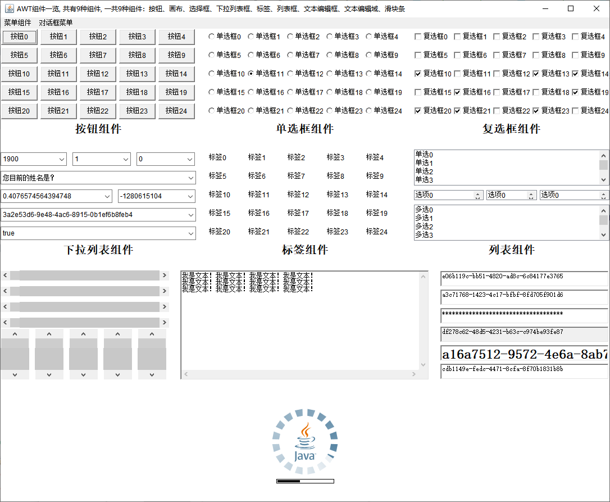

### 第一个AWT的窗口

想要制作我们的`AwtSets`程序，那第一步我们就要开始学习如何创建`Awt`窗口。

在`AWT`中，有一个类叫`Frame`，其对象代表一个窗口，可以直接使用这个类来创建一个窗口。创建一个窗口的步骤一般如下：

1. 继承`Frame`类
2. 设置窗口的大小和在屏幕中出现的位置（`bounds`），这一步通过调用`Frame`类提供的`setBounds(int x， int y, int width, int height)`实现
3. 添加关闭按钮事件处理，具体是重写`WindowListener`接口中的`windowClosing`方法
4. 设置窗口可视，也就是`Visible`属性，靠`Frame`中的`setVisible()`方法

步骤的参考代码如下：

```java
public class AWTEmptyWindows1 extends Frame {
    public AWTEmptyWindows1(){
        // 设置窗口显示位置和大小
        setBounds(200, 200, 500, 500);
        // 设置标题
        setTitle("第一个AWT窗口");
        // 默认情况下AWT窗口关闭按钮没反应，需要自己定义关闭按钮的行为，使用下面的语句可以实现关闭功能，实际上是一个事件监听，后面会介绍
        addWindowListener(new WindowAdapter() {
            @Override
            public void windowClosing(WindowEvent e) {
                System.exit(0);
            }
        });
        // 显示窗口，窗口可视
        setVisible(true);
    }

    public static void main(String[] args) {
        new AWTEmptyWindows1();
    }
}
```

这里针对上面的步骤做一些解释：

首先你可能在一些其他的`AWT`窗口代码中看到它们并不继承`Frame`而是将`Frame`以类字段的形式存放：

```java
public class AWTEmptyWindows2 {
    private Frame windows;

    // 如果窗口组件比较多的时候，可以采用init方法进行分类初始化
    private void initWindows(){
        // 初始化窗口，并指定窗口标题
        windows = new Frame("第一个AWT窗口");
        // 设置窗口位置和大小
        // windows.setBounds(200,200,500,500);
        // 设置窗口不可以被调节大小
        windows.setResizable(false);
        // 添加事件处理器，这个后面会介绍
        windows.addWindowListener(new WindowAdapter() {
            @Override
            public void windowClosing(WindowEvent e) {
                System.exit(0);
            }
        });
    }

    private void visibleWindows(){
        windows.setVisible(true);
    }

    public AWTEmptyWindows2(){
        initWindows();
        visibleWindows();
    }

    public static void main(String[] args) {
        new AWTEmptyWindows2();
    }
}
```

这是软件设计原则中合成复用原则的建议，如果你想创建的是多个窗口的窗口集合（参考文档窗口）建议采用这种方式而非直接继承`Frame`：

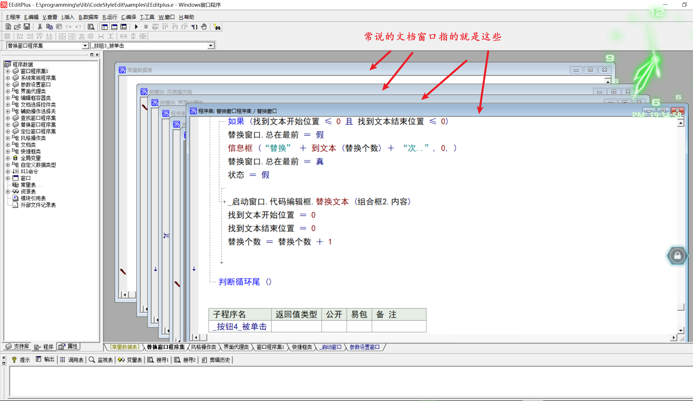

其次，当`Frame`对象创建出来的时候，其默认的窗口大小和位置是`x=0，y=0，width=0，height=0`，因此会出现运行窗口只有标题栏的情况：

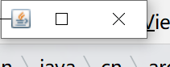

然后是添加关闭按钮事件处理器，默认情况下，`frame`窗体右上角会有三个按钮：最大化、最小化、关闭，其中最大化、最小化是能够用的，但是关闭按钮却没反应（~~奇怪的设计，后面Swing的JFrame就没那么多屁事~~），因为我们需要监听关闭按钮的点击动作。控制窗口这些最大化、最小化、关闭等事件的处理器是`windowListener`接口。

最后是`Visible`属性，默认情况下当`frame`实例创建出来之后，也不会直接显示在屏幕上，因为默认窗口实例是不可见的，可以理解成隐藏在屏幕上了（实际上在屏幕，但是你看不到）。早期`AWT`提供了`show()`方法，来让窗口变得可视，但是这个方法在`JDK1.5`版本之后被`setVisible()`方法给代替了。

**另外如果你希望创建出来的窗口没有关闭、最大化等按钮**，则可以使用`Window`类，它是`Frame`的直接父类，并且在多屏幕环境下，可以使用该类来做窗口矩形的兼容！

#### AwtSets窗口编写

那么为我们的`AwtSets`程序编写一个窗口吧，利用上面学过的知识，由于我们的`AwtSets`有一个主窗口，因此我们采用继承的形式来编写即可。

我们需要做的步骤如下：

1. 创建`AwtSets`窗口类，继承`Frame`类
2. 设置窗口的大小和在屏幕中出现的位置（`bounds`），设置标题
3. 添加关闭按钮事件处理
4. 设置窗口可视

参考代码如下：

```java
public class AwtSets extends Frame {

    public AwtSets(){
        // 设置标题
        setTitle("AwtSets");
        // 设置窗口大小和屏幕中出现的位置
        setBounds(0, 0, 500, 500);
        // 添加关闭按钮事件监听
        addWindowListener(new WindowListener() {
            @Override
            public void windowOpened(WindowEvent e) {

            }

            @Override
            public void windowClosing(WindowEvent e) {
                System.exit(0);
            }

            @Override
            public void windowClosed(WindowEvent e) {

            }

            @Override
            public void windowIconified(WindowEvent e) {

            }

            @Override
            public void windowDeiconified(WindowEvent e) {

            }

            @Override
            public void windowActivated(WindowEvent e) {

            }

            @Override
            public void windowDeactivated(WindowEvent e) {

            }
        });
        // 设置可视
        setVisible(true);
    }

    public static void main(String[] args) {
        new AwtSets();
    }
}
```

运行代码之后你将会看到有一个空白的窗口弹出，并且可以被关闭：

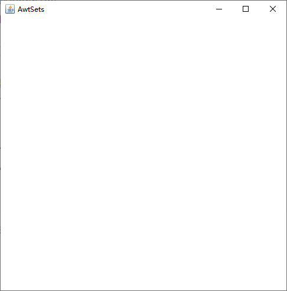

// todo 优化

### AWT容器组件布局

复杂的窗口内部可能会包含几十个客户类组件，这些客户类组件在容器组件中如何排列，组件组件之间如何编排、对齐等，这些都是很麻烦的问题，其中不仅涉及到`GUI`的美观还涉及到用户习惯，虽然在不考虑这些的情况下，你大可以将一个组件随便放置在窗口的任何位置（通过调用组件的`setBounds()`、`setSize()`等方法进行绝对定位），但即便如此，当你的窗口是可拉伸的时候，你仍然需要考虑拉伸窗口之后的组件排列和拉伸问题。

因此开发者虽然可以自己去定义每一个组件的宽高、位置、和拉伸结果，但这非常麻烦。好在`Java`提供了**窗口布局管理器**来处理这种组件的拉伸和缩小，实现组件的自适应，大大减少了布局上的麻烦。

在`AWT`包中，共提供了`5`种布局：`BorderLayout`、`CardLayout`、`FlowLayout`、`GridLayout`、`GripBagLayout`。

所有的布局都是接口`LayoutManager`或者`LayoutManager2`的实现类，当我们需要实现自己的布局的时候则需要实现这两个接口中的其中一个：

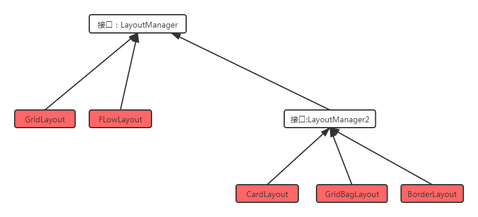

#### BorderLayout

`BorderLayout`将容器分为`EAST`、`SOUTH`、`WEST`、`NORTH`、`CENTER`五个区域，客户区组件可以被放置在这`5`个区域的任意一个中 。`BorderLayout`布局管理器的布局示意图如图所示 ：

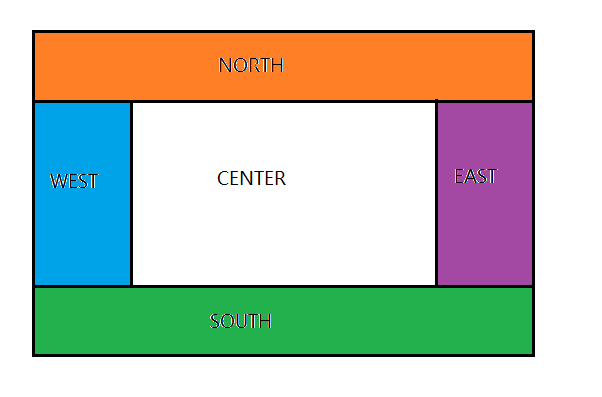

该布局有如下特点：

1. 当向使用`BorderLayout`布局管理器的容器中添加组件时，需要指定要添加到哪个区域中。如果没有指定添加到哪个区域中（`BorderLayout`内有5个区域常量：`BorderLayout.CENTER`、`BorderLayout.SOUTH`、`BorderLayout.EAST`、`BorderLayout.WEST`、`BorderLayout.NORTH`），则默认添加到中间区域中。

   ```java
   frame.setLayout(new BorderLayout());
   // public void add(Component comp, Object constraints);
   frame.add(button, BorderLayout.CENTER);
   ```

2. 如果向同一个区域中添加多个组件时，后放入的组件会覆盖先放入的组件。

3. `CENTER`区域会占据掉其他区域的位置，如果你没有往`WEST`、`EAST`、`NORTH`、`SOUTH`放组件，则`CENTER`会占领这些区域的位置

4. 拉伸容器的大小会连带影响`CENTER`区域大小，而其他四周区域不变！

5. 四周区域的大小随组件的大小决定！


`BorderLayout`还有两个属性：`hgap`（水平间距）和`vgap`（垂直间距），其中水平间距设置`CENTER`和`WEST`、`EAST`之间的距离，垂直间距设置`CENTER`和`NORTH`、`SOUTH`之间的距离：

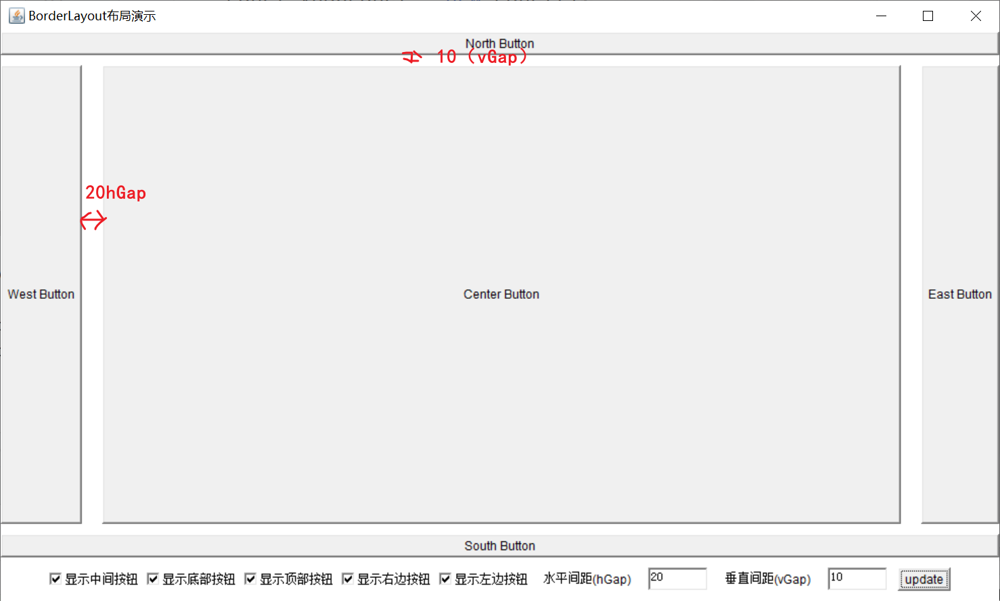

`BorderLayout`的使用方法和`API`如下：

| 构造方法                           | 方法功能                                                     |
| ---------------------------------- | ------------------------------------------------------------ |
| `BorderLayout()`                   | 使用默认的水平间距（0）、垂直间距（0）创建 `BorderLayout`布局管理器 。 |
| `BorderLayout(int hgap,int vgap):` | 使用指定的水平间距、垂直间距创建`BorderLayout`布局管理器。   |

容器组件类`Container`提供了`add`方法来辅助我们往布局中添加组件，`add`方法有很多重载，在`BorderLayout`中，我们一般使用下面的`add`重载来处理`BorderLayout`：

```java
public void add(Component comp, Object constraints);
// 参数一comp提供要放入的组件
// 参数二constraints提供要放入的位置，有五个常量：BorderLayout.CENTER、BorderLayout.SOUTH、BorderLayout.EAST、BorderLayout.WEST、BorderLayout.NORTH
// 例如：
Frame frame = ...;

Button button1 = new Button("按钮1");
Button button2 = new Button("按钮2");
Button button3 = new Button("按钮3");
Button button4 = new Button("按钮4");
Button button5 = new Button("按钮5");

frame.setLayout(new BorderLayout());
// 相当于frame.add(button1, BorderLayout.CENTER);
frame.add(button1);
frame.add(button2, BorderLayout.SOUTH);
frame.add(button3, BorderLayout.EAST);
frame.add(button4, BorderLayout.WEST);
frame.add(button5, BorderLayout.NORTH);
```

#### CardLayout

`CardLayout`布局管理器以时间而非空间来管理它里面的组件，它将加入容器的所有组件看成一叠卡片（每个卡片其实就是一个组件），每次只有最上面的那个`Component`才可见。就好像一副扑克牌，它们叠在一起，每次只有最上面的一张扑克牌才可见。

`CardLayout`提供了了基本一些方法来让你能够切换、定位卡片，下面是`CardLayout`的布局的展示：


`CardLayout`的特点：

1. `CardLayout`本身提供进行翻页的方法，如：`previous()`、`next()`、`first()`、`last()`等，用于设置顶层显示的组件。
2. 容器调用`add()`添加子组件的顺序决定了`CardLayout`的切换顺序，如果需要指定特定的叠层顺序，则需要使用带`index`参数的`add()`
3. `CardLayout`中的层叠组件是通过遍历容器内部维护的子组件`ArrayList`实现的，因此通常在使用`CardLayout`的时候建议将其作为字段而非局部变量（毕竟要使用`CardLayout`的方法）
4. 如果对容器内的组件进行增删改查，也会影响到`CardLayout`，因为`CardLayout`相当于将多个组件进行层叠放在一个组件的位置上进行切换显示，当我们删除组件的时候，也会影响`CardLayout`本身

下面是`CardLayout`的构造器和方法：

| 方法名称                            | 方法功能                                                     |
| ----------------------------------- | ------------------------------------------------------------ |
| `CardLayout()`                      | 创建默认的`CardLayout`布局管理器。                           |
| `CardLayout(int hgap,int vgap)`     | 通过指定卡片与容器左右边界的间距（`hgap`）、上下边界（`vgap`）的间距来创建`CardLayout`布局管理器. |
| `first(Container target)`           | 显示`target`容器中的第一张卡片.                              |
| `last(Container target)`            | 显示`target`容器中的最后一张卡片.                            |
| `previous(Container target)`        | 显示`target`容器中的前一张卡片.                              |
| `next(Container target)`            | 显示`target`容器中的后一张卡片.                              |
| `show(Container taget,String name)` | 显示 `target`容器中指定名字的卡片.                           |

`CardLayout`的`API`和切换组件相关的方法都需要提供对应的容器组件对象，这直接证明了切换的组件来自容器组件本身而非布局（布局不负责存储任何的组件，而仅仅管理组件如何展示和排列），直接证明了上面的第二和第三点。

使用了`CardLayout`的容器组件需要使用下面的`add`方法来添加子组件：

```java
// 该方法更加直接！但该方法属于JDK 1.0遗留方法，官方并不建议使用，建议用第二个方法代替
public Component add(String name, Component comp);
// 参数1提供要添加的子组件，参数2需要提供一个字符串，代表该组件的名字，用于show()方法的定位
public void add(Component comp, Object constraints);
// 如果需要指定子组件的层叠显示顺序，可以使用这个方法
public void add(Component comp, Object constraints, int index);

Container c = ...;
CardLayout layout = new CardLayout();
c.setLayout(layout);
Button b1 = new Button("b1");
Button b2 = new Button("b2");
BUtton b3 = new Button("b3");

// 顺序 button3 --> button1 --> button2
c.add(b1, "button1");
c.add("button2", b2);
c.add(b3, "button3", 0);

// 调用方法：
layout.first(c);
layout.last(c);
layout.next(c);
layout.previous(c);
layout.show(c, "button1");
```

#### FlowLayout

`FlowLayout`布局管理器中，组件像水流一样向某方向流动 (排列) ，遇到障碍(边界)就折回，重头开始排列。

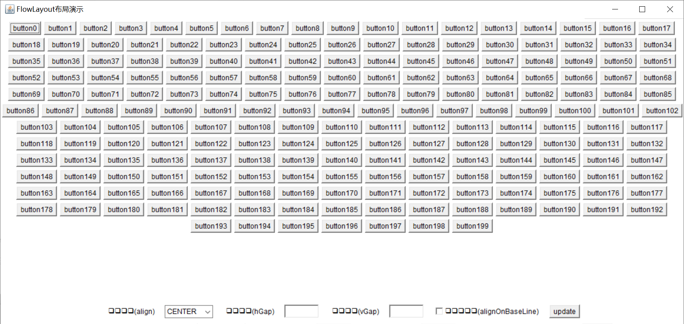

可以看到按钮从左到右流式排列，当右边的边距不够的时候，会换行继续排列！

`FlowLayout`主要有如下特点：

1. 一行能容纳多少个组件取决于父容器的大小，拉伸父类容器则一行就能容纳更多组件
2. 可以设置组件之间的水平间距和垂直间距
3. 可以设置组件的对齐方式，默认是从左到右对齐排列，也可以从右到左或者中间对齐等，`FlowLayout`提供了`3`个常用的对齐方式常量： `FlowLayout.LEFT`（左对齐） 、 `FlowLayout.CENTER` （中间对齐）、`FlowLayout.RIGHT`（右对齐）
4. `FlowLayout`还提供了两个根据容器内排列属性（即`ComponentOrientation`）来决定对齐方式的常量：`FlowLayout.LEADING`、`FlowLayout.TRAILING`。具体是：
   1. 如果容器组件设置了`ComponentOrientation`属性为`LEFT_TO_RIGHT`（或者`UNKNOWN`），`FlowLayout`设置了`FlowLayout.LEADING`，则其排列效果就是 `FlowLayout.LEFT`
   2. 如果容器组件设置了`ComponentOrientation`属性为`RIGHT_TO_LEFT`，`FlowLayout`设置了`FlowLayout.LEADING`，则其排列效果就是 `FlowLayout.RIGHT`
   3. 如果容器组件设置了`ComponentOrientation`属性为`LEFT_TO_RIGHT`（或者`UNKNOWN`），`FlowLayout`设置了`FlowLayout.TRAILING`，则其排列效果就是 `FlowLayout.RIGHT`
   4. 如果容器组件设置了`ComponentOrientation`属性为`RIGHT_TO_LEFT`，`FlowLayout`设置了`FlowLayout.TRAILING`，则其排列效果就是 `FlowLayout.LEFT`


和`BorderLayout`一样，提供了`hgap`（水平间距）和`vgap`（垂直间距）。

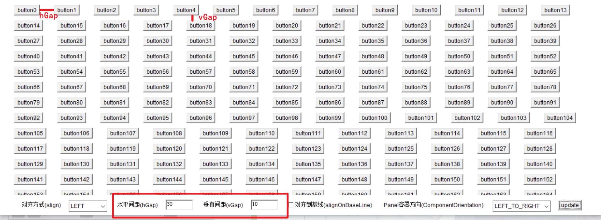

`FlowLayout`的`API`如下：

| 构造方法                                  | 方法功能                                                     | 备注                                                         |
| ----------------------------------------- | ------------------------------------------------------------ | ------------------------------------------------------------ |
| `FlowLayout()`                            | 使用默认的对齐方式及默认的垂直间距、水平间距创建`FlowLayout`布局管理器。 |                                                              |
| `FlowLayout(int align)`                   | 使用指定的对齐方式及默认的垂直间距、水平间距创建`FlowLayout`布局管理器。 | `align`参数主要有五个常量，即：`FlowLayout.LEFT`（左对齐） 、 `FlowLayout.CENTER` （中间对齐）、`FlowLayout.RIGHT`（右对齐）、`FlowLayout.LEADING`、<br />`FlowLayout.TRAILING` |
| `FlowLayout(int align,int hgap,int vgap)` | 使用指定的对齐方式及指定的垂直问距、水平间距创建`FlowLayout`布局管理器。 |                                                              |

容器组件类，在`FlowLayout`中，我们一般使用下面的`add`重载来处理：

```java
// 将组件放到容器的最后，该组件将会被最先进行绘制
public Component add(Component comp);

// panel默认就是FlowLayout
Panel panel = new Panel(new FlowLayout());

Button button1 = new Button("按钮1");
Button button2 = new Button("按钮2");
Button button3 = new Button("按钮3");
Button button4 = new Button("按钮4");
Button button5 = new Button("按钮5");

panel.add(button1);
panel.add(button2);
panel.add(button3);
panel.add(button4);
panel.add(button5);
```

#### GridLayout

`GridLayout`也叫网格布局，该布局管理器将容器分割成纵横线分隔的网格，每个网格所占的区域大小相同。在使用网格布局的时候，我们可以将容器平等地划分成各个格子：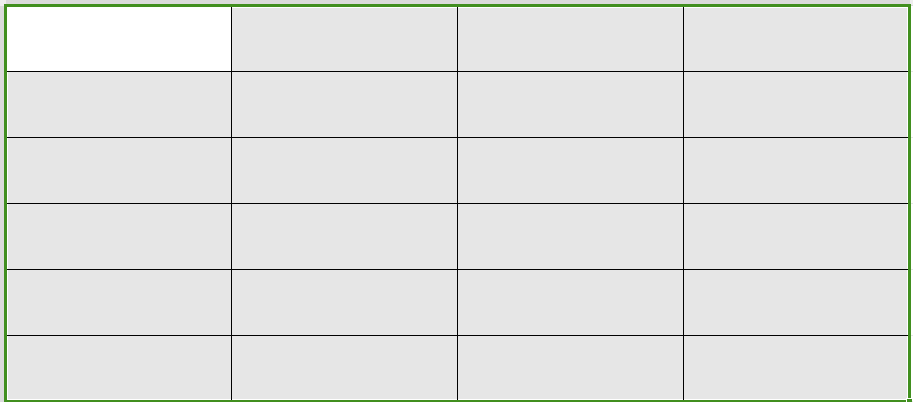

然后将子组件自上而下、自左到右铺满整个容器（注意不是格子，虽然我们可以这样理解，但是实际上子组件不够的时候并不会留出未使用的网格，参考下面动图）

// todo 图 

`GridLayout`主要特点：

1. 网格内的子组件会无时无刻地铺满整个网格（子组件宽高恒等于网格宽高），并且添加子组件的时候，默认是从上到下，从左到右的顺序填入。
2. 当预定的网格数大于实际填入容器的子组件数量，比如预创建了`5x5`的网格，但实际上只放入了`7`个子组件，则当前组件的排列可能是呈现`2x3+1`的形式的而非预定于的`5x5`，但是这`2x3+1`的网格仍然会沾满整个容器的大小（即`2x3+1`和`5x5`最后呈现的整个容器的大小是相同的，仅仅会调整网格的大小而非容器），如下面两个图都是采用`5x5`的网格布局，但第一个图只添加`10`个组件，第二个图添加了`25`个组件，容器的宽度和高度是不变的，调整的只是子组件的宽高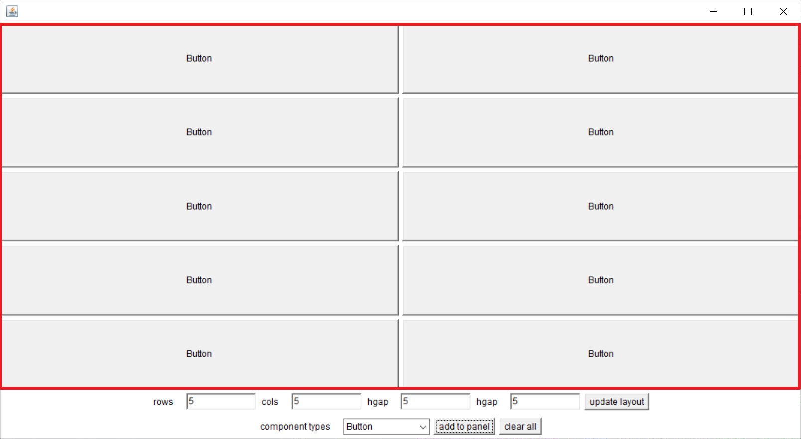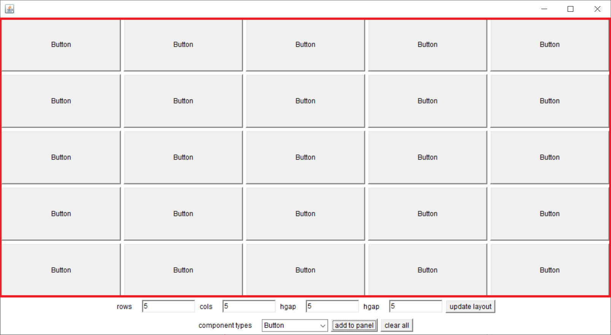
3. 每个网格都拥有相同的高度和宽度，即便添加的子组件不同，他们呈现出来的高度和宽度也是统一的，因此当窗口被拉伸的时候，所有子组件都会被拉伸，保持同样的高度和宽度！

下面是`GridLayout`的构造器：

| 构造方法                                          | 方法功能                                                     |
| ------------------------------------------------- | ------------------------------------------------------------ |
| `GridLayout(int rows,in t cols)`                  | 采用指定的行数、列数，以及默认的横向间距、纵向间距将容器 分割成多个网格 |
| `GridLayout(int rows,int cols,int hgap,int vgap)` | 采用指定 的行数、列 数 ，以及指定的横向间距 、 纵向间距将容器分割成多个网格。 |

在使用`GridLayout`的时候，容器需要使用下面的`add`重载即可：

```java
// 将组件放到容器的最后，该组件将会被最先进行绘制
public Component add(Component comp);

// panel默认就是FlowLayout
Panel panel = new Panel();
GridLayout layout = new GridLayout(3, 2);
panel,setLayout(layout);

Button button1 = new Button("按钮1");
Button button2 = new Button("按钮2");
Button button3 = new Button("按钮3");
Button button4 = new Button("按钮4");
Button button5 = new Button("按钮5");

panel.add(button1);
panel.add(button2);
panel.add(button3);
panel.add(button4);
panel.add(button5);
```

#### GridBagLayout

最后，我们来介绍`AWT`中最复杂的布局：`GridBagLayout`，也叫网格包布局，网格包布局可以看作是高级的网格布局，我们仍然可以使用网格布局中的网格视角来使用网格包布局，即将容器划分为一个个网格：

而网格包布局在网格布局的基础上，允许了：

1. 子组件可以横跨多个布局
2. 可以设置子组件是否跟随窗口的拉伸而拉伸
3. 子组件宽高和网格宽高相互独立，子组件的宽高可以大于、等于或小于网格的宽高
4. 可以设置网格的外边距和子组件的内边距

如下图：

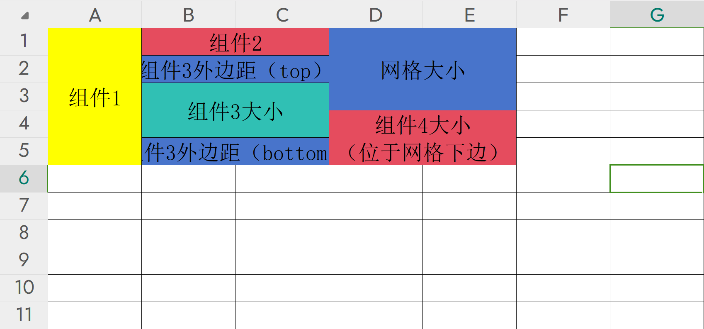

在使用`GridBagLayout`的时候，由于`GridBagLayout`的复杂性，需要非常注意，`GridBagLayout`根据上面的`4`点扩展，本身有非常多的属性，我们将在稍后讨论这些属性，并且给几点注意事项，最后给出一个简化该布局的使用的一个方法。

首先，`java`提供了`GridBagConstaints`类来实现上文提到的4个布局功能，通过与特定的组件绑定`GridBagConstaints`类，可以完成上述的具体大小和跨越性的设置。

在`GridBagConstaints`类中，定义了一些字段来完成上述的功能，这些字段都是`public`的，开发者可以随时更改其值：

| 字段         | 用途                                                         | 类型  | 参数和备注                           |
| ------------ | ------------------------------------------------------------ | ----- | ------------------------------------ |
| `gridx`      | 指定组件在网格中的起始列位置（注意是第几列，从0开始）        | `int` | 默认值：`GridBagConstaints.RELATIVE` |
| `gridy`      | 指定组件在网格中的起始行位置（注意是第几行，从0开始）        | `int` |                                      |
| `gridwidth`  | 指定组件跨越的列数。默认值为`1`（即一个组件占用多少列）      |       |                                      |
| `gridheight` | 指定组件跨越的行数。默认值为`1`（即一个组件占用多少行）      |       |                                      |
| `weightx`    | 指定组件在网格中水平方向上的权重，用于控制组件在网格中如何分配额外空间 |       |                                      |
| `weighty`    | 指定组件在网格中垂直方向上的权重，用于控制组件在网格中如何分配额外空间 |       |                                      |
| `anchor`     | 指定组件在其网格单元中的锚点位置。                           |       |                                      |
| `fill`       | 指定组件是否应该填充其网格单元。                             |       |                                      |
| `insets`     | 指定组件周围的边距。（外边距，相当于前端的`margin`）         |       |                                      |
| `ipadx`      | 指定组件水平方向上的内部填充。（左右内边距，相当于前端的`padding-left`和`padding-right`） |       |                                      |
| `ipady`      | 指定组件垂直方向上的内部填充。（内边距，相当于前端的`padding-top`和`padding-bottom`） |       |                                      |

另外该类除了字段之外，还定义了很多常量来辅助设计，该类除了构造器和`Object`继承的方法之外（包括`clone`），没有多余的方法：

```java
// 按照分类，常量值如下：
// 用于gridx、gridy：
public static final int RELATIVE = -1;

// 用于gridwidth、gridheight：
public static final int RELATIVE = -1;
public static final int REMAINDER = 0;

// 用于anchor，有三组：方向相对定位（orientation relative）、基线相对定位（baseline relative）、绝对定位（absolute）
// orientation relative：
public static final int PAGE_START = 19;
public static final int PAGE_END = 20;
public static final int LINE_START = 21;
public static final int LINE_END = 22;
public static final int FIRST_LINE_START = 23;
public static final int FIRST_LINE_END = 24;
public static final int LAST_LINE_START = 25;
public static final int LAST_LINE_END = 26;
// baseline relative:
public static final int BASELINE = 0x100;
public static final int BASELINE_LEADING = 0x200;
public static final int BASELINE_TRAILING = 0x300;
public static final int ABOVE_BASELINE = 0x400;
public static final int ABOVE_BASELINE_LEADING = 0x500;
public static final int ABOVE_BASELINE_TRAILING = 0x600;
public static final int BELOW_BASELINE = 0x700;
public static final int BELOW_BASELINE_LEADING = 0x800;
public static final int BELOW_BASELINE_TRAILING = 0x900;
// absolute
public static final int CENTER = 10;
public static final int NORTH = 11;
public static final int NORTHEAST = 12;
public static final int EAST = 13;
public static final int SOUTHEAST = 14;
public static final int SOUTH = 15;
public static final int SOUTHWEST = 16;
public static final int WEST = 17;
public static final int NORTHWEST = 18;

// 用于fill
public static final int NONE = 0;
public static final int BOTH = 1;
public static final int HORIZONTAL = 2;
public static final int VERTICAL = 3;
```

在使用`GridBagLayout`的过程中，要注意：

1. 使用绝对`gridx`和`gridy`时，比如当我们指定第一个组件`gridx=0`，第二个组件`gridx=2`时，其实际排列看起来和设置第二个组件`gridx=1`无差别，这是因为我们并没有往`gridx=1`的格子放入任何东西，默认情况下，`gridx=1`的格子宽度会是`0`，参考下图的解释，`gridy`同理。解决方法是使用`gridx=RELATIVE(或者2) + anchor=EAST + gridwidth=2`实现这种布局：

    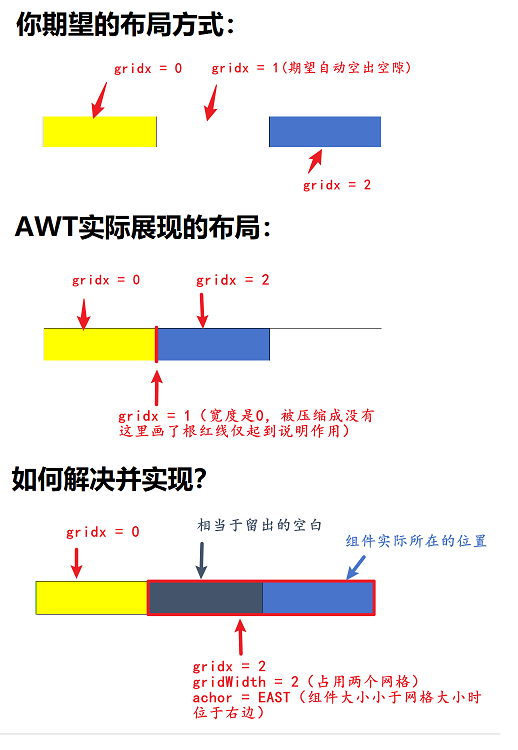

2. 和`GridLayout`一样，网格和网格之间默认是紧挨着的（组件和组件之间一点空隙都没有），如果希望组件之间留一些空隙，请设置`Insert`属性（外边距）

3. 每个网格的具体大小是由`GridBagConstants`的`gridWidth`和`gridheight`以及组件决定的，同时受外边距等的影响，比如当前窗口的客户区是`100px`，客户区一行设置了3个组件，他们的`gridWidth`比例分别是`4:2:4`，则每个格子的宽度就是`10px`，高度同理即可

4. `GridBagConstants`的`API`和`GridBagLayout`的`API`中建议当设置了第一个组件的`gridx`和`gridy`（一般都是`0`，毕竟是第一个组件）之后其他组件的`gridx`和`gridy`都使用常量`RELATIVE`。建议一行和一列的最后一个组件的`gridheight`和`gridWidth`使用`REMAINDER`常量（原因也很简单，使用绝对的`gridx`、`gridy`、`gridheight`和`gridWidth`，你往往需要事先确定好所有组件的布局，交由`AWT`来设计则无需考虑太多，但这种方式实际上也存在一定的风险，太过依赖`REMAINDER`和`RELATIVE`很有可能会得到预期之外的布局）

设计`GridBagLayout`布局之所以如此难，是因为其网格和组件不再像`GridLayout`一样完全对等了，需要开发者在设计组件排列的同时还要考虑网格的情况。

一种可用的方法是事先在`GUI`绘制软件或者在纸上先确定各个组件的布局，然后在进行细分和编码即可（`Core Java`的作者推荐的方式），我们这里通过设计一个简单的界面为例，来说明如何正确使用`GridBagLayout`：

1. 第一步永远都是想清楚自己想要画出怎样的界面，这一步是核心，搞清楚界面需求，比如我们这里要设计的界面如下图，这是一个非常简单的界面，包含了两个按钮，两个列表框：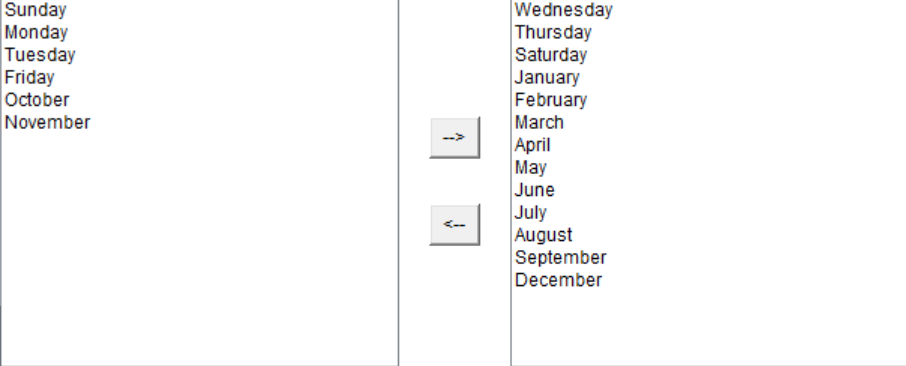
2. 决定好界面的情况之后，就可以开始考虑各个组件的`gridx`、`gridy`、`gridWidth`、`gridHeight`了。我们套用网格布局的网格图，考虑这个布局一行有多少个网格，一列有多少个网格，这个需要看个人习惯了（实际上随便就行，主要是为了定位组件用），笔者一般会采用`10`、`15`这些比较好处理的数字，我们这里就采用`10`，即一行有`10`个网格，一列有`10`个网格，决定了之后我们就可以得到下面的一张`10x10`的网格图（有点不规范，但大体是这样了）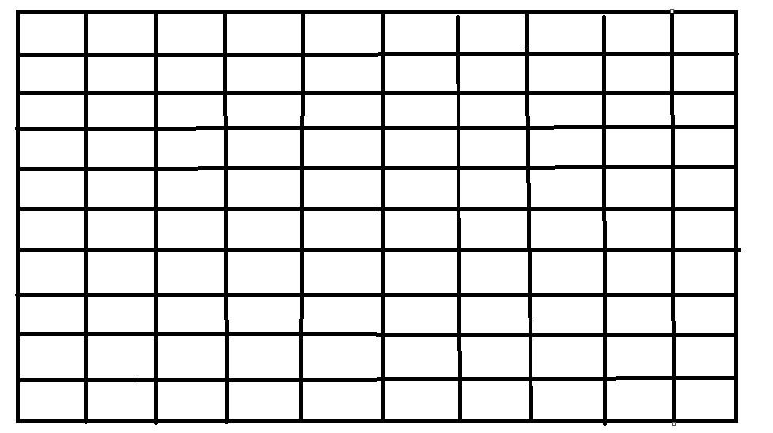
3. 然后我们将网格图套入到界面中，实际上就可以大概得到`GridBagLayout`的整体布局了// todo 画套入的图
4. 网格布局决定下来之后，最后，我们再决定组件的设置，即那些组件可以跟随窗口拉伸、组件和组件之间需要设置多少距离（外边距），填充相应的网格来决定`fill`和`anchor`参数，是否需要设置组件内边距：
5. 换成代码之后，我们得到了如下的`GridBagLayout`代码：

希望上面的步骤能多多少少帮助到开发者对`GridBagLayout`的使用，我们最后来说明以下如何往`GridBagLayout`的容器中添加组件：

使用下面的`add`重载来添加组件：

```java
public void add(Component comp, Object constraints);
// 参数一：具体要添加的子组件
// 参数二：GridBagConstaints对象

// 基本的使用可以参考：

```


### AWT组件

非常遗憾，因为历史遗留原因，`AWT`并没有提供太多的客户类组件。

下面是整个`AWT`组件继承图：

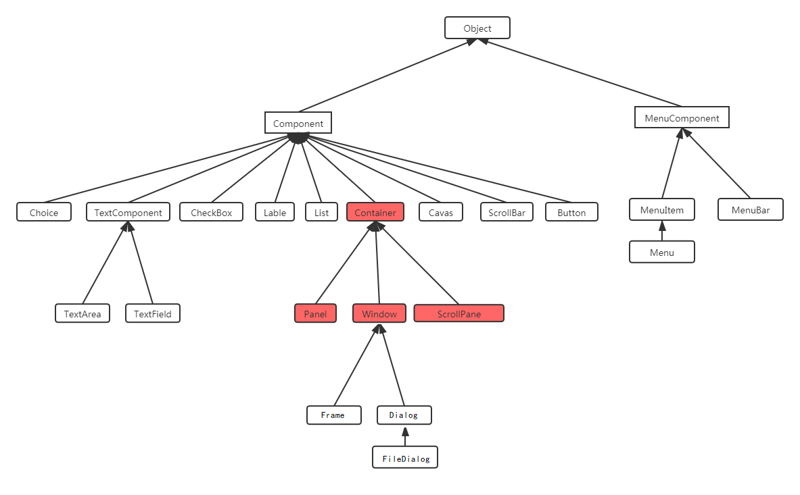

所有的组件大概能够分四大类：

1. 容器类组件：用于容纳其他客户类组件的组件。
2. 客户类组件：给用户提供操作的组件。
3. 菜单类组件：菜单类组件。
4. 对话框组件：提供一些通用的对话框，如消息框等。

所有的`awt`组件都位于`java.awt.*`下，因此你可以具体参考此包下的类，大概有：

| 容器类组件   | 意义                                       |
| ------------ | ------------------------------------------ |
| `Frame`      | 窗口                                       |
| `Panel`      | 空白的面板，可以在上面绘图、放组件等       |
| `ScrollPane` | 滚动面板，可以带滚动条，一般配合文本域使用 |

| 客户类组件  | 意义       |
| ----------- | ---------- |
| `Button`    | 按钮       |
| `Canvas`    | 画布组件   |
| `Checkbox`  | 选择框     |
| `Choice`    | 下拉列表框 |
| `Label`     | 标签       |
| `List`      | 列表框     |
| `Scrollbar` | 滑块条     |
| `TextArea`  | 文本域     |
| `TextField` | 文本框     |

| 菜单类组件         | 意义                                     |
| ------------------ | ---------------------------------------- |
| `Menu`             | 菜单列，内部可以容纳`MenuItem`（菜单项） |
| `MenuItem`         | 菜单项按钮                               |
| `MenuBar`          | 菜单工具条                               |
| `MenuShortcut`     | 菜单快捷按键                             |
| `PopupMenu`        | 右键弹出式菜单                           |
| `CheckboxMenuItem` | 选择式菜单项                             |

| 对话框类组件 | 意义           |
| ------------ | -------------- |
| `Dialog`     | 通用对话框     |
| `FileDialog` | 文件选择对话框 |

由于`AWT`的组件存在非常多的`API`，这些`API`不熟悉可能会对我们编写界面造成困扰，因此对组件的`API`进行分类非常有必要，好在很多`API`都只是对组件的内部属性进行设置的`Setter`和`Getter`方法，又因为组件之间的继承关系，并且很多组件的属性都是通用的，所以我们根据继承关系来分类`API`来学习即可。

文章将通过提供组件属性的表格的形式来告诉读者组件具有什么属性以及这些属性的作用，读者了解之后可以通过响应的使用`Getter`和`Setter`方法来配置即可。

所有的组件样式的`Demo`可以参考：// todo

在具体介绍各个组件的细节之前，我们有必要先了解两个类，即：`Component`和`MenuComponent`，`AWT`中所有组件都会继承此类，这两个类提供了所有组件的通用属性和方法，因此了解这两个类也有助于我们了解整个`AWT`的体系。

#### Component类

`AWT`所有的组件都继承自`Component`类，该类包含了组件通用属性（`Getter`和`Setter`）和方法，我们忽略掉一些历史遗留的和废弃的属性，整理了下面的一张属性表，包含（`Getter`、`Setter`、`Is`）：

| 组件属性                    | 说明                                                         | 参数说明                                                     | 获取方法           |
| --------------------------- | ------------------------------------------------------------ | ------------------------------------------------------------ | ------------------ |
| `AccessibleContext`         | 获取与此组件关联的`accessibecontext`对象。`AccessibleContext`表示所有可访问对象返回的最小信息。该信息包括对象的可访问名称、描述、角色和状态，以及关于其父节点和子节点的信息，位于`javax.accessibility`包中 | `AWT`组件支持无障碍辅助使用接入功能，AWT的组件使用这个`API`允许辅助技术（如屏幕阅读器、语音识别软件等）与`Java`应用程序进行交互。 | `Getter` |
| `AlignmentX`                | 组件与组件之间沿`x`轴的对齐方式（左对齐、居中、右对齐）      | 该值是一个介于`0`和`1`之间的数字，其中`0`表示沿着原点对齐（左对齐），`1`表示离原点最远（右对齐），`0.5`表示居中。<br />`Component`类中定义了相关常量：<br />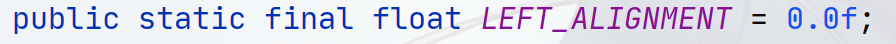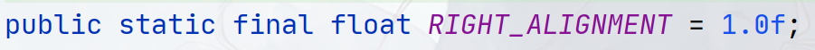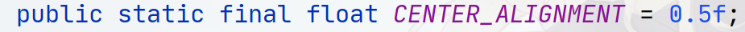 | `Getter`           |
| `AlignmentY`                | 组件与组件之间沿`y`轴的对齐方式（顶边对其、居中、底边对齐）  | 同`AlignmentX`，`Component`类中的常量：<br />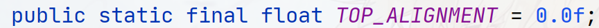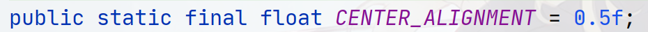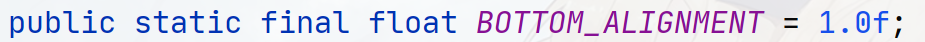 | `Getter`     |
| `Background`                | 设置组件背景色                                               | 参数是`java.awt.Color`类型，提供一个颜色，使用`Color`类内置的常量即可！ | `Setter`<br />`Getter` |
| `Baseline`                  | 组件基线                                                     | 基线是从组件顶部测量的。 此方法主要用于 `LayoutManager`沿其基线对齐组件。 返回值小于 0 表示此组件没有合理的基线，且 `LayoutManager`不应沿其基线对齐此组件。<br />默认实现返回-1。 支持基线的子类应进行适当重写。 如果返回值>=0，则该组件对于任何>=最小尺寸的尺寸都有有效基线，可使用`getBaselineResizeBehavior`确定基线如何随尺寸变化。 | `Getter` |
| `BaselineResizeBehavior`    | 组件基线变化行为                                             | 返回一个枚举（参考`Component.BaselineResizeBehavior`），指示组件的基线如何随尺寸变化而变化。 该方法主要用于布局管理器和`GUI` 构建器。<br />默认实现会返回`BaselineResizeBehavior.OTHER`，子类若包含基线参数，需进行适当重写。子类切勿返回空值；若无法计算基线，应返回`BaselineResizeBehavior.OTHER`。<br />调用方应先通过`getBaseline`获取基线值，若返回值≥0则使用本方法。即使getBaseline返回负值，本方法仍可返回非`BaselineResizeBehavior.OTHER`的其他值。 | `Getter`           |
| `Bounds`                    | 指定组件的`x`坐标、`y`坐标、宽度、高度，这四个参数有个统称叫组件矩形（`Rectangle`） | `Rectangle`类型                                              | `Getter`<br />`Setter` |
| `ColorModel`                | 获取用于在输出设备上显示组件的`ColorModel`实例               |                                                              | `Getter`           |
| `ComponentAt`               | 获取窗口上特定`(x,y)`上的组件。                              | 确定此组件或其直接子组件之一是否包含（x，y）位置，如果是，则返回包含该位置的组件。 此方法只查看一个级别深度。 如果点（x，y）在一个自身具有子组件的子组件内部（子组件嵌套），则不会继续查看子组件树。<br />若子组件被 **遮挡/透明/不可见**，仍会被返回；**Z-Order 最上层**的获胜。<br />若（x，y）坐标点位于组件的边界框内，其定位方法将直接返回该组件；否则返回null。 | `Getter` |
| `ComponentListeners`        | 返回在此组件上注册的所有`ComponentListener`监听器接口的数组。 | 如果组件没有注册`ComponentListener`，则返回成员数为`0`的数组 | `Getter`           |
| `ComponentOrientation`      | 设置组件内容排列方向，用于对组件或文本的元素排序。例如在复选框中，复选框的位置相对于文本，此属性主要考虑到各国人的阅读习惯，比如国内的阅读主要以从左到右为主，所以文字要从左到右排列，但是一些其他国家阅读文字是从右到左的，因此在这些国家文字是要从右往左排的 | 参数需要提供`ComponentOrientation`常量类：包括`LEFT_TO_RIGHT`、`RIGHT_TO_LEFT`和`UNKNOWN`（让组件自己决定）<br />`ComponentOrientation`类的文档对此属性进行了详细描述，请参考`ComponentOrientation`类的`Api`文档 | `Getter`<br />`Setter` |
| `Cursor`                    | 设置或获取组件内鼠标指针样式                                 | `Cursor`类型                                                 | `Getter`<br />`Setter` |
| `DropTarget`                | 拖放目标，只有容器组件设置了允许拖放的时候才有效，用于接收拖放进组件的各类资源（文本、文件等） | `DropTarget`类型                                             | `Setter`<br />`Getter` |
| `FocusCycleRootAncestor`    | 返回该组件的焦点遍历循环的焦点循环根容器。每个焦点遍历循环只有一个焦点循环根，每个不是容器的组件只属于一个焦点遍历循环。作为焦点循环根的容器属于两个循环:一个植根于容器本身，另一个植根于容器最近的焦点循环根祖先。对于这样的容器，此方法将返回离容器最近的焦点循环根祖先。 | 返回`Container`类型                                          | `Getter`           |
| `FocusListeners`            | 返回在此组件上注册的所有`FocusListener`监听器接口的数组。    | 如果组件没有注册`FocusListener`，则返回成员数为`0`的数组     | `Getter`           |
| `FocusTraversalKeys`        |                                                              |                                                              | `Getter`           |
| `FocusTraversalKeysEnabled` | 是否开启焦点切换功能                                         | `boolean`                                                    | `Getter`<br />`Setter` |
| `Font`                      | 设置或获取字体                                               | `Font`类型                                                   | `Getter`<br />`Setter` |
| `FontMetrics`               |                                                              |                                                              | `Getter`           |
| `Foreground`                | 设置或者获取前景颜色                                         | `Color`类型                                                  | `Getter`<br />`Setter`   |
| `Graphics`                  | 获取该组件的`Graphics`上下文对象，当`displayable`属性为`false`时，无法获取（返回`null`） | 返回`java.awt.Graphics`类型                                  | `Getter`                 |
| `GraphicsConfiguration` | 获取与此组件关联的`GraphicsConfiguration`。如果组件没有被分配一个特定的`GraphicsConfiguration`，则返回组件对象的顶层容器的`GraphicsConfiguration`。如果组件已创建，但尚未添加到容器中，则此方法返回`null`。 | 返回`java.awt.GraphicsConfiguration`类型 | `Getter` |
| `Height`                    | 返回该组件的当前高度。效果和`component.getBounds().height`和`component.getSize().height`一致，但因为不会创建`Dimension`对象所以不会引起任何堆内存分配 | 返回`int`类型                                                | `Getter`                 |
| `HierarchyBoundsListeners`  | 返回在此组件上注册的所有`HierarchyBoundsListener`监听器接口的数组。 | 返回`java.awt.event.HierarchyBoundsListener`对象             | `Getter`                 |
| `HierarchyListeners`        | 返回在此组件上注册的所有`HierarchyListener`监听器接口的数组。 | 返回`java.awt.event.HierarchyListener`对象                   | `Getter`                 |
| `IgnoreRepaint`             | 是否忽略窗口重绘，这不会影响`AWT`在软件中生成的绘制事件，除非它们是对操作系统级绘制消息的即时响应。 如果在全屏模式下运行并希望获得更好的性能，或者使用翻页作为缓冲策略，设置该属性会很有用。 | `boolean`类型                                                | `Getter`<br />`Setter`   |
| `InputContext`              |                                                              |                                                              | `Getter` |
| `InputMethodListeners`      |                                                              |                                                              | `Getter` |
| `InputMethodRequests`       |                                                              |                                                              | `Getter` |
| `KeyListeners`              | 返回在此组件上注册的所有`KeyListener`监听器接口的数组。      | 返回`java.awt.event.KeyListener`对象                         | `Getter`                 |
| `Listeners` |  |  | `Getter` |
| `Locale`                    | 获取或者设置组件`Locale`                                     | `java.util.Locale`                                           | `Getter`<br />`Setter`   |
| `Location`                  | 获取指定组件左上角的点的位置（`x`坐标和`y`坐标）。将相对于父父容器组件的坐标空间。 | `java.awt.Point`                                             | `Getter`<br />`Setter`<br /> |
| `LocationOnScreen`          | 获取指定组件左上角的点的位置（`x`坐标和`y`坐标）。将相对于屏幕的坐标空间。 | `java.awt.Point`                                             | `Getter`<br />           |
| `MaximumSize`               | 获取此组件的最大大小                                         | `java.awt.Dimension`                                         | `Getter`<br />`Setter`   |
| `MinimumSize`               | 获取此组件的最小大小                                         | `java.awt.Dimension`                                         | `Getter`<br />`Setter`   |
| `MouseListeners`            | 返回在此组件上注册的所有`MouseListener`监听器接口的数组。    | 返回`java.awt.event.MouseListener`对象                       | `Getter`                 |
| `MouseMotionListeners`      | 返回在此组件上注册的所有`MouseMotionListeners`监听器接口的数组。 |                                                              | `Getter` |
| `MousePosition`             | 如果鼠标当前在组件内，则返回鼠标指针在该组件坐标中的位置，如果不在组件内，则返回`null` | 返回`java.awt.Point`                                         | `Getter`                 |
| `MouseWheelListeners`       | 返回在此组件上注册的所有`MouseWheelListeners`监听器接口的数组。 | 返回`java.awt.event.MouseWheelListener`对象                  | `Getter`                 |
| `Name`                      | 设置组件的名称，注意该名称相当于组件的ID一样的存在，而非组件的显示文本！ | String类型                                                   | `Getter`<br />`Setter`   |
| `Parent`                    | 获取组件所在的父容器组件                                     | 返回`java.awt.Container`类型                                 | `Getter`                 |
| `Peer` |  |  |  |
| `PreferredSize`             | 获取或设置组件的首选大小，所谓首选大小指的是组件根据其显示的文本的字体、边框、边距等属性计算出来的大小 | `java.awt.Dimension`                                         | `Getter`<br />`Setter`   |
| `PropertyChangeListeners`   | 返回在此组件上注册的所有`PropertyChangeListener`监听器接口的数组。 | 返回`java.awt.event.PropertyChangeListener`对象              | `Getter`                 |
| `Size`                      | 以`Dimension`对象的形式返回此组件的大小。                    | `java.awt.Dimension`                                         | `Getter`<br />`Setter`   |
| `Toolkit`                   | 获取此组件的`Toolkit`对象（工具包对象）。请注意，包含组件的框架控制该组件使用哪个工具包。因此，如果组件从一个框架移动到另一个框架，它使用的工具包可能会改变。 | 返回`java.awt.Toolkit`                                       | `Getter`                 |
| `TreeLock`                  | 获取用于`AWT`组件树和布局操作的此组件的锁定对象(拥有线程同步监视器的对象) | 返回Object类型                                               | `Getter`                 |
| `Width`                     | 获取组件的宽度                                               | `int`                                                        | `Getter`                 |
| `X`                         | 获取组件的x坐标，和`component.getBounds().x`、`component.getLocation().x`一致，但是该属性的获取不会创建`Dimension`对象，不会分配堆内存 | `int`                                                        | `Getter`                 |
| `Y`                         | 获取组件的`Y`坐标，参考`X`属性                               | int                                                          | `Getter`                 |
| `BackgroundSet`             | 返回是否为该组件显式设置了背景颜色。如果此方法返回`false`，则表示该组件继承了祖先组件的背景色 | 返回`boolean`类型                                            | `Is`          |
| `CursorSet`                 | 返回是否为该组件显式设置了鼠标指针样式。如果此方法返回`false`，则此组件从祖先继承了鼠标指针样式。 | 返回`boolean`类型                                            | `Is`         |
| `Displayable`               | 判断组件是否`Displayable`，当且仅当组件有对应的`ComponentPeer`实现（即存在对应组件本地代码）时，此值返回`true`，参考：AWT如何实现跨平台？ | `API`原文：Determines whether this component is displayable. A component is displayable when it is connected to a native screen resource<br />返回`boolean`类型 | `Is`    |
| `DoubleBuffered` |  |  | `Is` |
| `Enabled`                   | 组件是否可用                                                 | `boolean`                                                    | `Setter`<br />`Is` |
| `Focusable`                 | 容器是否可以获取焦点，设置这个值，在焦点轮切的时候（常见是按`Tab`，但可以设置其他键）可以被切换上 | `boolean`                                                    | `Setter`<br />`Is` |
| `FocusCycleRoot` |  |  |  |
| `FocusOwner`                | 如果此组件是焦点所有者（焦点所有者指代那些接收用户生成的所有`keyeevent`的组件），则返回`true` | 返回`Boolean`类型                                            | `Is`         |
| `FontSet`                   | 同各种`XXXSet`一样，用于检测是否显式设置了某些属性！         | 返回`Boolean`类型                                            | `Is`               |
| `ForegroundSet`             | 同各种`XXXSet`一样，用于检测是否显式设置了某些属性！         | 返回`Boolean`类型                                            | `Is`               |
| `Lightweight`               | 判断组件是否是轻量级组件，轻量级组件没有`Peer`接口（参考AWT组件跨平台实现小节），`Component`和`Container`的子类，除了在`java.awt`包中定义这些如`Button`或`Scrollbar`属于重量级组件之外，其他都是轻量级的。所有的`Swing`组件都是轻量级的。 | 返回`boolean`                                                | `Is`               |
| `MaximumSizeSet`            |                                                              |                                                              | `Is`               |
| `MinimumSizeSet`            |                                                              |                                                              | `Is` |
| `Opaque`                    | 组件是否不透明（如果getPeer() == null则返回false），重量级组件一般都是不透明的，而轻量级组件（如Swing的组件），则默认都是透明的，因此设置背景颜色时需要设置`Opaque`为`true` | 返回boolean类型                                              | `Is`               |
| `PreferredSizeSet`          |                                                              |                                                              | `Is` |
| `Showing`                   | 如果当前组件可见，则返回true，否则返回false                  |                                                              | `Is` |
| `Valid`                     | Determines whether this component is valid. A component is valid when it is correctly sized and positioned within its parent container and all its children are also valid. In order to account for peers' size requirements, components are invalidated before they are first shown on the screen. By the time the parent container is fully realized, all its components will be valid. | 返回Boolean类型                                              | `Is`               |
| `Visible`                   | 确定当父组件可见时此组件是否应该可见。组件最初是可见的，除了顶级组件(如Frame对象)。 | Boolean类型                                                  | `Is`<br />`Setter` |

除了这些属性之外，`Component`类中也包含了相关的事件监听器方法，所谓事件其实就组件的行为触发的事件，比如点击按钮时发生什么，滑动滑块时发生什么等，这些事件方法涉及到`AWT`的事件模型，我们会在后面介绍：

```java
public synchronized void addComponentListener(ComponentListener l);
public synchronized void addFocusListener(FocusListener l);
public void addHierarchyBoundsListener(HierarchyBoundsListener l);
public void addHierarchyListener(HierarchyListener l);
public synchronized void addInputMethodListener(InputMethodListener l);
public synchronized void addKeyListener(KeyListener l);
public synchronized void addMouseListener(MouseListener l);
public synchronized void addMouseMotionListener(MouseMotionListener l);
public synchronized void addMouseWheelListener(MouseWheelListener l);
public void addPropertyChangeListener(PropertyChangeListener listener);
public void addPropertyChangeListener(String propertyName,PropertyChangeListener listener);
public synchronized void removeComponentListener(ComponentListener l);
public synchronized void removeFocusListener(FocusListener l);
public void removeHierarchyBoundsListener(HierarchyBoundsListener l);
public void removeHierarchyListener(HierarchyListener l);
public synchronized void removeInputMethodListener(InputMethodListener l);
public synchronized void removeKeyListener(KeyListener l);
public synchronized void removeMouseListener(MouseListener l);
public synchronized void removeMouseMotionListener(MouseMotionListener l);
public synchronized void removeMouseWheelListener(MouseWheelListener l);
public void removePropertyChangeListener(PropertyChangeListener listener);
public void removePropertyChangeListener(String propertyName,PropertyChangeListener listener);
```

组件通用功能中将会介绍上面这些属性的使用。

#### MenuComponent类

抽象类`MenuComponent`是所有菜单相关组件的超类。类似于`AWT`组件的抽象超类`Component`一样。菜单组件接收并处理`AWT`事件，就像组件通过`processEvent`方法一样。菜单组件的属性表和方法不多：

| 组件属性            | 说明 | 参数类型 | 获取方法               |
| ------------------- | ---- | -------- | ---------------------- |
| `AccessibleContext` |      |          | `Getter`               |
| `Font`              |      |          | `Getter`<br />`Setter` |
| `Name`              |      |          | `Getter`<br />`Setter` |
| `Parent`            |      |          | `Getter`               |
| `Peer`              |      |          | `Getter`               |

#### 组件通用功能

此处我们介绍`Component`类中的通用的属性（功能）

##### 组件对齐方式（AlignmentXY、Baseline）

-   方向对齐（AlignmentX、AlignmentXY）

-   基准线对齐（Baseline、BaselineResizeBehavior）

##### 颜色（Background、Foreground）

前景色（Foreground）、背景色（Background）

##### 坐标（Bounds、）

##### 组件定位（ComponentAt）

#### 容器类组件

我们先介绍所有容器类组件的层级类、类关系、功能以及相关属性列表，在最后此小节的最后，我们才介绍容器类组件的核心使用方式！因此前面的内容仅作工具内容方便参考，建议直接观看后面的小节。

##### Container类

由于`Container`类直接继承自`Component`类，因此`Component`类中的属性我们不再复述，只记录`Container`类独有的属性

| 属性                           | 描述                                                         | 类型                                                         | 获取方式               |
| ------------------------------ | ------------------------------------------------------------ | ------------------------------------------------------------ | ---------------------- |
| `Component`                    | 获取容器内第n个组件                                          |                                                              | `Getter`               |
| `ComponentCount`               | 获取此容器内组件的数量。                                     |                                                              | `Getter`               |
| `Components`                   | 获取此容器中的所有组件。返回`Component[]`类型                |                                                              | `Getter`               |
| `ComponentZOrder`              |                                                              |                                                              | `Getter`<br />`Setter` |
| `ContainerListeners`           |                                                              |                                                              | `Getter`               |
| `FocusTraversalPolicy`         |                                                              |                                                              | `Getter`               |
| `Insets`                       |                                                              |                                                              | `Getter`               |
| `Layout`                       |                                                              |                                                              | `Getter`<br />`Setter` |
| `Listeners`                    |                                                              |                                                              | `Getter`               |
| `MousePosition`                |                                                              |                                                              | `Getter`               |
| `AncestorOf`                   |                                                              |                                                              | `Is`                   |
| `FocusCycleRoot`               | 设置此容器是否是焦点遍历循环的根。一旦焦点进入遍历循环，它通常不能通过焦点遍历离开它，除非按下向上或向下循环键中的一个。法向遍历仅限于这个容器，以及所有这个容器的后代(不是次焦点循环根的后代)。注意，`FocusTraversalPolicy`可能会改变这些限制。例如，`ContainerOrderFocusTraversalPolicy`支持隐式向下循环遍历。<br />指定此容器的子容器遍历顺序的另一种方法是使用`FocusTraversalPolicyProviders` | `boolean`                                                    | `Setter`<br />`Is`     |
| `FocusTraversalPolicy`         |                                                              |                                                              | `Setter`               |
| `FocusTraversalPolicyProvider` |                                                              |                                                              | `Setter`<br />`Is`     |
| `FocusTraversalPolicySet`      |                                                              |                                                              |                        |
| `ValidateRoot`                 |                                                              |                                                              |                        |
| `FocusTraversalPolicy`         | 焦点切换的方式，或者说焦点切换策略                           | `FocusTraversalPolicy`类型，提供`FocusTraversalPolicy`的子类：<br />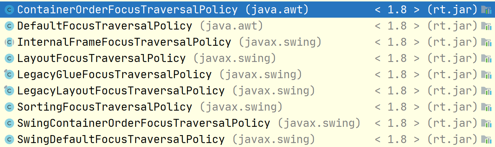 | Setter<br />Getter     |
| `FocusTraversalPolicyProvider` | 是否开启设置焦点切换的方式！设置此容器是否用于提供焦点遍历策略。将此属性设置为`true`的容器用于获取焦点遍历策略，而不是最近的焦点循环根祖先 | `boolean`                                                    | Getter<br />Setter     |
| `FocusTraversalPolicySet`      | 返回焦点遍历策略是否已为此容器显式设置。如果此方法返回`false`，则此容器将从祖先继承其焦点遍历策略。 |                                                              |                        |

```java
public int getComponentCount();
public Component[] getComponents();
// 上面的方法官方建议在AWT tree lock下调用，即：
Container container = ...;
int componentCount = 0;
synchronized (container.getTreeLock()){
    componentCount = container.getComponentCount();
    // ... other codes
}
// ... other codes
```

##### Window类

##### MenuContainer接口


##### Frame

`Frame`代表一个窗口，在`Java`中一个简单的`Frame`展示如下，在这个窗口中，一般会被分成几大块：

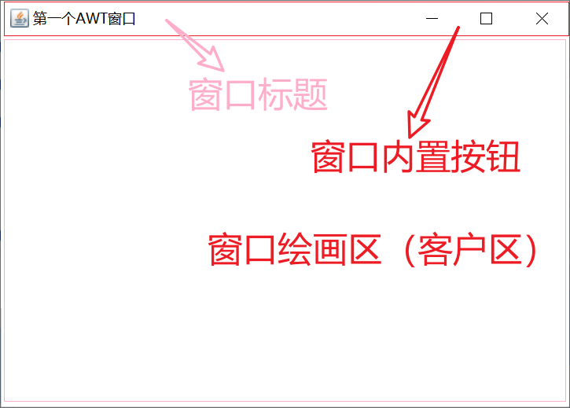

一般我们的组件都是在窗口客户区上进行绘画。顶部的标题、图标和最大化最小化关闭按钮共同组成了装饰区（`frame decorations`）。

窗口本身具有很多属性，可以通过`Setter`方法来设置这些属性（当然其中的部分也可以使用`Getter`来获取当前的值），设置了这些属性会让窗口有不同的表现。

这些属性中大部分都有相关的`Setter`、`Getter`，大部分属性都有带`isXXX()`作为状态判别方法，小部分是`areXXX()`开头。

属性参考下表：

| 属性名                  | 类型                                    | 说明                                                         |
| ----------------------- | --------------------------------------- | ------------------------------------------------------------ |
| `alwaysOnTop`           | `boolean`                               | 是否总是显示在前端                                           |
| `autoRequestFocus`      | `boolean`                               | 当窗口被激活的时候是否自动获取焦点                           |
|                         | `ComponentOrientation`                  | 未知                                                         |
| `ComponentZOrder`       | 参数1：Component<br />参数2：int：index | 窗口内组件刷新顺序。                                         |
|                         | `Cursor`                                | 窗口内鼠标样式                                               |
| `ExtendedState`         | `int`                                   | 窗口状态，如最大化、最小化等等                               |
| `FocusableWindowState`  |                                         | 窗口是否可以获取焦点，这个方法会根据窗口状态来影响判断       |
| `FocusTraversalKeys`    |                                         | 焦点切换按键                                                 |
|                         |                                         |                                                              |
|                         |                                         |                                                              |
|                         |                                         |                                                              |
|                         |                                         | 前景颜色                                                     |
| `IconImage |IconImages` |                                         | 图标图像（可以设置多个）                                     |
|                         |                                         |                                                              |
| `Layout`                |                                         | 客户区组件布局                                               |
| `Locale`                |                                         | `locale`，多语言支持的时候需要设置这个                       |
| `Location`              |                                         | 窗口在屏幕中的位置                                           |
| `LocationByPlatform`    |                                         | 是否由所在的平台来决定窗口位置                               |
| `LocationRelativeTo`    |                                         | 窗口的父窗口                                                 |
| `MaximizedBounds`       |                                         | 窗口的最大边界（窗口矩形）                                   |
| `MaximumSize`           |                                         | 窗口的最大宽高                                               |
| `MenuBar`               |                                         | 窗口菜单栏                                                   |
| `MinimumSize`           |                                         | 窗口最小大小                                                 |
| `ModalExclusionType`    |                                         | 窗口模态排除类型，一般情况下当一个窗口弹出一些信息框，那么那个窗口将会被阻塞，动不了，设置了这个属性，则窗口可能将不会被阻塞。 |
| `Name`                  |                                         | 组件名称，注意区别与`setTitle()`，`setTitle`是设置标题，而这个是在相当于为窗口设置一个名字，一般用于标记窗口或组件。 |
| `Opacity`               |                                         | 窗口透明度，值在`0.0f-1.0f`之间，需要注意，设置透明度需要先把窗口装饰区去掉，也就是`setUndecorated(true)` |
| `PreferredSize`         |                                         | 组件更加偏向的大小，一般在布局的设置中会采用这个，注意设置组件的大小不一定就会起作用，`AWT`会计算组件的大小以更好适应布局情况 |
| `Resizable`             |                                         | 窗口是否可拉伸                                               |
| `Shape`                 |                                         | 窗口的形状                                                   |
| `Size`                  |                                         | 窗口大小                                                     |
| `State`                 |                                         | 窗口状态                                                     |
| `Title`                 |                                         | 窗口标题                                                     |
| `Type`                  |                                         | 窗口类型                                                     |
| `Undecorated`           |                                         | 是否去除装饰区，当设置`true`则窗口最大化最小化，窗口标题，关闭按钮将被去除。 |
| `Visible`               |                                         | 窗口可视                                                     |


// 组件重要属性集

// 事件处理

// 布局集合

##### Panel

`Panel`，也叫面板，是用于存放其他组件的一个容器，一般情况下被用于划分功能相关的组件，调整组件布局等。但不能独立存在，只能被放置在窗口或者其他`Panel`中。

##### ScrollPane


##### 容器类组件添加删除组件

// 补充说明

几乎所有的容器类组件都有如下添加组件的方法：

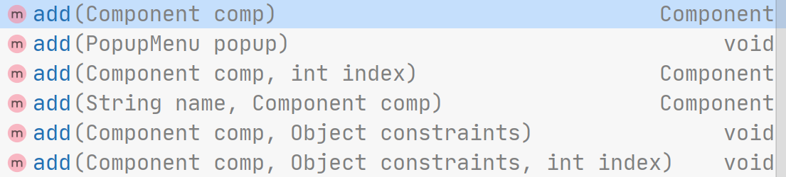

作为容器类组件，你也可以往其内部添加任意的客户类组件，`Frame`等容器组件内部维护了一个`ArrayList`用来存放组件，这也就是为什么会有`index`参数（也叫`ComponentZOrder`，也有相关的`API`，后面会讲）的原因，容器内组件的前后关系可能会影响最终的渲染效果，越排在前面的组件（`index`越小）越晚进行绘制，因此小`index`的组件最终会覆盖掉大`index`的组件。

```java
// 将组件放到容器的最后，该组件将会被最先进行绘制
public Component add(Component comp);
// 将组件放到容器的最后，该组件将会被最先进行绘制,并且用一个字符串与该组件关联,该方法如今已过时但并没有标记@Deprecated，建议使用public void add(Component comp, Object constraints);
public Component add(String name, Component comp);
// 将组件放到容器组件列表的index位置中
public Component add(Component comp, int index);
// 上面三个方法返回值都是comp参数本身

// 将指定组件添加到此容器的末尾。同时通知布局管理器使用指定的constraints对象将组件添加到容器的布局中。
public void add(Component comp, Object constraints);
// 将指定组件添加到此容器的index位置。同时通知布局管理器使用指定的constraints对象将组件添加到容器的布局中。
public void add(Component comp, Object constraints, int index);

// 添加弹出菜单
public void add(PopupMenu popup);
```

所有的`add()`都是`addImpl()`的简便方法，`addImpl()`本身并不对外公开（`protected`），如果容器内部使用了布局类来管理组件的话，则`addImpl()`实际上会调用布局的`addLayoutComponent`方法来实现添加布局，具体参考容器组件布局章节。

除了添加组件之外，你也可以讲将某个组件从容器组件中删除，`index`是上面提到的组件顺序。也可以使用`removeAll()`删除全部组件。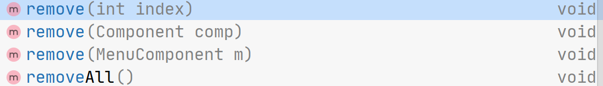

#### 客户区组件

##### Button

`AWT`的按钮组件！

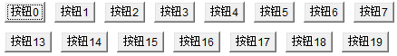

属性表：

| 属性              | 说明                                                         | 类型                            | 获取方式               |
| ----------------- | ------------------------------------------------------------ | ------------------------------- | ---------------------- |
| `ActionCommand`   | 当按钮被触发时（比如点击了按钮），此属性会被发送到事件处理器中，代表触发的指令，默认情况下，此属性和`Label`值相同 | `String`                        | `Getter`<br />`Setter` |
| `ActionListeners` | 按钮事件监听器，当按钮被触发时（比如点击了按钮），调用此监听器触发按钮事件 | `java.awt.event.ActionListener` | `Getter`               |
| `Label`           | 按钮显示的文本，比如上面的"按钮0"、"按钮1"等                 | `String`                        | `Getter`<br />`Setter` |

按钮的使用非常简单，我们只需要创建按钮对象，指定其`Label`属性，添加相应的监听器即可！`Button`按钮提供了两个构造器供你创建它的对象：

```java
public Button() throws HeadlessException;
public Button(String label) throws HeadlessException;

// 创建它的对象我们直接new即可
Button b = new Button("您好");
```

在创建完对象之后，我们需要为此按钮添加一个事件监听器，我们会在后续的章节中介绍此事件监听器具体内容，在此处我们先学会如果使用事件监听器！

基本所有的组件中都会有很多`addXXXXListener()`的方法，这些方法就是注册监听器的方法，当按钮被点击时就会触发相应的动作， 我们可以注册这些监听器：

```

```


##### Canvas

##### checkbox

##### choice

##### label

##### list

##### scrollbar

##### textarea

##### textfield

#### 菜单类组件


#### 对话框类组件

- Dialog
- FileDialog


### AWT事件处理

前面介绍了如何放置各种组件，从而得到了丰富多彩的图形界面，但这些界面还不能响应用户的任何操作。比如单击`Frame`窗口右上角的`X`按钮，但窗口依然不会关闭。因为在`AWT` 编程中，所有用户的操作，必须都需要经过一套**事件处理机制**来完成。

那所谓事件处理又是什么呢？学到这里的同学，都知道，`AWT`和`Swing`给大家提供了非常多的组件，包括按钮，列表框等等，所谓的事件是指我们对这些组件进行某一些操作，如点击按钮，选中列表框中的某个项目，滑动了滑块条，在编辑框内输入了内容等等。

**当我们做出这些动作的时候，组件会根据这些动作产生相应的事件，然后发送这些事件给事件处理器，事件处理器会对这些事件内容做处理，这个过程叫做事件响应。**

#### AWT中的事件处理机制和事件委派模型

`AWT`的事件遵循上面的事件流程，因此有如下的概念：

- 事件源（`Event Source`）：指产生事件的组件，例如按钮、窗口的组件
- 事件（`Event`）：事件对象，就是产生事件之后`AWT`封装的各种信息，在`Java`中，所有事件对象都是以`XXXXEvent`类的形式，如`ActionEvent`代表动作事件，当用户点击按钮，选择`List`内的项目的时候，`AWT`就会产生这个`ActionEvent`并将其**以参数的形式**传递给事件处理器。
- 事件监听器（`Event Listener`）：就是事件处理器，处理事件的地方，在`Java`中，所有的事件处理器都是以接口的形式定义好，用户只需要实现接口重写事件方法才能完成对事件的处理。
- 事件监听器注册：当开发者编写好事件监听器之后，需要注册到具体的事件源上面，使用这种注册方法是为了方便将事件处理器和事件源（组件）绑定在一块。

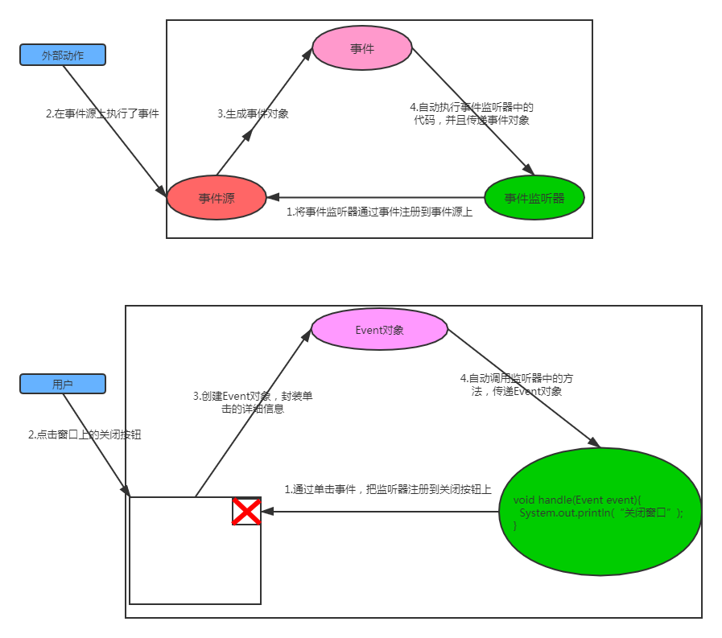

> 一般组件可以产生多种类型的事件
>
> 一个事件源可以绑定多个不同类型的事件监听器
>
> 一个事件监听器可以被多个事件源注册
>
> 因此事件监听器、事件源、事件对象三者之间是互相独立的。

#### 如何绑定事件监听器

在所有的组件中，都有一类叫`addXXXXXListener`的方法，这类方法一般就用来注册事件的，拿`Frame`窗口的关闭按钮举例：

首先我们需要知道当用户点击关闭按钮之后可能会发生的事情，一般都是关闭窗口，因此我们首先定义一个窗口的事件监听器（`WindowsListener`）：

```java
// 因为WindowsListener里面有很多接口方法，我们本次事件只需要关注关闭窗口时的事件, 因此我们直接使用WindowsListener的默认实现，然后重写我们需要的方法即可
WindowAdapter windowAdapter = new WindowAdapter() {
    @Override
    public void windowClosing(WindowEvent e) {
        System.exit(0);
    }
};
```

然后我们需要使用窗口组件的`addWindowListener`方法来注册事件监听器：

```java
frame.addWindowListener(windowAdapter);
```

这样事件源就事件处理器绑定在一块了，现在我们启动窗口，点击关闭按钮，然后`AWT`就会分发事件到对应的事件处理器上，调用相应的事件方法（这里就是`public void windowClosing(WindowEvent e)`），执行里面的`System.exit(0);`退出整个`Java`程序。

#### AWT事件对象

几乎所有的事件都是以`XXXXXEvent`命名，所有的事件类都是继承自`java.util.EventObject`类，在这个类之下，还有一个子类`AWTEvent`，他是所有`AWT`事件类的父类，有些`Swing`组件会生成一些其他的事件对象，这些事件对象并不继承自`AWT`而是直接继承`EventObject`。

`AWT`所有事件类都位于`java.awt.event`包下，但要注意并不是所有的`AWT`事件类对`Java`程序员来说都实用！如`PaintEvent`，这是一个重绘事件，但是当我们需要控制重绘的时候，我们并不关注这个事件，而是重写`paintComponent()`或者`paint()`再或者调用`repaint()`实现，又如`InvocationEvent`，该事件的对象会被放入`EventQueue`中被`AWT event dispatcher`线程执行，常用于`EventQueue`的`invokeLater`和`invokeAndWait`方法中执行`Runnable`接口的`run`方法，除非特殊情况，一般不需要关注这个事件！

下面是`AWT`中常见的事件继承图以及他们的触发方式：

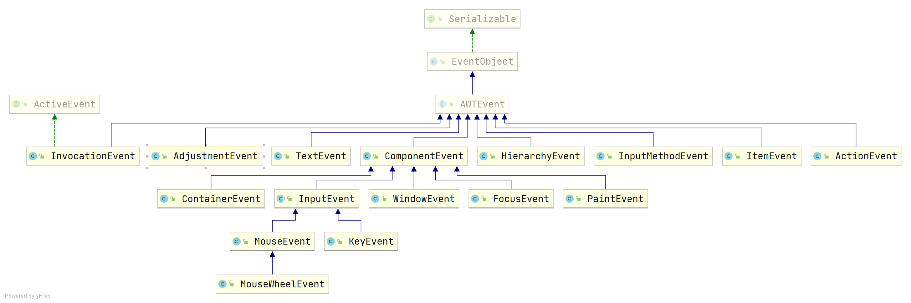

| 事件               | 触发时机                                                     |
| ------------------ | ------------------------------------------------------------ |
| `InvocationEvent`  | 用于多线程环境下运行`Runnable`的`Run()`的事件                |
| `AjustmentEvent`   | 调节事件，在滑动条上移动滑块以调节数值时触发该事件。         |
| `TextEvent`        | 文本事件，当文本框、文本域里的文本发生改变时触发该事件。     |
| `ComponentEvent`   | 组件事件 ，当组件尺寸发生变化、位置发生移动、显示/隐藏状态发生改变时触发该事件。 |
| `HierarchyEvent`   | 容器组件布局事件，当容器内的组件布局改变了的时候，如某个组件不可视了，某个组件的大小改变了时，会触发该事件。 |
| `FocusEvent`       | 焦点事件 ， 当组件得到焦点或失去焦点时触发该事件 。          |
| `InputMethodEvent` | 输入法事件，早期使用输入法的时候在输入法中按下任何按键将会触发此事件。 |
| `ItemEvent`        | 选项事件，当用户选中某项， 或取消选中某项时触发该事件 。     |
| `ActionEvent`      | 动作事件 ，当按钮、菜单项被单击，在`TextField`中按`Enter`键时，或者是`List`组件中双击选项触发。 |
| `MouseEvent`       | 鼠标事件，当进行单击、按下、松开、移动鼠标等动作时触发该事件。 |
| `PaintEvent`       | 组件绘制事件，该事件是一个特殊的事件类型 ， 当`GUI`组件调用`update/paint`方法来呈现自身时触发该事件，该事件并非专用于事件处理模型 。 |
| `KeyEvent`         | 键盘事件，当按键被按下、松开、单击时触发该事件。             |
| `WindowEvent`      | 窗口事件， 当窗口状态发生改变 ( 如打开、关闭、最大化、最 小化)时触发该事件 。 |
| `MouseWheelEvent`  | 滚轮事件，鼠标滚轮转动时或滚轮按下时触发。                   |
| `ContainerEvent`   | 容器事件 ， 当容器里发生添加组件、删除组件时触发该事件 。    |

所有事件类的父类都是`java.util.EventObject`，`EventObject`会保存产生该事件的事件源：

```java
public class EventObject implements java.io.Serializable {

    private static final long serialVersionUID = 5516075349620653480L;

    // 产生事件的事件源，如Button对象、List对象等
    protected transient Object  source;

    public EventObject(Object source) {
        if (source == null)
            throw new IllegalArgumentException("null source");

        this.source = source;
    }
    
    // 获取事件源，注意获取的事件源一般需要强转！
    public Object getSource() {
        return source;
    }
    
    public String toString() {
        return getClass().getName() + "[source=" + source + "]";
    }
}
```

`AWT`在`JDK1.1`使用了一个新的事件父类：`AWTEvent`（`JDK1.0`版本的时候使用的是旧的`Event`类），`AWTEvent`类相对于`EventObject`，增加了以下内容：

```java
public abstract class AWTEvent extends EventObject {
    // 事件的id，AWT为每一类事件使用一个2次方的数进行唯一性标记
    protected int id;
    // 各类事件的id见具体的事件子类，如ActionEvent的ACTION_PERFORMED
    public AWTEvent(Event event);
    public AWTEvent(Object source, int id);
    // 获取事件ID
    public int getID();
    // 返回表示此事件状态的字符串。此方法仅用于调试目的，返回字符串的内容和格式可能因实现而异。返回的字符串可以为空，也可以不为空。
    public String paramString();
    public String toString();
    // 设置事件源
    public void setSource(Object newSource);
}
```


```java

// 设置新的
public void setSource(Object newSource);
// 获取事件ID，一般每个事件都会有自己的一个事件ID,用来标记事件的唯一性,如AdjustmentEvent是601,TextEvent是900
public int getID();
// 打印事件状态，一般用于调试
public String paramString();
// 输出事件类信息
public String toString();
```


#### AWT事件监听器


#### 事件及监听器对照表

| 监听器接口       | 监听方法          | 事件          | 事件信息方法                                                 |
| ---------------- | ----------------- | ------------- | ------------------------------------------------------------ |
| `ActionListener` | `actionPerformed` | `ActionEvent` | `getActionCommand`：用于传递动作指令的方法，可以与做数据传递，默认使用标题<br />`getWhen`：事件什么时候产生的<br />`getModifiers`：触发事件的时候是否按下`Alt`、`Ctrl`、`Shift`键 |
|                  |                   |               |                                                              |
|                  |                   |               |                                                              |


#### 事件源监听方法

- `addComponentListener()`：
- `addContainerListener()`：
- `addFocusListener()`：
- `addHierarchyBoundsListener()`：
- `addHierarchyListener()`：
- `addInputMethodListener()`：
- `addKeyListener()`：
- `addMouseListener()`：
- `addMouseMotionListener()`：
- `addMouseWheelListener()`：
- `addPropertyChangeListener()`：
- `addWindowFocusListener()`：
- `addWindowListener()`：
- `addWindowStateListener()`：

当然既然能够添加事件，那么也可以移除事件，在`Frame`中还有一类方法，这种方法以`removeXXXXListener()`，参考上面的`addXXXXListener()`：

- `removeComponentListener()`：
- `removeContainerListener()`：
- `removeFocusListener()`：
- `removeHierarchyBoundsListener()`：
- `removeHierarchyListener()`：
- `removeInputMethodListener()`：
- `removeKeyListener()`：
- `removeMouseListener()`：
- `removeMouseMotionListener()`：
- `removeMouseWheelListener()`：
- `removePropertyChangeListener()`：
- `removeWindowFocusListener()`：
- `removeWindowListener()`：
- `removeWindowStateListener()`：
- 

10.4

#### 组合触发多个监听器


#### 事件监听原理与事件触发原理

此小节我们开始研究`AWT`事件监听底层机制，`AWT`事件监听机制自诞生以来基本覆盖`Java`图形化的所有迭代，哪怕后面的`Swing`和`JavaFX`，其事件监听仍然采用`AWT`的监听模型，本小节的内容基于个人研究，受`JDK`版本和个人能力有限，不完全准确，但基本方向是正确的。

我们回顾按钮的事件产生过程：

1.   创建一个事件监听器（`ActionListener`）,该监听器监听事件对象（`ActionEvent`）

     ```java
     ActionListener eventListener = new ActionListener() {
         public void actionPerformed(ActionEvent e) {
             System.out.println("Button clicked!");
         }
     }
     ```

2.   在按钮【事件源】上注册事件监听器（`addActionListener()`）

     ```java
     Button button = new Button("Click Me");
     button.addActionListener(eventListener);
     // Button内部为了一个ActionListener的数组
     ```

3.   用户点击按钮【事件源】，触发点击事件，创建`ActionEvent`对象

4.   按钮调用执行监听器方法，遍历所有注册的`ActionListener`

5.   每个`ActionListener`的`actionPerformed`方法被调用，传递创建的`ActionEvent`事件对象，执行自定义的事件处理逻辑。

整个过程初看很好理解，即组件本身维护了事件监听器，并且在特定的过程中触发这些监听器而已，但是深究就能发现还有一个问题没有解决，即当用户点击按钮的时候，触发点击事件的过程是如何执行的，又是谁负责这个过程？

由于`AWT`是重量级组件，他的所有组件都是基于本地操作系统来实现的，大部分的`AWT`组件代码都是`C`语言写的，因此当我们点击按钮时，触发按钮事件给我们的肯定也是操作系统，了解过`Windows`程序设计的朋友可能就会理解，当我们使用原生的`Win32 API`创建一个窗口的时候，通常需要定义一个窗口回调函数，这个函数内部就是对各种事件的处理，通常他的定义形式如下：

```c
LRESULT CALLBACK WndProc(HWND hWnd, UINT message, WPARAM wParam, LPARAM lParam)
{
    switch (message)
    {
    case WM_PAINT:
    {
        PAINTSTRUCT ps;
        HDC hdc = BeginPaint(hWnd, &ps);
        // 在这里进行绘制操作
        EndPaint(hWnd, &ps);
        return 0;
    }
    case WM_DESTROY:
    {
        PostQuitMessage(0);
        return 0;
    }
    case WM_SIZE:
    {
        int width = LOWORD(lParam);
        int height = HIWORD(lParam);
        // 处理窗口大小改变逻辑
        return 0;
    }
    case WM_MOVE:
    {
        int x = LOWORD(lParam);
        int y = HIWORD(lParam);
        // 处理窗口位置改变逻辑
        return 0;
    }
    case WM_LBUTTONDOWN:
    {
        int x = LOWORD(lParam);
        int y = HIWORD(lParam);
        // 处理鼠标左键按下逻辑
        return 0;
    }
    case WM_KEYDOWN:
    {
        int key = wParam;
        // 处理按键逻辑
        return 0;
    }
    case WM_COMMAND:
    {
        int wmId = LOWORD(wParam);
        int wmEvent = HIWORD(wParam);
        HWND hwndCtl = (HWND) lParam;
        // 处理菜单项或控件的通知
        return 0;
    }
    case WM_ACTIVATE:
    {
        int state = LOWORD(wParam);
        HWND hwndOther = (HWND) lParam;
        if (state == WA_INACTIVE) {
            // 窗口被去激活
        } else {
            // 窗口被激活
        }
        return 0;
    }
    default:
        return DefWindowProc(hWnd, message, wParam, lParam);
    }
}
```

而其中，如果窗口包含按钮，则通常还需要处理`WM_COMMAND`事件，因此当`AWT`组件被触发的时候，首当其冲也是调用底层的`C`代码，而我们的监听器是写在`Java`代码中的，要触发我们`Java`代码中的监听器，就需要跨语言调用，而`AWT`中每一种组件都需要考虑这种调用，这不现实，因此需要一种模型能够实现这种跨端的调用。

而常用的则是事件队列（`EventQueue`），几乎所有的`GUI`事件设计都会基于这种模型，该模型通过维护一个事件队列，将组件触发的所有事件都一一入队，然后通过外部的消费者消费事件队列中的事件的形式，来触发组件本身的事件动作，参考下图，而其中的消费者可以是单个（单线程消费），也可以是多个（多线程消费就更复杂了），这也就是广为流传的事件驱动模型：

// todo 事件消费的图

事件队列的好处是让系统只处理产生的事件，而无需要关注到底是谁触发了，并且将这个问题推给客户端代码来进行判断，大大减轻系统的压力的同时，提高了通用性。

而在`Java`类库中，实际上也有这两个角色，你可以在`java.awt`找到下面两个类：

-   `java.awt.EventQueue`：也就是事件队列
-   `java.awt.EventDispatchThread`：实际的事件消费者，也叫`EDT`，`AWT`的事件队列就是基于`EDT`来消费的，单线程消费。

这两个核心类共同组成了`AWT`事件系统的核心，底层操作系统不断地往`EventQueue`中仍事件，`EventDispatchThread`单线程启动死循环不断地消费事件队列中的事件。

`EDT`的启动线程通常以`"AWT-EventQueue-X"`的名字驻留，我们可以随意运行一个`GUI`程序，然后使用`jstack`查看运行中的线程，比如我当前启动了一个`GUI`程序：

运行CMD，输入`jstack [PID]`：


输入：`jstack 91812`，会得到一堆信息，其中你会发现：

这个就是运行中的`EDT`线程，用以消费`EventQueue`中的事件。

而除了这个`"AWT-EventQueue-0"`之外，你可能还发现了一个叫`AWT-Windows`的线程：

从线程的调用栈发现它并非`EventQueue`也和`EDT`没有关系，但从方法名中我们基本可以确定它和事件系统也有关系，这就得引出实际上参与`AWT`事件系统的类除了两大核心的`EventQueue`和`EDT`之外，还有两个辅助的类，即：

-   `java.awt.AWTEventMulticaster`：
-   `java.awt.Toolkit`：

在了解了这些类之后，我们开始尝试还原整个事件监听处理过程，并深挖一些内容，来补充我们最开始按钮的事件产生过程中一些忽略掉的细节，我们根据时间线，将之前的`5`个步骤分为两个场景：编码期和运行期：

>   编码期

在编码期我们主要做了两件事情：

1.   创建一个事件监听器（`ActionListener`）,该监听器监听事件对象（`ActionEvent`）

     ```java
     ActionListener eventListener = new ActionListener() {
         public void actionPerformed(ActionEvent e) {
             System.out.println("Button clicked!");
         }
     }
     ```

2.   在按钮【事件源】上注册事件监听器（`addActionListener()`）

     ```java
     Button button = new Button("Click Me");
     button.addActionListener(eventListener);
     // Button内部为了一个ActionListener的数组
     ```

     注册监听器的过程实际上靠`AWTEventMulticaster`来实现，该类也是典型的组合模式的应用，将多个监听器（包括`AWTEventMulticaster`自身）注册在一起，实现一个事件多个监听器监听！

     ```java
     public class Button extends Component implements Accessible{
         
         // Button类内部维护的唯一ActionListener，其真正实现可以是组合实现类AWTEventMulticaster的对象
         transient ActionListener actionListener;
     
         public synchronized void addActionListener(ActionListener l) {
             if (l == null) {
                 return;
             }
             // 1.add方法的逻辑是当actionListener为null时返回l
             // 2.当l为null时返回内部的actionListener本身（当然addActionListener()做了null判断，因此l为null是直接返回了）
             // 3.如果actionListener和l都不为null, 则创建AWTEventMulticaster对象，存储actionListener和l，同时AWTEventMulticaster本身实现了actionPerformed()方法，内部调用actionListener和l的actionPerformed()方法，实现一个事件多个监听器监听
             actionListener = AWTEventMulticaster.add(actionListener, l);
             newEventsOnly = true;
         }
     }
     ```

自此，编码期的工作完成！

>   运行期

而当我们启动程序之后，接下来的步骤就很多了！当我们运行程序的时候，事件系统启动，两大核心类将会被初始化，其中，`EventQueue`对象会在`Toolkit`的子抽象类`SunToolkit`中被初始化：

```java
// 初始化EventQueue对象的方法
private static void initEQ(AppContext var0) {
    // 获取系统中指定的EventQueue实现类，默认是java.awt.EventQueue
    String var2 = System.getProperty("AWT.EventQueueClass", "java.awt.EventQueue");

    // 创建java.awt.EventQueue的真正实现
    EventQueue var1;
    try {
        var1 = (EventQueue)Class.forName(var2).newInstance();
    } catch (Exception var4) {
        var4.printStackTrace();
        System.err.println("Failed loading " + var2 + ": " + var4);
        // 创建失败则使用java.awt.EventQueue默认实现
        var1 = new EventQueue();
    }

    // 这里设计到AppContext，接下来讲解
    // AppContext保存创建的java.awt.EventQueue和PostEventQueue对象供后续使用
    var0.put(AppContext.EVENT_QUEUE_KEY, var1);
    PostEventQueue var3 = new PostEventQueue(var1);
    var0.put("PostEventQueue", var3);
}
```

>   这里面涉及到`sun.awt.AppContext` 类，`sun.awt.AppContext` 是`Java AWT`（抽象窗口工具包）内部的一个核心类，主要功能是**为不同的“线程组”（ThreadGroup）提供隔离的应用程序服务存储空间**。它的核心设计目的是在类似浏览器的多`Applet`（小程序）环境中，保证关键资源（如事件队列、`UI`设置）相互隔离，防止不受信任的代码干扰或窃取其他Applet的数据。
>
>   ### 🆚 与其他“上下文”类的区别
>
>   为了更清晰地理解它的定位，可以看看它与常见的线程本地变量 `ThreadLocal` 的区别：
>
>   | 特性           | `sun.awt.AppContext`                                         | `ThreadLocal<T>`                                             |
>   | :------------- | :----------------------------------------------------------- | :----------------------------------------------------------- |
>   | **设计目的**   | AWT框架内部使用，为每个ThreadGroup提供**一组共享的服务实例**（如事件队列、UI管理器） | 通用工具，为每个线程提供一个**独立的变量副本**，用于传递线程上下文。 |
>   | **隔离级别**   | **ThreadGroup级别**。同一个ThreadGroup中的所有线程共享同一个AppContext。 | **Thread级别**。每个线程都有自己独立的数据副本。             |
>   | **主要使用者** | **AWT/Swing框架本身**（例如存储 `EventQueue`）。普通应用程序开发**很少需要直接使用**。 | **应用程序开发者**，常用于Web开发中传递请求上下文、用户信息等。 |
>   | **可见性**     | `sun` 包下的内部API，未来可能变化。                          | `java.lang` 包下的标准API，稳定。                            |
>
>   ### ⚙️ AppContext 的工作原理与生命周期
>
>   要理解AppContext，可以从其**创建、存储内容**和**生命周期**三个方面来看：
>
>   1.  **如何创建**
>       AppContext通常**不是由开发者主动创建**的。当一个新线程首次调用AWT相关功能时，框架会根据其所属的 `ThreadGroup` 自动创建或关联一个AppContext。
>   2.  **存储什么**
>       它是一个基于 `HashMap` 的键值对存储容器。框架会将关键的AWT单例对象存入其中，例如使用 `AppContext.EVENT_QUEUE_KEY` 作为键来存储该上下文中唯一的 `EventQueue` 实例。
>   3.  **何时销毁**
>       当关联的ThreadGroup中所有线程都终止且没有可显示的窗口时，AppContext可以被标记为“已处置”并被垃圾回收。
>
>   ### ⚠️ 重要的使用须知
>
>   结合搜索结果，有两个关键点需要特别注意：
>
>   -   **避免在非图形界面环境中触发**：在Java 7.0.25及更高版本中，**调用 `sun.awt.AppContext.getAppContext()` 可能会初始化图形环境并启动一个名为“AWT-AppKit”的线程**。这对于无头（`headless`）服务器应用来说，可能导致意外的资源消耗或启动失败。Tomcat等服务器软件早期版本有专门机制来预防此问题。
>   -   **注意潜在的内存泄漏**：虽然`AppContext`本身最终会被回收，但存储在其中的AWT组件（如JMenuBar）如果被长期持有引用，也可能导致内存无法及时释放。规范的实践是在窗口关闭时调用其 `dispose()` 方法，帮助清理相关资源。
>
>   总结来说，`sun.awt.AppContext` 是AWT实现多Applet安全隔离的底层基础设施，对普通应用开发者而言是“透明”的。理解它有助于你更深入地掌握AWT的线程模型，但通常无需在应用代码中直接操作。

`AppContext`会实际调用`initEQ()`方法初始化`EventQueue`，`AppContext`的作用


### AWT字体、颜色

### AWT图形、绘画

// Graphics类、图形库

// GDI（Graphics Devices Interface）


### AWT拖放


### AWT本地桌面和系统支持

// 系统托盘、剪贴板、桌面屏幕截图、显示模式、打印机交互、键盘等


#### 桌面环境


所谓桌面环境即我们通过什么来交互系统，常见如类似于`Windows`系统这样的图形化界面环境，与之相对应的是终端命令环境，即所谓的命令行界面，而除了这两种常见的桌面环境之外，还有一类是无界面环境，没有任何交互和显示器，主机运行之后单独跑程序即可。

桌面环境的内容包含很多， 比如桌面操作，文件管理，屏幕相关（分辨率，DPI等等），系统剪贴板，桌面托盘图标等等，`JDK`提供了三个核心类来帮助我们操作桌面环境：

- `java.awt.Desktop`：真正干活的"桌面集成"入口，负责打开浏览器、邮件客户端、文件管理器、打印机等，`JDK 6`引入，方法全部静态代理到本机默认程序 
- `java.awt.Toolkit`：`AWT`的"大管家"，可以取屏幕 DPI、系统剪贴板、默认字体、颜色模型等，也常用于获取图片或触发系统事件等等。
- `java.awt.GraphicsEnvironment`：描述"本地图形设备"的环境类，能列出所有屏幕、可用字体族、最大窗口边界等信息，多屏或字体预览时最常用。

##### Desktop类

`Desktop`类允许`Java`程序通过本地系统的默认程序来打开一些文件（包括`URI`），比如：

- 使用系统默认浏览器打开指定的网页
- 打开系统默认的邮件客户端程序
- 使用系统默认程序浏览，编辑和打印指定文件

该类提供与这些操作对应的函数。 这些函数会查找当前平台注册的相关应用程序，并启动该程序以处理`URI`或文件。 若未找到相关应用程序或启动失败，则会抛出异常。例如，`"sxi"`文件扩展名通常注册至`StarOffice`程序打开。 注册、访问及启动相关应用程序的机制因平台而异，比如windows系统如果无法识别要使用什么程序打开的话，则会弹出菜单让用户选择何时的程序

你不能直接创建`Desktop`类的对象，相反你可以使用下面的方法来获取`Desktop`实例

```java
public static synchronized Desktop getDesktop();
```

同时并非所有的桌面环境`Desktop`类都支持，因此我们在使用该类的时候还需要使用下面的方法检查是否支持桌面操作：

```java
public static boolean isDesktopSupported();
```

`Desktop`类的方法并不多：

```java
// 判断是否支持某种操作，这些操作可以在类Desktop.Action类中找到,有5类：
// Desktop.Action.OPEN ==> 打开文件
// Desktop.Action.EDIT ==> 编辑文件
// Desktop.Action.PRINT ==> 打印文件
// Desktop.Action.MAIL ==> 邮件操作
// Desktop.Action.BROWSE ==> 浏览器操作
// 建议在执行具体的操作之前调用此方法来查看是否支持对应的操作
public boolean isSupported(Action action);
// 使用默认浏览器打开某个URI
public void browse(URI uri) throws IOException;
// 使用默认程序编辑文件
public void edit(File file) throws IOException;
// 打开默认的邮件客户端
public void mail() throws IOException;
// 打开默认的邮件客户端并发送邮件
public void mail(URI mailtoURI) throws IOException;
// 打开特定文件
public void open(File file) throws IOException;
// 打印特定文件
public void print(File file) throws IOException;

// 桌面操作类型
public static enum Action {
    	// 打开文件操作
        OPEN,
    	// 编辑文件操作
        EDIT,
    	// 打印文件操作
        PRINT,
    	// 邮件操作
        MAIL,
        // 浏览器操作
        BROWSE
};
```

我们为上面的`API`编写了`Demo`，可以参考此`Demo`来使用此类：`core-java-8/java-gui/java-awt/src/main/java/cn/argento/askia/awt/supports/desktop/DesktopDemo.java`

最后在使用`Desktop`类时，需要注意下面的场景：

| 场景              | 注意事项                                                     |
| ----------------- | ------------------------------------------------------------ |
| `Linux`无图形环境 | `Desktop.isDesktopSupported()`返回 **false**，需装 `X11` 或 `Wayland` |
| `OpenJDK`精简版   | 部分发行版裁剪了 `java.desktop` 模块，运行会抛 `InternalError` |
| 沙箱/权限         | `WebStart/JNLP`或容器里可能无 `AWTPermission`，会抛 `SecurityException` |
| 路径含空格        | 传给 `browse/mail` 的 URI 先 `URLEncoder.encode(..., UTF_8)` 再替换 `+ → %20` |
| 并发调用          | `Desktop`本身是线程安全的，但外部程序启动顺序由 OS 决定，**不要同时打印+打开同一文件** |

##### Toolkit类

接下来介绍的`Toolkit`类可能是整个`AWT`体系中最为重要的一个类，该类基本提供了`AWT`所有功能的支持，比如：组件、事件、布局、系统底层等等。由于`AWT`采用的是原生平台实现，需要高度依赖系统平台，而其中负责把`Java`的抽象调用翻译成**平台原生GUI资源调用**，就需要依靠`Toolkit`类实现。

`Toolkit`类是个**抽象类**，各平台有私有实现，`Windows`下是 `WToolkit`，`macOS`是 `CToolkit`，`Linux`是 `XToolkit`但需要`JDK 9`之后，`JDK 9`之前，`Linux`和`Sun`的`Solaris`系统使用同一个`SunToolkit`，而除了这些实现之外，还有`HeadlessToolkit`和`HToolkit`：

| 实现类            | 所在平台 / 场景            | 说明                                                         |
| ----------------- | -------------------------- | ------------------------------------------------------------ |
| `SunToolkit`      | Solaris / Linux (X11)      | 传统 X-Window 平台的具体实现，提供窗口、字体、剪贴板、事件队列等本机绑定；JDK 9 起已逐步拆分到 `sun.awt.X11.XToolkit`，但代码里仍可见 `SunToolkit` 基类引用 。 |
| `HeadlessToolkit` | 所有平台（无显示器环境）   | 当 JVM 启动参数包含 `-Djava.awt.headless=true` 时，由 `Toolkit.getDefaultToolkit()` 自动包装 **真实平台 Toolkit** 而成；所有与屏幕、鼠标、键盘、剪贴板相关的调用都直接抛 `HeadlessException`，仅保留“纯计算”功能（图像、字体度量、Beep 等）。 |
| `HToolkit`        | Linux / 通用（纯无头备用） | OpenJDK 内置的“极简无头”实现，类名 `sun.awt.HToolkit`；通过 `-Dawt.toolkit=sun.awt.HToolkit` 强制指定，可完全避开本地图形库加载，适合服务器侧 **彻底无 X11** 的场景，比 `HeadlessToolkit` 更轻量且不会尝试加载原生组件 。 |

想要拿到具体的`Toolkit`实例，我们需要使用下面的静态方法：

```java
public static synchronized Toolkit getDefaultToolkit();
```


#### 本地系统支持


## Swing

// 介绍

想要系统学习Swing，我们必须在学习`AWT`的基础内容（包括：）后进行，因此如果不了解这部分内容的，请先跳转到这里阅读完之后再回来。


- 窗口感官：决定窗口和组件显示的`UI`形式，也可以叫窗口皮肤。（`Swing`中引入）

### Swing窗口创建


### Swing基本容器和组件


### Swing新增容器组件布局

`Swing`包中为我们提供了`6`种新的容器组件布局：

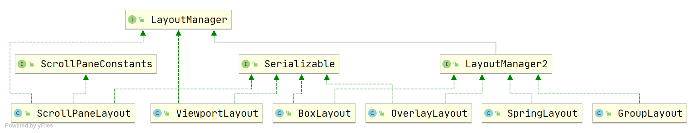

与`AWT`的布局相比，`Swing`的布局比较特别：

1. 它们可能应用于某个特定的容器组件，如`ScrollPaneLayout`用于`JScrollPane`、`ViewportLayout`用于`JViewport`
2. 大部分`Swing`布局都有辅助类，如`BoxLayout`的`Box`、`SpringLayout`的`Spring`等

与传统的`AWT`布局相比，`Swing`的布局稍显复杂，不过有意思的是，`BoxLayout`和`SpringLayout(JDK 1.4)`诞生的初衷，是为了解决`GridBagLayout`的复杂性问题，然而这两个布局都没有很好地完成这个任务。而后`GroupLayout(JDK 1.6)`布局诞生，并且`NetBeans IDE`集成了一个名叫`Matisse`的布局工具，用户界面设计者可以使用该工具托放组件到容器并指定组件的排列方式，工具将设计者的意图转换成对应的`GroupLayout`布局，这使得布局变得便捷。

> Swing中的布局几乎常用于GUI构建工具，因此手工编写这些布局的代码可能会非常繁琐，但理解这些布局的是如何工作的还是有必要的！

#### BoxLayout


#### SpringLayout

#### GroupLayout


### Swing新增事件


### Swing Look And Feel


## 高级GUI设计

本小节内容属于高级`GUI`内容，包括自定义组件

### AWT组件原理

> AWT如何实现跨平台？


> AWT组件绘制（paintComponent、paint）、重绘（repaint）

10.3.0


### 自定义AWT&Swing组件

#### AWT组件peer设计

#### Swing MVC组件设计模式

#### 开发自定义组件的一些思路


### 自定义布局管理器

#### 布局管理器类继承体系

#### 设计属于自己的布局管理器


### 感官设计

- flatlaf
- WebLaF
- beautyeye

### AWT事件模型源代码解读

### Swing线程模型


