# Java Language Specification

本篇文章主要介绍`Java`语言的**所有语法**、**类库概述包括常用类使用**和**历史缘由**这三部分，这是一篇很长的文章，建议选读。我会在文章中介绍各个部分的内容和跳转供选读参考。

语法部分我们会从基础语法到面向对象再到各类语言特性（泛型、异常、接口、内部类），这也是整篇文章中最长的章节：

- 基础语法：第一个`Java`程序、注释（`JavaDoc`）、变量常量数据类型、运算符和表达式、语句、数组、字符串、基本输入输出
- 面向对象：类、对象、三大特性、`Java`面向对象语言特性（枚举、接口、内部类、`classpath`、包、`import`、静态、初始化代码块）
- 语言特性：异常、泛型、断言
- 我们建议的观看顺序：

而后我们会介绍`JDK`提供的类库，我们会对整个体的类库进行介绍，包括各种常见需求应该使用哪个包，已经类库之外的需要时应该寻找哪些包（比如`apache`），紧接着我们将介绍一些切合基础语法的简单类的使用，这些类可能简单，但绝对实用，并且还常见，其主要覆盖`java.lang.*`和`java.util.*`：

- `java.lang.*`

最后我们将会介绍`JDK`的历史缘由，了解此处的内容有助于我们了解`JDK`的整体架构和工作方式，为我们接下来的学习梳理方向。

## Java基础语法

本章节主要介绍`Java`基础语法，包括：`Java`语言的语言基础，包括变量和数据类型、注释、运算符和表达式，`String`字符串类，语句、数组等基础语法。

#### 第一个Java程序

几乎所有的语言的学习都是从`Hello World`开始的，`Java`也一样，下面是一个最简单的`Java`应用程序，它的目的是打印一条消息到控制台窗口：

```java
public class HelloWorld {
    public static void main(String[] args) {
        System.out.println("Hello World!!");
    }
}
```

首先，`Java`是区分大小写的，如果出现拼写错误（如将上面的`main`写成了`Main`），则程序会无法运行。

我们对上面的程序进行简单的解释，随着学习的深入大家会逐渐熟悉这些东西，所以最开始不需要大家对此非常理解。

首先第一个`public`是访问修饰符（`access modifier`），访问修饰符主要用于控制程序的其他代码是否有这段代码的访问级别（调用权），`Java`中的访问修饰符有`4`个，我们在讲解到类和对象的时候会具体深入。

关键字`class`表明接下来要做的事情是定义一个类，`Java`程序中的全部内容都是包含在类当中的，如果读者曾经学过`C`或者`C++`，则在刚接触`Java`的时候可能会有点不适应，因为`C`和`C++`中有函数这一个概念而`Java`没有，`Java`是一门强面向对象语言，即所有的内容必须定义在`class`（类）里面

而`class`后紧跟的是类名`HelloWorld`，类名可以根据自己的实际需求来起名字，但名字必须以字母开头，后面可以跟字母和数字任意组合，同时不能使用`Java`的保留字（如`public`或者`class`）作为类名。一般情况下，标准的类名需要以字母或者`_`开头，中间能够使用字母、下划线和数字组合，比如下面的类名都是合法的：

```java
// todo
Hello
```

然后，第二行的`main`是类`HelloWorld`的方法，`main`方法是所有类的入口方法，和C、C++等的`main`函数一样。`Java`程序启动的时候`main`方法会被调用。

`Java`中的`main`方法的声明是固定的，必须是`public static void main(String[] args)`，`JVM`只认这个格式的`main`函数，其他的都不认，如：

```java
// 下面这些形式JVM都不会调用，也就是说Java程序在启动的时候不会调用它们
static void main(String args[]){}
private void main(String args[]){}
protected void main(String args[]){}
public void main(String args[]){}
public static void main(){}
```

`main`方法中的`public`、`static`是修饰符，这些修饰符含义我们会在后面介绍，现在大家只需要知道一点，那就是几乎`Java`所有的元素（类、方法等等），基本都可以指定修饰符。

再往下的`System.out.println("Hello World!!");`是方法调用，该方法的功能是打印`"Hello World!!"`到控制台，这行看起来奇奇怪怪的代码我们会在后续学到类的时候进行介绍，目前只需要知道，如果想要输出内容到控制台，只需要这样写就可以。

> 在Idea中，你无需全部都要把这行代码拼写出来，只需要写sout，就能出来这行代码！

#### 注释

在`Java`中，存在三种注释类型：单行注释、多行注释和文档注释。

单行注释主要以`//`开头，占用一行：

```java
// 这是第一行注释
// 这是第二行注释
```

多行注释以`/* */`进行分割：

```java
/*
	多行注释
	都会是注释
*/
```

在`Java`中，还有一种注释，其他很多语言都有参考这种注释，叫文档注释，以`/** */`作为标记，其中内部包含大量的`@`符号内容，代表参数内容，参数数量、方法注释等等，文档注释的内容可以通过`javadoc.exe`编译成`api`文档。

`Java`文档注释允许你使用一些`html`标签，这样`api`文档将有`html`格式。

```java
/**
	this is a XXX method.
	<p>
	some contents
	@param type 类型
*/
```

##### 文档注释

// 具体介绍文档注释的使用


#### 数据类型、变量、常量

##### 变量声明

`Java`中声明变量的方式很简单，和大多数语言一样，遵循下面的格式：

```java
// [变量类型] [变量名] = [值];
// [变量类型] [变量名] = [值], [变量名] = [值], [变量名] = [值]...;
// 如：
int a = 2;
short b = 4;
String a = "123";
long c = 4, d = 5;
```

`Java`是一种强类型语言，这意味着必须为每一个变量声明一种类型，在`Java`中，变量类型可以分为两类：基本类型（`primitive type`）和引用类型（`reference type`）

- 基本类型（`primitive type`）一共有`8`种，其中有`4`种整型（`int`、`short`、`long`、`byte`）、`2`种浮点型（`float`、`double`）、`1`种字符类型`char`（`unicode`编码）和一种逻辑型`boolean`。

- 引用类型是除了基本类型之外的所有类型都是引用类型，包括各种类的对象，枚举类型等等都是引用类型。

    > 所谓引用类型实际上和C语言的指针有异曲同工之妙，要想彻底了解Java中的引用是什么，就需要了解内存结构，在Java中，内存主要有堆和栈组成，我们在创建引用类型对象的时候，实际上JVM会在堆中分配一块内存来存储对象的内容（对象的内容），然后返回一个指针，代表该对象的入口地址，通过该入口地址，可以访问到对象内的数据。
    >
    > 而我们使用引用类型定义出来的引用类型变量，实际上就是储存这个对象入口地址的另外一个变量，因为这个变量引用着对象的入口地址，我们我们会称这个变量是一个引用。这个存储着对象入口地址的变量存放在栈中。
    >
    > 比如我们定义了一个String对象（注意，虽然String类很常用，但它实际上是引用类型）
    >
    > ```Java
    > String a = "123";
    > ```
    >
    > 实际上底层的的存放是这样的：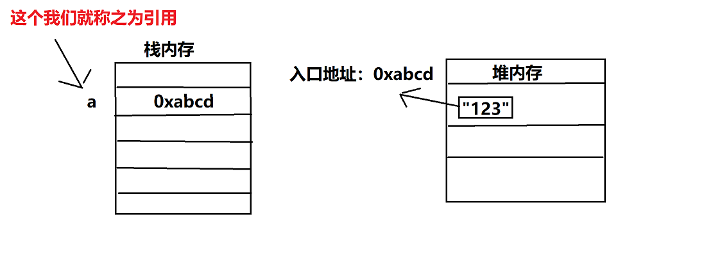
    >
    > JVM在编译时会检查各个引用的类型，检查其类型是否符合，还有各种检测，比如空指针（即栈内存中存的是null，null代表空的意思，即该引用不存储对象的任何入口地址）检测等
    >
    > 另外入口地址可以被多个引用存储：
    >
    > ```
    > String a = "123";
    > String b = a;
    > ```
    >
    > 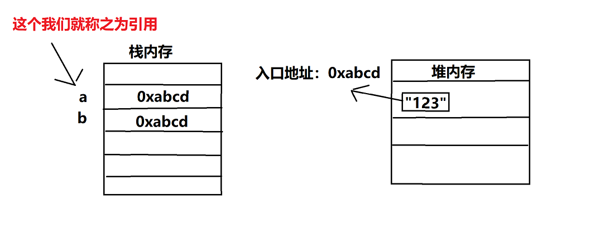
    >
    > JVM能够进行垃圾回收，实际上JVM的垃圾回收是基于引用数量来进行的，当一个对象的入口地址不被任何的引用所存储的时候，JVM就会标记该对象，在下次gc的时候会回收该对象的堆空间。

如果在定义变量的时候不指定初始值，如：

```java
int a;
short b;
```

则`Java`会使用默认值来进行初始化，具体的初始值参考下表：

| 变量类型       | 默认值                               |
| -------------- | ------------------------------------ |
| 整型           | 0                                    |
| 浮点型         | 0.0                                  |
| 字符类型       | `ASCII`第一个字符，即0，也就是`NULL` |
| 逻辑型         | `false`                              |
| 所有的引用类型 | `null`                               |

##### 数据类型

基本类型由`Java`语言规范规定，各个操作系统平台的`JVM`统一支持，所以不像`C`语言那样每个平台有不同的数据取值范围（例如在`16`位的操作系统中，`int`是占两个字节的，而在`32`位系统中，`int`是占用`4`个字节），`Java`语言的变量类型占用的内存空间全平台一致。

整数的`4`种类型存储字节和取值范围参考下表：

| 类型    | 存储需求 | 取值范围                                 | 初始值 |
| ------- | -------- | ---------------------------------------- | ------ |
| `int`   | 4字节    | -2147483648~2147483647                   | 0      |
| `short` | 2字节    | -32768~32767                             | 0      |
| `long`  | 8字节    | -9223372036854775808~9223372036854775807 | 0      |
| `byte`  | 1字节    | -128~127                                 | 0      |

和`C、C++`等一样，`Java`也支持整数的后缀和前缀表达，使用`L`或者`l`标记这个整数是一个`long`整数（400000L），使用`0x`或者`0X`前缀代表该数是一个16进制数（0xCAFE），使用0代表8进制数（`012`），`JDK 7`以后支持使用`0b`或者`0B`代表二进制数，如`0b01001`。

同时，从`JDK 7`开始，支持使用下划线`_`来划分整数，如：`1_000_000`、`0b1111_0000_0100_1100`，这些下划线只为了更加易读，`Java`编译器会去除这些下划线。

浮点类型是表示小数的类型，`Java`中有两种浮点类型，具体：

| 类型   | 存储需求 | 取值范围                                                     | 初始值 |
| ------ | -------- | ------------------------------------------------------------ | ------ |
| float  | 4字节    | 大约`-3.40282347E+38F-3.40282347E+38F`（有效位6~7位）        | 0.0    |
| double | 8字节    | 大约`-1.79769313486231570E+308-1.79769313486231570E+308`（有效位15位） | 0.0    |

`float`类型有一个后缀`f`或者`F`，没有后缀的浮点型默认是`double`，当然也可以在后面加上`d`或者`D`代表是`double`。

```java
float f1 = 2.32f;
float f2 = 6.52;
double d1 = 10.2564;
double d2 = 2.2564D;
```

浮点数还支持科学计数法进行赋值，使用E标记后面的位数，例如：`2.563E5`等于$2.563\times10^5$：

```Java
float f3 = 6.23E-2F;    // 科学计数法表示浮点数 E-2 ==> 10^-2，但由于小数常量默认是double,所以我们需要加F
double d5 = 2.563E5;
```

浮点型数据只有一个点要特别记住，即对浮点型的运算都要**考虑精度**，例如下面的代码：

```java
float f1 = 2.32f;
float f2 = 6.52f;
double d1 = 10.2564;
double d2 = 2.2564;
System.out.println(f2 - f1);
System.out.println((double) f2 - f1);
System.out.println(d1 - d2);

// 结果：
// 4.2
// 4.200000047683716
// 7.999999999999999
```

按照实际情况，`6.52-2.32=4.2`，所以当我们使用单精度类型（即`float`）减去单精度类型时，结果是`float`类型，得到的结果是准确的。但是如果我们此时使用双精度类型（即`double`），则实际上会得到`4.200000047683716`，也就是说得到的结果并不完全等于`4.2`，同样的问题还会出现的`double`减去`double`的类型中（如上面的10.2564 - 2.2564结果是`7.999999999999999`），这种误差的存在说明了计算机无法使用二进制完全准确地表示小数。因此在进行计算是还要考虑精度范围。

**同样的事情出现在比较两个浮点数中**，例如：

```java
double d3 = 58.30000000000000011;
double d4 = 58.29999999999999999;
System.out.println(d3 == d4);
// 结果：true
```

因此，请不要直接比较两个浮点数，因为结果不一定准确。计算机中认为在一定范围内的小数是相同的，比如误差值为$e$，则在$x-e < x < x+e$范围内的任何小数，都会被认为等于$x$

字符型`char`原本是用来表示单个字符，占一个字节，不过，如今情况已经有所变化，随着语言文字表达的需求，字符型的大小早已不仅仅使用单字节来表示了。

字符型的表示原理实际上和编码表有关，因为计算机只能表示数字，所以`char`类型实际上是一个整数，通过这个整数和编码表，来实现表达字符。如下面是比较有名的`ASCII`编码表（基本上单字节字符都使用下面这张表表示字符）：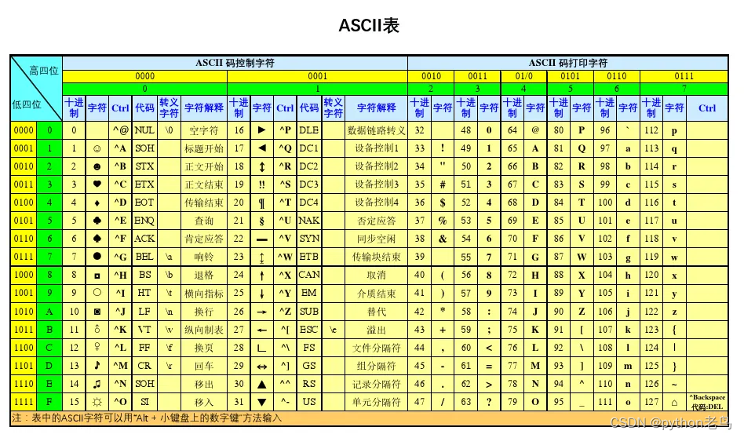

`Java`中的`char`类型的使用的并非是`ASCII`表而是`Unicode`方案，这种方案使用两个字节来表示字符，因此将字符的表达范围从最开始的单字节变成双字节，能够表达式更多的内容了（包括一部分汉字）

然而`2`字节的`Unicode`方案也并不能完全满足使用了，因此后续出现了很多扩展性的方案，如`4`字节的`Unicode`等，这些扩展在后续演变成了各种可变字节的编码表，如`UTF-8`、`UTF-16`、`UTF-32`等，其中Java默认使用`UTF-16`。

```
char a = 'a';
char ch = (char)65;
```

`boolean`型是逻辑型，其值有`true`和`false`，`boolean`类型需要注意一点是在其他语言中可能存在用整数来替代`boolean`类型的情况，比如不等于`0`的数就是`true`，`0`则是`false`。而在`Java`中，这种情况不适用，`true`就是`true`，`false`即时`false`，无法转为整数。

#####  常量

在`Java`中，使用`final`关键字来声明常量，比如：

```java
final int A = 20;
public final String S = "HelloWorld";
```

常量一旦赋值，无法进行改变，如果你在后续代码中对一个常量进行再赋值，则会抛出编译错误：

```java
final int A = 20;
A = 30;
// 这代码无法通过编译
```

// 字符和小数常量

#### 运算符

`Java`中的运算符主要有算术运算符、比较运算符、逻辑运算符、位运算符以及一些表达式：

##### 算术运算符

```
+ - * / % ++ --
```

##### 比较运算符

```
> < >= <= != ==
```

##### 逻辑运算符

```
&& || ! & |
```

##### 位运算符

```
& | ^ ~ << >> >>>
```

#####  赋值运算符

```
= += -= *= /= %=  <<= >>= &= ^=|=
```

##### 条件运算符(三目运算)

```
?:
```

##### instance of

```

```

##### 类型转换

各类整数类型（包括`char`）存在着一个隐式类型转换，我们经常需要将一种数值类型转为另外一种数值类型，他们遵循下面的转换规则：

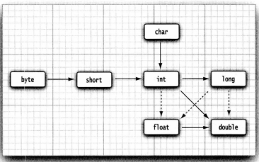

然而这种转换并非是完全准确的，例如当我们将一个`int`的`123456789`转为一个浮点数时，由于它包含的位数比`float`类型所能够表示的位数多，当将这个整数转为`float`类型时，将会得到正确的大小，但会损失一些精度。基本上，使用虚线标记出来的转换都是有可能存在精度损失的。

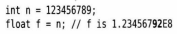

这种隐式类型转换同样存在运算过程中：

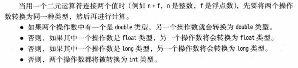


除了上面的隐式转换之外，我们平时更多使用的是**强制类型转换**，**强制类型转换**发生在基本类型和引用类型中，而不仅仅是整数类型。

// todo

##### 运算符的优先级

| 类别     | 操作符                                     | 关联性   |
| :------- | :----------------------------------------- | :------- |
| 后缀     | () [] . (点操作符)                         | 左到右   |
| 一元     | expr++ expr--                              | 从左到右 |
| 一元     | ++expr --expr + - ～ ！                    | 从右到左 |
| 乘性     | * /％                                      | 左到右   |
| 加性     | + -                                        | 左到右   |
| 移位     | >> >>>  <<                                 | 左到右   |
| 关系     | > >= < <=                                  | 左到右   |
| 相等     | == !=                                      | 左到右   |
| 按位与   | ＆                                         | 左到右   |
| 按位异或 | ^                                          | 左到右   |
| 按位或   | \|                                         | 左到右   |
| 逻辑与   | &&                                         | 左到右   |
| 逻辑或   | \| \|                                      | 左到右   |
| 条件     | ？：                                       | 从右到左 |
| 赋值     | = + = - = * = / =％= >> = << =＆= ^ = \| = | 从右到左 |

#### 语句

和大部分语言一样，语句基本包含分支选择和循环两种：

```java
// 分支选择
if...else if...else...
switch...case...default...

// 循环
for...
while()...
do...while();

// JDK 5新增
foreach循环
    
// 循环控制
break
continue
```

`if`语句的事情比较简单，`if`的条件必须是`true`或者`false`的，可以是表达式和`boolean`，其中`else`和`else if`都是可选的：

```java
if(true){}

int a = 5;
if(a > 6){}

int b = 7;
if(a < 6 && b > 7){}

if(a > 9 & b < 9){}
else if(a == 7){}

if(a > 9 || b < 2){}
else{}
```

一个常见的`if`语句：

```java
int monthStr = System.in.read();
int month = monthStr - '0';
if(month == 1){
    System.out.println(31);
}
else if(month == 2){
    if((year % 4 == 0 && year % 100 != 0) || year % 400 == 0) {
        System.out.println(29);
    } 
    else{
        System.out.println(28);
    }
}
else if(month == 3){
    System.out.println(31);
}
else if(month == 4){
    System.out.println(30);
}
else if(month == 5){
    System.out.println(31);
}
else if(month == 6){
    System.out.println(30);
}
else if(month == 7){
    System.out.println(31);
}
else if(month == 8){
    System.out.println(31);
}
else if(month == 9){
    System.out.println(30);
}
else if(month == 10){
    System.out.println(31);
}
else if(month == 11){
    System.out.println(30);
}
else if(month == 12){
    System.out.println(31);
}
else{
    System.out.println("没有这个月份");
}
```

`switch`语句一般需要配合`break`进行退出，支持整数类型和字符类型，在`JDK 5`之后支持字符串和枚举类型的`switch`：

```java
int monthStr = System.in.read();
int month = monthStr - '0';
switch(month){
    case 1:
        System.out.println(31);
        break;
    case 2:{
        //也可以使用{}，作为代码块,和上面的case 1没有区别，只不过更直观
        if((year % 4 == 0 && year % 100 != 0) || year % 400 == 0) {
            System.out.println(29);
        } 
        else{
            System.out.println(28);
        }
        break;
    }
    case 3:{
        //也可以使用{}，作为代码块,和上面的case 1没有区别，只不过更直观
        System.out.println(31);
        break;
    }
    case 4:{
        //也可以使用{}，作为代码块,和上面的case 1没有区别，只不过更直观
        System.out.println(30);
        break;
    }
    case 5:{
        //也可以使用{}，作为代码块,和上面的case 1没有区别，只不过更直观
        System.out.println(31);
        break;
    }
    case 6:{
        //也可以使用{}，作为代码块,和上面的case 1没有区别，只不过更直观
        System.out.println(30);
        break;
    }
    case 7:{
        //也可以使用{}，作为代码块,和上面的case 1没有区别，只不过更直观
        System.out.println(31);
        break;
    }
    case 8:{
        //也可以使用{}，作为代码块,和上面的case 1没有区别，只不过更直观
        System.out.println(31);
        break;
    }
    case 9:{
        //也可以使用{}，作为代码块,和上面的case 1没有区别，只不过更直观
        System.out.println(30);
        break;
    }
    case 10:{
        //也可以使用{}，作为代码块,和上面的case 1没有区别，只不过更直观
        System.out.println(31);
        break;
    }
    case 11:{
        //也可以使用{}，作为代码块,和上面的case 1没有区别，只不过更直观
        System.out.println(30);
        break;
    }
    case 12:{
        //也可以使用{}，作为代码块,和上面的case 1没有区别，只不过更直观
        System.out.println(31);
        break;
    }
    default:
        System.out.println("没有这个月份");
}
```

`JDK 5`之后支持字符串枚举，字符串的枚举参考如下：

```java
String lucky = "Alice";
switch(lucky){
	case "Luna":{
		System.out.println("Congratulation Luna！");
        break;
	}
    case "Alice":{
        System.out.println("Congratulation Alice！");
        break;
    }
    case "Hellen":{
        System.out.println("Congratulation Hellen！");
        break;
    }
    default:{
        System.out.println("Nobody won!");
        break;
    }
}
// 结果：Congratulation Alice！
```

枚举类型的`Switch`我们在介绍枚举类型时再进行讲解。

枚举一般需要配合`break`使用，那么如果不加`break`会怎样呢？我们拿上面的代码举例，如果我们把`break`删掉：

```java
String lucky = "Alice";
switch(lucky){
	case "Luna":{
		System.out.println("Congratulation Luna！");
	}
    case "Alice":{
        System.out.println("Congratulation Alice！");
    }
    case "Hellen":{
        System.out.println("Congratulation Hellen！");
    }
    default:{
        System.out.println("Nobody won!");
    }
}
// 结果：
// Congratulation Alice！
// Congratulation Hellen！
// Nobody won!
```

可以看到符合条件的`case`后面的所有`case`都会执行包括`default`，如果你调整了case的顺序：

```java
String lucky = "Alice";
switch(lucky){
	case "Luna":{
		System.out.println("Congratulation Luna！");
	}
	case "Hellen":{
        System.out.println("Congratulation Hellen！");
    }
    case "Alice":{
        System.out.println("Congratulation Alice！");
    }
    default:{
        System.out.println("Nobody won!");
    }
}
// 结果：
// Congratulation Alice！
// Nobody won!
```

在`Java`中有三类循环语句：`for`、`while`、`do...while`

```java
// for语句：迭代循环
for(初始化; 条件; 迭代){

}
// 初始化一般需要初始化用于迭代的变量，当然也可以同时初始化其他内容
// 条件是只有满足了才会往下执行
// 迭代是初始化时声明的迭代变量的增减，常用 ++ 或者 --
// 如下：
for(int i = 0; i <= 20 ;i++){
	System.out.println(i);
}

// while语句：条件循环
// 只有括号的条件为true时，才会进行循环
while(true){
    
}

// do...while()的逻辑和while一样，也是条件循环，只有当while(true)的时候才执行循环
// 注意while(true)后面有;
// 和while的唯一区别是，while()是先判断再执行，而do... while()是先执行，再判断
do{
    
}while(true);

// 可能有些同学以前学过until语句，即当条件满足时才退出循环，可惜Java没有这种循环语句！！
```

除了上面三种循环外，`Java`还有一种`foreach`循环，这种循环可以实现数组的快速遍历（当然实际不只是数组，这种循环实际上是`Java`的语法糖扩展而非核心语法，所以单独拎出来说）：

```java
// 格式for(数组原始类型 变量 : 数组变量)
String[] strs = new String[]{"123", "456", "789"};
for(String str : strs){
    System.out.println(str);
}

/*
结果：
123
456
789
	
*/
```

#### 类和对象基础

本节介绍面向对象，`Java`是完全面向对象的语言，所有的内容都是基于面向对象设计的，面向对象的核心内容主要就是类、对象以及面向对象的三大特性，我们在接下来会详细讲解这三个内容。

##### 类

在`Java`中，类实际上是一个抽象概念，你可以理解为是对象的模板，通过类，我们可以"复制"出对象。

在官方的定义中，类是一组数据（字段）和操作（方法）的集合体，是对实体的一种抽象。

> 面向过程的编程思想将内容以"过程函数"的方式进行表达，即我们的编码是基于函数来进行的，类似于数学上的函数，从输入，到过程处理再到输出过程，这种过程函数的处理方式对外是一个黑匣子，即过程函数使用者仅需要关注函数的输入和输出即可，而过程函数的定义者则需要具体去考虑函数的实现方式。
>
> 因此，面向过程编程的核心应用实际上就是数学函数思维的应用。
>
> 而面向对象思想则从现实实体出发，归纳实体具有的基本属性，操作能力，它的出发点是实体（即对象）本身而非数学函数，将多个具有同种属性集、同类操作能力的对象进行抽象和统一，则形成了所谓的类。面向对象的思想要求使用者和定义者都要考虑对象本身的属性和操作，使用者要探究对象提供了哪些属性和操作，而定义者则要制定好对象本身应该具有的属性和操作。
>
> 因此，面向对象编程的核心应用实际上就是对实体的归纳总结能力的应用。
>
> 两种编程思想并无优劣之分，面向过程更适合底层内容的设计（因为涉及到复杂的计算偏多），而面向对象更加适合应用级别内容的设计（如工业软件、`Web`、游戏等，这些领域更加强调实体和实体抽象而非函数计算）

我们现在开始介绍如何定义一个类，在`Java`中，定义类主要使用`class`关键字。

```java
public class Person{
	
}
```

`Java`中，我们声明类除了使用`class`关键字外，还需要一个如上面代码中的`public`一样的修饰符，这种修饰符被称为访问修饰符，他规定了后面修饰的内容是否能暴露给使用者，访问修饰符主要有以下的选择：

```
public：公开修饰符，任何人都可以访问
protected：保护级别修饰符，对子类，同包内的类可见
default：包级别修饰符，仅对同包的类可见 (一般不需要写这个关键字, 默认就是default)
private：只有类自己可见
```

我们会在下一节内容中具体介绍如何使用访问修饰符。修饰符除了访问修饰符之外，还有其他的两种修饰符：`static`静态修饰符和`final`修饰符，我们同样在后面的章节中进行介绍。

另外在声明类的时候，特别注意：**Java类名要和类文件名一致**，一般情况下，我们写的`Java`代码会被保存成后缀名为`*.java`文本文件，比如我们定义一个名叫`HelloWorld`类，则这个类的代码会被保存`HelloWorld.java`的文本文件中：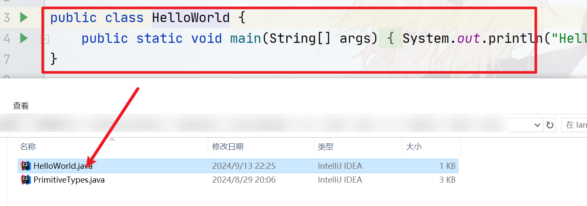

一般情况下`Java`类文件可以存在多个类，但是只能有一个`public`级别的类，并且这个`public`的类要和`Java`类文件的文件名相同。其他非`public`的类的访问级别是`default`

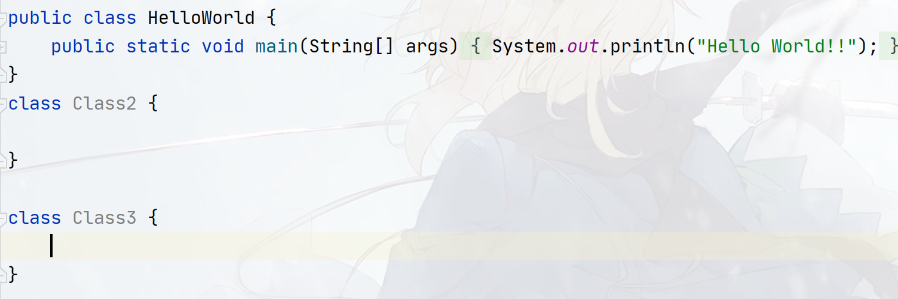

###### 访问修饰符

我们在前面说过定义一个类需要使用访问修饰符，实际上不仅仅在定义类的时候需要访问修饰符，在定义方法、定义字段的时候，也需要使用访问修饰符。我们会分别介绍在类、方法、字段中如何使用访问修饰符！

`Java`中的访问修饰符有四种：

```
public：公开修饰符，任何人都可以访问
protected：保护级别修饰符，对子类，同包内的类可见
default：包级别修饰符，仅对同包的类可见
private：只有类自己可见
```

其中需要注意，`default`修饰符不需要特地声明，在`Java`中，类、字段或者方法不加任何修饰符，默认就是`default`。

在声明类的时候，类只支持`public`和`default`两个级别：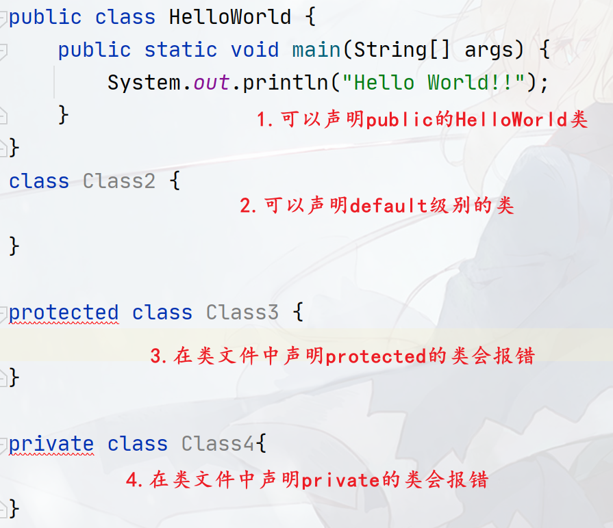

> 好，看这里如果你是Java初学者，我们建议你点击<a href="#methods">这里</a>跳转到学习如何在类中定义方法和字段，之后再回到这里继续学习方法和字段的访问修饰符

------

<a id="modifier"></a>如果访问修饰符修饰的是字段、方法，则所有的修饰符都有效，其具体的访问权限效果，可见下表：

| 修饰符      | 当前类 | 同一包内 | 子孙类(同一包) | 子孙类(不同包) | 其他包 |
| :---------- | :----- | :------- | :------------- | :------------- | :----- |
| `public`    | Y      | Y        | Y              | Y              | Y      |
| `protected` | Y      | Y        | Y              | Y/N            | N      |
| `default`   | Y      | Y        | Y              | N              | N      |
| `private`   | Y      | N        | N              | N              | N      |

我们接下来会分别演示他们的具体修饰效果：


##### static静态修饰符


##### final常量修饰符


##### 方法<a id="methods"></a>

既然类是方法和字段的集合体，那么如何在类中定义方法呢？很简单，定义方法的方式很像定义函数，都需要考虑下面的四种内容：

- 修饰符（访问、`final`、`static`）
- 方法返回值：指定返回值类型，可以是基本类型也可以是引用类型，如果方法不需要返回内容，则可以使用`void`关键字
- 方法签名：`Java`中的方法签名一般遵循驼峰命名法，但具体还是需要看个人习惯！
- 参数：参数需要指定参数类型和参数名，可以指定多个参数，如果不需要传递参数的话，留空括号即可

下面是定义方法的一个例子：

```java
public class HelloWorld {
	// 定义一个public级别的无返回值、无参数的名叫test1的方法
	public void test1(){}
    
    // 定义一个public级别的返回String类型的、接收两个参数的test2方法
    public String test2(int number, String address){
        // 代码
    }
    // 
    private void test3(String name){
        
    }
    //
    protected int test4(){
        
    }
}
```

> 同样，如果你是Java初学者，在对方法的定义有所了解之后：
>
> - 想继续深入学习方法，我们建议你点击：
>
>     - 继续学习方法中的重要概念——重载：<a href="#overload">点击</a>
>
>     - 学习方法中的一类特殊方法——构造器：<a href="#constructor">点击</a>
>
> - 你也可以先去学习如何在类中创建字段：<a href="#field">点击</a>

**方法重载：<a id="overload"></a>**

什么叫方法重载呢？在面向过程编程中，函数的定义一般是唯一的，即我们认为一个函数名对应一个函数，而这种规定在面向对象的方法中被打破，也就是说，在类中，**你可以定义多个具有相同方法签名的方法，而这些相同方法名的方法，他们互为重载方法（Overload）**

定义重载方法一般需要遵守下面两个规定：

- 具有相同的方法签名
- 方法要具有不同的参数（顺序不同或者类型不同或者数量不同）

我们举例：

```java
public class HelloWorld {
	// 定义一个public级别的无返回值、无参数的名叫test1的方法
	public void test1(){}
    // test1()的另外一个重载体（参数数量上的不同）
    public void test1(int number){}
    public void test1(String address, int number){}
    
    // 定义一个public级别的返回String类型的、接收两个参数的test2方法
    public String test2(int number, String address){
        // 代码
    }
    // test2(int number, String address)的重载方法（参数顺序上的不同）
    public String test2(String address, int number){
        // 代码
    }
    // 
    private void test3(String name){
        
    }
    // test3(String name)的重载方法（参数类型上的不同）
    private void test3(int number){} 
    
    //
    protected int test4(){
        
    }
    protected int test4(int numer){
        
    }
    // 在数量上、类型上、顺序上不同
    protected int test4(String address, int number, Date date){
        
    }
}
```

需要注意，重载方法只看方法签名和参数，其他条件都不会重载，如下面的条件都不能作为重载方法而**应该看作是同一个方法**：

- 方法签名相同，参数相同，返回类型不同（×）

- 方法签名相同，参数相同，访问修饰符不同（×）
- 方法签名相同，参数相同，抛出的异常（后面会讲解）不同或者另外一个方法不抛异常（×）

```java
public class HelloWorld {
    public void test1(String address, int number){}
    // 返回值不能作为重载条件，这两个方法可以看作是同一个方法！所以编译器会报错
    public String test1(String address, int number){}
    // 访问修饰符不能作为重载条件，这两个方法可以看作是同一个方法！所以编译器会报错
    private void test1(String address, int number){}
    // 抛出异常不能作为重载条件，这两个方法可以看作是同一个方法！所以编译器会报错
    public void test1(String address, int number) throws Exception{}
    // 那么这个呢？不是重载方法！
    protected Date test1(String address, int number) throws IOException{}
}
```

所以只要记住一点：决定两个方法能够构成重载，其决定条件只有两个：

- 相同的方法签名
- 参数不同

其他都不用管，无论其他条件怎样变，只要满足这两个条件，他们就互为重载方法！如果方法签名相同、参数相同，则它们就是同一个方法。

小练习，判断下面的方法是不是重载方法：

```

```

> 学习完方法重载之后，你基本能够熟练定义方法，则可以学习：
>
> - 学习方法中的一类特殊方法——构造器：<a href="#constructor">点击</a>
> - 学习如何在类中创建字段：<a href="#field">点击</a>
>
> 如果你已经学习完属性和构造器两个内容，则你可以学习：
>
> - 如何创建类的对象：<a href="#object">点击</a>
> - 可以回到访问修饰符（<a href="#modifier">点击</a>），继续学习访问修饰符对方法、字段的影响

**构造器：<a id="constructor"></a>**

首先大家需要知道，构造器（构造方法）是一种特殊的类方法（注意，**其本质还是方法**，所以我们在方法一节中对他进行介绍）。

构造器的声明需要遵循下面的4个条件：

- 访问修饰符：`Java`中的`4`个修饰符都支持
- 构造器不需要返回值
- 构造器的方法签名要和类名相同
- 参数：参数需要指定参数类型和参数名，可以指定多个参数，如果不需要传递参数的话，留空括号即可

例如：

```java
public class HelloWorld {
	public HelloWorld(){}
    
    private HelloWorld(int number){}
    
    protected HelloWorld(String address, int number){}
}
```

构造器在我们创建对象的时候会被调用，我们可以使用`new`关键字来创建对象，我们将在对象章节中进行具体介绍。

> 学习完构造器之后，你基本对构造器有一定的了解并且能够声明构造器，接下来你可以学习：
>
> - 方法重载，方法重载同样适用于构造器：<a href="#constructor">点击</a>
> - 学习如何在类中创建字段：<a href="#field">点击</a>
>
> 如果你已经学习完属性和重载两个内容，则你可以学习：
>
> - 如何创建类的对象：<a href="#object">点击</a>
> - 可以回到访问修饰符（<a href="#modifier">点击</a>），继续学习访问修饰符对方法、字段的影响

##### 属性<a id="field"></a>

那么如何在类中定义属性（字段）呢？实际上和定义变量的时候是差不多的，只不过需要加上访问修饰符，如：

```java
public class HelloWorld {
    private String name;
    private int a;
    protected String address;
}
```

在定义字段的时候，一般情况下需要进行初始化，我们可以把初始化的步骤放在构造器中进行，也可以直接进行赋值：

```java
public class HelloWorld {
    private String name = "123";
    private int a;
    protected String address;
    
    public HelloWorld(){
        a = 2;
        address = "china";
    }
}
```

字段的表现形式很像变量，所以你可以随时改变字段的值：

```java
public class HelloWorld {
    private String name = "123";
    private int a;
    protected String address;
    
    public HelloWorld(){
        a = 2;
        address = "china";
    }
    
    public void test2(){
    	address = "hello";
    }
}
```

> 在学习完类的属性定义之后，你基本掌握如何声明类的方法和类的字段：
>
> - 接下来可以返回方法，继续学习方法中的重要概念——重载：<a href="#overload">点击</a>
> - 你也可以学习方法中的一类特殊方法——构造器：<a href="#constructor">点击</a>
>
> 如果你已经学习完重载和构造器两个内容，则你可以学习：
>
> - 如何创建类的对象：<a href="#object">点击</a>
> - 可以回到访问修饰符（<a href="#modifier">点击</a>），继续学习访问修饰符对方法、字段的影响

#### 对象<a id="object"></a>

如何创建对象


#### 三大特性

本小节主要介绍面向对象的三大特性，即封装、多态和继承。

##### 封装

区分一个组件设计得好不好，唯一重要的因素在于，它对于外部的其他组件而言，是否隐藏了其内部数据和其他实现细节。设计良好的组件会隐藏所有的实现细节，把`API`与实现清晰地隔离开来。然后，组件之间只通过`API`进行通信。一个模块不需要知道其他模块的内部工作情况。这个概念就被称为封装。封装之所以重要是因为它能够降低系统模块和模块之间的耦合度。


##### 多态


##### 继承

// 单继承，重写、super、this


#### 基本输入输出


##### 数组


##### 字符串


## Java面向对象


#### 接口


#### 内部类

内部类，

#### 匿名类


#### 包和classpath

// 介绍java的寻class方式

#### import


#### 枚举

有的时候变量的取值在一个有限的集合内，如饮料的小杯、中杯、大杯、超大杯，衣服的尺寸码S、M、L、X等，这些类型的取值都在一个范围内并且相对固定的，这种时候即可使用枚举类型。

`Java`在`JDK 5`的时候提供了`enum`关键字来实现枚举类型，定义格式如下：

```Java
[public | private | protected] enum [枚举类型常量名]{
    [枚举量1], [枚举量2], ...;
}
```

如：

```java
public enum Size{
    SMALL, MEDIUM, LARGE, EXTRA_LARGE;
}
```

枚举类是一种类型，本质上和`Java`类是一样的，因此**首先要把枚举当作类来对待**，枚举实际上确实是一个特殊的类，**特殊在所有的对象都需要预先定义好**（即枚举类中的枚举量，`Java`会把他们当成**所属枚举类的对象**看待）并且无法通过`new`来创建枚举类的新对象，声明枚举类型的变量参考如下：

```java
Size currentSize = Size.MEDIUM;
Size s = Size.LARGE;
```

总之，**每个枚举常量都是定义它的类的对象**，这一点要记住！

枚举常量由于不能额外创建对象且所有的对象都已经在定义枚举类的时候声明好，也就是说枚举类的对象是有限的且固定的，因此枚举常量之间的比较可以使用`==`，如：

```java
Size currentSize = Size.MEDIUM;
if(currentSize ==Size.LARGE){
	
}
else if(currentSize ==Size.MEDIUM){

}
```

 枚举量同样支持使用`switch`来进行遍历：

```java
Size currentSize = Size.MEDIUM;
switch(currentSize){
    case LARGE:{
        
    }
    case MEDIUM:{
	}
    case SMALL:{
        
    }
}
```

##### Java语言枚举支持

在上面我们简单介绍了枚举的基本定义和使用并且说明每个枚举常量都是定义它的枚举类的对象之后，我们带着这两个特点来深入探究在`Java`语言层面理解枚举的实现。

正如上文提到，可以把枚举类当成是一种特殊的类，实际上`Java`语言也是这样处理的。你虽不能使用`new`实例化枚举，但枚举却有很多和类相同的功能，例如：**可以为枚举提供构造方法，添加实例变量和方法，甚至可以实现接口**。这也是为什么说枚举类是特殊的类的原因。另外还需要注意一点，**枚举类的构造器只能是private（这个private可以省略不写），不能是public等其他，指定其他修饰符会报语法错误**，这也是你无法`new`枚举类对象的原因。**其他如方法和字段的创建，基本和普通类一样**。

同样前文提过，**枚举常量实际上就是枚举类预先定义好的对象**，**如果枚举类中定义了构造器，则创建每个枚举常量时都会调用该构造器**，如果枚举类有多个构造器，**则当需要指定带参数的构造器的时候，需要在枚举常量后加括号进行参数赋值**，如：

```java
public enum Size{
    // 什么都不加的话会调用private Size(){}
    SMALL, 
    // 需要指定括号然后传递参数，和new后面的写法很像
    // 调用private Size(String a){}
    MEDIUM("1231"), 
    LARGE("12312"), 
    EXTRA_LARGE("2313");
    private Size(){}
    Size(String a){}
}
```

我们定义了一个复杂的枚举类型，来说明在枚举类中能够具体做哪些事情：

```java
package cn.argento.askia.enumeration;

import com.sun.tools.corba.se.idl.StringGen;

// 1.可以继承接口
public enum FlexSize implements AutoCloseable{

    UNKNOWN,
    SMALL("S"),
    MEDIUM("M"),
    LARGE("L"),
    EXTRA_LARGE("XL"),
    SMALL_H_W("S", 150, 60),
    MEDIUM_H_W("M", 160, 80),
    LARGE_H_W("L", 170, 100),
    EXTRA_LARGE_H_W("XL", 180, 120);

    // 2.可以定义成员变量
    private String inch;
    public int height;
    public int weight;

    private static boolean isFlex = false;

    // 3.你甚至可以定义静态常量
    public static final String FlexSizeConstant = "flexSizes";

    
    // 4.可以定义构造器
    private FlexSize(){
        inch = "?";
        height = -1;
        weight = -1;
    }

    private FlexSize(String inch) {
        this.inch = inch;
        height = 0;
        weight = 0;
    }

    // 5.定义静态方法
    public static boolean isIsFlex() {
        return isFlex;
    }

    public static void setIsFlex(boolean isFlex) {
        FlexSize.isFlex = isFlex;
    }

    private FlexSize(String inch, int height, int weight){
        this.inch = inch;
        this.height = height;
        this.weight = weight;
    }

    public String getInch() {
        return inch;
    }

    public int getHeight() {
        return height;
    }

    public void setHeight(int height) {
        this.height = height;
    }

    public int getWeight() {
        return weight;
    }

    public void setWeight(int weight) {
        this.weight = weight;
    }

    @Override
    public void close() throws Exception {
        System.out.println("close method");
    }
    
    // 甚至可以定义main
    public static void main(String[] args) {
        FlexSize flexSize = FlexSize.LARGE;
        System.out.println(flexSize);
    }
}
```

至此，我们总结一下在枚举类中能做的事情：

1. 可以且仅可以为枚举提供一个或多个`private`构造方法
2. 添加实例变量、静态变量、方法、实例常量、静态常量，不限制修饰符
3. 可以实现接口

在枚举类中不能做的事情：

1. 无法提供`public`、`protected`、`default`级别的构造器
2. 无法继承其他类

##### Java编译器处理枚举类

我们最后来说明下为什么**枚举类无法继承其他类却能实现接口**，这是因为`Java`中**所有的枚举类都会默认继承一个叫**`Enum`**的泛型类**，这个类位于`java.lang`包下，而`Java`的继承只支持单继承。

`Enum`类的类声明和`API`如下：

```java
public abstract class Enum<E extends Enum<E>>
        implements Comparable<E>, Serializable {
   
    // 返回该枚举对象的变量名称
    // 如：Size.SMALL.name();将会返回SMALL
    public final String name() {
        return name;
    }

	// 返回该枚举对象在所有对象中的顺序，从0开始
    /*
    	例如：
    	public enum Size{
            SMALL, 
            MEDIUM, 
            LARGE, 
            EXTRA_LARGE;
		}
		SMALL的ordinal就是0，MEDIUM就是1，LARGE就是2，EXTRA_LARGE就是3
    */
    private final int ordinal;
    public final int ordinal() {
        return ordinal;
    }

    // 枚举类型的构造方法，所有的子枚举类型都会调用这个构造器
    // 一般这个构造器有Java负责合成，开发者无需关心
    protected Enum(String name, int ordinal) {
        this.name = name;
        this.ordinal = ordinal;
    }

    // 该方法和name()一样
    public String toString() {
        return name;
    }

    // 对比两个常量是否相同，使用==即可，具体我们在上面有说明
    public final boolean equals(Object other) {
        return this==other;
    }
    
    public final int hashCode() {
        return super.hashCode();
    }

    protected final Object clone() throws CloneNotSupportedException {
        throw new CloneNotSupportedException();
    }


    public final int compareTo(E o) {
        Enum<?> other = (Enum<?>)o;
        Enum<E> self = this;
        if (self.getClass() != other.getClass() && // optimization
            self.getDeclaringClass() != other.getDeclaringClass())
            throw new ClassCastException();
        return self.ordinal - other.ordinal;
    }


    // 获取当前枚举类型的Class对象
    @SuppressWarnings("unchecked")
    public final Class<E> getDeclaringClass() {
        Class<?> clazz = getClass();
        Class<?> zuper = clazz.getSuperclass();
        return (zuper == Enum.class) ? (Class<E>)clazz : (Class<E>)zuper;
    }
    
    //  静态方法，通过枚举变量的变量名来获得枚举变量
    //  比如Enum.valueOF(Size.class, "SMALL") == Size.SMALL;
    public static <T extends Enum<T>> T valueOf(Class<T> enumType,
                                                String name) {
        T result = enumType.enumConstantDirectory().get(name);
        if (result != null)
            return result;
        if (name == null)
            throw new NullPointerException("Name is null");
        throw new IllegalArgumentException(
            "No enum constant " + enumType.getCanonicalName() + "." + name);
    }

    protected final void finalize() { }

    private void readObject(ObjectInputStream in) throws IOException,
        ClassNotFoundException {
        throw new InvalidObjectException("can't deserialize enum");
    }

    private void readObjectNoData() throws ObjectStreamException {
        throw new InvalidObjectException("can't deserialize enum");
    }
}

```

`Java`中所有的枚举类都实现了`Enum`类，我们通过反编译一个枚举类即可得到证实，比如我们有如下的枚举类：

```java
public enum Size {
    SMALL, MEDIUM, LARGE, EXTRA_LARGE;
}
```

我们使用下面的指令进行反编译：

```bash
# 只显示方法参数、方法签名、方法返回值
javap -p -s Size.class
# 显示方法参数、方法签名、方法返回值、方法代码等
javap -p -c -l -s Size.class
```

将会得到下面的反编译产物（为了篇幅我们不显示代码部分，感兴趣的可以自行反编译研究，你会看到很多`JVM`指令，并且对`Java`语言机制有更深入的了解）：

```java
// 第一行就可以证明我们之前说的所有枚举类型会继承java.lang.Enum
public final class cn.argento.askia.enumeration.Size 
    extends java.lang.Enum<cn.argento.askia.enumeration.Size> {
    
  // 第一个常量SMALL，会被定义成public static final
  public static final cn.argento.askia.enumeration.Size SMALL;
    descriptor: Lcn/argento/askia/enumeration/Size;
  // 第二个常量MEDIUM
  public static final cn.argento.askia.enumeration.Size MEDIUM;
    descriptor: Lcn/argento/askia/enumeration/Size;
  // 第三个常量LARGE
  public static final cn.argento.askia.enumeration.Size LARGE;
    descriptor: Lcn/argento/askia/enumeration/Size;
  public static final cn.argento.askia.enumeration.Size EXTRA_LARGE;
    descriptor: Lcn/argento/askia/enumeration/Size;
    
  // 这是一个合成的数组变量，存放我们定义的所有枚举对象，即上面的SMALL、MEDIUM、LARGE和EXTRA_LARGE。该变量由Java编译器生成，对代码开发过程是不可见的，但是可以使用反射API来进行获取（安全管理器SecurityManager出于安全可能会进行拦截，需要使用一些特殊的API）
  private static final cn.argento.askia.enumeration.Size[] $VALUES;
    descriptor: [Lcn/argento/askia/enumeration/Size;
  // 该方法主要返回$VALUES变量的内容，即所有的枚举对象组成的数组
  public static cn.argento.askia.enumeration.Size[] values();
    descriptor: ()[Lcn/argento/askia/enumeration/Size;

  // 静态方法，通过枚举变量的变量名来获得枚举变量
  // 比如：Size.valueOf("SMALL") == Size.SMALL;
  public static cn.argento.askia.enumeration.Size valueOf(java.lang.String);
    descriptor: (Ljava/lang/String;)Lcn/argento/askia/enumeration/Size;
                   
  // Size枚举类的构造器，需要注意，我们声明的枚举类是没有参数的，而descriptor中显示的是方法的参数和返回值，其格式是：(参数1;参数2)返回值，其中参数使用;分割，如果是引用类型，则使用L加具体类型的形式标记，如果是基本类型，则使用单个字母，比如使用I代表int、V代表void
  // 因此实际中，该方法会传递两个参数给Enum父类
  private cn.argento.askia.enumeration.Size();
    descriptor: (Ljava/lang/String;I)V

  // 静态代码块中一般用来初始化枚举对象
  static {};
    descriptor: ()V
}
```

通过反编译的代码和一些推测，我基本可以完全复原枚举类的代码，通过这个复原的代码，我们能直观地看到我们自己编写的枚举类的代码和经过`Java`编译器处理之后的代码的区别：

```java
// 原版代码：
public enum Size {
    SMALL, MEDIUM, LARGE, EXTRA_LARGE;
}

// 反编译后自行复原的代码：
public final class Size 
    extends Enum<Size> {
    
  public static final Size SMALL;
  public static final Size MEDIUM;
  public static final Size LARGE;
  public static final Size EXTRA_LARGE;
    
  private static final Size[] $VALUES;
  public static Size[] values(){
      // 返回 $VALUES即可
      return $VALUES;
  }

  public static Size valueOf(String name){
      // 借助Enum类的valueOf方法即可
      return Enum.valueOf(getClass(), name);
  }
                   
  private Size(String name ,int ordinal){
      // 调用Enum父类的protected构造器，注册枚举对象名和ordinary顺序
      super(name, oridinal);
  }
  static {
      // static代码块中主要负责初始化所有的final字段
      SMALL = new Size("SMALL", 0);
      MEDIUM = new Size("MEDIUM", 1);
      LARGE = new Size("LARGE", 2);
      EXTRA_LARGE = new Size("EXTRA_LARGE", 3);
      $VALUES = new Size[]{SMALL, MEDIUM, LARGE, EXTRA_LARGE};
  };
}
```

可以看到，`Java`编译器在支持自身特性上做了大量的工作，在上面反编译的代码中，需要注意一个常量：`private static final cn.argento.askia.enumeration.Size[] $VALUES;`。这个常量装载着所有的枚举对象，我们理论上可以通过反射`API`来获取它，通过一些特殊的手段，我们甚至能实现在程序运行时动态增加和替换枚举类的枚举对象。

##### 动态枚举类

最后，我们给出动态增加枚举对象的代码和相关的注释说明，读者可以基于这种思路来实现动态替换枚举类的枚举常量，其中核心需要使用到`JDK`中不公开的`ReflectionFactory`类。如果读者觉得有必要，可以尝试在后期单独封装此处的代码到工具类。

动态添加枚举常量的步骤主要如下：

1. 获取枚举类的`private`构造器，使其可以被访问，通过构造器，传递新枚举量的变量名和`ordinary`值来创建新的枚举对象。
2. 更改`$VALUES`变量，去除其`final`关键字使其可访问，然后往数组中添加新的值（或者干脆替换掉整个数组）
3. 清除枚举类的`Class`对象中的缓存（由于枚举类的Class对象会缓存所有枚举常量，所以需要清除掉，让其重新生成缓存）

```java
// 该代码位于项目Java-Language/src/main/java/cn/argento/askia/enumeration/下
package cn.argento.askia.enumeration;


import sun.reflect.FieldAccessor;
import sun.reflect.ReflectionFactory;

import java.lang.reflect.*;
import java.util.ArrayList;
import java.util.Arrays;
import java.util.List;
import java.util.Objects;

/**
 * 运行时动态修改枚举常量演示.
 * 目前能实现动态添加某个常量，动态修改已有常量值
 * 底层技术支持：Java反射
 * 原理：
 *      1. Java中所有的枚举类使用一个数组常量$VALUES来存储所有的枚举常量，通过修改$VALUES
 *         可以实现动态增加枚举量、动态修改枚举常量
 *      2. 动态添加的枚举量只能通过Enum类的valueOf()静态方法来获取，无法直接通过[枚举类.枚举常量]的形式来获取
 *         如果希望直接使用枚举类.枚举常量的方式获取，则需要修改字节码
 *      3. 枚举类的Class对象会缓存枚举类的所有枚举常量，由Class类的两个字段来存放：
 *          private volatile transient Map<String, T> enumConstantDirectory = null;
 *          private volatile transient T[] enumConstants = null;
 *          Enum类的valueOf()方法会调用Class类的包级私有方法：
 *              Map<String, T> enumConstantDirectory()方法
 *          这个方法会初始化enumConstantDirectory字段，并通过调用：
 *              T[] getEnumConstantsShared()方法
 *          同时初始化enumConstants字段
 *      4. getEnumConstantsShared()初始化enumConstants字段的原理是靠调用枚举类的
 *         静态合成方法values()获取枚举数组常量$VALUES实现的
 *      总结：
 *      因此要想实现动态增加枚举常量，需要 1.修改$VALUES变量，
 *      2.清空Class类中enumConstantDirectory字段和enumConstants字段，让系统重新调用静态合成方法values()
 *      触发更新
 *
 *      5.如何创建枚举类实例？Enum方法有一个protected的构造器，参数是String，int
 *      其中String代表枚举常量的常量名，如Size枚举类型有一个SMALL的枚举常量，则会传入”SMALL“字符串
 *      第二个int代表该枚举常量在数组$VALUES的index
 *      因此可以使用这个构造器，实际上自定义的枚举类型所有的构造器在编译成字节码之后都将会添加上这两个参数
 *      虽然这两个参数在Java代码中不可见，但在字节码中可见，如枚举类Size的构造器被定义为；
 *      private Size() 则编译成字节码时反编译结果会是：
 *      private <init>(Ljava/lang/String;I) ==> private Size(String, int);
 *      Java类型中使用I代表int
 *
 *
 *  参考：
 *  https://blog.51cto.com/u_16175447/11520817
 *  https://blog.csdn.net/u013813491/article/details/126511277
 *
 * @author Askia
 */
public class DynamicEnumUtil {

    public static <T extends Enum<T>> T addEnumConstant(Class<T> enumClass,
                                                        String enumName,
                                                        Class<?>[] paramsTypes,
                                                        Object[] params){
        Objects.requireNonNull(params);
        Objects.requireNonNull(paramsTypes);

        Object[] args = new Object[2 + params.length];
        // 1.get new Ordinal
        final int newOrdinal = getNewOrdinal(enumClass);
        // 2.设置前面的两个固定参数，枚举常量名和其对应的index
        args[0] = enumName;
        args[1] = newOrdinal;
        // 3.剩余的全部复制到args数组
        System.arraycopy(params, 0, args, 2, params.length);

        // 4.获取枚举类型的private构造器
        final Constructor<T> enumConstructor = getEnumConstructor(enumClass, paramsTypes);
        if (enumConstructor == null){
            // 无法获取构造器，失败
            return null;
        }

        // 5.创建新的枚举常量
        final T newEnumConstantObject = newEnumConstantObject(enumConstructor, args);
        if (newEnumConstantObject == null){
            // 无法创建枚举常量，失败
            return null;
        }
        System.out.println("新的枚举常量：" + newEnumConstantObject);

        // 6.添加到$VALUES内部
        addNewEnumConstantToValuesArray(enumClass, newEnumConstantObject);

        // 7.清除缓存
        clearEnumClassCache(enumClass);

        return newEnumConstantObject;
    }

    // 获取枚举构造器
    private static <T extends Enum<T>> Constructor<T> getEnumConstructor(Class<T> enumClass,
                                                                         Class<?>[] paramsTypes){
        // 1.判断构造器参数是否为空？
        Class<?>[] realParamsTypes = null;
        if (paramsTypes == null || paramsTypes.length == 0){
            realParamsTypes = new Class[2];
        }
        else{
            realParamsTypes = new Class[2 + paramsTypes.length];
            // 复制剩余参数到realParamsTypes
            System.arraycopy(paramsTypes, 0, realParamsTypes, 2, paramsTypes.length);
        }

        // 2.组合成真实的构造器，枚举类型的所有构造器（无论有参还是无参），默认都需要加上一个String、一个int参数，这些参数会
        // 传递给Enum类的构造器protected Enum(String name, int ordinal)，见doc的第五条
        realParamsTypes[0] = String.class;
        realParamsTypes[1] = int.class;

        // 3.获取枚举类型private构造器
        try {
            return enumClass.getDeclaredConstructor(realParamsTypes);
        } catch (NoSuchMethodException e) {
            // 找不到该构造器
            e.printStackTrace();
            return null;
        }
    }


    // 创建枚举常量对象
    private static <T extends Enum<T>> T newEnumConstantObject(Constructor<T> enumPrivateConstructor,
                                                               Object[] params){
        System.out.println("enum private constructor = [" + enumPrivateConstructor + "], accessible = " + enumPrivateConstructor.isAccessible());
        enumPrivateConstructor.setAccessible(true);
        try {
            // 由于SecurityManager，直接使用newInstance()可能会
            // 抛出IllegalArgumentException: Cannot reflectively create enum objects
            // 使用原始的ReflectionFactory来创建即可
            // return enumPrivateConstructor.newInstance(params);
            final Object newEnumConstant = ReflectionFactory.getReflectionFactory()
                    .newConstructorAccessor(enumPrivateConstructor).newInstance(params);
            return enumPrivateConstructor.getDeclaringClass().cast(newEnumConstant);
        } catch (InstantiationException | InvocationTargetException e) {
            e.printStackTrace();
            return null;
        }
    }

    // 修改static final的字段，去除final，使其可修改
    private static void makeFieldAccessibleAndSetValue(Field field, Object belong, Object value){
        // 1.设置可访问
        field.setAccessible(true);
        // 2.去除Field的final修饰符，实现访问static final 的 $VALUES
        try {
            // 2.1 获取Field类的modifiers字段，该字段代表一个字段的修饰符
            final Field modifiersField = Field.class.getDeclaredField("modifiers");
            modifiersField.setAccessible(true);
            // 2.2 获取修饰符
            int modifiers = modifiersField.getInt(field);
            if (Modifier.isFinal(modifiers)) {
                // 2.3 去除final修饰符
                modifiers = modifiers & (~Modifier.FINAL);
                modifiersField.setInt(field, modifiers);
            }


            // 3. 设置属性值
            // 由于安全管理器（SecurityManager）的权限管理，部分实现直接使用下面的set()会抛出IllegalArgumentException异常，
            // 无法设置值，因此决定采用原始的ReflectionFactory来设置值
            // field.set(belong, value);
            final FieldAccessor fieldAccessor = ReflectionFactory.getReflectionFactory().newFieldAccessor(field, false);
            fieldAccessor.set(belong, value);
        } catch (Exception e) {
            e.printStackTrace();
        }
    }

    // 获取新Enum constant的Ordinal
    private static <T extends Enum<T>> int getNewOrdinal(Class<T> enumClass){
        final T[] enumConstants = enumClass.getEnumConstants();
        return enumConstants == null? 0: enumConstants.length;
    }

    // 添加新的枚举常量到$VALUES数组
    @SuppressWarnings("unchecked")
    private static <T extends Enum<T>> void addNewEnumConstantToValuesArray(Class<T> enumClass, T newEnumConstant){
        try {
            // 1. get static enum array $VALUES and make it Accessible
            final Field valuesField = enumClass.getDeclaredField("$VALUES");
            valuesField.setAccessible(true);

            // 2. change to array and add new Enum Constant
            final T[] values = (T[])valuesField.get(null);
            System.out.println("values before: " + Arrays.toString(values));
            List<T> valuesList = new ArrayList<>(Arrays.asList(values));
            valuesList.add(newEnumConstant);
            // 引用类型的强制类型转换必须存在继承关系才行，也就是夫类型强制转换为子类型（要求父类型必须实际上是子类型）
            // 强制类型转换还能发张基本类型上，基本类型必须是同一类型才行！如整数的byte、int等进行强转，但无法将boolean强转为int
            // java的强制类型转换和C++的稍有区别！
            // 这也解释了为什么这里(T[]) valuesList.toArray();会报错，因为Object[]和T[]没有关系，而Object[]、T[]都继承自Object
            // 正确的做法应该是使用另一个toArray()重载体
//            final T[] newValues = (T[]) valuesList.toArray();
            final T[] newValues = valuesList.toArray((T[])Array.newInstance(enumClass, 0));
            System.out.println("values after: " + Arrays.toString(newValues));

            // 3. modify new $VALUES, static value belong arg set null
            makeFieldAccessibleAndSetValue(valuesField, null, newValues);
        } catch (NoSuchFieldException | IllegalAccessException e) {
            e.printStackTrace();
        }
    }

    // 清除枚举类的Class对象中相关枚举常量的缓存！
    private static void clearEnumClassCache(Class<? extends Enum<?>> enumClass){
        // jdk class enumConstantDirectory Field and enumConstants Field checked
        try {
            final Field enumConstantDirectoryMapField = Class.class.getDeclaredField("enumConstantDirectory");
            makeFieldAccessibleAndSetValue(enumConstantDirectoryMapField, enumClass, null);
        } catch (NoSuchFieldException e) {
            e.printStackTrace();
        }

        try {
            final Field enumConstantsField = Class.class.getDeclaredField("enumConstants");
            makeFieldAccessibleAndSetValue(enumConstantsField, enumClass, null);
        } catch (NoSuchFieldException e) {
            e.printStackTrace();
        }

    }

    // 测试

    public static void main(String[] args) {
        final Size[] values = Size.values();
        System.err.println("添加前：" + Arrays.toString(values));
        // 下面的常量无法获取
        try{
            final Size size = Size.valueOf("LITTLE_SMALL");
            System.err.println(size);
        }catch (Exception e){
            e.printStackTrace();
        }

        final Size newSizeConstant = addEnumConstant(Size.class, "LITTLE_SMALL", new Class[0], new Object[0]);
        if (newSizeConstant == null){
            System.err.println("无法创建新常量");
            return;
        }
        final Size[] values2 = Size.values();
        System.err.println("添加后：" + Arrays.toString(values2));
        // 现在可以获取了
        try{
            final Size size = Size.valueOf("LITTLE_SMALL");
            System.err.println(size);
        }catch (Exception e){
            e.printStackTrace();
        }
    }

}
```

##### 更多枚举类定义方式

由于`Java`语言本身对面向对象的支持，我们可以扩展出枚举类中更多的定义方式。

// todo

## Java语言特性

本节我们开始介绍`Java`中一些高阶的语言特性，包括异常、泛型、断言等内容。

### 异常

在刚刚学习`Java`的时候，我很难去理解这个概念。认为只要我在写代码的时候留多个心眼，做个判断，理论上不就可以避免很多不必要的问题了吗！（比如，在使用对象之前判断一次对象是不是`null`不就行了？），但真正上手代码之后，发现，异常可以说是必不可少的东西。

那什么是异常呢？众所周知，一个程序如果能够符合我们预期这样执行下去，至少需要满足两个条件，**第一是编译通过，第二是程序在运行过程中没有出现逻辑错误。**第一层错误很好解决，编译器会告诉我们我们写的程序哪里有问题。**但是第二个条件想要发现就比较困难了，形如数组越界、除数为0这一类的逻辑错误，**很多时候必须要**在程序跑起来的时候才能发现**，并且一经发现，不得不终止程序。**这就要求程序代码运行时，必须要一种保护机制，这种机制能够在遇到这一类运行逻辑错误时及时告诉用户，并终止程序运行，现在我们可以称呼这种机制叫异常。**

那异常机制被触发的时候，要如何处理呢？这就涉及到另外一个概念，**叫异常捕获**。所谓异常捕获，是当程序抛出异常之后，我们将其拦截下来，并对该异常进行处理的过程（处理可以指弹出一个提示框告诉用户，也可以进行代码的修正等等）。

上面两个属于异常机制的基本特性，`Java`在异常机制的基础上做了扩展，开发者可以**二次抛出异常**，也叫**传递异常**。同时`Java`语言**内置了非常庞大的异常类体系**，一般以`XXXXException`作为类名。

#### Java异常分类

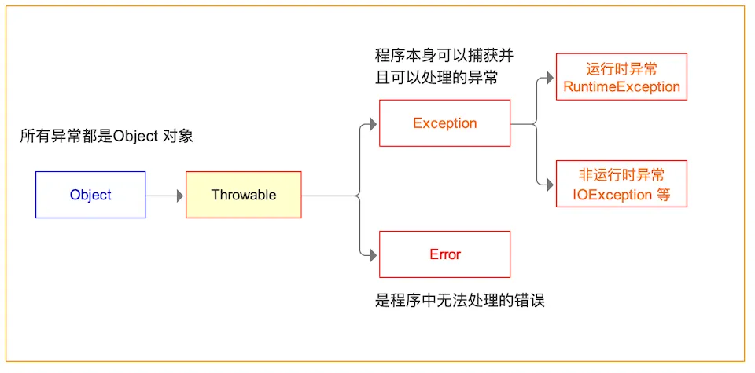

##### Throwable

所有异常都是由`Throwable`继承而来的，可以通过继承`Throwable`来实现新的异常，但是一般不推荐这样做，下一层分为了两个分支：`Error`和`Exception`

##### Error

`Error`类用来描述`Java`运行时**系统内部引起的错误和资源消耗错误**，因为是`Java`内部的错误，常见的有`StackOverflowError`等。

##### Exception

`Exception`类又可以分为`IOException`和`RuntimeException`，**开发者可以根据自己的需要继承该类来自定义一种新的异常类型。**

##### RuntimeException

**运行时异常，也叫非检查型异常。（这个要记得，后面会考）**

一般程序应该通过检测的方式尽量避免`RuntimeException`（也就是说出现这种异常就是开发者自己的问题，**开发者一般无需要捕获这一类异常**，相反，应该使用代码`if(obj == null)`来检测避免出现`NullPointException`）

这种异常类型一般包括下面几个经典：

- 错误的（类型）强制类型转换：`ClassCastException`
- 数组访问越界：`ArrayIndexOutOfBoundsException`
- 访问`null`指针：`NullPointerException`
- ...

##### IOException

**IO异常，也叫检查型异常。（这个要记得，后面会考）**

在实际中，**我们能够进行处理的只有检查型异常，因为检查型异常在我们个人的控制之内，非检查型异常对于任何的代码都有可能抛出，出现这些异常的时候我们没法控制。**

常见的`IOException`类包括：

- 文件末尾继续读取数据：`EOFException`

- 试图打开一个不存在的文件：`FileNotFoundException`

- 根据给定的字符串查找class对象，但是该类不存在：`ClassNotFoundException`

- ...

#### 异常机制的使用

##### 声明异常

声明异常可以参考下面的代码，异常只能在方法处进行声明，使用`throws`方法声明该方法可能抛出哪些**检查型异常**。**要注意，非检查型异常(**`RuntimeException`**及其子类)不需要声明。**

```java
public FileInputStream(String name) throws FileNotFoundException
```

若要声明多个**检查型异常**，**则需要用逗号分割**

```java
public Image loadImage(String name) throws FileNotFoundException, EOFException
```

那声明异常有什么作用呢？这就是之前说所的`Java`对异常机制的扩展，它的作用就是告诉其他方法，我这个方法当被调用的时候，可能会出现这两类逻辑错误，调用方要注意，至于调用方是直接捕获这两个异常还是把这两个异常传递出去，那就是另外的事情了。

##### 什么时候需要声明异常

一般在下面两种情况下声明异常：

1. 方法本身需要抛出**检查型异常**（**非检查型不用，可以直接抛出**），就需要声明。

```java
public Image importFile(String name) throws FileNotFoundException{
	file f = readfile(name);
	if(f == null){
		throw new FileNotFoundException();	// 抛出异常
        return null;
	}
}
```

2. **调用一个抛出检查型异常的方法**，传递异常的时候。

```java
public Image loadNewImage(String name) throws FileNotFoundException, EOFException{
	importFile(name);
}
```

##### 抛出异常

抛出异常的方法可以参考代码，主要涉及到`throw`（注意区分开`throw`和`throws`）

```java
// method 1:
throw new EOFException(); // 抛出一个EOFException

// method 2:
var a = new EOFException();
throw a;					// 抛出一个EOFException
```

抛出异常可以归纳为三个步骤：

1. 找到一个合适的异常类
2. 创建这一个异常类的对象
3. 将对象抛出

虽然前面稍微讲过，但是这里还是再提一次，因为异常有分**检查型异常**和**非检查型异常**两大类，他们的抛出方式也有所区别，**抛出检查型异常必须事先使用throws关键字在方法处进行声明**，如：

```java
// FileNotFoundException属于检查型异常
// importFile()方法抛出FileNotFoundException
public Image loadNewImage(String name) throws FileNotFoundException, EOFException{
	importFile(name);
}
```

**而抛出非检查型异常没有这个要求**，如：

```java
// ArrayIndexOutOfBoundsException属于非检查型异常
ublic void randomArrayMember(Object[] arrays, int index){
	if(arrays.length <= index){
		throw new ArrayIndexOutOfBoundsException();
	}
}
```

其次，**抛出非检查型异常一般意味着程序终止，而抛出检查型异常一般程序仍然在运行**。（当然**这并非绝对**，要看开发者如何处理异常，如进行异常包装等就不一定满足这个条件，这个后面再讲）

基于上面的这个条件，一般我们在带返回值的方法中，**抛出任何异常之后，不需要写**`return`**关键字，让我们抛出异常的时候，相当于跳出方法了，进入异常捕获代码段**，如：

```java
// 抛出非检查型异常的写法
public String importFile(String name) {
	file f = readfile(name);
	if(f == null){
		throw new RuntimeException();	// 抛出异常，之后方法就跳出去了
        // 不会运行到第六行。
	}
    return “123123”;
}
```

##### 捕获异常

在`Java`里面，要想处理（捕获）异常，需要使用`try...catch...finally...`语句，格式及运行顺序如下：

```java
try{
	// 先执行try里面的语句
	// 一旦try里面的有一条语句抛出ExceptionTypeX(X代表数字，都是ExceptionType的子类)类型异常，
    // 则进入相应的catch语句，哪怕try里面还有语句没执行完都要跳到catch里面去
}catch(ExceptionType1 e){
	// 在这里捕获异常，捕获到的异常信息，可以以弹框的形式提示给用户，也可以修正代码继续执行
}catch(ExceptionType2 e){
	// 可以存在多个catch，捕获多个异常
}catch(ExceptionType3 | ExceptionType4 e){
   	// JDK 1.7特性
    // 当捕获多个异常的时候，也可以这样写
	// 如果抛出的两个异常类是不同的，但是他们的处理方法都一样的话，还可以这样捕获
	// 注意这种方式捕获异常时，变量e被隐式声明为final，因此不能改变e的值
    // 注意当ExceptionType3是ExceptionType4的父类的时候，这种写法会报错，应该把子类异常先排在前面，父类异常排在后面，
    // 所以要改成ExceptionType4 | ExceptionType3，原因在于这个特性编译器终究会把它处理成这样的形式：
    /*
    	catch(ExceptionType3 e){}
    	catch(ExceptionType4 e){}
    */
 
}catch(ExceptionType e){
    // 当ExceptionType1、ExceptionType2、ExceptionType3、ExceptionType4都是ExceptionType的子类的时候
    // 还可以直接抛出高层异常，也叫父类异常，这种高层异常实际抛出有可能是上面四种子类异常中的其中一种
    // 抛出高层异常有非常大的好处，可以兼容复杂多样的异常子类，用户仅需要关注高层异常，
    // 并且通过高层异常的getMessage()方法获取异常机制提供给用户的逻辑错误信息，
    // 而无需通过具体的异常子类类型来判断出现了什么逻辑问题。
}finally{
	// 无论是否发生异常，最后都会运行此处的代码，通常用于释放资源
	// finally代码块可以省略
	// 注意不要把控制流的语句放在finally(return,throw,break,continue),会发生意想不到的错误
	// 同时也不应该过分依赖finally，一般的设计原则是将finally应用在关闭资源或者释放资源，如关闭IO流等
}
```

##### 二次抛出异常（传递异常）

当我们调用了一个抛出**捕获型异常**的方法的时候，**如果我们不知道要怎么处理这个捕获型异常，那么原则上都需要把这个异常进行二次抛出**，将这个异常的最终处理权交给最后一个调用方。

如何二次抛出异常呢？就像抛出检查型异常那样，只需要在方法处声明异常即可，像下面这样：

```java
// FileNotFoundException属于检查型异常
// importFile(name)会抛出FileNotFoundException
public Image loadNewImage(String name) throws FileNotFoundException{
	importFile(name);
}
```

我们没有在`loadNewImage`方法里面抛出`FileNotFoundException`，这个异常由我们调用的`importFile(name)`方法抛出，当我们调用`loadNewImage()`方法，`loadNewImage()`方法里面的`importFile(name)`方法抛出`FileNotFoundException`之后，`loadNewImage()`方法**会将这个异常再次抛出**。

从`loadNewImage()`方法的调用方来看，`FileNotFoundException`像是从`loadNewImage()`方法中直接抛出的一样，但是`loadNewImage()`方法只是`FileNotFoundException`的搬运工，它并没有直接抛出这个异常，这个异常的产生来源自`importFile(name)`方法。

下面的代码可能更加直观的表示这种关系：

```java
public A() throws Exception {
	B();
}
public B() throws Exception {
	... // 处理代码
	if(...){
		throw new Exception();
	}
}

public fun(){
	try{
		A();
	}catch(Exception e){
	  // do something
	}
}
```

##### 犹豫不决的问题：捕获异常还是传递异常

我们可以通过捕获异常来处理方法抛出的异常，但是并非每一个异常我们都知道怎么去处理。**异常要在适当的时候才去捕获。**

那么什么才算是适当的时候呢？这个问题没有答案。是的你没听错，**原则上只要你知道抛出来的异常要怎么解决，这个时候你才需要去捕获它，否则都应该把异常再次抛出去，让最后一个调用者来考虑如何处理异常。**

同时，由于方法内部可能调用了多个会抛出**检查型异常**的方法，`Java`异常也鼓励高层调用方**抛出高层统一的异常**，因此在传递异常时，可以传递异常的公共父类性，来达到抛出高层异常的需要，见下面的代码：

```java
// FileNotFoundException、EOFException都是IOException的子类，因此我们可以直接抛出父类异常来兼容这两种异常
public Image loadNewImage(String name) throws IOException{
	Image image = importFile(name);
	readByte(image);
    // 省略其他代码
}

public int readByte(Image image) throws EOFException{
	int codePoint = read0();
	if(codePoint == -1){
		throw new EOFException();
		return -1;
	}
	// 省略其他代码
}

public Image importFile(String name) throws FileNotFoundException{
	file f = readfile(name);
	if(f == null){
		throw new FileNotFoundException();	// 抛出异常
        return null;						// 带返回值
	}
	// 省略其他代码
}
```

在继承中，**检查型异常**的抛出也比较有意思。一般而言，如果父类的某个方法抛出了异常，则子类在重写这个方法的时候可以抛出相同的异常或是这个异常的具体子类，也可以选择不抛出异常，甚至抛出完全不一样的异常，如：

```java
public class ExceptionInheritedFather{
	public void test() throws IOException{
		// 省略其他代码
	}
}

class ExceptionInheritedSon1 extends ExceptionInheritedFather{
    // EOFException 是 IOException的子类
	@override
	public void test() throws EOFException{
		// 省略其他代码
	}
}

class ExceptionInheritedSon2 extends ExceptionInheritedFather{
   	// 子类也可以抛出相同的异常
	@override
	public void test() throws IOException{
		// 省略其他代码
	}
}
class ExceptionInheritedSon3 extends ExceptionInheritedFather{
    // 不抛出任何异常
    @override
	public void test() {
		// 省略其他代码
	}
}
class ExceptionInheritedSon4 extends ExceptionInheritedFather{
    // 抛出完全不相关的异常
    @override
	public void test() throws RuntimeException{
		// 省略其他代码
	}
}
```

#### 自定义异常类

通常我们需要满足我们个人的一个程序需要的时候就需要自定义异常类，异常类的定义可以通过继承`Exception`类或者它的子类如`IOException`类或者`RuntimeException`类来完成

```java
public FileFormatException extends IOException{
	public FileFormatException(){
		super();
	}
	public FileFormatException(String message){
		super(message);
	}
    // JDK 1.4
	public FileFormatException(Throwable cause){
		super(cause);
	}
    // JDK 1.4
	public FileFormatException(String message, Throwable cause){
		super(message, cause);
	}
}
```

上面就是最基本的一个异常的定义，实际中，定义异常的时候，可以夹带一些对象或者私货，如：

```java
public FileFormatException extends IOException{
    private Date exceptionHappenTime;
	public FileFormatException(){
		super();
        exceptionHappenTime = new Date();
	}
	public FileFormatException(String message){
		super(message);
        exceptionHappenTime = new Date();
	}
	public FileFormatException(Throwable cause){
		super(cause);
        exceptionHappenTime = new Date();
	}
	public FileFormatException(String message, Throwable cause){
		super(message, cause);
        exceptionHappenTime = new Date();
	}
    public String getHappenTime(){
        SimpleDateFormat sdf = new SimpleDateFormat("yyyy-MM-dd hh:mm:ss");
        return sdf.format(exceptionHappenTime);
    }
}
```

当我们捕获了异常之后，我们可以获取异常发生的事件：

```java
public void formatFile(File file) throws FileFormatException{
	// 省略代码
	throw new FileFormatException();
}

public void format(String fileName){
	File f = new File(fileName);
	try{
		formatFile(f);
	}catch(FileFormatException e){
        // 获取异常发生事件
		System.out.println(e.getHappenTime())
	}
}
```

#### 异常机制API及高级异常

##### 异常机制API

之前我们曾经说过异常捕获的问题，当我们捕获一个异常的时候，要如何处理了，当时没有详细说，实际上在`Java`中，所有的异常类都有一套基本的`API`（你当然可以在这个的基础上进行扩展啦~），`API`列表如下：

```java
// 比较两个异常对象的引用（注意是引用）
public boolean equals(Object obj);
// 获取异常携带信息
public String getMessage();
public String getLocalizedMessage();
// 初始化低层异常、打印cause by内容
public Throwable initCause(Throwable cause);
public Throwable getCause();
// 添加异常链、打印Suppressed:内容
public final void addSuppressed(@NotNull Throwable exception);
public final Throwable[] getSuppressed();
// 获取栈调试信息
public StackTraceElement[] getStackTrace();
// 打印异常信息
public void printStackTrace();
public void printStackTrace(PrintStream s);
// 打印异常信息
public String toString();
```

就一般而言，**如果最后的调用者也不知道要如何处理这个异常，那就直接调用方法**`printStackTrace()`**即可**，这个方法会在`System.err`（控制台）输出红色的错误信息。具体代码如下：

```java
try {
    exceptionAPI.throwIOException();
} catch (IOException e) {
    e.printStackTrace();
}
```

如果你写了类似的代码，当抛出异常之后，你的控制可能会打印下面的类似于调试信息的东西。

```
java.io.IOException: 我是IOException高层异常，我带了三个其他异常，请收好~~~
	at api.ExceptionAPI.throwIOException(ExceptionAPI.java:23)
	at api.ExceptionAPI.main(ExceptionAPI.java:16)
	Suppressed: java.net.BindException: bindException作为伴随异常（Suppressed）存在IOException异常里面了
		at api.ExceptionAPI.throwBindException(ExceptionAPI.java:46)
		at api.ExceptionAPI.throwIOException(ExceptionAPI.java:29)
		... 1 more
	Suppressed: java.net.ConnectException: connectException作为伴随异常（Suppressed）存在IOException异常里面了
		at api.ExceptionAPI.throwConnectException(ExceptionAPI.java:49)
		at api.ExceptionAPI.throwIOException(ExceptionAPI.java:33)
		... 1 more
Caused by: java.io.EOFException: 已经到达文件尾啦~
	at api.ExceptionAPI.throwEOFException(ExceptionAPI.java:43)
	at api.ExceptionAPI.throwIOException(ExceptionAPI.java:25)
	... 1 more
```

上面的异常信息，各个部分是什么意思可以参考下面的图，现阶段，如果对异常链、`cause`异常不清楚的同学，无需担心，后面会讲，现在只需要有这样一个概念即可。

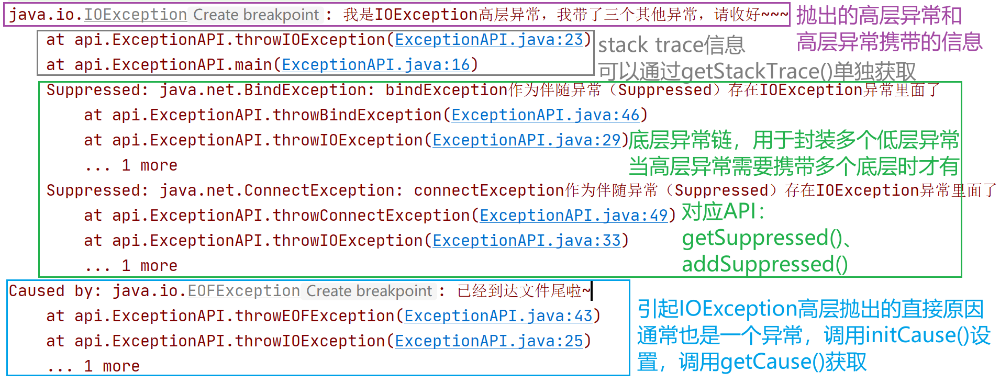

当然我们也可以分开获取对应的异常信息。具体的也会在接下来逐一介绍。

##### 获取抛出异常信息

获取异常信息主要以下面两个`API`为主：

```java
// 获取异常携带信息
public String getMessage();
public String getLocalizedMessage();
```

当然这两个`API`获取到的信息并无差别，我们那上面图中的异常为例，`getMessage()`和`getLocalizedMessage()`获取到的都是一样的信息。

```java
try {
    exceptionAPI.throwIOException();
} catch (IOException e) {
    // 1.如果不知道需要干啥的，可以直接e.printStackTrace();
    // 2.输出异常信息
    String message = e.getMessage();
    String localizedMessage = e.getLocalizedMessage();
    System.out.println("message:" + message);
    System.out.println("localizedMessage:" + localizedMessage);
}
// 控制台输出：
// message:我是IOException高层异常，我带了三个其他异常，请收好~~~
// localizedMessage:我是IOException高层异常，我带了三个其他异常，请收好~~~
```

实际上在自定义异常的时候，子异常可以重写`getLocalizedMessage()`，以提供`getMessage()`之外的信息，一般用于描述这个自定义的异常是什么意思，何时会被抛出：

```java
public class NoSuchHandlerException extends IOException{
	public NoSuchHandlerException(){
		super();
	}
	public NoSuchHandlerException(String message){
		super(message);
	}
	public NoSuchHandlerException(Throwable cause){
		super(cause);
	}
	public NoSuchHandlerException(String message, Throwable cause){
		super(message, cause);
	}
	
	@Override
	public String getLocalizedMessage(){
		return "这个异常，用于指定DBUtils不存在这样的Handler的时候将会抛出，抛出这类异常请不要慌，请检查你的代码中是否有未注册的ResultSet处理器";
	}
}
```

当需要抛出高层异常或者统一异常的时候，**你也可以把底层异常的信息传递给高层异常**：

```java
try {
    exceptionAPI.throwIOException();
} catch (IOException e) {
    throw new Exception(e.getMessage());
}
```

##### 异常嵌套中的捕获

先看下面的代码：

```java
InputStream i = ...;
try{
 ...	// code 1
 	try{
 		// code 2
 	}catch(Exception e){
 	
 	}finally{
 		i.close();	
 	}
}catch(IOException e){

}
```

若`finally`代码块中发生异常，则交由外层`IOException`捕获处理，若在`code 2`位置发生异常，交由内层`Exception`处理

##### 二次抛出底层或另类异常

前面我们讲解过如何二次抛出异常，也说过当我们方法调用了多个将会产生异常的方法时，可以抛出这些异常的统一高层异常来避免一个方法抛出过多的异常，但大多数时候我们方法抛出的异常不可感知，体现在：

1. 方法内抛出的这多个异常，**分布广泛**，可能是扩展自`IOException`的类，甚至有些是继承`RuntimeException`的。

2. 还有一种情况是，当我们在方法中捕获到高层异常，你并不清楚这个高层异常的具体类型，**但现在需要你拿出具体的异常类型抛出**。

3. 甚至，有些时候，我们捕获到的异常和我们需要抛出去的**异常不存在父子关系**，这种情况一般常见于网络编程，如：我们方法需要抛出`SocketException`，但是我们在方法内调用的方法抛出了`EOFException`，这种情况可以通过初始化`cause`的方式来抛出，这是后话。

对于上面三种情况，我们可能需要二次抛出于之前调用方法异常毫无相关的异常，或者需要把高层异常解析，抛出具体的底层异常的，我们**可以先捕获，然后再抛出。**具体参考下面的代码：

```java
public void connection() throws ApplicationRunningException{
    // 针对情况1
    try{
        fun1();		// 可能抛出ArrayOutOfBoundsException
        fun2();		// 可能抛出SocketException
        fun3();		// 可能抛出EOFException
    }catch(IOException e){
        throw new ApplicationRunningException();	 
        // ApplicationRunningException自定义的异常，
        // 与ArrayOutOfBoundsException、SocketException、EOFException无关，
        // 但是你的方法又需要抛出ApplicationRunningException，这个时候可以采用这种方法。
    }
}
```

```java
public void connection() throws ApplicationRunningException{
    // 针对情况2
    try{
        fun1();		// 抛出高层异常IOException的方法，具体异常不详
    }catch(IOException e){
      // 其他处理代码
      String message = e.getMessage();
      throw new ApplicationRunningException(message);
    }
}
```

##### 异常包装

我们在上一小节提及初始化`cause`这个东西，这里简单介绍，所谓`cause`是指，引发我这个异常被抛出的上一层异常。`cause`一般代表着最原始也是最重要的信息，特别在抛出高层异常中，这个高层异常很有可能是多个异常的集合体，如果需要告知具体是哪个异常引发的血案，有些时候可以不尝试抛出底层异常，而是尝试使用`cause`：

```java
public void connection() throws ApplicationRunningException{
    // 针对情况3
    try{
        fun1();		// 可能抛出ArrayOutOfBoundsException
        fun2();		// 可能抛出SocketException
        fun3();		// 可能抛出EOFException
    }catch(IOException e){
        throw new ApplicationRunningException(e);
    }
}
```

或者也可以这样写：

```java
public void connection() throws ApplicationRunningException{
    // 针对情况3
    try{
        fun1();		// 可能抛出ArrayOutOfBoundsException
        fun2();		// 可能抛出SocketException
        fun3();		// 可能抛出EOFException
    }catch(IOException e){
        ApplicationRunningException throwEx = new ApplicationRunningException();
        throwEx.initCause(e);
        throw throwEx;	 
    }
}
```

捕获异常时，使用

```java
Throwable original = e.getcause();
```

便可以获取引发高层的`cause`

在异常信息底下的`cause by`就和现在介绍的`initCause()`有关。只不过`getCause()`帮你把它单独拿出来而已。

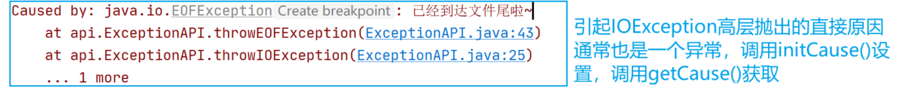

异常包装还是比较厉害的，你甚至能够包装高层异常或者是两个毫无关系的异常：

```java
public void connection() throws ApplicationRunningException{
    // 针对情况3
    try{
        fun1();		// 可能抛出IOException
    }catch(IOException e){
        ApplicationRunningException throwEx = new ApplicationRunningException();
        throwEx.initCause(e);
        throw throwEx;	 
    }
}
```

##### 异常包装链和抑制异常

先看一段代码：

```java
public void func() throw IOException {
	byte[] fileBytes;
	// 其他代码
	try{
		InputStream in = new FileInputStream("D:\\test.txt");
		// 其他代码
	} catch(FileNotFoundException e){
		throw e;
	} finally{
		fileBytes = readAllBytes();
		try{
            in.close();
        }catch(IOException ex){
            throw ex;
        }
	}
}
```

上面的代码没有任何问题，但当`close()`方法抛出异常的时候，你没法直观判断`FileNotFoundException`到底有没有抛出。

因为如果代码先抛出`FileNotFoundException`进入`finally`代码块，`finally`代码块的`close()`方法再抛出异常，那现在抛出的`IOException`会盖过先前的`FileNotFoundException`。

为了解决这个问题，可以尝试异常抑制，那具体的异常抑制涉及到两个方法：

```java
public final void addSuppressed(@NotNull Throwable exception);
public final Throwable[] getSuppressed();
```

改进后的代码可以参考：

```java
// JDK 7新增异常抑制
public void func() throw IOException {
	byte[] fileBytes;
	FileNotFoundException fileNotFoundException;
	// 其他代码
	try{
		InputStream in = new FileInputStream("D:\\test.txt");
		// 其他代码
	} catch(FileNotFoundException e){
		fileNotFoundException = e;
		throw fileNotFoundException;
	} finally {
		fileBytes = readAllBytes();
		try{
            in.close();
        }catch(IOException ex){
           fileNotFoundException.addSuppressed(ex);
        }
	}
}
```

获取压制的异常，使用方法：

```java
public final Throwable[] getSuppressed();
```

对应下图的信息：

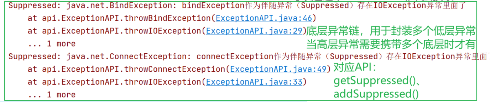

#### 异常注意事项

##### 在带finally的catch中使用return

需要注意在异常捕获语句中**使用return**，**finally块会被执行**，如下面代码：

```java
try {
    throwIOException();
} catch (IOException e) {
    e.printStackTrace();
    return "12313";
}finally {
    System.out.println("123123123123");
}
return "456456";
// 执行结果：
// e.printStackTrace();
// System.out.println("123123123123");
// return "12313";
```

当执行 `e.printStackTrace();`控制台打印异常信息，然后到`return "12313";`当执行完这语句之后，方法**实际上并没有完全返回**，而是去执行`finally`代码块的内容，执行`System.out.println("123123123123");`，最后才会返回方法调用处。

然后，当我们把`return "12313";`替换成`System.exit()`，此时程序将完全关闭。`finally`也自然不执行。

##### 是否一定要完整写完try...catch...finally

// todo

#### try-with-resource语句

该语句用于简化`try-catch-finally`语句中的释放工作

要使用`try-with-resource`语句，需要`res`实现`AutoCloseable`接口，该接口只有一个方法

```
void close() throws Exception
```

```
try(Resource res = ...){
	// work
}
```

使用`try-with-resource`，代码段在运行结束之后，无论是否有异常抛出，都会调用`res`中实现的`close()`。

一般情况下，**只要需要关闭资源，就要尽可能使用`try-with-resource`**

#### Java中常见异常

1. `NullPointerException`：空指针异常。

2. `SQLException`：与数据库有关的异常，此为高层异常

3. `IndexOutOfBoundsException`：下标越界

4. `NumberFormatException`：数字格式化异常，如尝试将`abc`格式化成数字时就会出这个异常

5. `FileNotFoundException`：当试图打开指定路径名表示的文件失败时，抛出此异常。

6. `IOException`：当发生某种I/O异常时，抛出此异常。此类是失败或中断的I/O操作生成的异常的通用类。

7. `ClassCastException`：强制类型转换时，如果类型不对则抛出这个异常。

8. `ArrayStoreException`：试图将错误类型的对象存储到一个对象数组时抛出的异常。

9. `IllegalArgumentException`：参数传递不合法异常，如在不期望接收`null`的方法参数上传递`null`时可以选择抛出该异常。

10. `ArithmeticException`：当出现异常的运算条件时，抛出此异常。例如，一个整数“除以零”时，抛出此类的一个实例。

11. `NegativeArraySizeException`：如果应用程序试图创建大小为负的数组，则抛出该异常。

12. `NoSuchMethodException`：无法找到某一类中的特定方法时，抛出该异常，反射中见得比较多。
13. `NoSuchFiledException`：无法找到某一类中的特定字段时，抛出该异常，反射中见得比较多。
14. `SecurityException`：由安全管理器抛出的异常，指示存在安全侵犯。
15. `UnsupportedOperationException`：当不支持请求的操作时，抛出该异常。 
16. `RuntimeException`：是那些可能在Java虚拟机正常运行期间抛出的异常的超类。
17. `EOFException`：当程序在输入的过程中遇到文件或流的结尾时，引发异常。因此该异常用于检查是否达到文件或流的结尾。
18. `InterruptedException`：当某个线程处于长时间的等待、休眠或其他暂停状态，而此时其他的线程通过Thread的interrupt方法终止该线程时抛出该异常。
19. `CloneNotSupportedException`： 当没有实现`Cloneable`接口或者不支持克隆方法时,调用其`clone()`方法则抛出该异常。
20. `NoClassDefFoundException`：当`Java`虚拟机或者类装载器试图实例化某个类，而找不到该类的定义时抛出该错误。

#### 2021.4.28 补充

##### 捕获异常使用

在捕获异常时，**应该尽可能地对抛出异常那一条语句（调用）使用`try...catch`而不包含其他代码**，这样做的好处就是即便抛出了异常也能继续执行想要的代码，否则，过多地包含其他地代码会造成编码时的混乱，在程序变大的时候一旦出bug就非常难受了。**一句话，捕获异常需谨慎！**

#### 2022.7.28补充

`Java`中无法创建泛型异常，下面的代码在`ide`中将会报错：

```java
public class HelloException<T> extends Exception{
	// 会报错，Java不支持泛型异常
}
```

#### 参考

- 《`Java`核心技术卷一》
- [`Java7`的异常处理新特性-`addSuppressed()`方法等](https://www.cnblogs.com/langtianya/p/5139465.html)
- [`Java`常见的10个异常](https://www.cnblogs.com/jie-y/p/10775688.html)
- [`Java`中常见的异常（`Exception`）](https://blog.csdn.net/u011816231/article/details/50560751)

## Java基础常用类

最后我们介绍`Java`中的类库：

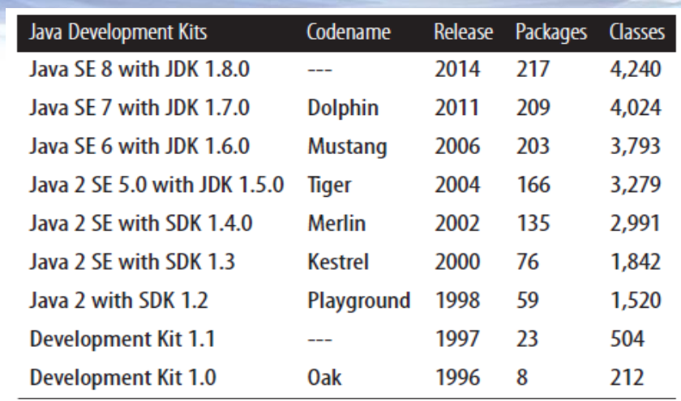

从`JDK1.0`开始到后面的`JDK 8`，`Java`类库越来越庞大。主要是`java`、`javax`、`org`三个包

`java`：所有以`java.`开头的都是Java的核心包（`Java Core Package`）

`javax`：所有以 `javax.` 开始的包是 `Java` 扩展包 （`Java Extension Package`) ，例如 `javax.swing` 包；

`org`：第三方组织规范标准包，如`W3C`的`DOM`。

`JDK8API`组成如下图所示：

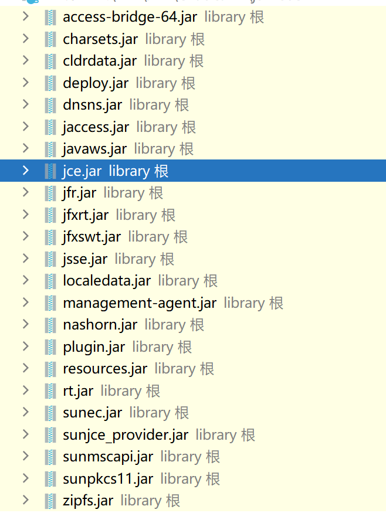

其中`rt.jar`是运行时必须依赖的包。该包是`Java`的核心，当然也有其他比较重要的包如：`jfr`、`zipfs`、`jce`等

`Java`中的所有`API`都是以包的形式进行组织，每个包提供了非常多的类、接口、异常类等等，这些东西组成`Java`的类库。

下面是`rt.jar`核心类包对照表：

| 包名              | 描述                                                         |
| ----------------- | ------------------------------------------------------------ |
| `java.lang.*`     | `Java` 编程语言的基本类库                                    |
| `java.applet.*`   | 创建 `applet` 需要的所有类                                   |
| `java.awt.*`      | 创建用户界面以及绘制和管理图形、图像的类                     |
| `java.io.*`       | 通过数据流、对象序列以及文件系统实现的系统输入、输出         |
| `java.net.*`      | 用于实现网络通讯应用的所有类                                 |
| `java.util.*`     | 集合类、时间处理模式、日期时间工具等各类常用工具包           |
| `java.sql.*`      | 访问和处理来自于 `Java` 标准数据源数据的类                   |
| `java.text.*`     | 以一种独立于自然语言的方式处理文本、日期、数字和消息的类和接口 |
| `java.security.*` | 设计网络安全方案需要的一些类                                 |
| `java.beans.*`    | 开发 `Java Beans` 需要的所有类                               |
| `java.math.*`     | 简明的整数算术以及十进制算术的基本函数                       |
| `java.rmi.*`      | 与远程方法调用相关的所有类                                   |
| `java.nio.*`      | 提供了实现`NIO`（非阻塞`IO`）应用的所有类                    |
| `java.time.*`     | 提供了`Java`日期、时间类的新处理方式（`Java 8`新增包）       |

| 包名                    | 解析                                                         |
| ----------------------- | ------------------------------------------------------------ |
| `javax.accessibility.*` | 定义了用户界面组件与提供对这些组件进行访问的辅助技术之间的协定。 |
| `javax.activation.*`    | activation拓展                                               |
| `javax.activity.*`      | 包含了解组期间通过ORB机制抛出异常的相关活动服务。            |
| `javax.annotation.*`    | `JSR330`扩展，包括一些常用的注解如：`@PostConstruct`、`@PreDestroy`等 |
| `javax.imageio.*`       | `Java Image I/O API` 的主要包。用于处理图像                  |
| `javax.jws.*`           | 提供一个轻量级`Web`服务框架（`JAX-WS`）                      |
| `javax.lang.model.*`    | 用来为 `Java` 编程语言建立模型的包的类和层次结构。 此包及其子包的成员适用于语言建模、语言处理任务和 `API`（包括但并不仅限于注释处理框架） |
| `javax.management.*`    | 提供 `Java Management Extensions` 的核心类。 `Java Management Extensions` (`JMXTM`) `API` 是一个用于管理和监视的标准 `API` |
| `javax.naming.*`        | 为访问命名服务提供类和接口。（`JNDI`）                       |
| `javax.net.*`           | 提供用于网络应用程序的类。                                   |
| `javax.print.*`         | 提供打印服务的类，为 `JavaTM Print Service API` 提供了主要类和接口。 |
| `javax.rmi.*`           | 包含 `RMI-IIOP` 的用户 `API`。                               |
| `javax.script.*`        | 这个包用来和`JavaScript`进行互操作,比如`Java`类可以调用`JavaScript`中的方法,而`JavaScript`也可调用 `Java`中的方法. |
| `javax.security.*`      | `Java`安全机制相关包                                         |
| `javax.smartcardio.*`   | 主要功能是通过虚拟机建立与标准`pc/sc`读卡器及卡片的通信（`JavaME`） |
| `javax.sound.*`         | `Java`音频控制包                                             |
| `javax.sql.*`           | `JDBC 3.0`特性，对`java.sql.*`进行补充，提供`Datasource`接口，连接池支持，分布式事务处理机制，`rowset` |
| `javax.swing.*`         | 提供一组轻量级（全部是 `Java` 语言）`UI`组件，尽量让这些组件在所有平台上的工作方式都相同，属于`Java`的第二代图形化 |
| `javax.tools.*`         | 为能够从程序（例如，编译器）中调用的工具提供接口。           |
| `javax.transaction.*`   | 包含解组期间通过 `ORB` 机制抛出的三个异常。                  |
| `javax.xml.*`           | 根据 `XML` 规范定义核心 `XML` 常量和功能。                   |

### Java中的API文档和Demo

#### 官方类库文档

- `JavaSE 6`:[Overview (Java Platform SE 6)](https://docs.oracle.com/javase/6/docs/api/)
- `JavaSE 7`:[Overview (Java Platform SE 7)](https://docs.oracle.com/javase/7/docs/api/)
- `JavaSE 8`:[Overview (Java Platform SE 8 )](https://docs.oracle.com/javase/8/docs/api/)
- 各版本`Oracle`官网：[Java Platform, Standard Edition Documentation - Releases (oracle.com)](https://docs.oracle.com/en/java/javase/index.html)

#### 第三方文档（中文）

[Java 官方文档 官方文档|官方教程|Java 官方文档 API中文手册|Java 官方文档参考文档_w3cschool](https://www.w3cschool.cn/java/dict)

[在线API文档 (oschina.net)](https://tool.oschina.net/apidocs/api)

[Java 8 中文版 - 在线API中文手册 - 码工具 (matools.com)](https://www.matools.com/api/java8)

### 常用类使用

#### 数字包及数学相关类

`Java`中的数字类主要有下面几类：

- 用于包装基本类型的：`Short`、`Long`、`Double`等**包装器类**
- 用户处理大数的：`BigInteger`、`BigDecimal`
- 用于处理随机数的`Random`
- 用于处理特殊运算的`Math`工具
- `java.math`包下的类：如：

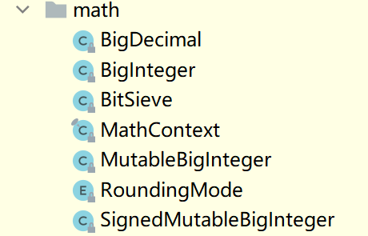

#### 包装器类

首先包装器类是基于各个基本类型的，在`JDK5`之后的版本，允许将包装器类和基本类型之间的相互转换的。如：

```java
Integer a = 23;	// int --> Integer（装箱）
int b = a;		// Integer --> int（拆箱 | 开箱）
// SpringBoot
```

对于数字处理这个分类，在`Java`中最基础的数字处理类是`Number`，他是一个抽象类，代表一个数，继承于`Number`类的类中**有我们常用的基本类型的包装类**，也有处于并发包（ `java.util.concurrent`）下的原子类。他们的继承关系图参考如下：

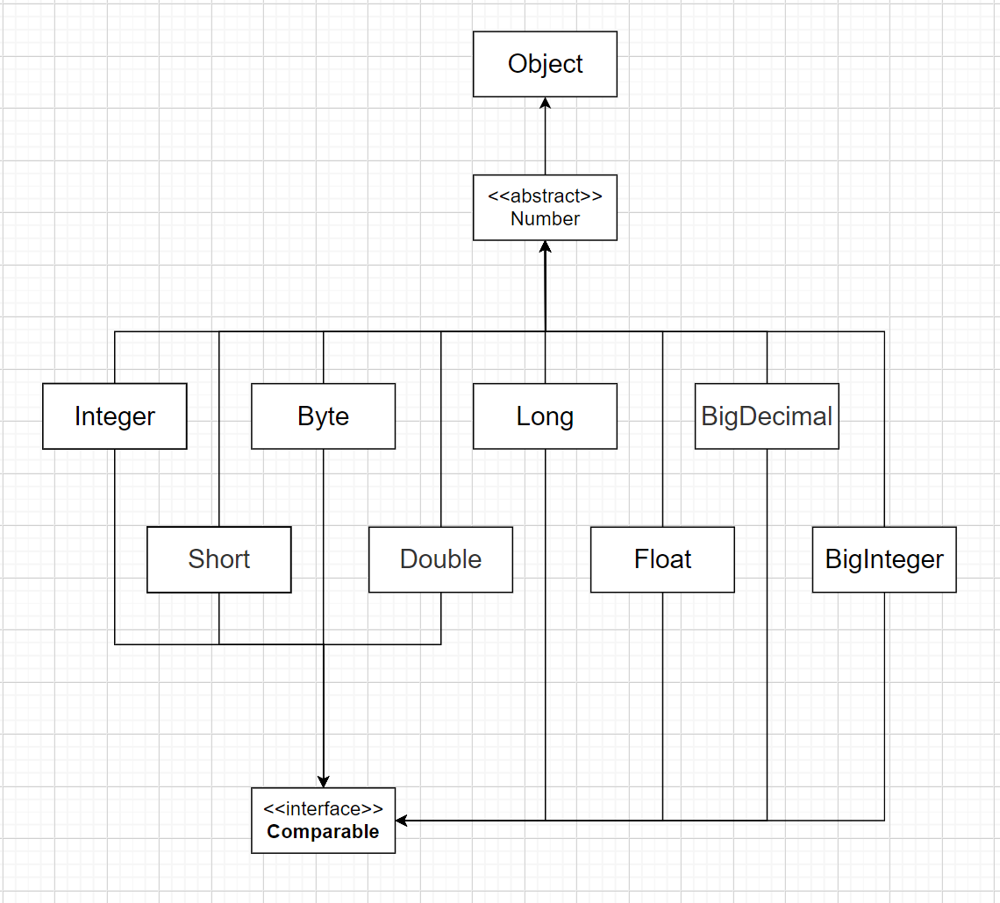

包装器类帮我们将一些基本类型的属性，如：**最大最小值、类型转换、进制转换等等**。

包装器类主要有下面几个：

- Byte
- Short
- Integer
- Long
- Float
- Double
- Character
- Boolean

```java
// API方法
Integer.parseInt()
Integer.parseUnsignedInt()
Integer.valueOf()
Integer.toString()
Integer.decode()
Integer.max()
Integer.min()
Integer.signum()
// ...
// 具体参考Github仓库JavaProjectfen'zhi
```

#### 大数类

众所周知，基本类型有一个范围限制。如果要想表示类似于9999999999999999这样的大数，即便是8个字节的`long`也无动于衷，这个时候就轮到下面两位大哥出场了：

- `BigInteger`：表示任意大的整数类型
- `BigDecimal`：表示任意大的浮点类型

两位大哥能够表示无限大的数。两位大哥的`API`可以参考下面两篇笔记：

[`BigInteger`类使用方法]()

[`BigDecimal`类使用方法]()

#### 随机类

随机类主要有两个类：

- `Random`：能够产生一个随机数
- `UUID`：能够产生一个随机字符序列

#### Math工具类

Math工具类为我们提供了许多和数学处理有关的东西，如计算幂次，平方根等。


#### 字符串处理

字符串处理主要有四个大类：

- `String`
- `StringBuffer`
- `StringBuilder`
- `StringJoiner`

#### 时间类（旧）

- `Date`
- `Calendar`

#### 格式化类

- `NumberFormat`
- `MessageFormat`
- `DateFormat`

### API封装（作业）

字符串类：SQLBuilder

格式化类：FormatUtils

时间类：DateTimeUtils

基本包装类：CommonUtils
