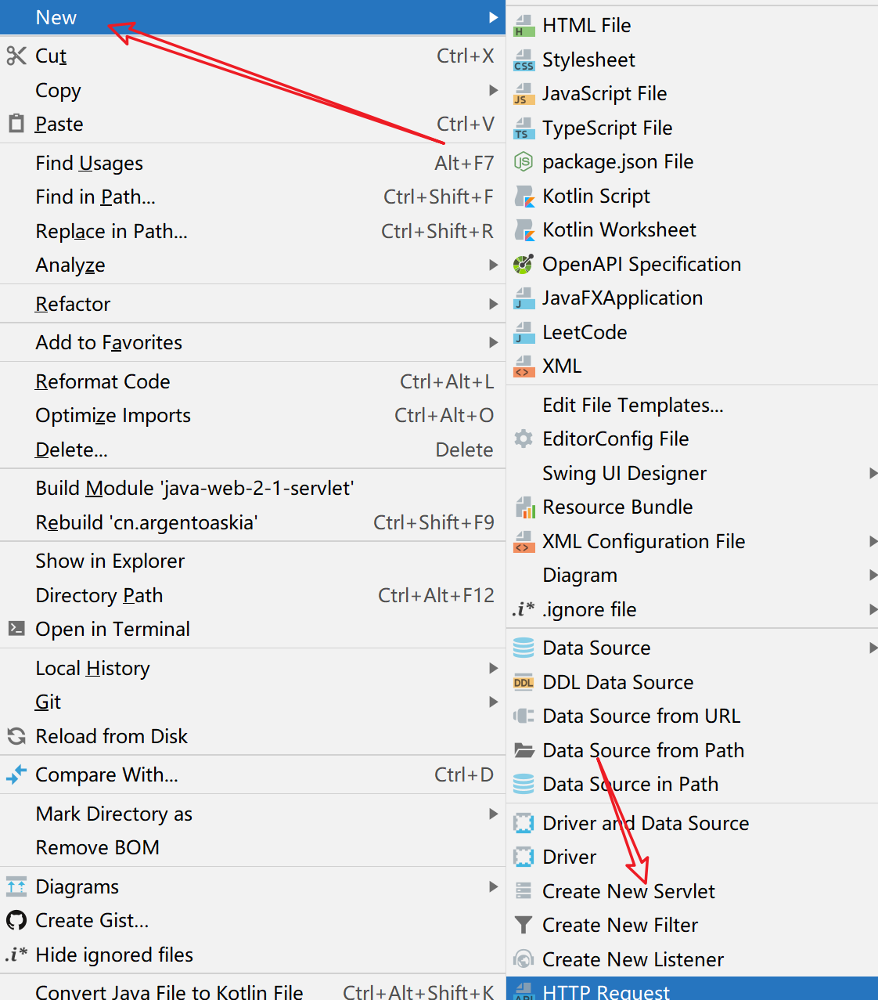
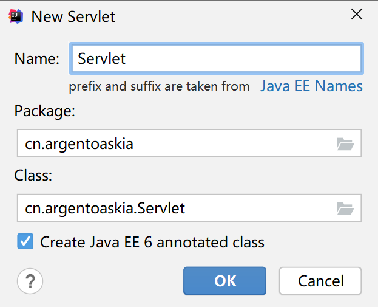
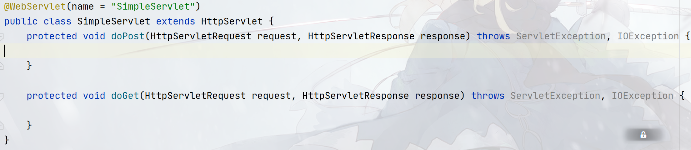
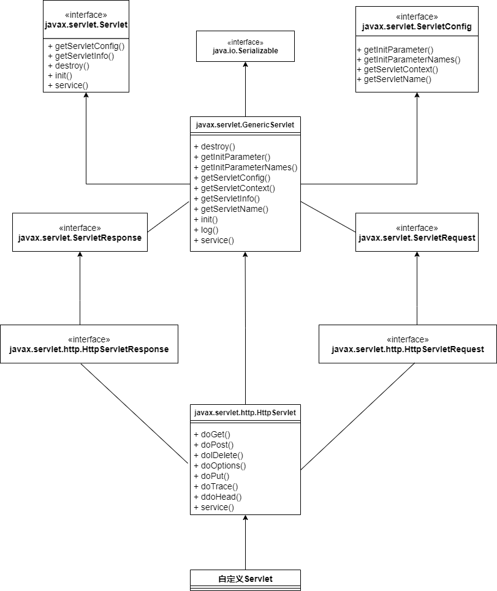
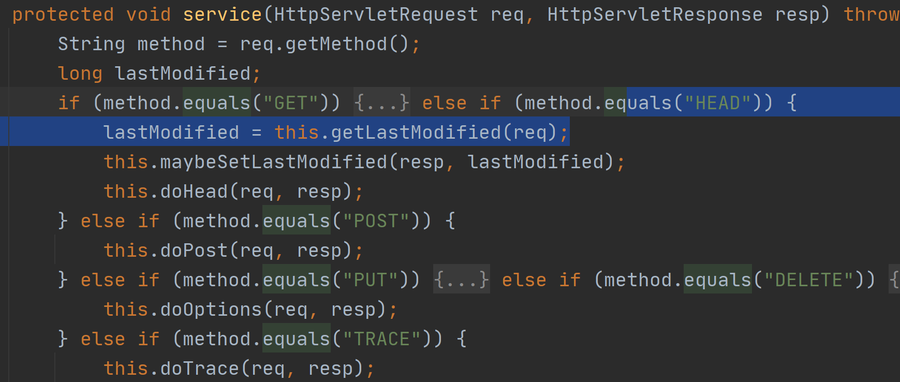

## Servlet

通过本篇`README`，你将学会：

- `Idea`中如何快速创建`Servlet`
- 基于`XML`的·`Servlet`配置
- `Servlet`生命周期
- `Servlet api`体系

### Idea快速创建Servlet

`Idea`中创建`Servlet`的方式很简单，只要创建一个`XXXXServlet`的`class`类，然后让这个这个类继承`HttpServlet`，重写`doGet()`、`doPost()`即可。

但在`Idea`中，创建`Servlet`有快捷方式，你可以点击右键菜单，往下拉会看到下面这个选项：



点击`Create New Servlet`就会弹出这样的一个框：



填好`Servlet`的名字之后点击`OK`，就可以看到下面的整个结构：



### 基于XML的Servlet配置

在`Servlet 3.0`标准之前，创建`Servlet`的方法多采用`XML`的形式来创建，而在`Servlet 3.0`标准之后多出了基于注解和容器初始化接口这两种方法。

因此，创建一个`Servlet`的方法有三种：

- 通过`Web.xml`来创建一个`Servlet`
- 通过`@WebServlet`注解来创建
- 通过`ServletContainerInitializer`接口

而本篇笔记将会介绍第一种，基于`xml`的配置方法：


### Servlet 生命周期

一个`servlet`程序要想在`Web`服务器上运行，一般需要四个步骤：

1. 装入
2. 初始化
3. 提供服务
4. 销毁

其中程序员能决定，从步骤`2`开始，到步骤`4`，装入一般交给`web`服务器，准确点来说是服务器软件，如`Tomcat`负责。

从步骤2到步骤4，我们能在`Servlet`的顶层接口`javax.servlet.Servlet`中找到对应的接口方法：

```java
public interface Servlet {

    // 初始化
    public void init(ServletConfig config) throws ServletException;
    
    public ServletConfig getServletConfig();
    
    // 提供服务
    public void service(ServletRequest req, ServletResponse res)
	throws ServletException, IOException;

    public String getServletInfo();
    
    // 销毁
    public void destroy();
}
```

#### 初始化

初始化，也就是实例化`Servlet`的具体实现类的工作，这个动作会调用`Servlet`接口的`init()`，在整个`servlet`生命周期中只会执行一次。

那这里就产生了两个问题：

##### Servlet什么时候初始化？

默认情况下，第一次被访问时，Servlet类就被初始化，可以配置执行Servlet的创建时机。

在`<servlet>`标签下配置

1. 第一次被访问时创建，`<load-on-startup>`的值为负数
2. 在服务器启动时创建，`<load-on-startup>`的值为0或正整数

##### Servlet是单例的

Servlet的初始化在整个生命周期过程中只执行一次，这就说明对于每一个`Servlet`的具体实现类被加载之后，必须要走完整个生命周期，才能再次创建相同实现类的实例，**因此在内存中只存在唯一对象，`Servlet`是单例的**，**一旦涉及到单例，就可能存在线程安全问题**。

**因此尽量不要在`Servlet`中定义成员变量。**即使定义了成员变量，也不要修改值

#### 提供服务

该过程会执行`service()`，执行多次，每次访问Servlet时，Service方法都会被调用一次。

由于对`Servlet`接口的进一步封装，现在也很少直接在`service()`进行编码，一般使用的是`HttpServlet`的`doGet()`、`doPost()`等

#### 销毁

执行`destroy`方法，只执行一次，`Servlet`被销毁时执行。服务器关闭时，Servlet被销毁

* 只有服务器正常关闭时，才会执行`destroy`方法。
* `destroy`方法在`Servlet`被销毁之前执行，一般用于释放资源

### Servlet API及体系结构

但就实际而言，我们一般不会直接继承`javax.servlet.Servlet`接口来定义`Servlet`，而是继承自`HttpServlet`来定义，也就是说继承使用`http`协议的`servlet`。

那这就不得不谈整个`Servlet`的接口体系：



其中`GenericServlet`和`HttpServlet`都是抽象类，`GenericServlet`只提供一个抽象方法`service()`，对`Servlet`中的其他方法都做了默认实现。因此如果需要继承`GenericServlet`，只需要实现一个方法：`service()`

而对于`HttpServlet`来说，`Http`有7中请求方式，将这7种方式都封装在`HttpServlet`，它们都是：`doXXX()`这样的方法！

实际上观察`HttpServlet`的`service()`方法可以看到：



首先`getMethod()`返回请求方式，如果是`post`，调用`doPost()`，如果是`get`，调用`doGet()`，以此类推。

实际上对于`HttpServlet`，常用的两个方法是：`doGet()`和`doPost()`，因此继承自`HttpServlet`的`Servlet`类只需要重写这两个方法即可。

那么最后，我们来反观一下整个`servlet`体系中，有哪些类和接口我们需要特别注意：

- `javax.servlet.Servlet`
- `javax.servlet.GenericServlet`
- `javax.servlet.http.HttpServlet`

- `javax.servlet.ServletConfig`（`Servlet`配置文件相关，即`Web.xml`解析结果）

- `javax.servlet.ServletResponse`
- `javax.servlet.ServletRequest`
- `javax.servlet.http.HttpServletResponse`（`HTTP`响应对象的封装）
- `javax.servlet.http.HttpServletRequest`（`HTTP`请求对象的封装）

- `javax.servlet.http.HttpSession`（`Session`）
- `javax.servlet.http.HttpSessionBindingListener`
- `javax.servlet.http.HttpSessionBindingEvent`

- `javax.servlet.ServletContext`

- `javax.servlet.RequestDispatcher`（`Servlet`协作）

- `javax.servlet.http.Cookie`

- `javax.servlet.http.HttpUtils`
